# Chapter 10: Visualisation Libraries

- [Notes](#notes)
  - [Matplotlib](#matplotlib)
    - [`matplotlib.pylab`](#matplotlibpylab)
    - [`matplotlib.pyplot`](#matplotlibpyplot)
      - [Styling Plots](#styling-plots)
      - [Labelled Data](#labelled-data)
      - [Plotting Multiple Sets of
        Data](#plotting-multiple-sets-of-data)
      - [Adding Labels, Titles and
        Legends](#adding-labels-titles-and-legends)
    - [Axes Interface or Object-Oriented
      Style](#axes-interface-or-object-oriented-style)
  - [Seaborn](#seaborn)
    - [Seaborn Themes](#seaborn-themes)
    - [Seaborn Plot Types](#seaborn-plot-types)
  - [Plotly](#plotly)
  - [Bokeh](#bokeh)
  - [Other Visualisation Libraries](#other-visualisation-libraries)
- [Summary](#summary)
- [Questions](#questions)

## Notes

- Summary statistics are nice but often truly understanding a dataset
  requires *visualising* it
  - One can make data sets with identical summary statistics but that
    look vastly different when visualised
- Python has a number of mature libraries for data visualisation

### Matplotlib

- Matplotlib is the most well-known and used plotting tool in Python
  - Designed for creating publication-ready plots
- Underpin’s many higher-level plotting libraries (See
  [Seaborn](#seaborn))
- Part of the Scipy ecosysem (With
  [NumPy](../Chapter_07/Chapter_07.qmd),
  [Scipy](../Chapter_08/Chapter_08.qmd) and
  [Pandas](../Chapter_09/Chapter_09.qmd))
- Provides several interfaces for use

#### `matplotlib.pylab`

- `pylab` is outdated interface for Matplotlib
- Designed to simulate a MATPLOT environment
- In general it is should not be used anymore

#### `matplotlib.pyplot`

- `pyplot` is the conventional interface for Matplotlib
  - By convention it is imported at `plt`

    ``` python
      import matplotlib.pyplot as plt
    ```

- Matplotlib plots are typically defined in terms of *figures* and
  *axes*
  - A figure represents a graph of data
    - May contain multiple axes
  - Axes are areas where points are specified via coordinates
    - Is associated to *one* figure
- The `pyplot` interface can either be used *implicitly* or *explicitly*
  - plot methods will often implicitly plot to the current axis and
    figure if not otherwise specified
  - For example `plt.plot` is used to plot $x$ vs $y$ data
  - Shown below

``` python
import matplotlib.pyplot as plt
import numpy as np

X = np.arange(0, 10)
Y = np.array([20, 25, 35, 50, 10, 12, 20, 40, 70, 110])

plt.plot(X, Y)
```

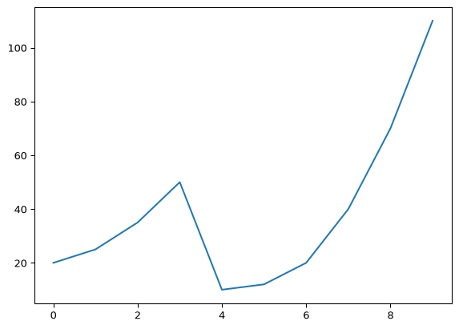

##### Styling Plots

- Plot’s can be further styled at creation time or after creation
- One can directly style a plotted line by interacting directly with the
  `matplotlib.Line2D` class
  - The full list of properties is given in the
    [documentation](https://matplotlib.org/stable/api/_as_gen/matplotlib.lines.Line2D.html)
  - Alternatively can define these properties as keyword arguments on
    call to `plt.plot`
- Three commonly modified properties are
  1. `marker`

      - Defines special markers that indicate plotted points

      - Large number of options

        | marker | Description           |
        |--------|-----------------------|
        | .      | point                 |
        | ,      | pixel                 |
        | o      | circle                |
        | v      | upside down triangle  |
        | ^      | up triangle           |
        | \<     | left triangle         |
        | \>     | right triangle        |
        | 1      | tri marker (down)     |
        | 2      | tri marker (up)       |
        | 3      | tri marker (left)     |
        | 4      | tri marker (right)    |
        | s      | square                |
        | p      | pentagon              |
        | \*     | star                  |
        | h      | hexagon               |
        | H      | hexagon (alternative) |
        | \+     | plus                  |
        | D      | diamond               |
        | d      | thin diamond          |
        | \|     | vertical line         |
        | \_     | horizontal line       |

  2. `linestyle`

      - Defines how the line is styled

        | linestyle            | Description   |
        |----------------------|---------------|
        | \-                   | solid line    |
        | –                    | dashed line   |
        | -.                   | dash dot line |
        | :                    | dotted line   |
        | None or empty string | no line       |

  3. `color`

      - Colours the line

      - There are simple alias for common colours

        | color | Description |
        |-------|-------------|
        | b     | blue        |
        | g     | green       |
        | r     | red         |
        | c     | cyan        |
        | m     | magenta     |
        | y     | yellow      |
        | k     | black       |
        | w     | white       |

- We can put all this together

``` python
import matplotlib.pyplot as plt
import numpy as np

X = np.arange(0, 10)
Y = np.array([20, 25, 35, 50, 10, 12, 20, 40, 70, 110])

plt.plot(X, Y, marker="s", linestyle="-.", color="m")
```

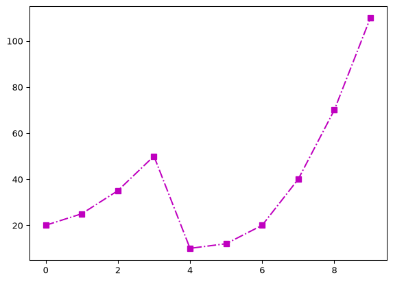

- An alternative technique is to use the optional `fmt` positional
  argument
  - Takes a format string
  - This is a shorthand for the marker, line style and colour
  - Structured as `[marker][linestyle][color]`
  - e.g. the equivalent `fmt` string for above is `s-.m`
  - is passed into `plot` after the $x$ and $y$ data

``` python
import matplotlib.pyplot as plt
import numpy as np

X = np.arange(0, 10)
Y = np.array([20, 25, 35, 50, 10, 12, 20, 40, 70, 110])

plt.plot(X, Y, "s-.m")
```


- We can combine the format string specifier with other keyword
  arguments

``` python
import matplotlib.pyplot as plt
import numpy as np

X = np.arange(0, 10)
Y = np.array([20, 25, 35, 50, 10, 12, 20, 40, 70, 110])

plt.plot(X, Y, "s--r", linewidth=4.3)
```

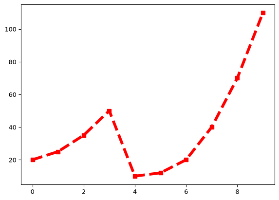

##### Labelled Data

- `matplotlib` works with labelled data
  - Integrates nicely with dictionaries, pandas dataframes
  - Extends to any data structure that supports bracket indexing
- Instead of supplying $x$ and $y$ data we supply the labelled data

``` python
import matplotlib.pyplot as plt
import pandas as pd

data = {
    "Years": ["2000", "2002", "2004", "2006", "2008", "2010", "2012", "2014", "2016"],
    "Men": [189.1, 191.8, 193.5, 196.0, 194.7, 196.3, 194.4, 197.0, 197.8],
    "Women": [175.5, 176.4, 176.5, 176.2, 175.9, 175.9, 175.7, 175.8, 175.3],
}

heights_df = pd.DataFrame(data)
plt.plot("Years", "Women", data=heights_df)
```

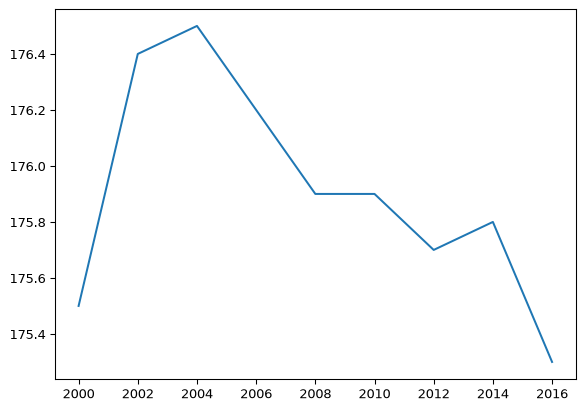

- Observe here rather than pass the $x$ and $y$ we pass the labels as
  mentioned, then supply the dataframe via the `data` parameter

##### Plotting Multiple Sets of Data

- Multiple datasets can be plotted on the same figure
- Most straightforward approach is just to call `plot` multiple times

``` python
import matplotlib.pyplot as plt
import numpy as np

X_1 = np.arange(0, 10)
Y_1 = np.array([20, 25, 35, 50, 10, 12, 20, 40, 70, 110])
fmt = "s-.r"

X_2 = np.arange(0, 10)
Y_2 = np.array([90, 89, 87, 82, 72, 60, 45, 28, 10, 0])
fmt2 = "^:k"

plt.plot(X_1, Y_1, fmt)
plt.plot(X_2, Y_2, fmt2)
```

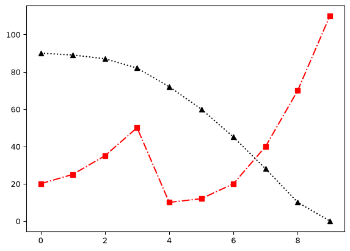

- This works because `plot` defaults to the current figure and axes
  - As long as we haven’t cleared the previous figure it will continue
    to layer onto the current figure
- The alternative is to pass everything in one go (each block of $x$,
  $y$, `fmt` sequentially)

``` python
import matplotlib.pyplot as plt
import numpy as np

X_1 = np.arange(0, 10)
Y_1 = np.array([20, 25, 35, 50, 10, 12, 20, 40, 70, 110])
fmt = "s-.r"

X_2 = np.arange(0, 10)
Y_2 = np.array([90, 89, 87, 82, 72, 60, 45, 28, 10, 0])
fmt2 = "^:k"

plt.plot(X_1, Y_1, fmt, X_2, Y_2, fmt2)
```


- We can do the same with labelled data by passing additional labels

``` python
import matplotlib.pyplot as plt
import pandas as pd

data = {
    "Years": ["2000", "2002", "2004", "2006", "2008", "2010", "2012", "2014", "2016"],
    "Men": [189.1, 191.8, 193.5, 196.0, 194.7, 196.3, 194.4, 197.0, 197.8],
    "Women": [175.5, 176.4, 176.5, 176.2, 175.9, 175.9, 175.7, 175.8, 175.3],
}

heights_df = pd.DataFrame(data)
plt.plot("Years", "Women", "Men", data=heights_df)
```

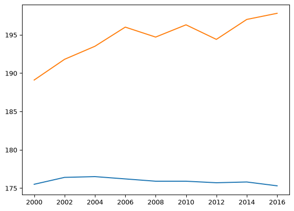

##### Adding Labels, Titles and Legends

- `pyplot` provides simple convenience functions for adding labels,
  titles and legends
- As with `plot` these applyt to the current figure and axes

``` python
import matplotlib.pyplot as plt
import pandas as pd

data = {
    "Years": ["2000", "2002", "2004", "2006", "2008", "2010", "2012", "2014", "2016"],
    "Men": [189.1, 191.8, 193.5, 196.0, 194.7, 196.3, 194.4, 197.0, 197.8],
    "Women": [175.5, 176.4, 176.5, 176.2, 175.9, 175.9, 175.7, 175.8, 175.3],
}

heights_df = pd.DataFrame(data)
plt.plot("Years", "Women", "Men", data=heights_df)
plt.xlabel("Year")
plt.ylabel("Height (Inches)")
plt.title("Average Height over Time")
plt.legend(["Women", "Men"])
```

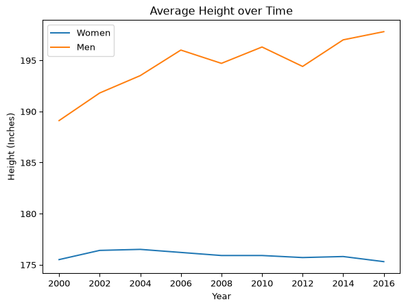

#### Axes Interface or Object-Oriented Style

- The second main interface for Matplotlib is the Axes interface
- Also referred to as the Object-Oriented interface
- Contrasts the implicit or functional interface of pyplot
  - Interactive interface tends to be more useful in interactive data
    interrogation
  - Very popular in combination with jupyter notebooks
- The axes interface let’s you directly interact with figures and axes
  to have more fine-grained control over how plot’s look
  - Can be accessed directly via the figure and axes elements
  - Or via some `pyplot` functions like `pyplot.subplots`
    - Return’s a figure and a the specified number of axes (by default
      $1$)
    - Each axes can then be plotted on directly like with the implicit
      interface

``` python
import matplotlib.pyplot as plt
import pandas as pd

data = {
    "Years": ["2000", "2002", "2004", "2006", "2008", "2010", "2012", "2014", "2016"],
    "Men": [189.1, 191.8, 193.5, 196.0, 194.7, 196.3, 194.4, 197.0, 197.8],
    "Women": [175.5, 176.4, 176.5, 176.2, 175.9, 175.9, 175.7, 175.8, 175.3],
}

heights_df = pd.DataFrame(data)

# Get one figure and axis
fig, ax = plt.subplots()
ax.plot("Years", "Women", "Men", data=heights_df)
ax.set_xlabel("Year")
ax.set_ylabel("Height (Inches)")
ax.set_title("Heights over time")
ax.legend(["Women", "Men"])
```

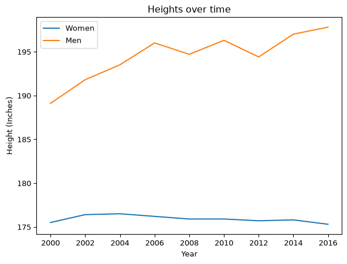

- Using multiple axes enables plotting multiple charts on the same
  figure
- Use `plt.subplots`, specify the *shape* of the plot in terms of the
  number of rows, then columns
- For example, plotting two charts

``` python
import matplotlib.pyplot as plt
import pandas as pd

data = {
    "Years": ["2000", "2002", "2004", "2006", "2008", "2010", "2012", "2014", "2016"],
    "Men": [189.1, 191.8, 193.5, 196.0, 194.7, 196.3, 194.4, 197.0, 197.8],
    "Women": [175.5, 176.4, 176.5, 176.2, 175.9, 175.9, 175.7, 175.8, 175.3],
}

heights_df = pd.DataFrame(data)

fig, (ax1, ax2) = plt.subplots(1, 2)  # Create a figure with 1 row and 2 columns

ax1.plot("Years", "Women", data=heights_df)
ax1.set_xlabel("Year")
ax1.set_ylabel("Height (Inches)")
ax1.set_title("Women")
ax1.legend(["Women"])

ax2.plot("Years", "Men", data=heights_df)
ax2.set_xlabel("Year")
ax2.set_title("Men")
ax2.legend(["Men"])

fig.autofmt_xdate(rotation=65)  # Rotate data labels
```

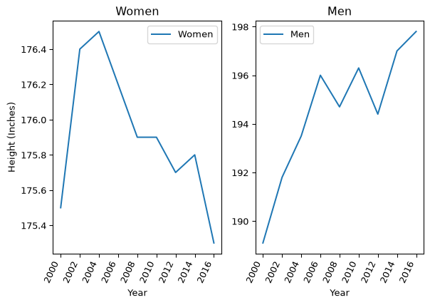

- This explicit style is great once you’re looking to create polished
  finished charts instead of just general interactive data interrogation

### Seaborn

- Seaborn is a statistical plotting library

  - Designed to be used with Pandas
  - Builds on top of [Matplotlib](#matplotlib)
  - Aims to provide good-looking plots out of the box

- By convention Seaborn is imported as `sns`

  ``` python
    import seaborn as sns
  ```

- Seaborn comes with some built-in datasets

  - Used in the online documentation and tutorials
  - Aims to give you something to work with out of the box

- Datasets are designed to be loaded as Pandas dataframes

  - The full list is maintained at ths
    [repository](https://github.com/mwaskom/seaborn-data)

- For example, plotting some data from the car crashes dataset

  - Here the relationship between two columns using the `relplot`

``` python
import seaborn as sns

car_crashes = sns.load_dataset("car_crashes")
car_crashes = car_crashes[["total", "not_distracted", "alcohol"]] #filtering the dataframe
sns.relplot(data=car_crashes, x="total", y="not_distracted")
```

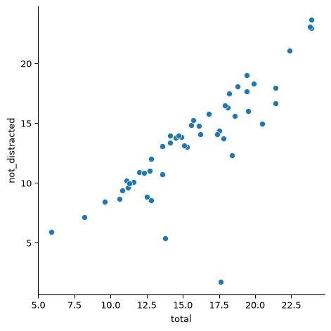

#### Seaborn Themes

- Seaborn bundles a number of themes that control how plots are styled

- The default is set via

  ``` python
    sns.set_theme()
  ```

- We can repeat our previous plot to see the style of this theme

``` python
import seaborn as sns

sns.set_theme()

car_crashes = sns.load_dataset("car_crashes")
car_crashes = car_crashes[
    ["total", "not_distracted", "alcohol"]
]  # filtering the dataframe
sns.relplot(data=car_crashes, x="total", y="not_distracted")
```

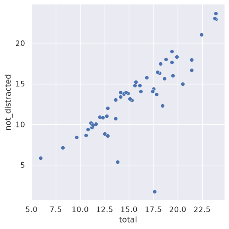

- A seaborn theme changes a bunch of parameters behind the scenes

- The theme thus applied to any subsequent seaborn themes

  - But is also applied to general Matplotlib plots too!

- Seaborn breaks down formatting a chart into two types of parameters

  1. Style
      - The aesthetic
  2. Scale
      - The sizing of the plot and various elements

- Seaborn also defines a number of *styles* that can be set

  - There are five included by default

    1. `darkgrid`
    2. `whitegrid`
    3. `dark`
    4. `white`
    5. `ticks`

- Style is then set by `sns.set_style`

- For example, using the dark style

``` python
import seaborn as sns

sns.set_style("dark")

car_crashes = sns.load_dataset("car_crashes")
car_crashes = car_crashes[
    ["total", "not_distracted", "alcohol"]
]  # filtering the dataframe
sns.relplot(data=car_crashes, x="total", y="not_distracted")
```


- Setting the scale is designed to target specific presentation styles.
  The defaults are

  1. `paper`
  2. `notebook`
  3. `talk`
  4. `poster`

- The scale theme can be set via the `set_context` instructions

``` python
import seaborn as sns

sns.set_context("talk")

car_crashes = sns.load_dataset("car_crashes")
car_crashes = car_crashes[
    ["total", "not_distracted", "alcohol"]
]  # filtering the dataframe
sns.relplot(data=car_crashes, x="total", y="not_distracted")
```

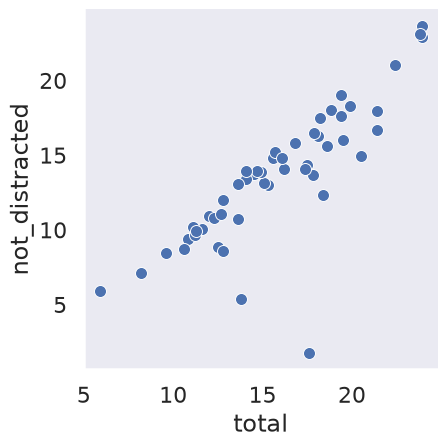

#### Seaborn Plot Types

- Seaborn has an extension range of different plots
- One useful class is `pairplot`
  - Helps identify correlations in data
  - Plot’s the correlations between all columns in a dataframe
- For example, using the Iris built-in dataset

``` python
import seaborn as sns

df = sns.load_dataset("iris")
sns.pairplot(df, hue="species")
```

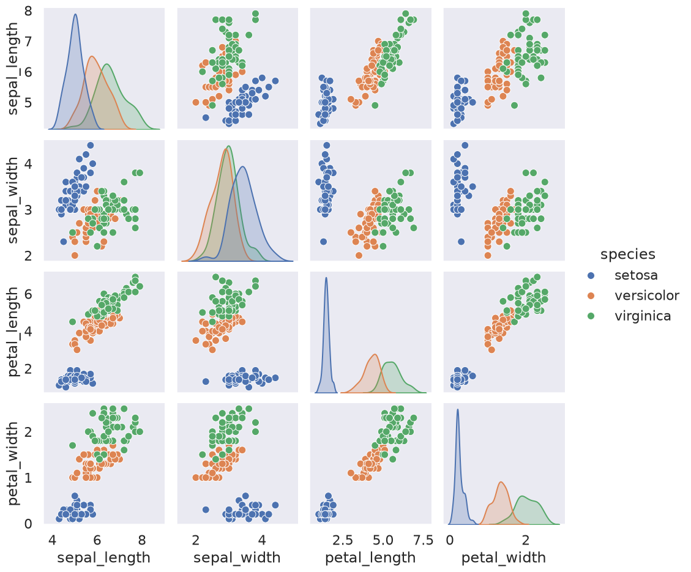

### Plotly

- [Matplotlib](#matplotlib) and by extension [Seaborn](#seaborn) are
  designed primarily for publication-ready static charts
  - Or simple animations
- They can be extended to create interactive charts, but not their
  primary supported use case
- Plotly is designed for producing high-quality interactive charts
- An advantage of Plotly over Matplotlib is that it supports a proper 3D
  rendering engine for 3D plots
- For example, the chart below demonstrates a 3D plot created in Plotly

``` python
import plotly.express as px

iris = px.data.iris()

fig = px.scatter_3d(
    iris, x="sepal_length", y="petal_width", z="petal_length", color="species"
)
fig.show()
```

        <script>
        window.PlotlyConfig = {MathJaxConfig: 'local'};
        if (window.MathJax && window.MathJax.Hub && window.MathJax.Hub.Config) {window.MathJax.Hub.Config({SVG: {font: "STIX-Web"}});}
        </script>
        <script type="module">import "https://cdn.plot.ly/plotly-3.6.0.min"</script>

<div style="height:525px; width:100%;">            <script src="https://cdnjs.cloudflare.com/ajax/libs/mathjax/2.7.5/MathJax.js?config=TeX-AMS-MML_SVG"></script><script>if (window.MathJax && window.MathJax.Hub && window.MathJax.Hub.Config) {window.MathJax.Hub.Config({SVG: {font: "STIX-Web"}});}</script>                <script>window.PlotlyConfig = {MathJaxConfig: 'local'};</script>
        <script charset="utf-8" src="https://cdn.plot.ly/plotly-3.6.0.min.js" integrity="sha256-QaOVwtVY0T02VaHrr6pnoHLCwayMJp4O5n4YyaE3rJk=" crossorigin="anonymous"></script>                <div id="e8c641a2-ecd1-4e97-939e-ace95542a474" class="plotly-graph-div" style="height:100%; width:100%;"></div>            <script>                window.PLOTLYENV=window.PLOTLYENV || {};                                if (document.getElementById("e8c641a2-ecd1-4e97-939e-ace95542a474")) {                    Plotly.newPlot(                        "e8c641a2-ecd1-4e97-939e-ace95542a474",                        [{"hovertemplate":"species=setosa\u003cbr\u003esepal_length=%{x}\u003cbr\u003epetal_width=%{y}\u003cbr\u003epetal_length=%{z}\u003cextra\u003e\u003c\u002fextra\u003e","legendgroup":"setosa","marker":{"color":"#636efa","symbol":"circle"},"mode":"markers","name":"setosa","scene":"scene","showlegend":true,"x":{"dtype":"f8","bdata":"ZmZmZmZmFECamZmZmZkTQM3MzMzMzBJAZmZmZmZmEkAAAAAAAAAUQJqZmZmZmRVAZmZmZmZmEkAAAAAAAAAUQJqZmZmZmRFAmpmZmZmZE0CamZmZmZkVQDMzMzMzMxNAMzMzMzMzE0AzMzMzMzMRQDMzMzMzMxdAzczMzMzMFkCamZmZmZkVQGZmZmZmZhRAzczMzMzMFkBmZmZmZmYUQJqZmZmZmRVAZmZmZmZmFEBmZmZmZmYSQGZmZmZmZhRAMzMzMzMzE0AAAAAAAAAUQAAAAAAAABRAzczMzMzMFEDNzMzMzMwUQM3MzMzMzBJAMzMzMzMzE0CamZmZmZkVQM3MzMzMzBRAAAAAAAAAFkCamZmZmZkTQAAAAAAAABRAAAAAAAAAFkCamZmZmZkTQJqZmZmZmRFAZmZmZmZmFEAAAAAAAAAUQAAAAAAAABJAmpmZmZmZEUAAAAAAAAAUQGZmZmZmZhRAMzMzMzMzE0BmZmZmZmYUQGZmZmZmZhJAMzMzMzMzFUAAAAAAAAAUQA=="},"y":{"dtype":"f8","bdata":"mpmZmZmZyT+amZmZmZnJP5qZmZmZmck\u002fmpmZmZmZyT+amZmZmZnJP5qZmZmZmdk\u002fMzMzMzMz0z+amZmZmZnJP5qZmZmZmck\u002fmpmZmZmZuT+amZmZmZnJP5qZmZmZmck\u002fmpmZmZmZuT+amZmZmZm5P5qZmZmZmck\u002fmpmZmZmZ2T+amZmZmZnZPzMzMzMzM9M\u002fMzMzMzMz0z8zMzMzMzPTP5qZmZmZmck\u002fmpmZmZmZ2T+amZmZmZnJPwAAAAAAAOA\u002fmpmZmZmZyT+amZmZmZnJP5qZmZmZmdk\u002fmpmZmZmZyT+amZmZmZnJP5qZmZmZmck\u002fmpmZmZmZyT+amZmZmZnZP5qZmZmZmbk\u002fmpmZmZmZyT+amZmZmZm5P5qZmZmZmck\u002fmpmZmZmZyT+amZmZmZm5P5qZmZmZmck\u002fmpmZmZmZyT8zMzMzMzPTPzMzMzMzM9M\u002fmpmZmZmZyT8zMzMzMzPjP5qZmZmZmdk\u002fMzMzMzMz0z+amZmZmZnJP5qZmZmZmck\u002fmpmZmZmZyT+amZmZmZnJPw=="},"z":{"dtype":"f8","bdata":"ZmZmZmZm9j9mZmZmZmb2P83MzMzMzPQ\u002fAAAAAAAA+D9mZmZmZmb2PzMzMzMzM\u002fs\u002fZmZmZmZm9j8AAAAAAAD4P2ZmZmZmZvY\u002fAAAAAAAA+D8AAAAAAAD4P5qZmZmZmfk\u002fZmZmZmZm9j+amZmZmZnxPzMzMzMzM\u002fM\u002fAAAAAAAA+D\u002fNzMzMzMz0P2ZmZmZmZvY\u002fMzMzMzMz+z8AAAAAAAD4PzMzMzMzM\u002fs\u002fAAAAAAAA+D8AAAAAAADwPzMzMzMzM\u002fs\u002fZmZmZmZm\u002fj+amZmZmZn5P5qZmZmZmfk\u002fAAAAAAAA+D9mZmZmZmb2P5qZmZmZmfk\u002fmpmZmZmZ+T8AAAAAAAD4PwAAAAAAAPg\u002fZmZmZmZm9j8AAAAAAAD4PzMzMzMzM\u002fM\u002fzczMzMzM9D8AAAAAAAD4P83MzMzMzPQ\u002fAAAAAAAA+D\u002fNzMzMzMz0P83MzMzMzPQ\u002fzczMzMzM9D+amZmZmZn5P2ZmZmZmZv4\u002fZmZmZmZm9j+amZmZmZn5P2ZmZmZmZvY\u002fAAAAAAAA+D9mZmZmZmb2Pw=="},"type":"scatter3d"},{"hovertemplate":"species=versicolor\u003cbr\u003esepal_length=%{x}\u003cbr\u003epetal_width=%{y}\u003cbr\u003epetal_length=%{z}\u003cextra\u003e\u003c\u002fextra\u003e","legendgroup":"versicolor","marker":{"color":"#EF553B","symbol":"circle"},"mode":"markers","name":"versicolor","scene":"scene","showlegend":true,"x":{"dtype":"f8","bdata":"AAAAAAAAHECamZmZmZkZQJqZmZmZmRtAAAAAAAAAFkAAAAAAAAAaQM3MzMzMzBZAMzMzMzMzGUCamZmZmZkTQGZmZmZmZhpAzczMzMzMFEAAAAAAAAAUQJqZmZmZmRdAAAAAAAAAGEBmZmZmZmYYQGZmZmZmZhZAzczMzMzMGkBmZmZmZmYWQDMzMzMzMxdAzczMzMzMGEBmZmZmZmYWQJqZmZmZmRdAZmZmZmZmGEAzMzMzMzMZQGZmZmZmZhhAmpmZmZmZGUBmZmZmZmYaQDMzMzMzMxtAzczMzMzMGkAAAAAAAAAYQM3MzMzMzBZAAAAAAAAAFkAAAAAAAAAWQDMzMzMzMxdAAAAAAAAAGECamZmZmZkVQAAAAAAAABhAzczMzMzMGkAzMzMzMzMZQGZmZmZmZhZAAAAAAAAAFkAAAAAAAAAWQGZmZmZmZhhAMzMzMzMzF0AAAAAAAAAUQGZmZmZmZhZAzczMzMzMFkDNzMzMzMwWQM3MzMzMzBhAZmZmZmZmFEDNzMzMzMwWQA=="},"y":{"dtype":"f8","bdata":"ZmZmZmZm9j8AAAAAAAD4PwAAAAAAAPg\u002fzczMzMzM9D8AAAAAAAD4P83MzMzMzPQ\u002fmpmZmZmZ+T8AAAAAAADwP83MzMzMzPQ\u002fZmZmZmZm9j8AAAAAAADwPwAAAAAAAPg\u002fAAAAAAAA8D9mZmZmZmb2P83MzMzMzPQ\u002fZmZmZmZm9j8AAAAAAAD4PwAAAAAAAPA\u002fAAAAAAAA+D+amZmZmZnxP83MzMzMzPw\u002fzczMzMzM9D8AAAAAAAD4PzMzMzMzM\u002fM\u002fzczMzMzM9D9mZmZmZmb2P2ZmZmZmZvY\u002fMzMzMzMz+z8AAAAAAAD4PwAAAAAAAPA\u002fmpmZmZmZ8T8AAAAAAADwPzMzMzMzM\u002fM\u002fmpmZmZmZ+T8AAAAAAAD4P5qZmZmZmfk\u002fAAAAAAAA+D\u002fNzMzMzMz0P83MzMzMzPQ\u002fzczMzMzM9D8zMzMzMzPzP2ZmZmZmZvY\u002fMzMzMzMz8z8AAAAAAADwP83MzMzMzPQ\u002fMzMzMzMz8z\u002fNzMzMzMz0P83MzMzMzPQ\u002fmpmZmZmZ8T\u002fNzMzMzMz0Pw=="},"z":{"dtype":"f8","bdata":"zczMzMzMEkAAAAAAAAASQJqZmZmZmRNAAAAAAAAAEEBmZmZmZmYSQAAAAAAAABJAzczMzMzMEkBmZmZmZmYKQGZmZmZmZhJAMzMzMzMzD0AAAAAAAAAMQM3MzMzMzBBAAAAAAAAAEEDNzMzMzMwSQM3MzMzMzAxAmpmZmZmZEUAAAAAAAAASQGZmZmZmZhBAAAAAAAAAEkAzMzMzMzMPQDMzMzMzMxNAAAAAAAAAEECamZmZmZkTQM3MzMzMzBJAMzMzMzMzEUCamZmZmZkRQDMzMzMzMxNAAAAAAAAAFEAAAAAAAAASQAAAAAAAAAxAZmZmZmZmDkCamZmZmZkNQDMzMzMzMw9AZmZmZmZmFEAAAAAAAAASQAAAAAAAABJAzczMzMzMEkCamZmZmZkRQGZmZmZmZhBAAAAAAAAAEECamZmZmZkRQGZmZmZmZhJAAAAAAAAAEEBmZmZmZmYKQM3MzMzMzBBAzczMzMzMEEDNzMzMzMwQQDMzMzMzMxFAAAAAAAAACEBmZmZmZmYQQA=="},"type":"scatter3d"},{"hovertemplate":"species=virginica\u003cbr\u003esepal_length=%{x}\u003cbr\u003epetal_width=%{y}\u003cbr\u003epetal_length=%{z}\u003cextra\u003e\u003c\u002fextra\u003e","legendgroup":"virginica","marker":{"color":"#00cc96","symbol":"circle"},"mode":"markers","name":"virginica","scene":"scene","showlegend":true,"x":{"dtype":"f8","bdata":"MzMzMzMzGUAzMzMzMzMXQGZmZmZmZhxAMzMzMzMzGUAAAAAAAAAaQGZmZmZmZh5AmpmZmZmZE0AzMzMzMzMdQM3MzMzMzBpAzczMzMzMHEAAAAAAAAAaQJqZmZmZmRlAMzMzMzMzG0DNzMzMzMwWQDMzMzMzMxdAmpmZmZmZGUAAAAAAAAAaQM3MzMzMzB5AzczMzMzMHkAAAAAAAAAYQJqZmZmZmRtAZmZmZmZmFkDNzMzMzMweQDMzMzMzMxlAzczMzMzMGkDNzMzMzMwcQM3MzMzMzBhAZmZmZmZmGECamZmZmZkZQM3MzMzMzBxAmpmZmZmZHUCamZmZmZkfQJqZmZmZmRlAMzMzMzMzGUBmZmZmZmYYQM3MzMzMzB5AMzMzMzMzGUCamZmZmZkZQAAAAAAAABhAmpmZmZmZG0DNzMzMzMwaQJqZmZmZmRtAMzMzMzMzF0AzMzMzMzMbQM3MzMzMzBpAzczMzMzMGkAzMzMzMzMZQAAAAAAAABpAzczMzMzMGECamZmZmZkXQA=="},"y":{"dtype":"f8","bdata":"AAAAAAAABEBmZmZmZmb+P83MzMzMzABAzczMzMzM\u002fD+amZmZmZkBQM3MzMzMzABAMzMzMzMz+z\u002fNzMzMzMz8P83MzMzMzPw\u002fAAAAAAAABEAAAAAAAAAAQGZmZmZmZv4\u002fzczMzMzMAEAAAAAAAAAAQDMzMzMzMwNAZmZmZmZmAkDNzMzMzMz8P5qZmZmZmQFAZmZmZmZmAkAAAAAAAAD4P2ZmZmZmZgJAAAAAAAAAAEAAAAAAAAAAQM3MzMzMzPw\u002fzczMzMzMAEDNzMzMzMz8P83MzMzMzPw\u002fzczMzMzM\u002fD\u002fNzMzMzMwAQJqZmZmZmfk\u002fZmZmZmZm\u002fj8AAAAAAAAAQJqZmZmZmQFAAAAAAAAA+D9mZmZmZmb2P2ZmZmZmZgJAMzMzMzMzA0DNzMzMzMz8P83MzMzMzPw\u002fzczMzMzMAEAzMzMzMzMDQGZmZmZmZgJAZmZmZmZm\u002fj9mZmZmZmYCQAAAAAAAAARAZmZmZmZmAkBmZmZmZmb+PwAAAAAAAABAZmZmZmZmAkDNzMzMzMz8Pw=="},"z":{"dtype":"f8","bdata":"AAAAAAAAGEBmZmZmZmYUQJqZmZmZmRdAZmZmZmZmFkAzMzMzMzMXQGZmZmZmZhpAAAAAAAAAEkAzMzMzMzMZQDMzMzMzMxdAZmZmZmZmGEBmZmZmZmYUQDMzMzMzMxVAAAAAAAAAFkAAAAAAAAAUQGZmZmZmZhRAMzMzMzMzFUAAAAAAAAAWQM3MzMzMzBpAmpmZmZmZG0AAAAAAAAAUQM3MzMzMzBZAmpmZmZmZE0DNzMzMzMwaQJqZmZmZmRNAzczMzMzMFkAAAAAAAAAYQDMzMzMzMxNAmpmZmZmZE0BmZmZmZmYWQDMzMzMzMxdAZmZmZmZmGECamZmZmZkZQGZmZmZmZhZAZmZmZmZmFEBmZmZmZmYWQGZmZmZmZhhAZmZmZmZmFkAAAAAAAAAWQDMzMzMzMxNAmpmZmZmZFUBmZmZmZmYWQGZmZmZmZhRAZmZmZmZmFECamZmZmZkXQM3MzMzMzBZAzczMzMzMFEAAAAAAAAAUQM3MzMzMzBRAmpmZmZmZFUBmZmZmZmYUQA=="},"type":"scatter3d"}],                        {"template":{"data":{"histogram2dcontour":[{"type":"histogram2dcontour","colorbar":{"outlinewidth":0,"ticks":""},"colorscale":[[0.0,"#0d0887"],[0.1111111111111111,"#46039f"],[0.2222222222222222,"#7201a8"],[0.3333333333333333,"#9c179e"],[0.4444444444444444,"#bd3786"],[0.5555555555555556,"#d8576b"],[0.6666666666666666,"#ed7953"],[0.7777777777777778,"#fb9f3a"],[0.8888888888888888,"#fdca26"],[1.0,"#f0f921"]]}],"choropleth":[{"type":"choropleth","colorbar":{"outlinewidth":0,"ticks":""}}],"histogram2d":[{"type":"histogram2d","colorbar":{"outlinewidth":0,"ticks":""},"colorscale":[[0.0,"#0d0887"],[0.1111111111111111,"#46039f"],[0.2222222222222222,"#7201a8"],[0.3333333333333333,"#9c179e"],[0.4444444444444444,"#bd3786"],[0.5555555555555556,"#d8576b"],[0.6666666666666666,"#ed7953"],[0.7777777777777778,"#fb9f3a"],[0.8888888888888888,"#fdca26"],[1.0,"#f0f921"]]}],"heatmap":[{"type":"heatmap","colorbar":{"outlinewidth":0,"ticks":""},"colorscale":[[0.0,"#0d0887"],[0.1111111111111111,"#46039f"],[0.2222222222222222,"#7201a8"],[0.3333333333333333,"#9c179e"],[0.4444444444444444,"#bd3786"],[0.5555555555555556,"#d8576b"],[0.6666666666666666,"#ed7953"],[0.7777777777777778,"#fb9f3a"],[0.8888888888888888,"#fdca26"],[1.0,"#f0f921"]]}],"contourcarpet":[{"type":"contourcarpet","colorbar":{"outlinewidth":0,"ticks":""}}],"contour":[{"type":"contour","colorbar":{"outlinewidth":0,"ticks":""},"colorscale":[[0.0,"#0d0887"],[0.1111111111111111,"#46039f"],[0.2222222222222222,"#7201a8"],[0.3333333333333333,"#9c179e"],[0.4444444444444444,"#bd3786"],[0.5555555555555556,"#d8576b"],[0.6666666666666666,"#ed7953"],[0.7777777777777778,"#fb9f3a"],[0.8888888888888888,"#fdca26"],[1.0,"#f0f921"]]}],"surface":[{"type":"surface","colorbar":{"outlinewidth":0,"ticks":""},"colorscale":[[0.0,"#0d0887"],[0.1111111111111111,"#46039f"],[0.2222222222222222,"#7201a8"],[0.3333333333333333,"#9c179e"],[0.4444444444444444,"#bd3786"],[0.5555555555555556,"#d8576b"],[0.6666666666666666,"#ed7953"],[0.7777777777777778,"#fb9f3a"],[0.8888888888888888,"#fdca26"],[1.0,"#f0f921"]]}],"mesh3d":[{"type":"mesh3d","colorbar":{"outlinewidth":0,"ticks":""}}],"scatter":[{"fillpattern":{"fillmode":"overlay","size":10,"solidity":0.2},"type":"scatter"}],"parcoords":[{"type":"parcoords","line":{"colorbar":{"outlinewidth":0,"ticks":""}}}],"scatterpolargl":[{"type":"scatterpolargl","marker":{"colorbar":{"outlinewidth":0,"ticks":""}}}],"bar":[{"error_x":{"color":"#2a3f5f"},"error_y":{"color":"#2a3f5f"},"marker":{"line":{"color":"#E5ECF6","width":0.5},"pattern":{"fillmode":"overlay","size":10,"solidity":0.2}},"type":"bar"}],"scattergeo":[{"type":"scattergeo","marker":{"colorbar":{"outlinewidth":0,"ticks":""}}}],"scatterpolar":[{"type":"scatterpolar","marker":{"colorbar":{"outlinewidth":0,"ticks":""}}}],"histogram":[{"marker":{"pattern":{"fillmode":"overlay","size":10,"solidity":0.2}},"type":"histogram"}],"scattergl":[{"type":"scattergl","marker":{"colorbar":{"outlinewidth":0,"ticks":""}}}],"scatter3d":[{"type":"scatter3d","line":{"colorbar":{"outlinewidth":0,"ticks":""}},"marker":{"colorbar":{"outlinewidth":0,"ticks":""}}}],"scattermap":[{"type":"scattermap","marker":{"colorbar":{"outlinewidth":0,"ticks":""}}}],"scattermapbox":[{"type":"scattermapbox","marker":{"colorbar":{"outlinewidth":0,"ticks":""}}}],"scatterternary":[{"type":"scatterternary","marker":{"colorbar":{"outlinewidth":0,"ticks":""}}}],"scattercarpet":[{"type":"scattercarpet","marker":{"colorbar":{"outlinewidth":0,"ticks":""}}}],"carpet":[{"aaxis":{"endlinecolor":"#2a3f5f","gridcolor":"white","linecolor":"white","minorgridcolor":"white","startlinecolor":"#2a3f5f"},"baxis":{"endlinecolor":"#2a3f5f","gridcolor":"white","linecolor":"white","minorgridcolor":"white","startlinecolor":"#2a3f5f"},"type":"carpet"}],"table":[{"cells":{"fill":{"color":"#EBF0F8"},"line":{"color":"white"}},"header":{"fill":{"color":"#C8D4E3"},"line":{"color":"white"}},"type":"table"}],"barpolar":[{"marker":{"line":{"color":"#E5ECF6","width":0.5},"pattern":{"fillmode":"overlay","size":10,"solidity":0.2}},"type":"barpolar"}],"pie":[{"automargin":true,"type":"pie"}]},"layout":{"autotypenumbers":"strict","colorway":["#636efa","#EF553B","#00cc96","#ab63fa","#FFA15A","#19d3f3","#FF6692","#B6E880","#FF97FF","#FECB52"],"font":{"color":"#2a3f5f"},"hovermode":"closest","hoverlabel":{"align":"left"},"paper_bgcolor":"white","plot_bgcolor":"#E5ECF6","polar":{"bgcolor":"#E5ECF6","angularaxis":{"gridcolor":"white","linecolor":"white","ticks":""},"radialaxis":{"gridcolor":"white","linecolor":"white","ticks":""}},"ternary":{"bgcolor":"#E5ECF6","aaxis":{"gridcolor":"white","linecolor":"white","ticks":""},"baxis":{"gridcolor":"white","linecolor":"white","ticks":""},"caxis":{"gridcolor":"white","linecolor":"white","ticks":""}},"coloraxis":{"colorbar":{"outlinewidth":0,"ticks":""}},"colorscale":{"sequential":[[0.0,"#0d0887"],[0.1111111111111111,"#46039f"],[0.2222222222222222,"#7201a8"],[0.3333333333333333,"#9c179e"],[0.4444444444444444,"#bd3786"],[0.5555555555555556,"#d8576b"],[0.6666666666666666,"#ed7953"],[0.7777777777777778,"#fb9f3a"],[0.8888888888888888,"#fdca26"],[1.0,"#f0f921"]],"sequentialminus":[[0.0,"#0d0887"],[0.1111111111111111,"#46039f"],[0.2222222222222222,"#7201a8"],[0.3333333333333333,"#9c179e"],[0.4444444444444444,"#bd3786"],[0.5555555555555556,"#d8576b"],[0.6666666666666666,"#ed7953"],[0.7777777777777778,"#fb9f3a"],[0.8888888888888888,"#fdca26"],[1.0,"#f0f921"]],"diverging":[[0,"#8e0152"],[0.1,"#c51b7d"],[0.2,"#de77ae"],[0.3,"#f1b6da"],[0.4,"#fde0ef"],[0.5,"#f7f7f7"],[0.6,"#e6f5d0"],[0.7,"#b8e186"],[0.8,"#7fbc41"],[0.9,"#4d9221"],[1,"#276419"]]},"xaxis":{"gridcolor":"white","linecolor":"white","ticks":"","title":{"standoff":15},"zerolinecolor":"white","automargin":true,"zerolinewidth":2},"yaxis":{"gridcolor":"white","linecolor":"white","ticks":"","title":{"standoff":15},"zerolinecolor":"white","automargin":true,"zerolinewidth":2},"scene":{"xaxis":{"backgroundcolor":"#E5ECF6","gridcolor":"white","linecolor":"white","showbackground":true,"ticks":"","zerolinecolor":"white","gridwidth":2},"yaxis":{"backgroundcolor":"#E5ECF6","gridcolor":"white","linecolor":"white","showbackground":true,"ticks":"","zerolinecolor":"white","gridwidth":2},"zaxis":{"backgroundcolor":"#E5ECF6","gridcolor":"white","linecolor":"white","showbackground":true,"ticks":"","zerolinecolor":"white","gridwidth":2}},"shapedefaults":{"line":{"color":"#2a3f5f"}},"annotationdefaults":{"arrowcolor":"#2a3f5f","arrowhead":0,"arrowwidth":1},"geo":{"bgcolor":"white","landcolor":"#E5ECF6","subunitcolor":"white","showland":true,"showlakes":true,"lakecolor":"white"},"title":{"x":0.05},"mapbox":{"style":"light"},"margin":{"b":0,"l":0,"r":0,"t":30}}},"scene":{"domain":{"x":[0.0,1.0],"y":[0.0,1.0]},"xaxis":{"title":{"text":"sepal_length"}},"yaxis":{"title":{"text":"petal_width"}},"zaxis":{"title":{"text":"petal_length"}}},"legend":{"title":{"text":"species"},"tracegroupgap":0}},                        {"responsive": true}                    ).then(function(){
                            &#10;var gd = document.getElementById('e8c641a2-ecd1-4e97-939e-ace95542a474');
var x = new MutationObserver(function (mutations, observer) {{
        var display = window.getComputedStyle(gd).display;
        if (!display || display === 'none') {{
            console.log([gd, 'removed!']);
            Plotly.purge(gd);
            observer.disconnect();
        }}
}});
&#10;// Listen for the removal of the full notebook cells
var notebookContainer = gd.closest('#notebook-container');
if (notebookContainer) {{
    x.observe(notebookContainer, {childList: true});
}}
&#10;// Listen for the clearing of the current output cell
var outputEl = gd.closest('.output');
if (outputEl) {{
    x.observe(outputEl, {childList: true});
}}
&#10;                        })                };            </script>        </div>

### Bokeh

- Bokeh is another library for creating interactive plots
- Designed to offer improved performance and enable data to be updated
  without a state reload via the `ColumnDataSource` class
- Data sources can be shared across figures
  - Means updating the data source automatically updates dependent plots

``` python
from bokeh.io import output_notebook
from bokeh.plotting import figure, show
from bokeh.models import ColumnDataSource
from bokeh.layouts import gridplot

output_notebook()

Y_1 = [x for x in range(0, 200, 2)]
Y_2 = [x**2 for x in Y_1]

X = [x for x in range(100)]

data = {"x": X, "y1": Y_1, "y2": Y_2}  # create data

TOOLS = "box_select"  # select interactive tools
source = ColumnDataSource(data=data)  # Create data model

left = figure(tools=TOOLS, title="Brushing")  # Create figure using the selected tools
left.circle(
    "x", "y1", radius=0.5, source=source
)  # Create a circle plot on the first figure

right = figure(
    tools=TOOLS, title="Brushing"
)  # Create a second figure using the selected tools
right.circle(
    "x", "y2", radius=0.5, source=source
)  # Create a circle plot on the second figure

p = gridplot([[left, right]])  # Put the figures on a grid
show(p)  # Show the grid
```

    <style>
        .bk-notebook-logo {
            display: block;
            width: 20px;
            height: 20px;
            background-image: url(data:image/png;base64,iVBORw0KGgoAAAANSUhEUgAAABQAAAAUCAYAAACNiR0NAAAABHNCSVQICAgIfAhkiAAAAAlwSFlzAAALEgAACxIB0t1+/AAAABx0RVh0U29mdHdhcmUAQWRvYmUgRmlyZXdvcmtzIENTNui8sowAAAOkSURBVDiNjZRtaJVlGMd/1/08zzln5zjP1LWcU9N0NkN8m2CYjpgQYQXqSs0I84OLIC0hkEKoPtiH3gmKoiJDU7QpLgoLjLIQCpEsNJ1vqUOdO7ppbuec5+V+rj4ctwzd8IIbbi6u+8f1539dt3A78eXC7QizUF7gyV1fD1Yqg4JWz84yffhm0qkFqBogB9rM8tZdtwVsPUhWhGcFJngGeWrPzHm5oaMmkfEg1usvLFyc8jLRqDOMru7AyC8saQr7GG7f5fvDeH7Ej8CM66nIF+8yngt6HWaKh7k49Soy9nXurCi1o3qUbS3zWfrYeQDTB/Qj6kX6Ybhw4B+bOYoLKCC9H3Nu/leUTZ1JdRWkkn2ldcCamzrcf47KKXdAJllSlxAOkRgyHsGC/zRday5Qld9DyoM4/q/rUoy/CXh3jzOu3bHUVZeU+DEn8FInkPBFlu3+nW3Nw0mk6vCDiWg8CeJaxEwuHS3+z5RgY+YBR6V1Z1nxSOfoaPa4LASWxxdNp+VWTk7+4vzaou8v8PN+xo+KY2xsw6une2frhw05CTYOmQvsEhjhWjn0bmXPjpE1+kplmmkP3suftwTubK9Vq22qKmrBhpY4jvd5afdRA3wGjFAgcnTK2s4hY0/GPNIb0nErGMCRxWOOX64Z8RAC4oCXdklmEvcL8o0BfkNK4lUg9HTl+oPlQxdNo3Mg4Nv175e/1LDGzZen30MEjRUtmXSfiTVu1kK8W4txyV6BMKlbgk3lMwYCiusNy9fVfvvwMxv8Ynl6vxoByANLTWplvuj/nF9m2+PDtt1eiHPBr1oIfhCChQMBw6Aw0UulqTKZdfVvfG7VcfIqLG9bcldL/+pdWTLxLUy8Qq38heUIjh4XlzZxzQm19lLFlr8vdQ97rjZVOLf8nclzckbcD4wxXMidpX30sFd37Fv/GtwwhzhxGVAprjbg0gCAEeIgwCZyTV2Z1REEW8O4py0wsjeloKoMr6iCY6dP92H6Vw/oTyICIthibxjm/DfN9lVz8IqtqKYLUXfoKVMVQVVJOElGjrnnUt9T9wbgp8AyYKaGlqingHZU/uG2NTZSVqwHQTWkx9hxjkpWDaCg6Ckj5qebgBVbT3V3NNXMSiWSDdGV3hrtzla7J+duwPOToIg42ChPQOQjspnSlp1V+Gjdged7+8UN5CRAV7a5EdFNwCjEaBR27b3W890TE7g24NAP/mMDXRWrGoFPQI9ls/MWO2dWFAar/xcOIImbbpA3zgAAAABJRU5ErkJggg==);
        }
    </style>
    <div>
        <a href="https://bokeh.org" target="_blank" class="bk-notebook-logo"></a>
        <span id="e8411f08-43b3-4202-964e-6be7ad3cc105">Loading BokehJS ...</span>
    </div>

    Unable to display output for mime type(s): application/javascript, application/vnd.bokehjs_load.v0+json

  <div id="e2ca70ca-5c86-4c4b-9c05-fbb93f797bea" data-root-id="p1085" style="display: contents;"></div>

    Unable to display output for mime type(s): application/javascript, application/vnd.bokehjs_exec.v0+json

- The resulting figures can be selected cross-axes
  - Defined by the specified tool
- Selecting one plot, selects the corresponding points on the other
  chart

### Other Visualisation Libraries

- There are a range of other visualisation suites available

- Most cater to specific domains or data regimes

  - `geoplotlib`
    - For visualising maps and geographic data
  - `ggplot`
    - Python interface based on the R package ggplot2
  - `pygal`
    - For creating simple plots
  - `folium`
    - For creating interactive maps
  - `missingno`
    - Enables visualising missing data

## Summary

- Visualisation is highly important for data exploration and data
  presentation
- Many libraries exist for visualising data
  - Different libraries cater to different domains
- `matplotlib` is the plotting library as part of the Scipy suite
  - Underpins many other high level plotting libraries
  - Very common in scientific communication and publication-ready
    presentation
  - Very powerful but can have a steep learning curve
- `seaborn` is a statistics visualisation library built on `matplotlib`
  - It is designed for making it easy to plot standard statistical plots
    out of the box
- `Plotly` and `Bokeh` are other plotting engines designed for creating
  more interactive visualisations
  - Also great for creating dashboards

## Questions

Use the following example to answer the following questions

``` python
import matplotlib.pyplot as plt
import seaborn as sns
import pandas as pd

data = {
    "X": [x for x in range(50)],
    "Y": [y for y in range(50, 0, -1)],
    "Y1": [y**2 for y in range(25, 75)]
}

df = pd.DataFrame(data)
```

1. Use `matplotlib` to plot the relationship between column `X` and
    column `Y`
    - See below
2. Use `matplotlib` to plot the relationship between column `X` and
    column `Y1` to the same plot
    - See below
3. Use `matplotlib` to plot the relationship betweeen the relationships
    from Question 1 and Question 2 on seperate axes of the same figure
    - See below
4. Use `seaborn` to change the theme to `darkgrid` and then repeat the
    plots from Question 3

``` python
import matplotlib.pyplot as plt
import seaborn as sns
import pandas as pd

data = {
    "X": [x for x in range(50)],
    "Y": [y for y in range(50, 0, -1)],
    "Y1": [y**2 for y in range(25, 75)],
}

df = pd.DataFrame(data)

print("Question 1")
plt.plot("X", "Y", data=data)
plt.xlabel("X")
plt.ylabel("Y")
```

    Question 1

    Text(0, 0.5, 'Y')

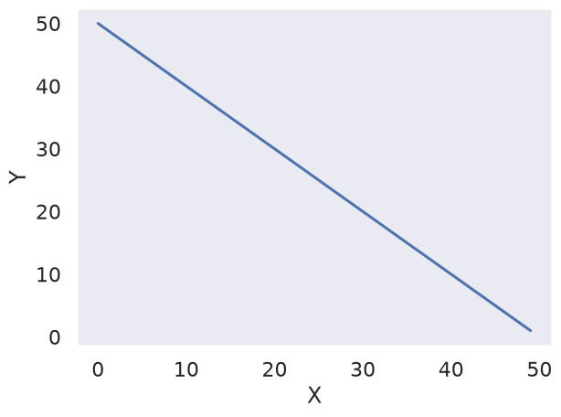

``` python
import matplotlib.pyplot as plt
import seaborn as sns
import pandas as pd

data = {
    "X": [x for x in range(50)],
    "Y": [y for y in range(50, 0, -1)],
    "Y1": [y**2 for y in range(25, 75)],
}

df = pd.DataFrame(data)

print("Question 2")
plt.plot("X", "Y", "Y1", data=data)
plt.xlabel("X")
plt.legend(["Y", "Y1"])
```

    Question 2

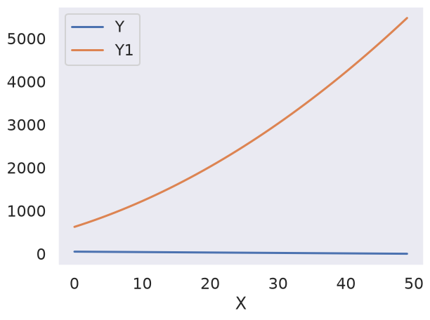

``` python
import matplotlib.pyplot as plt
import seaborn as sns
import pandas as pd

data = {
    "X": [x for x in range(50)],
    "Y": [y for y in range(50, 0, -1)],
    "Y1": [y**2 for y in range(25, 75)],
}
df = pd.DataFrame(data)

print("Question 3")
fig, (ax1, ax2) = plt.subplots(1, 2)

ax1.plot("X", "Y", data=data)
ax1.set_xlabel("X")
ax1.set_ylabel("Y")


ax2.plot("X", "Y1", data=data)
ax2.set_xlabel("X")
ax2.set_ylabel("Y")
```

    Question 3

    Text(0, 0.5, 'Y')

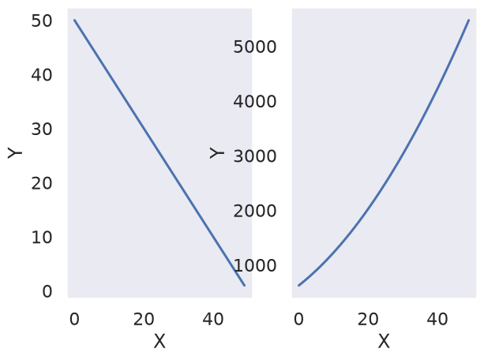

``` python
import matplotlib.pyplot as plt
import seaborn as sns
import pandas as pd

data = {
    "X": [x for x in range(50)],
    "Y": [y for y in range(50, 0, -1)],
    "Y1": [y**2 for y in range(25, 75)],
}
df = pd.DataFrame(data)

print("Question 4")

sns.set_style("darkgrid")

fig, (ax1, ax2) = plt.subplots(1, 2)

ax1.plot("X", "Y", data=data)
ax1.set_xlabel("X")
ax1.set_ylabel("Y")


ax2.plot("X", "Y1", data=data)
ax2.set_xlabel("X")
ax2.set_ylabel("Y")
```

    Question 4

    Text(0, 0.5, 'Y')

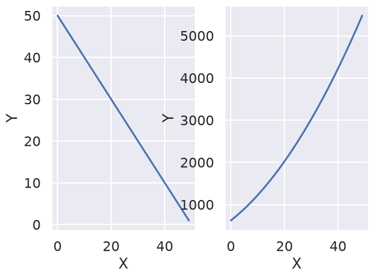
