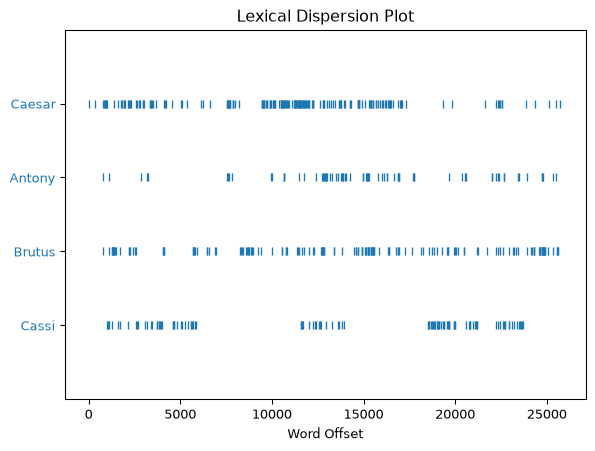

# Chapter 12: Natural Language Toolkit


- [Notes](#notes)
  - [NLTK Sample Texts](#nltk-sample-texts)
  - [Frequency Distributions](#frequency-distributions)
  - [Text Objects](#text-objects)
  - [Classifying Text](#classifying-text)
- [Summary](#summary)
- [Questions and Answers](#questions-and-answers)

## Notes

- A specialised field of data science is the study of text or *natural
  language*
- The Natural Language Toolkit ([NLTK](https://www.nltk.org/)) is a
  python package for language processing

### NLTK Sample Texts

- NTLTK comes with sample texts that can be downloaded and used
- [Project Gutenburg](https://www.gutenberg.org/) is an online library
  of E-Books
  - Mostly Public Domain works
  - NLTK packages a subset of this collection
- `nltk.download` is used to download data into a local `nltk/corpora`
  directory
  - Data can then be imported for use
  - Stored as a *corpus reader* object
  - A useful feature to download is `punkt`
    - This is a tokenizer used to define sentence endings

``` python
import nltk

nltk.download("gutenberg")
nltk.download("punkt")

from nltk.corpus import gutenberg

gutenberg
```

    [nltk_data] Downloading package gutenberg to /home/runner/nltk_data...
    [nltk_data]   Package gutenberg is already up-to-date!
    [nltk_data] Downloading package punkt to /home/runner/nltk_data...
    [nltk_data]   Package punkt is already up-to-date!

    <PlaintextCorpusReader in '/home/runner/nltk_data/corpora/gutenberg'>

> [!TIP]
>
> **Corpus Readers**
>
> Corpus readers are designed to read a specific set of texts. There are
> different corpus readers for different types of text. For plain text
> like books typically the corpus reader is plain text via the
> `PlainTextCorpusReader`.

- Once a corpus is loaded, individual texts can be listed via the
  `fileids` method.
  - Text’s are stored as files

``` python
from nltk.corpus import gutenberg

gutenberg.fileids()
```

    ['austen-emma.txt',
     'austen-persuasion.txt',
     'austen-sense.txt',
     'bible-kjv.txt',
     'blake-poems.txt',
     'bryant-stories.txt',
     'burgess-busterbrown.txt',
     'carroll-alice.txt',
     'chesterton-ball.txt',
     'chesterton-brown.txt',
     'chesterton-thursday.txt',
     'edgeworth-parents.txt',
     'melville-moby_dick.txt',
     'milton-paradise.txt',
     'shakespeare-caesar.txt',
     'shakespeare-hamlet.txt',
     'shakespeare-macbeth.txt',
     'whitman-leaves.txt']

- Corpus readers support various mechanisms for analysing text
  - Text can be loaded broken into
    - Words
    - Sentences
    - Paragraphs
- For example, loading Shakespeare’s *Julius Caesar*

``` python
from nltk.corpus import gutenberg

caesar = gutenberg.sents("shakespeare-caesar.txt")

caesar
```

    ValueError: No sentence tokenizer for this corpus
    ---------------------------------------------------------------------------
    LookupError                               Traceback (most recent call last)
    File ~/work/foundational-data-science-for-python/foundational-data-science-for-python/.venv/lib/python3.14/site-packages/nltk/corpus/reader/plaintext.py:89, in PlaintextCorpusReader.sents(self, fileids)
         88 try:
    ---> 89     self._sent_tokenizer = PunktTokenizer()
         90 except Exception:

    File ~/work/foundational-data-science-for-python/foundational-data-science-for-python/.venv/lib/python3.14/site-packages/nltk/tokenize/punkt.py:1746, in PunktTokenizer.__init__(self, lang)
       1745 PunktSentenceTokenizer.__init__(self)
    -> 1746 self.load_lang(lang)

    File ~/work/foundational-data-science-for-python/foundational-data-science-for-python/.venv/lib/python3.14/site-packages/nltk/tokenize/punkt.py:1751, in PunktTokenizer.load_lang(self, lang)
       1749 from nltk.data import find
    -> 1751 lang_dir = find(f"tokenizers/punkt_tab/{lang}/")
       1752 self._params = load_punkt_params(lang_dir)

    File ~/work/foundational-data-science-for-python/foundational-data-science-for-python/.venv/lib/python3.14/site-packages/nltk/data.py:738, in find(resource_name, paths)
        737 resource_not_found = f"\n{sep}\n{msg}\n{sep}\n"
    --> 738 raise LookupError(resource_not_found)

    LookupError: 
    **********************************************************************
      Resource 'punkt_tab' not found.
      Please use the NLTK Downloader to obtain the resource:

      >>> import nltk
      >>> nltk.download('punkt_tab')

      For more information see: https://www.nltk.org/data.html

      Attempted to load 'tokenizers/punkt_tab/english/'

      Searched in:
        - '/home/runner/nltk_data'
        - '/home/runner/work/foundational-data-science-for-python/foundational-data-science-for-python/.venv/nltk_data'
        - '/home/runner/work/foundational-data-science-for-python/foundational-data-science-for-python/.venv/share/nltk_data'
        - '/home/runner/work/foundational-data-science-for-python/foundational-data-science-for-python/.venv/lib/nltk_data'
        - '/usr/share/nltk_data'
        - '/usr/local/share/nltk_data'
        - '/usr/lib/nltk_data'
        - '/usr/local/lib/nltk_data'
    **********************************************************************


    During handling of the above exception, another exception occurred:

    ValueError                                Traceback (most recent call last)
    Cell In[3], line 3
          1 from nltk.corpus import gutenberg
          2 
    ----> 3 caesar = gutenberg.sents("shakespeare-caesar.txt")
          4 
          5 caesar

    File ~/work/foundational-data-science-for-python/foundational-data-science-for-python/.venv/lib/python3.14/site-packages/nltk/corpus/reader/plaintext.py:91, in PlaintextCorpusReader.sents(self, fileids)
         89         self._sent_tokenizer = PunktTokenizer()
         90     except Exception:
    ---> 91         raise ValueError("No sentence tokenizer for this corpus")
         93 return concat(
         94     [
         95         self.CorpusView(path, self._read_sent_block, encoding=enc)
         96         for (path, enc, fileid) in self.abspaths(fileids, True, True)
         97     ]
         98 )

    ValueError: No sentence tokenizer for this corpus

- As mentioned to parse text into sentences you need to use a
  *tokenizer*
- Punkt is a general-purpose tokenizer
  - Designed to work across multiple languages
- As mentioned before NLTK will download into a local `nltk_data` folder
  - It is divided up into,
    1.  *corpora*
        - Texts to analyse
    2.  *tokenizers*
        - Text analysis engines

``` python
!ls ~/nltk_data
```

    corpora  tokenizers

- Inside the corpora directory we can see the text set’s we have
  downloaded

``` python
!ls ~/nltk_data/corpora
```

    brown      gutenberg      names      stopwords
    brown.zip  gutenberg.zip  names.zip  stopwords.zip

- and of-course the text’s they contain

``` python
!ls ~/nltk_data/corpora/gutenberg
```

    README             burgess-busterbrown.txt  milton-paradise.txt
    austen-emma.txt        carroll-alice.txt    shakespeare-caesar.txt
    austen-persuasion.txt  chesterton-ball.txt  shakespeare-hamlet.txt
    austen-sense.txt       chesterton-brown.txt shakespeare-macbeth.txt
    bible-kjv.txt          chesterton-thursday.txt  whitman-leaves.txt
    blake-poems.txt        edgeworth-parents.txt
    bryant-stories.txt     melville-moby_dick.txt

- Inside the tokenizers directory we can see the tokenizers we’ve
  downloaded

``` python
!ls ~/nltk_data/tokenizers
```

    punkt  punkt.zip

- and within the `punkt` directory we can see the languages it supports

``` python
!ls ~/nltk_data/tokenizers/punkt
```

    PY3     estonian.pickle  malayalam.pickle   spanish.pickle
    README      finnish.pickle   norwegian.pickle   swedish.pickle
    czech.pickle    french.pickle    polish.pickle      turkish.pickle
    danish.pickle   german.pickle    portuguese.pickle
    dutch.pickle    greek.pickle     russian.pickle
    english.pickle  italian.pickle   slovene.pickle

### Frequency Distributions

- The `nltk.freqDist` class can be used to examine the occurrences of
  words within a text
- Can look at,
  - Which words are the most frequent
  - How many unique words there are
  - etc.

``` python
import nltk
from nltk.corpus import gutenberg

caesar = gutenberg.words("shakespeare-caesar.txt")
caesar_dist = nltk.FreqDist(caesar)
caesar_dist.most_common(15)
```

    [(',', 2204),
     ('.', 1296),
     ('I', 531),
     ('the', 502),
     (':', 499),
     ('and', 409),
     ("'", 384),
     ('to', 370),
     ('you', 342),
     ('of', 336),
     ('?', 296),
     ('not', 249),
     ('a', 240),
     ('is', 230),
     ('And', 218)]

- NLTK defines a word as any piece of text that is not whitespace
- This means punctuation is counted as separate “words”
- To filter out punctuation we can use the built-in `string` library
  - Contains a `punctuation` attribute
    - String containing every punctuation character
- For example, to filter the punctuation out of the above example, we
  can,

``` python
import string

import nltk
from nltk.corpus import gutenberg

print("punctuation:", string.punctuation)

caesar = gutenberg.words("shakespeare-caesar.txt")

caesar_filtered = [word in caesar if word not in string.punctuation]

print("Number of punctuation symbols:", len(caesar) - len(caesar_filtered))

caesar_dist = nltk.freqDist(caesar_filtered)
caesar_dist.most_common(15)
```

    SyntaxError: expected 'else' after 'if' expression (1697756737.py, line 10)
      Cell In[10], line 10
        caesar_filtered = [word in caesar if word not in string.punctuation]
                           ^
    SyntaxError: expected 'else' after 'if' expression

> [!NOTE]
>
> **List Comprehension**
>
> The syntax we’ve used above is called a list comprehension, and is
> designed for quickly creating a list based on the elements of an
> existing collection. You could achieve the same with a simple `for`
> loop as described in [Chapter
> 5](../../1_learning-python-in-a-notebook-environment/Chapter_05/Chapter_05.qmd),
> but the list comprehension syntax is more compact. List comprehensions
> will be discussed in more detail later.

- Another common filtering step is remove common words that don’t
  provide much contextual understanding
  - These are simple words like “the”, “and”, “as” etc.
  - Commonly referred to as *stopwords*
- NLTK provides the `stopwords` corpus which can be downloaded to
  perform this filtering

``` python
import nltk

nltk.download("stopwords")

from nltk.corpus import stopwords

english_stopwords = stopwords.words("english")
english_stopwords[:10]  # show the first ten stopwords
```

    [nltk_data] Downloading package stopwords to /home/runner/nltk_data...
    [nltk_data]   Package stopwords is already up-to-date!

    ['a', 'about', 'above', 'after', 'again', 'against', 'ain', 'all', 'am', 'an']

- Once we’ve downloaded the `stopwords` corpus we can use it to filter
  out the these common words from our analysis of Julius Caesar.

``` python
import string

import nltk
from nltk.corpus import gutenberg, stopwords

caesar = gutenberg.words("shakespeare-caesar.txt")

# filter out punctuation
caesar_punctuation_filtered = [word in caesar if word not in string.punctuation]

# filter out stopwords
english_stopwords = stopwords.words("english")
caesar_filtered = [word in caesar_punctuation_filtered if word.lower() not in english_stopwords]

print("Number of stop words:", len(caesar_punctuation_filtered) - caesar_filtered)

caesar_dist = nltk.freqDist(caesar_filtered)
caesar_dist.most_common(15)
```

    SyntaxError: expected 'else' after 'if' expression (2168184387.py, line 9)
      Cell In[12], line 9
        caesar_punctuation_filtered = [word in caesar if word not in string.punctuation]
                                       ^
    SyntaxError: expected 'else' after 'if' expression

- With the extraneous words removed we can start deriving insight into
  the text
  - For example, the above shows Caesar and Brutus are mentioned the
    most out of any other characters
- The `freqDist` class also comes with a bunch of other methods for
  analysing a text

``` python
import string

import nltk
from nltk.corpus import gutenberg, stopwords

caesar = gutenberg.words("shakespeare-caesar.txt")

# filter out punctuation
caesar_filtered = [word in caesar if word not in string.punctuation]

# filter out stopwords
english_stopwords = stopwords.words("english")
caesar_filtered = [word in caesar_filtered if word.lower() not in english_stopwords]

caesar_dist = nltk.freqDist(caesar_filtered)


print("caesar_dist.max():", caesar_dist.max()) # The word with the most appearances

print("caesar_dist['Cassi']:", caesar_dist['Cassi']) # perform a key lookup for the count of a particular word

print("caesar_dist.freq('Cassi'):", caesar_dist.freq('Cassi')) # Count of the word divided by the total count

print("caesar_dist.N():", caesar_dist.N()) # The number of words

print("caesar_dist.tabulate(10):\n", caesar_dist.tabulate(10)) # Display the count for the top 10 words

# plot the 10 most frequent words
caesar_dist.plot(10)
```

    SyntaxError: expected 'else' after 'if' expression (406482526.py, line 9)
      Cell In[13], line 9
        caesar_filtered = [word in caesar if word not in string.punctuation]
                           ^
    SyntaxError: expected 'else' after 'if' expression

### Text Objects

- The `Text` class is provides functionality for exploring a text
- Is initialised from a list of words

``` python
import nltk
from nltk.corpus import gutenberg
from nltk.text import Text

caesar = gutenberg.words("shakespeare-caesar.txt")
caesar_t = Text(caesar)
type(caesar_t)
```

    nltk.text.Text

- `Text` provides a number of useful methods for studying a text
  - `concordance`
    - Show’s the context around a given word
  - `collocations`
    - Displays words commonly appearing together
  - `similar` finds words appearing in a similar context
  - `findall` returns all text matching a regular expression
    - Use `<` and `>` to define word boundaries
    - `*` as a match anything wildcard
  - `dispersion_plot` compares where words appear in a given text

``` python
import nltk
from nltk.corpus import gutenberg
from nltk.text import Text

caesar = gutenberg.words("shakespeare-caesar.txt")
caesar_t = Text(caesar)

print(
    "caesar_t.concordance('Antony', lines=5):\n",
    caesar_t.concordance("Antony", lines=5),
)

print("caesar_t.collocations(num=4):\n", caesar_t.collocations(num=4))

print("caesar_t.similar('Caesar'):\n", caesar_t.similar("Caesar"))

print("caesar_t.findall(r'<O><C.*>'):\n", caesar_t.findall(r"<O><C.*>"))

caesar_t.dispersion_plot(["Caesar", "Antony", "Brutus", "Cassi"])
```

    Displaying 5 of 75 matches:
    efulnesse . Exeunt . Enter Caesar , Antony for the Course , Calphurnia , Porti
    rt Of that quicke Spirit that is in Antony : Let me not hinder Cassius your de
    . He loues no Playes , As thou dost Antony : he heares no Musicke ; Seldome he
    fer ' d him the Crowne ? Cask . Why Antony Bru . Tell vs the manner of it , ge
    , I did not marke it . I sawe Marke Antony offer him a Crowne , yet ' twas not
    caesar_t.concordance('Antony', lines=5):
     None
    Mark Antony; Marke Antony; Good morrow; Caius Ligarius
    caesar_t.collocations(num=4):
     None
    me it brutus you he rome that cassius this if men worke him vs feare
    world thee what know day
    caesar_t.similar('Caesar'):
     None
    O Cicero; O Cassius; O Conspiracie; O Caesar; O Caesar; O Caesar; O
    Constancie; O Caesar; O Caesar; O Caesar; O Cassius; O Cassius; O
    Cassius; O Coward; O Cassius; O Clitus
    caesar_t.findall(r'<O><C.*>'):
     None



### Classifying Text

- Classifier classes are designed to label text data
- To label text data typically you need prepare data with category or
  label features
  - Can then build a model (See [Chapter
    11](../Chapter_11/Chapter_11.qmd))
- This section steps through a simple example using the [Brown
  Corpus](http://korpus.uib.no/icame/brown/bcm.html)
  - This corpus simplifies the process since the data comes pre-labelled
- For example, let us consider attempting to label paragraphs as either
  *editorial* or *fiction*
  - We might do this based on the appearance of certain words
  - Here a simple dictionary `tell_words`
- First need to download our data

``` python
import nltk

nltk.download('brown')

from nltk.corpus import brown

brown
```

    [nltk_data] Downloading package brown to /home/runner/nltk_data...
    [nltk_data]   Package brown is already up-to-date!

    <CategorizedTaggedCorpusReader in '/home/runner/nltk_data/corpora/brown'>

- Now we need to load our data, clean it and define our `tell_words`
  dictionary

``` python
import nltk
from nltk.corpus import brown, stopwords

tell_words = {
    "american",
    "city",
    "congress",
    "country",
    "county",
    "editor",
    "fact",
    "government",
    "national",
    "nuclear",
    "party",
    "peace",
    "political",
    "power",
    "president",
    "public",
    "state",
    "states",
    "united",
    "war",
    "washington",
    "world",
    "big",
    "church",
    "every",
    "eyes",
    "face",
    "felt",
    "found",
    "god",
    "hand",
    "head",
    "home",
    "house",
    "knew",
    "moment",
    "night",
    "room",
    "seemed",
    "stood",
    "think",
    "though",
    "thought",
    "told",
    "voice",
}

english_stopwords = stopwords.words("english")
editorial_paragraphs = brown.paras(categories="editorial")  # load editorial paragraphs
fiction_paragraphs = brown.paras(categories="fiction")  # load only fiction paragraphs

print("There are", len(editorial_paragraphs), "paragraphs")
print("There are", len(fiction_paragraphs), "paragraphs")
```

    There are 1003 paragraphs
    There are 1043 paragraphs

- Each paragraph is a list of lists
  - Each sub-list is a sentence in a paragraph
- For this analysis we only care about the unique words in a paragraph
  - So we want to flatten each paragraph into the set of words it
    contains
  - We can do this with a simple function and a *set comprehension* (See
    the earlier discussion of list comprehensions)
    - We’ve added *type hints* to help the reader understand what is
      happening to the dimensions of the data

``` python
import nltk
from nltk.corpus import brown, stopwords
from typing import Sequence

tell_words = {
    "american",
    "city",
    "congress",
    "country",
    "county",
    "editor",
    "fact",
    "government",
    "national",
    "nuclear",
    "party",
    "peace",
    "political",
    "power",
    "president",
    "public",
    "state",
    "states",
    "united",
    "war",
    "washington",
    "world",
    "big",
    "church",
    "every",
    "eyes",
    "face",
    "felt",
    "found",
    "god",
    "hand",
    "head",
    "home",
    "house",
    "knew",
    "moment",
    "night",
    "room",
    "seemed",
    "stood",
    "think",
    "though",
    "thought",
    "told",
    "voice",
}

# Load the datasets
english_stopwords = stopwords.words("english")
editorial_paragraphs = brown.paras(categories="editorial")  # load editorial paragraphs
fiction_paragraphs = brown.paras(categories="fiction")  # load only fiction paragraphs


# Clean the data format


def flatten(paragraph: Sequence[Sequence[str]]) -> Set[str]:
    return {word for sentence in paragraph for word in sentence}


editorial_paragraphs_flattened = [
    flatten(paragraph) for paragraph in editorial_paragraphs
]
fiction_paragraphs_flattened = [flatten(paragraph) for paragraph in fiction_paragraphs]

print("Flattened editorial paragraphs:\n", editorial_paragraphs_flattened)
```

    Flattened editorial paragraphs:
     [{'decision', 'session', 'abandoning', 'in', 'and', 'of', 'the', 'schools', 'immediately', 'risk', 'an', 'brought', 'governor', 'performed', 'on', 'much', 'good', 'The', 'it', 'education', 'from', 'showdown', '.', 'with', 'convened', 'not', 'has', 'crisis', 'today', 'public', 'faced', 'adjourns', 'issue', ',', 'It', 'atmosphere', 'to', 'struggle', 'conjunction', 'Assembly', 'which', 'met', 'day', 'was', 'General', 'squarely', 'a'}, {'decision', 'powers', 'and', 'in', 'been', 'legislators', 'the', 'need', 'opened', 'There', 'but', 'information', 'provide', 'The', 'budgeting', 'decided', 'tackle', 'for', '.', 'strengthening', 'followed', 'went', 'procedures', 'has', 'budget', ',', 'historic', 'final', 'fight', 'they', 'to', 'executive', 'appropriations', 'Assembly', 'which', 'way', 'General', 'a'}, {'them', 'insured', 'state', 'session', 'ways', 'and', 'in', 'of', 'the', 'government', 'now', 'finance', 'musts', 'instance', 'become', 'for', 'may', 'from', '.', 'crisis-to-crisis', 'two', 'crisis', 'programs', 'have', 'years', 'planning', 'financial', 'This', ',', 'next', 'to', 'Long-range', 'is', 'avoid', 'few', 'if', 'a'}, {'city', 'road', 'some', 'state', 'repeal', 'responsibility', 'and', 'in', 'of', 'the', 'an', 'by', 'lost', 'In', 'Some', 'increase', 'school', 'same', 'auto', 'shuffle', 'on', 'can', 'limits', 'roads', 'good', 'law', 'all', 'turmoil', 'applaud', 'passage', 'teacher', 'for', 'at', 'rate', '.', 'legislation', 'Certainly', 'await', 'title', 'municipalities', 'pensions', 'bills', 'issue', 'passed', ',', 'future', 'ban', 'as', 'maintenance', 'outside', 'college', 'action', 'bond', 'racing', 'age', 'drag', 'other', 'were', 'acceptance', 'was', 'limit'}, {'major', 'state', 'No', 'and', 'been', 'in', 'outright', 'modification', 'the', 'of', 'sales', 'was', 'attacking', 'unit', 'question', 'fireworks', 'on', 'reform', 'ending', 'made', 'its', 'reappraisal', 'companion', 'such', 'taken', 'industry', 'however', '.', 'Only', 'has', 'tax', 'issue', 'system', 'token', ',', 'as', 'problems', 'action', 'county', 'fee', 'banning', 'to', 'attracting', 'penal', 'start', 'a'}, {'us', 'state', 'anything', 'and', 'in', 'of', 'the', 'schools', 'usual', 'South', 'questions', 'but', 'spared', 'like', 'on', 'made', 'its', '``', 'The', 'it', 'empire', 'legislature', 'silly', 'from', 'Georgia', '.', 'Fortunately', 'have', 'time', 'expended', 'most', "''", 'past', 'look', 'spate', 'resolutions', 'appropriations', 'which'}, {'very', 'political', 'answers', 'we', 'House', 'studying', 'will', 'and', 'social', 'of', 'the', 'now', "Georgia's", 'congratulate', 'In', 'without', 'heroics', 'on', 'membership', 'come', 'its', 'Senate', 'good', 'entire', 'record', 'their', 'all', 'up', '.', 'with', 'legislation', 'minds', 'We', 'year', 'interim', 'put', ',', 'problems', 'next', 'to', 'between', 'fiscal', 'real', 'economic', 'trust'}, {"It's", '40', 'and', 'in', 'of', 'the', 'now', 'side', 'right', 'stands', 'on', 'Voters', 'its', 'The', 'it', 'fund', 'good', 'League', '.', 'windup', 'Women', 'inviting', 'proudly', 'financial', 'regularly', ',', 'money', 'drive', 'is', 'contributions', 'admitting', 'use', 'a'}, {'attention', "Jefferson's", 'must', 'alive', 'out', 'of', 'the', 'are', 'suffrage', 'but', 'spirit', '``', 'their', 'grew', 'movement', 'Thomas', 'organization', 'old', '.', 'cherish', 'Keep', 'dedicated', "''", 'one', "people's", 'dictum', 'to', 'These', 'whose', 'women', 'that'}, {'said', 'and', 'assemblies', 'the', 'affairs', 'I', 'you', 'judges', '``', 'become', 'shall', 'all', 'If', '.', 'wolves', 'governors', 'Congress', 'public', 'once', ',', "''", 'they', 'to', 'inattentive', 'Jefferson'}, {'them', 'attention', 'a', 'regularity', 'make', 'choice', 'and', 'politicians', 'out', 'complex', 'of', 'the', 'expert', 'in', 'are', 'And', 'side', 'cons', 'right', 'affairs', 'wade', 'stand', 'especially', 'on', 'issues', 'analysis', 'available', 'penetrating', 'workers', 'The', 'Newspapermen', '.', 'with', 'more', 'search', 'public', 'most', ',', 'great', 'pros', 'harder', 'to', 'league', 'is', 'willing', 'aware', 'gives', 'takes'}, {'counties', 'ahead', 'would', 'and', 'in', 'of', 'the', 'are', 'Commission', 'eyes', 'Coosa', 'Cities', 'progress', '13', 'development', 'their', 'for', 'Georgia', '.', 'do', 'Development', 'well', 'members', 'Planning', 'months', 'industrial', 'Valley', 'northwest', 'Area', 'to', 'toward', 'peeled', 'interested', 'Look', 'keep', 'that'}, {'Vandiver', 'state', 'authorized', 'group', 'established', 'program', 'will', 'in', 'full-time', 'and', 'of', 'the', 'an', 'by', 'sign', 'Coupling', 'be', 'office', 'work', 'Tech', 'its', '$83,750', 'research', 'development', 'Rome', 'for', 'area', 'Georgia', '.', 'with', 'own', 'expects', 'five-member', 'Gov.', 'budget', 'contract', 'planning', ',', 'Tech.', 'industrial', '$30,000', 'staff', 'to', 'March', 'grant', 'Then', 'a'}, {'promise', 'fact', 'and', 'in', 'the', 'an', 'by', 'accomplished', 'banding', 'results', 'be', 'can', 'its', 'recognizes', 'abundant', 'The', '.', 'area-wide', 'has', 'undertaking', 'neighbors', 'better', 'go-it-alone', 'than', 'through', 'effort', 'It', 'one', 'county', 'what', 'approach', 'helps', 'together', 'that'}, {'removes', 'in', 'of', 'the', 'existed', 'retaliation', 'Rusk', 'danger', 'States', 'The', 'replacing', 'that', 'balanced', 'strengthens', '.', 'massive', 'has', ',', 'theory', 'Dulles', 'United', 'grave', 'defense', 'idea', 'belief', 'a'}, {';', 'would', 'delusion', 'in', 'and', 'of', 'the', "Russia's", 'deter', 'danger', 'believing', 'The', '.', 'not', 'nuclear', 'own', 'American', 'A-bombs', 'hers', 'sound', 'theory', 'deterrence', 'our', 'is', 'lay', 'use', 'enough', 'was', 'that'}, {'possibility', 'would', 'we', 'war', 'of', 'the', 'kind', 'limited', 'strategy', 'its', 'much', 'that', 'ability', '.', 'nuclear', 'besides', 'American', 'have', 'too', 'this', 'By', 'any', ',', 'This', 'strength', 'fight', 'to', 'heightened', 'country', 'limiting', 'a'}, {'ultimate', 'diplomatic', 'we', 'war', 'in', 'the', 'desire', 'easily', 'did', 'Russia', 'weakened', '.', 'not', 'nuclear', ',', 'It', 'could', 'our', 'also', 'because', 'extremity', 'guess', 'stance', 'except', 'a'}, {'.', 'with', 'brushfire', 'considerable', 'low-grade', 'plenty', 'Soviets', 'to', 'left', 'of', 'the', 'aggressions', 'leeway', 'This', 'impunity', 'start'}, {'muscle', 'conventional', 'and', 'of', 'the', 'gearing', 'but', 'State', 'Rusk', 'military', 'wars', 'Secretary', 'safety', 'greater', '.', 'builds', 'position', 'nuclear', 'forces', 'more', 'American', 'too', 'deterrent', 'By', ',', 'maintaining', 'brinkmanship', 'fight', 'to', 'junks', 'our', 'into', 'bluff'}, {'promise', "DeKalb's", 'make', 'and', 'of', 'the', 'increase', 'on', 'carries', 'shows', 'record', 'it', 'for', '.', 'with', 'no', 'beam', 'budget', 'tax', '1961', 'one', 'DeKalb', 'county', 'to', 'is', 'balance', 'a'}, {'road', 'efforts', 'in', 'and', 'of', 'the', 'expenditures', 'several', 'minimum', 'health', 'financing', 'essential', 'development', 'such', 'wage', 'for', 'at', 'welfare', '.', 'jobs', 'protection', 'sanitation', ',', 'It', 'new', 'as', 'maintenance', 'industrial', 'county', 'raise', 'increased', 'creation', 'executive', 'fire', 'services', 'beefed-up', 'includes', 'level', 'a'}, {'taxes', 'board', 'demonstrating', 'obtained', 'Chairman', 'in', 'and', 'of', 'the', 'commissioners', 'by', 'he', 'be', 'on', 'can', 'officials', 'such', 'due', 'expansion', 'that', 'That', '.', 'who', 'part', 'trust', 'given', 'well', 'O.', 'sound', 'tax', 'public', 'Charles', 'digest', 'planning', ',', 'headed', 'county', 'Emmerich', 'placed', 'raise', 'to', 'is', 'fiscal', 'other', 'growth', 'without', 'was', 'a'}, {'us', 'saying', 'arrived', 'Soapy', 'learning', 'difficulties', 'and', 'in', 'of', 'the', 'should', 'bound', 'Touring', 'found', 'he', 'be', 'Chin', 'U.S.', 'State', 'Secretary', 'imperialists', 'Williams', '``', 'signs', 'Mennen', 'him', 'diplomacy', 'G.', 'love', 'up', 'for', '.', 'rapidly', 'denounced', 'Africa', 'somebody', 'Somewhere', 'promptly', 'Zanzibar', 'British', 'American', ',', "''", 'go', 'new', 'to', 'carrying', 'is', 'Assistant', 'observed', 'Africans', 'Then', 'home'}, {'confidence', "state's", 'in', 'the', 'Power', 'Confidence', 'backs', 'record', "Company's", 'for', 'Georgia', '.', 'with', 'reflected', 'budget', 'construction', 'this', 'year', 'future', 'company', 'is', 'dollars', 'economic'}, {'industrialization', 'forecasts', 'know', 'will', 'and', 'of', 'the', 'but', 'its', 'research', 'The', 'good', 'that', 'continue', 'does', 'Georgia', '.', 'meaning', 'not', 'rate', 'normal', 'more', 'electrical', 'have', 'large', 'power', 'meet', 'It', 'sufficient', 'to', 'only', 'demands', 'is', 'rapid', 'firm', 'growth', 'amount', 'encourage', 'a'}, {'form', 'needed', 'program', 'in', 'of', 'the', "Georgia's", 'Hospital', 'increase', 'State', 'health', 'boost', 'for', 'from', 'Milledgeville', '.', 'received', 'budget', 'mental', '$1,750,000', 'Assembly', 'badly', 'General', 'a'}, {'Vandiver', 'state', 'the', 'institution', 'it', 'from', '.', 'Gov.', 'already', 'year', '$1,250,000', ',', 'half-million', 'amounts', 'allocated', 'Actually', 'to', 'receiving', 'is', 'above', 'surplus', 'what', 'dollars', 'last', 'additional', 'considering'}, {'sounds', 'will', 'and', 'of', 'question', 'hunk', 'there', 'like', 'much', 'it', 'so', 'that', 'far', 'way', 'doing', '.', 'exactly', 'how', 'Either', 'sizable', 'improving', 'go', 'conditions', 'toward', 'another', 'is', 'But', 'because', 'needs', 'money', 'a'}, {'or', 'duty', 'and', 'of', 'the', 'should', 'are', 'attendants', 'per', 'be', 'on', 'work', '65', 'The', 'hospital', 'hours', 'for', 'at', '.', 'not', 'who', 'more', 'whether', 'eat', 'practice', 'abolished', 'reduced', 'they', 'week', 'employes', 'charging', 'meals'}, {'doctors', '.', 'More', 'attention', 'be', 'getting', 'more', 'they', 'and', 'than', 'deserve', 'should', 'are', ',', 'Patients', 'attendants', 'nurses', 'hired'}, {'ill', 'will', 'in', 'patient', 'and', 'of', 'the', 'low', 'by', 'per', 'considered', 'increase', 'funds', 'be', 'figure', 'treatment', 'average', 'health', 'its', 'The', '$3.15', '$4', '$9', 'for', 'Georgia', '.', 'spending', 'with', 'mentally', 'around', 'more', 'spends', 'experts', 'than', 'too', 'year', 'nation', 'mental', ',', 'as', 'Kansas', 'next', 'Even', 'only', 'to', 'fiscal', 'is', 'field', 'national', 'regarded', 'day', 'tops', 'that'}, {'some', 'we', 'program', 'in', 'dragging', 'are', 'treatment', 'made', 'working', 'The', 'so', 'Georgia', '.', 'has', 'well', 'reforms', ',', 'true', 'intensive', 'many', 'is', 'areas', 'But', 'other', 'still'}, {'Considering', 'done', 'some', 'granted', 'possible', 'the', 'of', 'increase', 'compared', 'being', 'be', 'but', 'helpful', 'best', 'boost', 'The', 'it', 'hospital', 'careful', '.', 'do', 'mighty', 'behooves', 'planning', ',', 'inadequate', 'to', 'management', 'toward', 'is', 'what', 'making', 'needs', 'use'}, {'Trujillo', 'often', 'blood-thirsty', 'in', 'even-handed', 'of', 'the', 'his', 'question', 'now', 'Republic', 'end', 'an', 'conscience', 'Ciudad', 'be', 'El', 'Caribbean', 'men', 'dictator', 'answered', 'The', 'good', 'that', 'cannot', 'deserved', 'for', 'murder', 'perhaps', '.', 'even', 'whether', 'people', 'repulsive', 'years', 'history', 'freedom', ',', 'fate', 'means', 'appraisal', 'Rafael', 'tyrant', '31', 'to', 'fiefdom', 'is', 'Benefactor', 'But', 'Assassination', 'Dominican', 'a'}, {'arms', 'involving', 'deaths', 'responsibility', 'Venezuela', 'Maria', 'Romulo', 'York', 'in', 'been', 'government', 'by', 'assassination', 'such', 'murder', 'Jimenez', '.', 'President', 'with', 'sort', 'countries', 'has', 'time', 'justice', ',', 'about', 'deal', 'involved', 'Dictator', 'his', 'countless', 'uncovered', 'Galindez', 'quashed', 'for', 'had', 'own', 'overthrow', 'scores', 'away', 'new', 'Perez', 'He', 'a', 'Trujillo', 'University', 'Jesus', 'leaders', 'Marcos', 'Columbia', 'door', 'abduction', 'great', 'former', 'Venezuelan', 'was', 'use', 'schemes', 'that', 'professor', 'and', 'of', 'the', 'neighboring', 'The', 'reportedly', 'at', 'knew', 'do', 'democratic', 'It', 'as', 'including', 'laid', 'to', 'Betancourt', 'New', 'poetic', 'Dominican', 'plot', 'demise'}, {'Trujillo', 'some', 'professedly', 'or', 'price', ':', 'in', 'and', 'was', 'oppressive', 'of', 'the', 'his', 'standard', 'living', 'Republic', 'an', 'notably', 'attracted', 'he', 'Unquestionably', 'did', 'dictatorship', 'tends', 'opposition', 'become', 'such', 'The', 'good', 'roads', 'all', 'industry', 'for', 'benevolent', '.', 'even', 'improved', 'sanitation', 'public', 'recent', 'history', 'facilities', 'study', ',', 'investment', 'as', 'classical', 'things', 'almost', 'to', 'grave', 'is', 'silence', 'But', 'criticism', 'country', 'which', 'Dominican', 'raised', 'way', 'a'}, {'political', 'maintained', 'sycophantically', 'incurred', 'in', 'and', 'the', 'his', 'displeasure', 'influence', 'financed', 'El', 'praise', 'States', 'The', 'lobbies', 'grew', 'had', '.', 'with', 'who', 'prisoners', 'even', 'Congress', "Benefactor's", 'elsewhere', 'vanity', 'amply', 'chanted', ',', 'United', 'jails', 'to', 'wealth', 'filled', 'extended', 'were', 'which', 'overflowing', 'personal', 'He'}, {'Trujillo', 'diplomatic', 'often', 'or', 'Organization', 'and', 'been', 'in', 'understand', 'of', 'the', 'evidence', 'his', 'broke', 'an', 'faith', 'by', 'after', 'here', 'accepted', 'repression', 'Caribbean', 'Tardily', 'States', 'profession', 'article', 'association', 'good', 'so', 'him', 'aggressions', 'Last', 'for', 'had', 'numerous', '.', 'with', 'own', 'how', "country's", 'American', 'too', 'this', 'year', 'relations', 'members', ',', 'cited', 'as', 'Government', 'came', 'many', 'United', 'to', 'altogether', 'last', 'other', 'tarnished', 'reputation', 'was', 'Until', 'character', 'friendship'}, {'right-wing', 'ideological', 'Trujillo', 'previously', 'and', 'been', 'in', 'of', 'the', 'his', 'evidence', 'tacit', 'right', 'lines', 'Thereupon', 'he', 'after', 'There', '--', 'dictatorship', 'started', 'illustrating', 'demonstration', 'conservative', 'thus', 'along', 'propaganda', 'mouthing', 'that', 'Communist', 'censure', 'way', 'had', '.', 'rapprochement', 'with', 'followed', 'confines', 'totalitarianism', 'no', "Trujillo's", 'noire', 'Cuba', 'left', ',', 'bete', 'tyranny', 'considerable', 'Castro', 'to', 'coalesces', 'But', 'knows', 'which', 'slogans', 'was', 'a'}, {'generation', 'comes', 'been', 'sympathy', 'government', 'easily', 'but', 'institutions', 'danger', 'breathe', 'all', '.', 'no', 'has', 'have', 'effort', ',', 'greatest', 'could', 'toward', 'able', 'representative', 'without', 'help', 'would', 'Perhaps', 'genuine', 'army', 'creates', 'tragedy', 'reform', 'twist', 'suppressed', 'for', 'reason', 'people', 'known', 'precious', 'any', 'fear', 'What', 'Such', 'Communist-type', 'bring', 'turn', 'a', 'Trujillo', 'will', 'deserve', 'now', 'Republic', 'after', 'vacuum', 'who', 'freedom', 'great', 'stability', 'that', 'puzzle', 'authoritarianism', 'and', 'of', 'the', 'free', 'need', 'little', 'be', 'leadership', 'The', 'maintain', 'Western', 'democratic', 'as', 'to', 'is', 'alternative', 'For', 'Dominican'}, {'city', 'transit', 'support', 'Council', 'are', 'by', 'sample', 'can', 'County', 'such', 'Cabin', 'Montgomery', 'all', '.', 'not', 'Transportation', 'downtown', 'High-speed', ',', 'C.', 'Memorial', 'rapid', 'Capital', 'Brookmont', 'would', 'his', 'attractive', 'NCTA', 'coming', 'In', 'Echo', 'come', 'Start', 'for', 'area', 'alluring', 'frankly', 'this', 'new', 'plans', 'between', 'into', 'Such', 'difficult', 'if', 'will', 'should', 'an', 'launching', 'Darwin', 'soon', 'constitute', 'presenting', 'seeking', 'buses', 'John', 'what', 'was', 'administrator', 'agency', 'and', 'of', 'the', 'projects', 'before', 'Glen', 'be', 'on', 'National', 'George', 'do', 'Parkway', 'presented', 'Agency', 'Washington', 'as', 'express', 'Stolzenbach', 'to', 'operating', 'outline'}, {'would', 'needed', 'session', 'purpose', 'Because', 'bus', 'will', 'stop', 'and', 'of', 'the', 'stations', 'parking', 'NCTA', 'funds', 'be', 'on', 'seek', 'The', 'for', 'from', '.', 'not', 'nearby', 'well', 'Congress', 'this', ',', 'land', 'buses', 'to', 'is', 'areas', 'advised', 'parkway', 'present'}, {'Berlin', '?', 'Must', 'remain', 'divided'}, {'city', 'building', 'must', 'widely', 'been', 'Communists', 'in', 'of', 'the', 'free', 'living', 'accepted', 'succeeded', 'The', 'across', 'dismemberment', '.', 'barricades', 'has', 'have', 'too', 'inference', 'world', 'because', 'Berlin', 'acquiesce', 'that'}, {'.', 'not', 'acquiesced', 'do', 'powers', 'is', 'Western', 'have', 'and', 'record', 'should', 'the', 'so', 'far', ',', 'So', 'as', 'concerned'}, {'or', 'absorb', 'in', 'give', 'of', 'grace', 'the', 'government', 'Germany', 'by', 'right', 'be', 'usurp', 'him', 'does', 'man', 'Though', 'may', '.', 'not', 'Walter', 'Soviet', 'any', ',', 'head', 'to', 'tanks', 'into', 'Ulbricht', 'semi-city', 'Berlin', 'East', 'zone', 'that'}, {'city', 'airlift', 'division', 'Council', 'purpose', 'Greater', 'and', 'respectively', 'in', 'designated', 'of', 'the', 'French', 'declared', 'troops', 'by', '(', 'effects', 'administrative', 'Germany', 'protocol', 'three', 'be', '1949', 'later', '1944', '``', 'September', '12', 'The', 'entire', 'special', 'comprising', 'area', 'for', 'mitigate', '.', 'not', 'After', 'under', 'blockade', 'part', 'Foreign', 'American', 'British', 'Soviet', 'joint', 'occupation', 'any', ',', "''", 'It', 'zones', 'one', ')', 'to', 'Ministers', 'wartime', 'Berlin', 'was', 'four', 'present', 'a'}, {'separately', 'some', 'puppet', 'honored', 'began', 'treat', 'capital', 'and', 'Communists', 'of', 'the', 'government', 'by', 'Germany', 'offices', 'sector', 'it', 'moved', 'for', '.', 'two', 'time', 'as', 'illegally', 'distinction', 'they', 'German', 'between', 'to', 'areas', 'into', 'promulgating', 'For', 'East', 'laws', 'Berlin', 'Soviet', 'Then', 'zone'}, {'juvenile', 'gratuitous', 'protest', 'and', 'been', 'in', 'Moscow', 'of', 'the', 'was', 'provocative', 'by', 'Berlin-West', 'after', '--', 'taunts', 'accepted', 'France', 'there', 'States', 'officials', 'visit', 'Eisler', 'much', 'notes', 'The', 'over', 'That', 'had', 'Britain', '.', 'not', 'border', 'Chancellor', 'West', 'Adenauer', 'less', 'appears', 'have', 'Western', 'sent', 'than', 'this', 'Gerhard', 'governments', ',', "latter's", 'as', 'business', 'United', 'to', 'German', 'closing', 'sound-truck', 'other', 'Ulbricht', 'which', 'Berlin', 'East', 'certainly', 'a'}, {'a', 'fundamental', 'fact', 'efforts', 'isolating', 'capital', 'make', 'and', 'out', 'Moscow', 'of', 'the', 'Germany', 'by', 'whole', 'on', '``', 'quadripartite', 'The', 'it', 'Communist', 'They', 'from', '.', 'insisted', 'has', 'British', 'authorities', 'replies', 'status', 'outside', "''", 'pointed', 'note', 'to', 'other', 'into', 'attempting', 'integrate', 'Berlin', 'East', 'that'}, {'diplomatic', 'fact', 'or', 'efforts', 'prevent', 'protest', 'recognizing', 'those', 'of', 'the', 'question', 'an', 'accomplished', 'remains', 'There', 'can', 'course', 'far', 'from', '.', 'acknowledging', 'do', 'West', 'facts', 'becoming', ',', 'This', 'as', 'to', 'beyond', 'is', 'what', 'illegal'}, {'gun', 'car', 'One', 'a', 'redressed', 'trivial', 'remained', 'incidents', 'of', 'fusillades', 'are', 'an', 'fleeing', 'exists', 'but', 'glass', 'feeds', 'on', 'unarmed', '``', 'such', 'The', 'official', 'when', 'hooliganism', 'Communist', 'over', 'stray', 'may', '.', 'Army', 'shots', 'with', 'West', 'try', 'American', 'Another', 'recovered', 'broken', 'go', 'ground', 'as', "''", 'down', 'residents', 'seem', 'action', 'unless', 'they', 'to', 'into', 'Berlin', 'was', 'certainly', 'vopos'}, {'stiffening', 'a', 'misgivings', 'salami', 'representative', 'some', 'Remembering', 'will', 'and', 'of', 'tactics', 'the', 'mark', 'be', 'but', '``', 'step-by-step', 'it', 'aggressions', "Kennedy's", 'indignities', 'President', '.', 'not', 'response', 'West', 'have', 'dispatch', 'passed', ',', "''", 'fate', 'as', 'future', 'Clay', 'hoped', 'Danzig', 'about', 'German', 'to', 'only', 'is', 'also', 'Berlin', 'General', 'that'}, {'dome', 'dusty-green', 'A', 'throw-rug', 'will', 'and', 'of', 'the', 'seamless', 'vast', 'never', '(', 'be', 'like', 'on', '``', 'Prairie', 'National', 'man', 'brown', '.', 'buffalo', 'Park', 'even', 'grazing', 'bison', 'upon', 'grassland', 'sky', 'Thousands', ',', "''", ')', 'horizon', 'binding', 'they', 'to', 'mobile', 'sun-bleached', 'rolling', 'street', 'earth', 'a'}, {'them', 'near', 'generation', 'a', 'indelibly', 'millions', 'studied', 'grass', 'canyons', 'westward', 'began', 'in', 'and', 'those', 'of', 'the', 'take', 'whole', 'Mississippi', 'later', 'image', 'made', 'picture', 'prairie', 'abundant', 'it', 'when', 'Hollywood', 'supply', 'Americans', 'That', 'for', 'conquest', '.', 'who', 'buffalo', 'continent', 'West', 'live-oak', 'valleys', 'Ohio', 'American', 'have', 'symbolized', 'any', 'as', 'memory', 'fill', 'seas', 'many', 'chicken', 'to', 'is', 'cinema', 'For', 'fixed', 'was', 'endless', 'that'}, {'them', 'moth-eaten', 'unbroken', 'Service', 'would', 'zoo', 'or', 'saw', 'Pottawatomie', 'seen', 'in', 'of', 'the', 'now', 'an', 'by', 'There', 'barn', '--', 'be', 'stream', 'County', '``', 'Wooded', 'Prairie', 'The', 'settlers', 'National', 'tapestry', 'area', 'unplowed', '.', 'proposes', 'not', 'preserve', 'buffalo', 'extend', 'unfenced', 'first', 'Park', 'folds', 'valleys', 'silo', 'roam', ',', "''", 'Grasslands', 'as', 'Kansas', 'northeast', 'saved', 'specimens', 'to', 'earth', 'a'}, {'Service', 'impressive', 'and', 'should', 'the', 'an', 'makes', 'case', 'The', 'asked', 'when', 'for', 'statistical', '.', 'clinch', 'Park', 'approve', 'American', 'Congress', 'ecological', 'this', 'history', 'park', 'new', 'to', 'is', 'creating'}, {'hard-liquor', 'A', 'and', 'in', 'of', 'the', 'distiller', 'stations', 'barriers', 'apparently', 'Broadcasters', 'anti-liquor', 'Starting', 'on', 'customary', 'prohibition', 'advertising', 'Philadelphia', 'currently', 'air', 'radio', 'National', 'against', '.', 'Whisky', 'TV', 'with', 'not', 'major-market', 'small', 'break', 'members', ',', 'Association', 'down', 'seeking', 'to', 'is', 'breaching', 'firm'}, {'licensing', 'of', 'the', 'kind', 'Commission', 'Federal', 'wedge', 'best', 'its', 'advertising', 'such', 'entering', 'answer', '.', 'Communications', 'congressional', 'requiring', 'this', 'through', 'power', 'Probably', 'ban', 'action', 'to', 'is'}, {'hard-liquor', 'Spirits', 'code', 'Institute', 'of', 'the', 'Broadcasters', 'Past', 'prohibition', 'The', 'National', 'for', 'had', '.', 'show', 'popular', 'has', 'public', 'long', 'bars', 'this', 'specific', 'Association', 'Even', 'commercials', 'favor', 'Distilled', 'polls', 'policy', 'opinion', 'specifically', 'a'}, {'ads', 'some', 'state', 'Spirits', 'NAB', 'liquor', 'necessary', 'and', 'these', 'firms', 'subverting', 'of', 'the', 'Institute', 'are', 'stations', 'tends', 'Why', 'seek', 'barring', '?', 'it', 'radio', '.', 'with', 'not', 'TV', 'Simply', 'barricades', 'congressional', 'members', ',', 'then', 'spread', 'action', 'voluntary', 'to', 'is', 'Distilled', 'because', 'laws', 'that'}, {'some', 'efforts', 'otherwise', 'will', 'of', 'the', 'on', 'their', 'grounds', 'industry', 'from', '.', 'Soon', 'unfairly', 'groups', 'two', 'non-code', 'competitors', 'amend', 'doubtless', 'members', 'codes', 'they', 'to', 'suffer', 'want', 'that'}, {'surrounding', 'or', 'difference', 'applied', 'and', 'bourbon', 'the', 'are', 'sad', 'downed', 'whisky', 'there', 'viewer', 'gulling', 'enticing', 'him', 'glamour', '.', 'with', 'TV', 'no', 'more', 'fatuous', 'soft-drinks', 'than', 'Oopsie-Cola', ',', 'downing', 'toothpaste', 'possibly', 'Although', 'commercials', 'false', 'is', 'between', 'pseudo-sophistication', 'other', 'into', 'sipping', 'which', 'a'}, {'.', 'A', 'needed', 'is', 'law'}, {'party', "Democrats'", 'City', 'Mayor', ':', 'York', 'Democrats', 'will', 'choice', 'in', 'elect', 'and', 'the', 'men', 'their', 'for', 'Registered', 'organization', '.', 'who', 'have', 'this', 'year', 'opportunity', 'municipal', "party's", 'candidates', 'to', 'run', 'New', 'other', 'posts'}, {'faction', 'some', 'Mayor', 'contest', 'points', 'said', 'in', 'the', 'found', 'In', 'pertinent', 'for', 'may', '.', 'each', 'has', 'have', ',', 'central', 'they', 'about', 'what', 'other', 'that'}, {'finding', 'responsibility', 'regime', 'Mayor', 'must', 'seen', 'in', 'and', 'ethics', 'schools', 'the', 'his', 'policies', 'enforcement', 'office', 'The', 'it', 'law', 'all', 'demand', 'record', 'for', 'lax', '.', 'While', 'awkward', 'against', 'own', 'opponents', 'blame', 'Robert', 'has', 'assume', 'performance', 'campaign', ',', 'as', 'share', 'municipal', 'problems', 'F.', 'Wagner', 'to', 'citizens', 'fiscal', 'is', 'serious'}, {'Levitt', 'political', 'a', 'effectively', 'party', 'interest', 'in', 'those', 'of', 'the', 'deny', "city's", 'he', 'Arthur', 'be', 'leaders', 'State', 'on', 'Controller', 'livelier', 'ills', 'cannot', 'They', 'welfare', '.', 'who', 'candidate', 'with', 'rule', 'has', 'links', 'have', 'than', 'power', 'too', ',', 'as', 'hand', 'chosen', 'to', 'other', 'shown', 'that'}, {'Levitt', 'state', 'Mayor', 'and', 'been', 'in', 'those', 'of', 'his', 'are', 'an', 'exposed', 'be', 'mercilessly', 'post', 'impression', 'men', 'Both', 'public-spirited', 'perhaps', '.', 'who', 'more', 'have', 'known', 'than', 'left', 'honest', "Wagner's", 'quiet', 'to', 'shortcomings', 'competence', 'Mr.', 'protected'}, {'Levitt', 'strengthen', 'some', 'would', 'Mayor', 'unquestionably', 'regulars', 'independent', 'out', 'election', 'of', 'the', 'his', 'be', 'like', 'on', '``', 'His', 'might', '.', 'more', 'than', 'As', ',', "''", 'supporters', 'hand', 'to', 'leading', 'other', 'Mr.', 'turn'}, {'a', 'party', 'calls', 'or', 'Mayor', 'support', 'independent', 'in', 'those', 'of', 'the', 'now', 'rejected', 'free', 'bosses', 'are', 'he', 'be', 'leaders', 'same', 'seek', '``', 'might', 'course', 'term', 'whom', '.', 'not', 'third', 'has', 'people', 'this', 'vote', ',', "''", 'new', 'pressure', 'Wagner', 'only', 'to', 'These', 'is', 'whose', 'Mr.', 'that'}, {'strengthen', '.', 'who', 'liberal', 'would', 'reelection', 'Democrats', 'But', 'and', 'unions', 'back', 'him', 'the', 'his', 'labor'}, {'party', 'Democrats', 'York', 'must', 'choice', 'in', 'and', 'nevertheless', 'of', 'the', 'government', 'be', 'made', 'The', 'it', 'their', 'may', 'If', '.', 'less', 'than', 'this', 'vote', ',', 'exciting', 'citizens', 'is', 'voice', 'New', 'still', 'wish', 'operation', 'gives', 'a'}, {'war', 'and', 'big', 'speak', 'Little', "K's", 'sticks', 'softly', 'Both', 'Laos', 'so', 'carry', 'far', 'over', '.', 'test', 'have', ',', 'continued', 'to', 'Mr.'}, {'Kennedy', 'or', 'make', 'Moscow', 'fighting', 'of', 'the', 'his', 'hour', 'And', 'possible', 'an', 'arrangements', 'marines', 'he', 'ultimatum', 'helicopter-borne', 'within', 'be', 'same', 'route', 'Thursday', 'Rusk', 'Secretary', 'delivering', 'emergency', 'refused', 'moved', 'for', 'at', 'trying', 'President', '.', 'en', 'forces', 'two', 'Australian', 'public', 'time', 'already', 'doubtless', ',', 'Thai', 'down', 'Bangkok', 'quiet', 'drawn', 'to', 'demands', 'is', 'entry', 'into', 'But', 'still', 'SEATO', 'a'}, {'outset', 'stick', 'Kennedy', 'must', 'and', 'in', 'out', 'speaking', 'of', 'the', 'his', 'Moscow', 'by', 'he', 'softly', 'best', 'says', 'dealings', 'The', 'that', 'at', '.', 'President', 'position', 'with', 'exactly', 'show', 'no', 'sizable', 'bad', ',', 'means', 'bluffs', 'new', 'situation', 'issuing', 'to', 'callable', 'carrying', 'is', 'making', 'what', 'He', 'For', 'Mr.', 'start', 'a'}, {'Kennedy', 'At', 'we', 'war', 'just', 'All', 'said', 'in', 'unprovocative', 'government', 'the', 'his', 'scene', 'ready', 'he', 'In', 'but', 'conference', 'military', 'case', '``', 'Laos', 'truly', 'for', 'neutral', '.', 'cold', 'not', 'position', 'third', 'clearly', 'has', 'time', 'peace', 'this', 'pawn', 'put', ',', "''", 'as', 'strength', 'Khrushchev', 'alternatives', 'to', 'is', 'shown', 'Mr.', 'press', 'want', 'a'}, {'peculiar', 'would', 'expected', 'must', 'in', 'spot', 'Moscow', 'bog', 'of', 'the', 'nature', 'value', 'little', '--', 'be', 'but', 'on', 'Since', 'military', 'appear', 'tactical', 'itself', 'mess', 'Laos', 'him', 'it', 'might', 'that', 'course', 'tempted', 'for', '.', 'no', 'more', 'purely', 'than', 'this', 'Washington', ',', 'let', 'head', 'things', 'cost', 'Khrushchev', 'situation', 'ride', 'to', 'moment', 'is', 'off', 'But', 'approach', 'because', 'Mr.', 'leader', 'Soviet', 'a'}, {'some', 'tough', 'savored', 'hard', 'attempt', 'Casualties', 'been', 'and', 'in', 'of', 'the', 'allies', 'dozen', 'government', 'army', 'an', 'terrain', 'risk', 'by', 'road-shy', 'little', 'core', 'guerrilla', 'combat-tested', '2,000', 'wars', 'men', 'States', 'its', 'Laos', 'The', 'Minh', 'force', 'up', 'for', 'shore', '.', 'not', 'Pentagon', 'monsoon-shrouded', 'extremely', 'less', 'numbers', 'have', 'fighters', 'As', 'Viet', 'planners', ',', 'go', 'running', 'one', 'pro-Communist', 'about', 'only', 'United', 'to', 'is', "guerrilla-th'-wisp", 'But', 'rebel', 'day', 'SEATO', 'a'}, {'anything', 'fact', 'contest', 'negotiations', 'will', 'attempt', 'get', 'and', 'Moscow', 'the', 'are', 'ready', 'disarmament', 'enjoyment', 'he', '--', 'be', 'bigger', 'can', 'something', 'much', 'it', 'watching', 'from', 'Braddock-against-the-Indians', '.', 'not', 'with', 'forces', 'has', 'plus', 'this', 'lose', 'Washington', ',', 'really', 'probably', 'Khrushchev', 'to', 'closing', 'off', 'But', 'other', 'idea', 'if', 'Mr.', 'bring', 'SEATO', 'home', 'that'}, {'alliance', 'a', 'would', 'swung', 'chief', 'and', 'achieve', 'allies', 'the', 'now', 'of', 'are', 'table', 'fully', 'via', 'be', 'Laos', 'it', 'neutral', 'President', '.', 'say', 'Republicans', 'aim', 'more', 'behind', 'Fortunately', 'accurate', 'joined', 'Western', 'has', 'British', 'bargaining', "America's", 'seeking', 'international', 'Actually', 'to', 'both', 'policy', 'leader', 'that'}, {'coup', 'and', 'of', 'rejected', 'the', 'Souvanna', 'after', 'State', 'having', 'concept', 'conference', 'Department', 'Laos', 'Phouma', 'The', 'so', 'it', 'that', 'tacitly', 'for', 'neutral', '.', 'Geneva', 'years', 'year', 'Washington', ',', 'It', 'as', 'bypassed', 'six', 'to', '1954', 'struggle', 'is', 'unreasonable', 'backed', 'last', 'idea', 'rightist', 'Premier', 'ousted', 'ironic', 'a'}, {'powers', 'and', 'been', 'pro-neutralist', 'the', 'now', 'of', 'ready', 'by', 'moving', 'conference', 'States', 'cease-fire', 'back', 'for', '.', 'position', 'followed', 'has', 'since', 'British', 'plan', 'outside', 'observers', 'patrolled', 'United', 'toward', 'to', 'is', 'interested', 'last', 'But', 'fall', 'a'}, {'Southeast', 'road', 'a', 'well-ruled', 'would', 'war', 'choice', 'and', 'in', 'fighting', 'of', 'the', 'now', 'terrain', 'big', 'warfare', 'by', '--', 'be', 'on', 'safety', 'made', 'Laos', 'The', 'that', 'militant', 'for', 'from', 'had', 'awaits', '.', 'cold', 'coup-proof', 'who', 'not', 'Asia', 'people', 'today', 'sake', 'this', 'Laotian', 'effort', ',', 'as', "Khrushchev's", 'minority', 'world', 'engaged', 'seal', 'alternatives', 'almost', 'to', 'is', 'last', 'But', 'difficult', 'either', 'country', 'Mr.', 'guaranteed-neutral', "nation's"}, {'A', 'efforts', 'support', 'overwhelming', 'house', 'in', '64-13', 'controlled', 'should', 'the', 'lower', '(', 'be', "Senate's", 'educational', 'The', 'for', '.', 'TV', 'vote', 'emulated', ')', 'locally', 'to'}, {'them', 'previously', 'House', 'expected', 'and', 'out', 'calling', 'the', 'backing', 'subcommittee', 'funds', 'be', 'match', 'Senate', 'ETV', 'The', 'good', 'communications', 'may', 'for', '.', 'report', 'federal', 'has', 'die', 'better', 'Twice', 'this', 'year', 'bill', 'let', 'approved', 'measures', 'to', 'states', 'is', 'prospects', 'But', 'a'}, {'state', 'would', 'or', 'efforts', 'support', 'and', 'in', 'of', 'the', 'used', 'funds', 'be', 'provide', 'Senate', 'ETV', 'The', 'equipment', 'for', 'Columbia', '.', 'with', 'not', 'measure', '$1,000,000', 'each', 'This', ',', 'municipal', 'land', 'buildings', 'private', 'to', 'District', "year's", 'operation'}, {'them', 'or', 'difficulties', 'of', 'commercial', 'the', 'value', 'difficulty', 'stations', 'by', 'found', '--', 'be', 'expenses', 'meeting', 'communities', 'ones', 'Senate', 'educational', 'The', 'such', 'their', 'equipment', 'from', 'had', '.', 'initial', 'have', 'Other', 'improving', 'aided', 'most', 'bill', ',', 'service', 'cost', 'considerable', 'to', 'starting', 'But', 'because', 'few', 'relatively', 'sponsors', 'lacking', 'money', 'high', 'that'}, {'Sam', '.', 'Mr.', 'Goodby', 'third', 'A', 'Rayburn', 'American', 'and', 'was', 'good', 'man', ',', 'Democrat', 'departs', 'a'}, {';', 'and', 'these', 'of', 'the', 'sturdy', 'figure', 'Speaker', 'same', 'all', 'rolled', 'at', 'Sam', '.', 'time', ',', 'Democrat', 'one', 'into', 'Mr.', 'was', 'He'}, {'birth', 'House', 'finally', 'powerful', 'and', 'in', 'of', 'the', 'his', 'he', 'there', 'flourished', 'young', 'post', 'Speaker', 'The', 'man', 'for', 'from', 'habitat', '.', 'forceful', 'first', 'intended', 'most', 'Washington', ',', 'then', 'as', 'second', 'committee', 'chairman', 'which', 'seemed', 'representative', 'was', 'a'}, {'a', 'or', 'needed', 'label', 'Deal', 'will', 'and', 'flaming', 'was', 'of', 'the', 'an', 'partisans', 'conservative', 'rear-looking', 'much', 'him', 'that', 'man', 'Fair', '.', 'not', 'Frontier', 'liberal', 'no', 'persuasion', 'miss', 'any', ',', 'as', 'classify', 'to', 'Rayburn', 'New', 'easy', 'Mr.', 'yet', 'He'}, {'subject', 'confidence', 'a', 'took', 'vital', 'expected', 'word', 'secrets', 'and', 'politicians', 'of', 'the', 'his', 'are', 'by', 'never', 'he', 'qualities', 'be', 'unnumbered', 'him', 'so', 'might', 'for', 'Sam', '.', 'with', 'not', 'added', 'retraction', 'theirs', 'others', 'given', 'once', 'demanded', ',', 'It', 'politician', 'as', 'always', 'kept', 'loquacious', 'Two', 'Rayburn', 'to', 'grave', 'other', 'keep', 'was', 'that'}, {'political', 'A', 'or', 'theatrical', 'would', 'rise', 'House', 'in', 'and', 'of', 'the', 'his', 'chatter', 'chin', 'never', 'side', 'be', 'usually', 'demonstration', 'leadership', 'hands', 'The', 'His', 'it', 'dramas', 'for', '.', 'not', 'nod', 'presented', 'well', 'upon', 'legislative', 'growl', 'power', 'desk', 'subside', 'Washington', ',', 'great', 'gripping', 'one', 'audiences', 'flamboyant', 'silence', 'into', 'enough', 'When', 'He', 'was', 'chest', 'a'}, {'oratorical', 'House', 'and', 'the', 'plain', 'usually', 'made', 'good', 'it', '.', 'briefly', 'flourishes', 'American', 'upon', 'point', ',', 'spoke', 'to', 'sense', 'acted', 'common', 'sensibly', 'recognized', 'without', 'He'}, {'them', 'political', 'a', 'counseling', 'efforts', 'House', 'expected', 'Democrats', 'duty', 'and', 'been', 'out', 'in', 'the', 'his', 'before', 'an', 'he', 'did', 'rare', 'on', 'its', 'it', 'their', 'when', 'With', 'floor', 'had', '.', 'patiently', 'do', 'thing', 'test', 'normally', 'public', 'long', 'issue', ',', 'service', 'pointed', 'excellent', 'memory', 'to', 'Rayburn', 'These', 'educating', 'because', 'were', 'persuading', 'Mr.', 'leader', 'reached', 'He'}, {'very', 'House', 'war', 'existence', 'must', 'in', 'remaining', 'of', 'the', 'To', 'are', 'Germany', 'There', 'men', 'it', 'coincided', 'that', 'course', 'Americans', 'for', 'Sam', '.', 'voted', 'who', 'with', 'against', 'two', 'though', 'Congress', 'generations', 'time', 'long', 'have', ',', 'declaration', 'as', '1917', 'almost', 'only', 'Rayburn', 'He', 'seemed', 'Mr.', 'was', 'a'}, {'House', 'said', 'and', 'those', 'of', 'And', 'the', 'To', 'his', 'end', 'he', 'officer', 'desire', 'be', 'president', 'Senate', '``', 'The', 'it', 'him', 'ambition', '.', 'not', 'who', 'with', 'under', 'served', "''", 'presiding', 'loved', 'corrected', 'to', 'upper', 'body', 'was', 'He'}, {'us', 'Dwight', 'Kennedy', 'Warren', 'began', 'and', 'in', 'social', 'those', 'of', 'the', 'his', 'And', 'Hoover', 'Harding', 'he', 'D.', 'death', 'FDR', 'him', 'G.', 'whom', 'Truman', 'revolution', '.', 'with', 'who', 'Herbert', 'served', 'years', 'managed', 'roll', 'preceded', 'Washington', ',', 'Wilson', 'Coolidge', 'Harry', 'C.', 'F.', 'John', 'Eisenhower', 'Woodrow', 'still', 'Sound', 'S.', 'Calvin', 'a'}, {'a', 'Kennedy', 'party', 'would', 'absence', 'remember', 'and', 'been', 'those', 'of', 'the', 'his', 'experience', 'he', 'there', 'loyal', '``', 'it', 'recall', 'hopeless', 'for', 'Truman', 'had', 'Sam', '.', 'with', 'first', 'not', 'own', 'blow', 'has', 'Congress', 'have', 'illness', 'than', 'campaign', 'As', ',', "''", 'partisan', '1948', 'final', 'only', 'to', 'administration', 'what', 'sadder', 'because', 'Mr.', 'was', 'fighter', 'He'}, {'attacks', 'automatic', 'of', 'the', 'his', 'an', 'he', 'but', 'on', 'Republicanism', 'With', 'born', 'that', 'man', 'campaigns', 'for', '.', 'not', 'own', 'Republican', 'part', 'game', 'fair', 'fought', 'presidents', ',', 'partisan', 'kept', 'to', 'is', 'play', 'was', 'obstructionist', 'He'}, {'Sam', 'he', '.', '--', 'Speaker', 'man', 'Under', 'was', 'good', 'name', 'Mr.', 'any', ',', 'Democrat', 'a'}, {'Congolese', 'cause', 'of', 'banner', 'the', 'track', 'troops', 'instead', 'death', 'hands', 'Thirteen', 'their', 'at', '.', 'who', 'under', 'went', 'Nations', 'violent', 'Italian', 'serve', 'un', 'have', 'peace', 'friends', 'airmen', 'supposedly', 'United', 'to', 'off', 'met', 'Congo'}, {'them', 'Katanga', 'savages', 'cause', '18', 'and', 'been', 'out', 'jungle', 'of', 'the', 'government', 'by', 'remains', 'In', 'victims', 'be', 'mercenaries', 'tossed', 'The', 'their', 'Italians', 'Belgian', 'might', 'serving', 'bloodlust', 'from', 'for', 'had', '.', 'atrocities', 'excuse', 'dismembered', 'Simply', 'no', 'more', 'reported', 'mistaken', 'has', ',', 'central', 'months', 'words', 'they', 'wearing', 'bodies', 'offered', 'grisly', 'murderers', 'condoned', 'into', 'other', 'uniform', 'dissident', 'incident', 'was', 'river', 'that'}, {'violence', 'support', 'in', 'been', 'government', 'by', 'contrary', 'troop', 'Does', 'Mass', 'such', 'reckless', '.', 'not', 'no', 'has', 'have', 'adventures', ',', 'nationhood', 'authority', 'past', 'goal', 'toward', 'six', 'only', 'making', 'Congo', 'gives', 'rapes', 'or', 'demonstrably', 'limited', 'work', 'progress', 'itself', 'it', 'for', 'Leopoldville', 'this', 'any', 'which', 'governing', 'a', 'political', 'To', 'military', 'become', 'so', 'weeks', 'territory', 'given', 'upon', 'looting', 'pillage', 'happens', 'whatever', 'fiction', 'abroad', 'basic', 'almost', 'fit', 'daily', 'occurrences', 'mutinies', 'suggest', 'piled', 'that', 'Katanga', 'anarchy', 'and', 'of', 'the', 'incapable', 'uncontrolled', 'its', '?', 'commanding', 'Yet', 'sanction', 'condition', 'through', 'It', 'as', 'is', 'UN', 'credit', 'outlawry'}, {'a', 'bitter', 'fact', 'solution', 'terms', 'probable', 'just', 'pride', 'will', 'nations', 'in', 'main', 'and', 'out', 'of', 'the', 'question', 'exercise', 'are', 'by', 'instead', 'visiting', 'Central', 'young', 'on', 'veto', 'can', 'its', 'problem', 'much', '?', 'The', 'sand', 'it', 'so', 'Russia', 'up', 'answer', '.', 'do', 'how', 'Africa', 'no', 'has', 'chaos', 'long', 'wake', 'truth', 'head', 'as', 'facing', 'longer', 'until', 'they', 'to', 'favor', 'is', 'UN', 'bury', 'African', 'false', 'raised', 'incident', 'Congo', 'ruin', 'present', 'that'}, {'Katanga', 'solid', 'would', 'points', 'wrong-headed', 'garrisoned', 'anarchy', 'and', 'Further', 'out', 'of', 'the', 'now', 'fantastically', 'are', 'resolution', 'several', 'army', 'weak', 'makes', 'deliver', 'demoralized', 'work', 'view', 'its', 'Right', 'The', 'it', 'task', 'That', 'from', 'for', 'Last', '.', 'reasonably', 'invade', 'pushing', 'forces', 'notion', 'no', 'has', 'territory', 'chaos', 'have', 'subjugate', 'existing', 'too', ',', 'one', 'stopping', 'they', 'to', 'cut', 'is', 'UN', 'sense', 'into', 'which', 'where', 'use', 'a'}, {'political', 'prevailed', 'wisdom', 'mandate', 'failure', 'expediency', 'some', 'mandated', 'realism', 'will', 'and', 'been', 'in', 'courage', 'should', 'of', 'now', 'the', 'magnitude', 'Otherwise', 'certain', 'ready', 'defeat', 'on', 'men', 'termed', 'march', 'The', 'it', 'over', 'for', 'perhaps', '.', 'talk', 'not', 'with', 'measure', 'even', 'Congo', 'blindly', 'urge', 'have', 'time', 'too', 'truth', 'any', ',', 'remain', 'It', 'new', 'independence', 'to', 'is', 'UN', 'suggested', 'what', 'But', 'because', 'late', 'if', 'idea', 'Assembly', 'inconsistent', 'approach', 'was', 'General', 'feeling'}, {'discussing', 'Telegraphers', 'Railroad', 'criticized', 'A', 'and', 'been', 'Order', 'was', 'of', 'the', 'Featherbed', 'labor-management', 'editorial', 'on', 'information', 'Co.', 'it', 'that', 'grounds', 'complete', 'reversal', 'Southern', 'not', '.', 'has', 'based', 'recent', 'agreement', 'Pacific', 'between', 'reached', 'a'}, {'some', 'comment', 'in', 'sympathy', 'entered', 'but', 'association', 'such', '.', 'not', "hours'", ',', 'could', 'they', 'statement', 'or', 'job', 'limited', 'imagine', 'Our', 'guaranteed', 'railroad', 'cent', 'made', 'it', 'their', 'worked', 'reduction', 'for', 'from', 'had', 'whether', 'received', 'agreement', 'this', 'year', 'into', 'difficult', 'balance', 'which', 'were', 'pay', 'benefit', 'a', 'number', 'an', 'per', 'news', '``', 'whereby', 'based', 'dispatch', 'featherbedding', 'secured', 'week', 'also', 'compensating', 'what', 'was', 'that', 'ultimate', 'form', 'said', '40', 'and', '2', 'life', 'the', 'editorial', 'on', 'its', 'The', 'since', "''", 'misplaced', 'telegraphers', 'to', 'undoubtedly'}, {'us', 'Also', 'would', 'or', 'stabilized', 'personnel', 'make', 'in', 'of', 'the', 'job', 'need', 'supplied', 'discloses', 'railroad', 'information', 'it', 'that', 'reduction', 'supply', 'gained', '.', 'normal', 'more', 'attrition', 'less', 'Additional', ',', 'telegraphers', 'to', 'provision', 'which', 'academic', 'was', 'a'}, {'reached', 'solution', 'and', 'in', 'of', 'the', 'situations', 'union', 'railroad', 'originally', 'acceptable', 'The', 'applicable', 'special', 'that', 'therefore', 'included', '.', 'Southern', 'with', 'not', 'series', 'more', 'agreement', 'than', 'Pacific', 'regard', 'necessarily', 'one', 'situation', 'to', 'demands', 'industries', 'other', 'was', 'a'}, {'Time', 'house', 'delegates', 'and', 'in', 'of', 'the', 'fallout', 'an', 'side', 'but', 'here', 'there', 'unanimously', 'leaned', 'shelter', 'association', 'Meditations', 'it', 'when', 'that', 'taken', 'imperfection', 'over', 'bar', 'from', '.', 'not', 'Nations', 'less', 'St.', 'American', 'have', 'lads', 'vote', 'than', 'wonderful', 'grumble', ',', 'Bar', 'humidity', 'about', 'to', 'United', 'despite', 'sense', 'But', 'common', 'internationalists', 'scarcely', 'met', 'body', 'Louis', 'was', 'governing', 'a'}, {'some', 'we', 'and', 'Peace', 'get', 'the', 'before', 'peaceful', 'an', 'on', 'best', '``', '?', 'it', 'law', 'decided', 'for', 'hope', '.', 'jumper', 'abiding', "shouldn't", 'wonderful', 'too', 'writers', 'space', 'put', ',', "''", 'It', 'international', 'world', "man's", 'brief', 'claim', 'covenant', 'extending', 'into', "it's", 'Russians', 'was', 'moon', 'a'}, {'promising', 'bomb', "can't", 'equal', 'in', 'Moscow', 'those', 'of', 'the', 'his', 'Berlin', 'communism', 'by', 'see', 'million', 'adding', 'march', 'law', '100', 'surrendering', 'tons', 'bit', 'oafs', '.', 'with', 'who', 'West', 'Meanwhile', 'justice', ',', 'backward', 'Khrushchev', 'world', 'build', 'to', 'wallop', 'TNT', 'sense', 'into', 'heads', 'knock', 'was', 'a'}, {'kicks', 'beer', 'pacifier', 'some', 'anything', 'A', 'would', 'just', 'house', 'delegates', 'bang', 'and', 'these', 'propel', 'of', 'the', "wouldn't", 'triggered', 'times', '--', 'be', 'half', 'there', 'bigger', 'States', 'it', 'might', 'for', 'produce', 'seminar', 'from', '.', 'nuclear', 'even', 'has', 'St.', 'drink', 'than', 'roughly', ',', 'any', 'Khrushchev', 'dimensions', 'six', 'United', 'to', 'use', 'where', 'Louis', 'experimentally', 'certainly', 'moon', 'a'}, {'assist', "can't", 'appreciate', 'in', 'those', 'of', 'the', 'an', 'by', 'coexistence', 'he', 'bellowing', 'it', 'at', '.', 'While', 'who', 'philosopher', 'rule', 'reason', 'thru', 'west', ',', 'Kremlin', 'to', 'contributed', 'additional', 'suicide', 'was'}, {'Fools', 'he', 'do', 'bayed', 'you', 'what', '``', 'think', '?', 'are', ',', "''", 'doing'}, {'domes', 'we', 'house', 'humble', 'delegates', 'in', 'of', 'the', "aren't", 'feeble', 'but', 'on', 'can', 'least', 'playing', 'The', 'marimba', 'improve', 'at', 'perhaps', '.', 'with', 'response', 'Nations', 'this', 'effort', ',', 'one', 'heavy', 'shoes', 'United', 'only', 'our', 'is', 'think', 'that'}, {'gun', 'change', 'admirer', 'some', 'familiar', 'Shadow', 'provided', 'Mexico', 'City', 'will', 'foreign', 'unwelcome', 'rushed', 'Colombian', 'of', 'the', 'evidence', 'an', 'by', 'plane', 'spreading', 'but', 'made', 'States', 'The', 'back', 'unknown', 'for', 'from', 'old', 'flight', '.', 'recruit', 'with', 'who', 'not', 'rule', 'gunman', 'reason', 'revolution', 'passenger', 'Havana', 'American', 'demented', 'sent', 'Another', 'minister', 'suitable', 'crazy', 'craft', 'prove', ',', 'hijacking', 'airport', 'kept', 'Castro', 'express', 'Algerian', 'United', 'to', 'mortification', 'daily', 'is', "O'Clock", 'where', 'was', 'Ten', 'a'}, {'purloined', 'promise', 'dollar', 'Venezuela', 'Inter-American', 'council', 'documents', 'and', 'in', 'reading', 'foreign', 'the', 'by', 'right', 'Guevara', 'meeting', 'on', '20', 'billion', 'States', 'Latin', 'legal', 'embassy', 'The', 'man', 'embarrassing', 'Americans', 'for', 'from', 'at', '.', 'who', 'aid', 'respect', 'contents', 'spokesmen', 'two', 'Less', 'American', 'Social', ',', "Castro's", 'hand', 'millennium', 'secret', 'United', 'to', 'highly', 'Caracas', 'edified', 'Che', 'conventions', 'displayed', 'Montevideo', 'were', 'was', 'Economic', 'a'}, {'diplomatic', 'symptomatic', 'Kennedy', 'protecting', 'would', 'we', 'invasion', 'Perhaps', 'April', 'invoked', 'said', 'and', 'planes', 'in', 'these', 'of', 'the', 'moralities', 'are', 'Cuban', 'by', 'demurrer', 'file', 'advanced', 'but', 'same', 'be', 'can', 'incompetence', 'its', 'half-hearted', 'The', 'law', 'that', 'for', 'effect', '.', 'not', 'own', 'holding', 'papers', 'trust', 'American', 'methods', 'happen', ',', 'things', 'always', 'Khrushchev', 'world', 'mounted', 'felonious', 'interests', 'about', 'to', 'administration', 'is', 'off', 'last', 'which', 'stealing', 'a'}, {'please', 'just', 'dark', 'and', 'of', 'the', 'Pass', 'read', 'getting', 'here', 'pass', 'candle', 'light', 'law', 'bit', 'for', '.', "we're", 'time', 'iron', ',', 'down', 'world', 'to', 'another', "it's", 'rations', 'away', 'minded', 'a'}, {'board', 'planned', 'group', 'freight', 'again', 'commission', 'of', 'the', 'reduce', 'customer', 'on', 'The', 'ordered', 'their', 'Interstate', 'had', '.', 'not', 'do', 'rates', 'has', 'Commerce', 'grain', 'this', ',', 'as', 'loses', 'railroads', 'suspension', 'they', 'to', 'month', 'a'}, {'barge', 'car', 'some', 'deal', 'conventional', 'and', '100-ton', 'in', 'of', 'the', '60', 'spent', 'lower', 'railway', 'per', 'lost', 'lines', 'move', 'request', 'half', 'says', 'can', 'cent', 'its', 'reducing', 'much', 'The', 'good', 'it', 'associated', 'back', 'win', 'for', 'at', 'costs', 'hope', '.', 'Southern', 'with', 'rates', 'developing', 'originated', 'has', 'have', 'time', 'grain', 'By', ',', 'as', 'business', 'railroads', 'hopper', 'about', 'to', 'they', 'truckers', 'what', 'smaller', 'which', 'money', 'a'}, {'maze', 'against', '.', 'action', 'up', 'enterprise', 'our', 'is', 'regulatory', 'what', "board's", 'in', 'The', 'shows', 'complex', 'of', 'laws', 'free'}, {'A', 'war', 'session', 'will', 'in', 'and', 'of', 'the', 'his', 'an', 'plane', 'end', 'he', 'globe', 'hangs', 'be', 'on', 'death', 'come', 'issues', 'tragic', 'His', 'when', 'crash', 'missed', 'shockwave', 'from', 'at', '.', 'grips', 'with', 'cold', 'Africa', 'Dag', 'around', 'Word', 'Nations', 'has', 'desperately', 'momentous', 'sent', 'peace', 'As', 'shock', ',', 'head', 'It', 'came', 'symbol', 'world', 'hand', 'eve', 'United', 'to', 'moment', 'wave', 'African', 'firm', 'precariously', 'was', 'U.N.', "Hammarskjold's", 'a'}, {'a', 'Katanga', 'province', 'in', 'been', 'fighting', 'of', 'the', 'sought', 'mission', 'on', 'president', 'cease-fire', 'Hammarskjold', 'Tshombe', 'had', '.', 'with', 'earnestly', 'Africa', 'secessionist', 'urged', 'talks', 'bloody', 'peace', 'recent', ',', 'Moise', "Congo's", 'where', 'Mr.', 'was', 'He'}, {'city', 'machinegun', 'or', 'fatal', 'cause', 'must', 'riddled', 'in', 'been', 'and', 'Ndola', 'of', 'the', 'plane', 'fully', 'be', 'conference', 'flying', 'newly', 'repaired', 'bullets', 'Whether', 'The', 'crash', 'weekend', 'from', 'had', '.', 'not', 'with', 'promptly', 'story', 'determined', 'known', 'this', ',', 'action', 'U.N.-chartered', 'is', 'last', 'Northern', 'which', 'overt', 'was', 'Rhodesia'}, {'defended', 'stood', 'removes', 'nations', 'and', 'attacks', 'of', 'the', 'his', 'savage', 'he', "Nations'", 'death', 'Hammarskjold', 'controversial', 'The', 'rights', 'bloc', 'Communist', 'for', '.', 'against', 'with', 'small', 'uncompromising', 'peace', 'most', 'justice', 'freedom', ',', 'ground', 'United', 'because', 'courageously', 'Mr.', 'leader', 'was', 'He'}, {'exert', 'a', 'conflicts', 'life', 'war', 'died', 'cause', 'beliefs', 'in', 'was', 'and', 'outbreaks', 'of', 'scene', 'the', 'his', 'threatened', 'these', 'imperiled', 'policies', 'take', 'influence', 'he', 'gave', 'solutions', 'danger', 'flew', 'workable', 'Hammarskjold', 'The', 'His', 'Katangan', 'for', 'calming', 'had', 'beginning', '.', 'cold', 'ignite', 'resolved', 'recent', 'triumphs', ',', 'one', 'greatest', 'to', 'despite', 'whose', 'He', 'When', 'were', 'Mr.', 'shape', 'Congo', 'that'}, {'session', 'will', 'of', 'the', 'his', 'passing', 'on', 'edge', 'The', 'for', '.', 'with', 'under', 'today', 'momentous', 'meet', 'crucial', 'scheduled', 'It', 'world', 'developments', 'is', 'U.N.', 'cloud', 'a'}, {'moves', 'sore', 'nations', 'in', 'and', 'of', 'the', 'his', 'yet', 'passing', 'be', 'can', 'issues', 'spirit', 'manner', 'That', 'hope', 'If', '.', 'with', 'resolved', 'reason', 'dedication', 'justice', 'world', 'mankind', 'to', 'is', 'act', 'plague', 'that'}, {'arrived', 'consensus', 'togetherness', 'Greater', 'in', 'been', 'of', 'the', 'tasks', 'projects', 'value', 'usual', 'whole', 'bickering', 'on', 'least', 'reaching', 'when', 'at', '.', 'has', 'hardest', 'have', 'long', 'agreement', 'public', "Miami's", 'vote', ',', 'dissenting', 'Monument', 'down', 'one', 'community', 'Even', 'many', 'to', 'bodies', 'bogged', 'Too', 'a'}, {'Authority', 'we', 'Inter-American', 'All', 'and', 'of', 'the', 'So', 'finance', 'sample', 'trade', 'unanimity', 'proposal', '&', 'for', "Company's", '.', 'voted', 'center', 'Center', 'members', 'cultural', 'long-awaited', 'note', 'to', 'approvingly', 'nine', 'Goodbody', 'fresh', 'a'}, {'terms', 'house', 'will', 'Graves', 'widely', 'out', '60', 'the', 'of', 'spell', 'minimum', 'revenue', 'Tract', 'accepted', 'million', 'its', 'The', 'over', 'for', 'from', '.', 'If', 'repayable', 'center', 'developing', 'has', 'spacious', 'days', 'contract', 'known', 'indenture', 'issue', 'financial', ',', 'authority', 'hand', 'bond', 'validate', 'to', 'is', '$15.5', 'firm', 'proceed', 'Goodbody', 'Then', 'a'}, {'board', 'approval', 'period', 'Authority', 'support', 'negotiations', 'budgeted', 'been', 'of', 'the', 'sum', 'coming', 'spent', 'by', 'arranged', 'three', 'Dade', 'be', 'half', 'being', 'County', 'its', 'financing', 'The', 'ago', 'allotted', 'that', 'They', 'for', 'awaits', '.', 'own', 'step', 'Less', 'has', 'today', 'since', 'years', 'than', 'pennies', 'year', 'Metro', 'members', 'during', ',', 'as', '$500,000', 'next', 'pinched', 'until', 'could', 'Port', 'Interama', 'to', 'is', 'balance', 'painstaking', 'commissioners'}, {'state', 'recently', 'City', 'nearly', 'Graves', 'and', 'cooperated', 'of', 'the', 'So', 'agreed', 'yielded', 'surprising', 'here', 'Tract', 'on', 'rare', 'million', 'County', 'officials', 'Unanimity', 'The', 'for', 'at', '.', 'not', 'federal', 'spokesmen', '$8.5', 'everyone', 'prior', 'clear', 'public', 'have', 'project', 'elected', 'It', 'one', 'levels', 'Miami', "people's", 'Interama', 'ventures', 'to', 'consistently', 'is', 'claim', 'which', 'way', 'a'}, {'will', 'Greater', 'get', 'worthwhile', 'living', 'be', 'on', 'enterprises', 'it', 'ability', '.', 'monument', "Miami's", ',', 'as', 'Interama', 'to', 'rises', 'together', 'a'}, {'A', 'or', 'lack', 'impressive', 'and', 'in', 'short', 'of', 'the', 'an', 'by', 'Commission', 'on', 'progress', 'States', 'good', 'it', 'rights', 'compilation', '.', 'report', 'reported', 'civil', ',', 'one', '50', 'issued', '689-page', 'Rights', 'United', 'toward', 'week', 'states', 'is', 'last', 'Civil', 'a'}, {'happened', 'state', 'in', 'documented', 'of', 'the', 'Much', 'are', 'lengthy', 'Some', 'but', 'activity', 'its', "Florida's", '12', 'all', '.', 'accounts', 'paragraphs', 'own', 'requiring', 'advisory', 'this', 'during', ',', 'months', 'past', 'quite', 'only', 'is', 'shortest', 'field', 'committee', 'four', 'Each'}, {'established', 'group', 'in', 'race', 'and', 'of', 'the', 'Singer', 'by', 'South', 'D.', 'B.', 'William', 'Turner', '``', 'The', 'all', 'Harold', '.', 'reported', 'relative', 'two', 'has', 'relations', 'calm', 'this', 'Colee', 'Jacksonville', ',', 'pattern', "''", 'continued', 'headed', 'Floridians', 'including', 'John', 'Miami', 'field', 'areas'}, {'or', 'group', 'No', 'been', 'filed', 'the', 'complaints', 'verbally', '``', 'individual', 'from', '.', 'have', 'year', 'during', 'any', ',', 'past', 'written', 'either', 'charges'}, {'state', 'efforts', 'program', 'in', 'and', 'of', 'the', 'review', 'its', '``', 'spectrum', 'The', 'arise', 'entire', 'that', 'rights', 'progressed', 'local', 'at', 'from', '.', 'civil', 'feel', 'has', 'time', 'Florida', 'sound', "''", 'problems', 'as', 'transition', 'levels', 'they', 'to', 'both', 'continues', 'committee', 'assess', 'equitable', 'a'}, {'slowly', 'some', 'among', 'we', 'restraint', 'understanding', 'in', 'been', 'and', 'out', 'the', 'by', 'move', 'but', 'stands', 'progress', 'arisen', 'Problems', "Florida's", 'cases', 'The', 'record', 'good', 'handled', '.', 'While', 'with', 'reported', 'others', 'have', 'advisory', 'this', 'most', 'too', ',', 'one', '50', 'sensitive', 'fast', 'is', 'field', 'real', 'committee', 'think', 'a'}, {'ahead', 'fact', 'will', "Sunday's", 'and', 'election', 'government', 'the', 'Germany', 'remains', 'key', 'on', 'tests', 'emerging', 'that', 'from', '.', 'with', 'coalition', 'West', 'Western', 'crucial', 'face', ',', 'This', 'lie', 'is', 'unification', 'national', 'Berlin', 'a'}, {'form', 'absolute', "Adenauer's", 'some', 'enjoyed', 'Democratic', 'deal', 'must', 'in', 'government', 'the', 'of', 'voting', 'little', 'In', 'but', 'Inevitably', 'Party', 'it', 'Christian', '.', 'gained', 'with', 'Bundestag', 'compromise', 'Chancellor', 'order', 'two', 'has', 'since', 'slipped', 'this', 'majority', 'lose', 'means', 'new', 'one', 'strength', 'only', 'to', 'parties', 'enough', 'which', 'rival', 'was', '1957', 'a'}, {'Willy', 'enter', '23', 'Democrats', 'will', 'in', 'and', 'government', 'the', "Brandt's", 'before', 'seats', 'Free', 'likelihood', 'be', 'on', 'Both', 'insist', 'The', 'all', 'that', 'up', '.', 'gained', 'who', 'parliament', 'Social', ',', 'new', 'picked', '22', 'they', 'aging', 'retired', 'chancellor'}, {'Erhart', 'probably', '.', 'Ludwig', 'Moon-faced', 'ascend', 'to', 'leadership', 'denied', 'will', 'long', 'him', 'the', 'expert', 'economic', ','}, {'soul', 'Erhart', 'building', 'a', 'enterprise', 'would', 'fashioned', 'make', 'Dr.', 'and', 'of', 'the', 'free', 'are', 'Germany', 'he', 'becomes', 'Germans', 'The', 'wizard', 'all', 'If', '.', 'who', 'with', 'West', 'astonishing', 'dedicated', "nation's", 'captive', ',', 'as', "Germany's", 'industrial', 'strength', 'to', 'is', 'rebirth', 'He', 'reunion', 'few', 'changes', 'Berlin', 'East', 'chancellor'}, {'doubt', 'will', 'in', 'and', 'allies', 'nature', 'the', 'of', 'free', 'voting', 'consider', 'Germans', 'their', '.', 'coalition', 'trends', 'as', 'What', 'is', 'result', 'that'}, {'stiffening', 'Erhart', 'city', 'Willy', 'party', 'would', 'Mayor', 'and', 'of', 'the', 'his', 'by', 'per', "Berlin's", 'won', 'be', 'stand', 'on', 'cent', 'it', 'votes', 'resolve', 'dismemberment', 'old', 'If', '.', 'with', 'approaches', 'West', 'Adenauer', 'vote', 'firmer', 'demanded', ',', '36', '45', 'vigorously', 'which', 'result', 'Brandt', 'a'}, {'avoided', 'war', 'Democrats', 'negotiating', 'believe', 'and', 'of', 'the', 'by', 'per', '(', 'Free', 'be', 'can', 'cent', '12', 'dealings', 'The', 'bloc', 'Communist', '.', 'with', 'nuclear', 'more', 'vote', 'Union', ',', ')', 'Soviet', 'a'}, {'gains', 'or', 'points', 'election', 'firmness', 'question', 'the', 'of', 'Germany', 'by', 'same', 'slightly', 'view', 'The', 'for', '.', 'West', 'more', 'whether', 'since', 'left', ',', 'go', 'It', 'could', 'about', 'toward', 'both', 'is', 'either', 'were', 'veers', 'way', 'flexibility'}, {'near', 'decision', 'began', 'nations', 'and', 'of', 'the', 'And', 'are', 'free', 'end', 'Germany', 'remains', 'leaders', 'reaffirmed', 'military', 'its', 'Regardless', 'draws', 'might', 'tradition', 'Konrad', '.', 'with', 'who', 'West', 'two', 'democracy', 'Adenauer', 'upheld', 'facts', 'clear', 'rock-like', ',', 'industrial', "Germany's", 'career', 'Bismarck', 'firm', 'which'}, {'endearing', 'joiners', 'make', 'and', 'of', 'the', 'are', 'before', "doesn't", 'sometimes', 'be', 'joiner', 'quality', 'can', 'it', 'Americans', '.', 'joining', 'Better', 'nation', 'friends', ',', 'himself', 'amusing', 'ask', 'to', 'our', 'dangerous', 'But', 'find', 'spectacle', 'which', 'if', 'want', 'a'}, {'them', 'some', 'took', 'in', 'of', 'the', 'are', 'conservative', 'instance', '``', 'organizations', '.', 'joining', 'liberal', 'garden', 'once', ',', "''", 'secret', 'so-called', 'sprouting', 'For', 'where', 'root'}, {'One', 'efforts', 'we', 'will', 'in', 'get', 'the', 'but', 'going', 'commendable', '``', 'The', 'that', '.', 'somebody', 'suspect', 'anti-Communist', 'specific', "''", 'example', 'practice', 'coordinate', 'principle', 'gulled', 'secret', 'to', 'is', 'which', 'fraternity', 'a'}, {'Service', ':', 'and', 'of', 'the', 'his', 'questions', 'Mosk', 'joiner', 'State', '1', 'The', 'Stanley', 'might', 'Tribune', 'According', 'organization', '.', 'series', 'Atty.', 'Gen.', 'News', 'devised', 'has', 'well', 'any', ',', 'Chicago', 'seeking', 'ask', 'to', 'about', 'California', 'which', 'name', 'money', 'a'}, {'.', 'with', 'assail', 'churches', 'Does', 'and', '?', '2', 'it', 'schools', 'blanket', 'accusations'}, {'.', 'attack', 'with', 'unsupportable', 'institutions', 'wild', 'traditional', 'Does', 'American', 'other', 'and', '?', 'it', '3', 'charges'}, {'.', 'with', 'subversive', 'or', 'un-American', 'on', 'disagrees', 'everyone', 'label', 'Does', '4', 'politically', '?', 'it', 'of', 'the', 'put', 'whom'}, {'attempt', 'depression', 'and', 'of', 'the', 'by', 'Communism', 'wars', 'Does', 'blaming', '?', 'it', 'rewrite', 'statesmen', 'for', '.', '5', 'American', 'history', ',', 'world', 'to', 'other', 'modern', 'troubles'}, {'calls', 'letter', 'and', 'anonymous', 'tactics', 'writing', 'telephone', '6', 'Does', 'crude', 'such', '?', 'it', 'employ', 'campaigns', '.', 'with', 'means', 'as', 'pressure'}, {'advocate', 'in', 'of', 'the', 'its', '?', 'principles', 'spokesmen', 'more', 'than', 'collect', 'seem', 'they', 'to', 'Do', 'interested', 'amount', 'purport', 'money'}, {'.', 'In', 'some', 'be', 'added', 'can', ':', 'question', 'seventh', '7', 'instances', 'a'}, {'political', 'party', 'or', 'foreign', 'in', 'government', 'affinity', 'the', 'preference', 'an', 'opposition', 'Does', '?', 'for', 'organization', 'show', 'American', 'system', ',', 'to', 'personality', 'a'}, {'city', 'happily', 'in', 'nevertheless', 'And', 'are', 'end', 'by', 'he', 'fleas', 'unlimited', 'but', 'here', 'developers', 'tip', 'you', 'can', 'someone', 'instance', 'all', 'up', 'Americans', 'Beach', '.', 'not', 'with', 'say', 'no', 'has', 'protection', 'have', 'time', 'public', 'too', 'plan', 'losing', 'bars', ',', 'land', 'theory', 'underwater', 'extremists', 'water', 'only', 'both', 'our', 'without', 'protected', 'us', 'often', 'southward', 'Key', 'these', 'looking', 'green', 'limited', 'sands', 'enjoyment', 'see', 'latter', 'In', 'there', 'made', 'least', 'Elliott', 'access', 'their', 'for', 'from', 'own', "Einstein's", 'insistence', 'people', 'Florida', 'history', 'this', 'somewhere', 'hotels', 'string', 'likely', 'between', 'offshore', 'difficult', 'real', 'ours', 'a', 'duped', 'apprehensions', "can't", 'islands', 'those', 'North', 'should', 'Falling', 'an', 'right', 'being', 'develop', 'waterfront', 'problem', '``', 'would-be', 'sand', 'asks', 'Islandia', 'belongs', 'Whatever', 'concrete', 'If', 'whereby', 'who', 'underneath', 'nothing', 'hectic', 'residents', 'seeking', 'until', 'confusions', 'troubled', 'almost', 'brief', 'owners', 'what', 'category', 'use', 'that', 'represent', 'concerns', 'tropical', 'and', 'row', 'of', 'the', 'agree', 'questions', 'property', '--', 'joiner', 'be', 'wound', 'on', 'devise', 'its', 'capitalize', 'above-water', 'The', 'development', 'at', 'title', 'fairly', 'future', "''", 'share', 'as', 'patriotic', 'Miami', 'to', 'is', 'undeniably'}, {'city', 'anti-secrecy', 'doors', 'City', 'Council', 'in', 'certain', 'of', 'Closed', 'The', 'it', 'reaction', 'disappointing', '.', 'newest', 'dismaying', 'hall', 'members', 'as', "California's", 'to', 'laws', 'was'}, {'city', 'hide', 'and', 'of', 'the', 'objections', 'its', 'least', 'available', 'committees', 'therefore', 'local', 'at', 'had', '.', 'no', 'commissions', 'legislative', 'deliberations', 'public', 'We', 'assumed', 'this', 'nothing', ',', 'to', 'making', 'body', 'that'}, {'declares', 'open-meeting', 'statutes', 'collectively', 'agencies', 'state', 'and', 'in', 'boards', 'of', 'the', 'In', 'be', 'Legislature', 'preamble', 'councils', '``', 'law', 'their', 'taken', 'actions', '.', 'aid', 'commissions', 'intent', 'conducted', 'deliberations', 'public', 'Brown', 'known', 'this', ',', 'exist', 'as', 'business', 'It', "people's", 'to', 'is', 'Act', 'other', 'openly', 'conduct', 'that'}, {'them', 'state', 'agencies', 'know', 'sovereignty', 'in', 'and', 'give', 'of', 'the', 'right', 'delegating', '``', 'decide', 'The', 'good', 'their', 'servants', 'for', '.', 'do', 'not', 'people', 'serve', 'public', 'this', 'yield', ',', 'authority', 'to', 'is', 'what', 'that'}, {'efforts', 'plug', 'in', 'these', 'remaining', 'of', 'the', 'did', 'implementation', 'be', 'five', 'Legislature', 'publicly', 'but', 'Since', 'loopholes', 'sessions', 'guarantees', 'lawmakers', 'shall', 'The', 'enacting', 'taken', 'however', '.', 'not', 'Sacramento', 'full', 'has', 'conducted', 'public', 'Brown', 'this', '1953', 'year', 'nation', ',', 'business', 'words', 'until', 'led', 'California', 'Act', 'noble', 'that'}, {'anti-secrecy', 'statutes', 'subverted', 'and', 'lip', 'been', 'else', 'argued', 'the', 'governmental', 'by', 'continuously', 'reservations', 'paid', 'Despite', 'sessions', 'open', 'it', 'all', 'slow', 'local', '.', 'have', 'governments', ',', 'service', 'down', 'operations', 'is', 'rationalizations', 'When', 'fails', 'that'}, {'Without', 'would', 'agencies', 'doubt', 'and', 'of', 'the', 'correct', 'expeditious', 'never', 'speedily', '--', 'be', 'aims', 'its', 'law', 'that', 'course', 'scrutiny', 'effect', '.', 'no', 'more', 'desirable', 'sure', 'conducted', 'deliberations', 'public', 'We', 'this', 'submit', 'most', ',', 'as', 'one', 'principal', 'decisions', 'they', 'citizens', 'is', 'resulted', 'But', 'were', 'a'}, {'Trujillo', 'a', 'needed', 'enabled', 'prevent', 'will', 'in', 'government', 'the', 'of', 'threatened', 'free', 'Republic', 'be', 'dictatorship', 'U.S.', 'Balaguer', 'due', 'it', 'when', 'force', 'If', 'President', 'restoration', '.', 'show', 'part', 'achieves', 'large', 'democratic', ',', 'Help', 'to', 'Dominican', 'that'}, {'Trujillo', 'preliminary', 'in', 'and', 'control', 'of', 'the', 'his', 'government', 'free', 'remains', 'leaders', 'Ciudad', 'None', 'Balaguer', 'opposition', 'offer', 'further', '.', 'family', 'excuse', 'coalition', 'no', 'suspect', 'have', 'calm', 'spring', ',', 'elections', 'to', 'is', 'Outwardly', 'Mr.', 'a'}, {'Ultimately', 'possibility', 'a', 'would', 'warships', 'or', 'war', 'returned', 'in', 'been', 'wracked', 'the', 'now', 'by', 'takeover', 'be', 'there', 'U.S.', 'elements', 'every', 'responsive', 'appeared', '.', 'not', 'coast', 'civil', 'favorable', 'have', 'Trujillos', 'power', 'conflict', ',', 'Castro', 'conditions', 'Had', 'to', 'off', 'is', 'produced', 'either', 'country', 'Dominican', 'Cuba', 'that'}, {'near', 'Yankees', 'some', 'More', 'hailed', 'lives', 'Organization', 'Dr.', 'and', 'in', 'of', 'the', 'risk', 'by', 'leader', 'complaint', 'be', 'there', 'Ciudad', 'U.S.', 'opposition', 'waterfront', 'having', 'States', 'obviously', '``', 'Within', 'may', 'from', '.', 'not', 'Juan', 'no', "Trujillo's", 'American', 'lined', 'this', ',', "''", 'future', 'as', 'action', 'principal', 'saved', 'intervention', 'Bosch', 'unilateral', 'many', 'troubles', '!', 'criticism', 'But', 'shouting', 'Vive', 'which', 'Dominican', 'crowds', 'without', 'was', 'a'}, {'pro-Castro', 'finally', 'pro-Trujillo', 'will', 'authoritarianism', 'and', 'of', 'the', 'are', 'speed', 'by', 'need', 'In', 'move', 'alike', 'States', 'might', 'all', 'that', 'effectiveness', 'over', '.', 'with', 'eradicate', 'no', 'forces', 'OAS', 'members', ',', 'means', "Balaguer's", 'demonstrated', 'cooperating', 'United', 'to', 'toward', 'He', 'objective', 'Mr.', 'troubles', 'help'}, {'split', 'Matter', 'and', 'in', 'those', 'of', 'the', 'big', 'labor', 'recognize', 'all', 'rivalry', 'watching', 'unions', 'may', '.', '1935', 'craft', 'pressures', 'survival', 'industrial', 'led', 'to', 'between', 'growing', 'that'}, {'a', 'of', 'Now', 'work', 'seek', 'Craft', 'such', 'it', 'unions', '.', 'matter', 'jobs', ',', 'as', 'then', 'maintenance', 'industrial', 'factory', 'is', 'claim', 'that'}, {'Labor', 'in', 'and', 'of', 'the', 'potent', 'spark', 'by', 'union', 'Federation', 'looked', 'later', 'Industrial', '20', 'like', 'its', 'The', 'it', 'That', 'from', 'at', '.', 'Organizations', 'healed', 'American', 'Congress', 'time', "that's", 'years', 'issue', '1935', 'members', 'Or', 'industrial', 'sufficiently', 'breach', 'to', 'what', 'merger', 'secession', 'was'}, {'Reuther', 'faction', 'AFL-CIO', 'will', 'and', 'of', 'the', 'labor', 'union', 'be', 'renewed', 'competition', 'says', 'factories', 'all', 'complexity', 'for', '.', 'two', 'jobs', 'has', 'automation', 'American', 'Walter', 'years', 'this', ',', 'squabbling', 'industrial', 'disastrous', 'another', 'But', 'increasing', 'leader'}, {'disputes', 'Jimmy', 'of', 'the', 'Hoffa', 'labor', 'be', 'conjecture', 'Whether', 'it', 'that', 'rivalry', 'win', 'for', 'from', '.', 'do', 'not', 'say', 'matter', 'American', 'friends', ',', 'as', 'could', 'disastrous', 'is', 'jurisdictional', 'But', 'craft-industrial', 'result', 'Teamsters', 'a'}, {'battle', 'interest', 'must', 'Engaged', 'confronting', 'in', 'and', 'survive', 'of', 'the', 'free', 'labor', 'little', 'concept', 'can', 'trade', 'itself', 'outmoded', 'The', 'it', 'special', 'task', 'for', '.', 'family', 'with', 'first', 'condition', 'have', 'learn', "labor's", 'this', 'class', ',', 'put', 'survival', 'as', 'America', 'patience', 'world', 'to', 'is', 'bastion', 'national', 'country', 'if', 'feuds', 'a'}, {'among', 'single', 'estate', 'and', 'in', 'of', 'question', 'the', 'communism', 'Navy', 'insists', 'agriculture', 'Secretary', 'States', 'farmer', '``', 'secretary', 'may', '.', 'Deterrent', 'Army', 'success', 'around', 'others', 'American', 'deterrent', 'source', 'freedom', ',', "''", 'strength', 'spread', 'greatest', 'world', 'United', 'to', 'struggle', 'claim', 'Air', 'is', 'insure', 'But', "Freeman's", 'strongest', 'Force', 'high', 'that'}, {';', 'capacity', 'or', 'visited', 'said', 'surpluses', 'in', 'been', 'of', 'the', 'by', 'he', '--', 'impressed', 'on', 'trade', 'secretary', 'trip', 'that', 'taxpayers', 'food', 'produce', 'for', '.', "Soviet's", 'more', 'countries', 'even', 'people', "shouldn't", 'American', 'have', 'recent', 'than', 'long', 'time', 'production', 'space', 'This', ',', 'awed', "America's", 'industrial', 'world', 'successes', 'many', 'to', 'our', 'surprise', 'were', 'Mr.', 'Freeman', 'a'}, {'very', 'relief', 'dollar', 'fact', 'capacity', 'And', 'the', "farmer's", 'In', 'little', 'thus', 'over-produce', 'taxpayers', 'far', 'over', '.', 'has', 'American', 'years', 'large', ',', 'cost', 'to', 'offered', 'Mr.', 'Freeman', 'a'}, {'dollar', 'outsmarted', 'planted', 'price', 'program', 'growers', 'in', 'been', 'and', 'declared', 'the', 'rows', 'by', 'acreage', 'shortening', 'In', 'pledged', 'on', 'billion', 'sponsored', 'supports', 'secretary', 'The', 'reduction', 'exchange', 'for', 'farmers', '.', 'distance', 'has', 'grain', 'higher', 'fiasco', '1961', ',', 'Washington', 'fertilizer', 'feed', 'pouring', 'between', 'But', 'which', 'a'}, {'Perhaps', ':', 'stop', 'in', 'Communists', 'deficit', 'the', 'agriculture', 'but', 'billion', 'says', 'swindling', 'The', 'it', 'taxpayer', '$1.1', 'may', '.', 'federal', 'added', 'American', 'budget', ',', 'as', 'to', 'is', 'also', 'result', 'Mr.', 'Freeman'}, {'some', 'state', 'A', 'and', 'been', 'of', 'the', 'by', 'subcommittee', 'top', 'but', 'State', 'says', 'Department', 'going', '``', 'The', 'department', 'it', 'fewer', 'over', 'at', 'wrong', 'senate', '.', 'Sen.', 'has', 'direction', 'better', 'people', 'Jackson', 'Washington', ',', "''", 'headed', 'conclusions', 'predictable', "What's", 'sense', 'clearer', 'needs', 'reached', 'a'}, {'Kennedy', 'in', 'of', 'the', 'questioning', 'his', 'alone', 'subcommittee', 'dissatisfaction', 'its', 'The', 'department', 'effectiveness', 'indicated', '.', 'President', 'not', 'with', 'has', 'performance', 'is'}, {'would', 'overcome', 'must', 'and', 'complex', 'those', 'of', 'the', 'an', 'layers', 'officials', 'mistakes', 'so', 'all', 'organization', '.', 'who', 'first', 'fearful', 'procedures', 'revitalize', 'suspicious', ',', 'traditional', 'to', 'But', 'resistance', 'innovation', 'wedded'}, {'delicate', 'among', 'assistants', 'House', 'presence', 'in', 'foreign', 'and', 'confusion', 'of', 'the', 'presidential', 'vigor', 'his', 'by', 'tends', 'Rusk', 'Secretary', 'made', 'created', 'it', 'does', 'initiative', 'for', '.', 'subordinates', 'not', 'create', 'restore', 'Sen.', 'has', 'Jackson', 'study', 'This', 'discuss', 'situation', 'engaged', 'easier', 'to', 'corps', 'policy', 'friction', 'Nor', 'White', 'a'}, {'them', 'we', 'vital', 'must', 'believe', 'understanding', 'and', 'of', 'the', 'need', 'he', '--', 'progress', '``', '.', 'do', 'promote', 'Sen.', 'Jackson', ',', "''", 'as', 'particularly', 'observers', 'interests', 'lie', 'competent', 'toward', 'to', 'our', 'is', 'primary', 'making', 'what', 'But', 'clearer', 'national', 'lists', 'where', 'a'}, {'political', 'a', 'some', 'needed', 'commodity', 'support', 'will', 'personnel', 'get', 'in', 'Self-criticism', 'of', 'the', 'should', 'need', 'he', "Jackson's", 'be', 'but', 'Rusk', 'work', 'rare', 'comfort', 'draw', 'provide', '``', 'The', 'department', 'it', 'recommendation', 'does', 'doing', 'from', 'rid', '.', 'report', 'not', 'with', 'puts', 'improved', 'Sen.', 'congressional', 'methods', 'Congress', 'Jackson', 'security', ',', "''", 'as', 'really', 'problems', 'engaged', 'to', 'is', 'also', 'dealing', 'national', 'if', 'Mr.', 'that'}, {'Labor', 'prognosticator', 'forecasting', 'of', 'the', 'now', 'risk', 'his', 'job', 'apparently', 'he', 'be', 'activity', 'men', 'Secretary', 'that', 'unemployment', 'for', '.', 'specialist', 'reputation', 'even', 'trends', 'undertaking', 'hazardous', 'as', 'to', 'is', 'But', 'willing', 'economic', 'requires', 'Betting', 'a'}, {'cake', 'in', 'fedora', 'of', 'the', 'his', 'promised', 'lost', 'he', 'three', 'but', 'million', 'P.', 'Mitchell', 'department', 'ago', 'when', 'unemployment', 'for', '.', 'years', 'James', 'hat', 'drop', 'settled', 'eat', ',', 'head', 'below', 'couple', 'to', "didn't", 'He', 'if', 'shape', 'was', 'a'}, {'Goldberg', 'No', 'in', 'been', 'out', 'government', 'by', 'increase', 'basing', 'Secretary', 'durable', 'rate', '.', '11', 'has', 'neck', ',', 'starts', 'month', 'Mr.', 'high', 'personal', 'putting', 'just', 'broadened', 'again', '7', 'his', 'retail', 'cent', 'for', 'under', 'this', 'new', 'months', 'which', 'guess', 'He', 'a', 'will', 'statistics', 'sales', 'an', 'per', 'says', 'income', '``', 'record', 'unemployment', 'man', 'wrong', 'show', 'gain', 'business', 'betting', 'spurt', 'also', 'guessing', 'predicting', 'stride', 'merely', 'that', 'housing', 'and', 'my', 'the', '--', 'on', "he's", 'its', 'His', 'goods', 'holding', 'orders', 'drop', "''", 'go', 'down', 'successor', 'is', 'last'}, {'blamed', 'Goldberg', "can't", 'seems', 'and', 'in', 'the', 'are', 'an', 'end', 'he', '--', 'be', 'spared', 'auto', 'on', 'hurricane', 'appear', 'Mitchell', 'thus', 'along', 'much', 'The', 'so', 'lasted', 'economy', 'steel', 'for', 'at', 'had', 'strikes', '.', 'odds', 'may', 'excuse', 'reason', 'even', 'has', 'less', 'favorable', 'neck', 'losing', 'than', 'season', 'anticipated', '1961', 'longer', 'they', 'to', "secretary's", 'November', 'sailing', 'strike', 'keel', 'Mr.', 'missing', 'that'}, {'very', 'Southeast', 'state', 'would', 'established', 'otherwise', 'chief', 'harboring', 'and', 'been', 'life', 'in', 'of', 'South', 'Little', 'insists', 'neighboring', 'he', 'be', 'its', 'Communist', 'for', 'Nam', '.', 'who', 'Asia', 'has', 'miserable', 'accused', 'power', 'Viet', ',', 'Thailand', 'marauders', "Cambodia's", 'unhappy', 'making', 'resistance', 'if', 'communism'}, {'a', 'triumph', 'nations', 'in', 'of', 'the', 'And', 'grace', 'ready', 'he', 'see', 'I', 'inevitable', "communism's", 'posture', 'pro-Western', '``', 'so', 'it', 'from', '.', 'towel', 'puts', 'concedes', 'two', 'facts', 'have', 'Sihanouk', 'point', 'years', 'Prince', 'prince', ',', "''", 'maintaining', 'throw', 'to', 'another', 'is', 'convinced', 'But', 'vantage', 'way', 'that'}, {'prognostication', 'some', 'powers', 'courage', 'of', 'the', 'his', 'be', 'but', 'praise', 'convictions', 'may', '.', 'not', 'Prince', 'history', "Sihanouk's", 'confirmed', 'likely', 'to', 'is', 'day'}, {'Mr.', 'Labor', 'some', "Hodges'", 'Weeks', 'Goldberg', 'saw', 'House', 'seems', 'cast', 'in', 'been', 'and', 'of', 'the', 'his', 'role', 'he', 'there', 'shaking', 'fell', 'Secretary', 'official', 'pacemaker', 'ago', 'their', 'so', 'for', 'upturn', 'at', '.', 'quarter', 'with', 'do', 'line', 'reluctance', 'though', 'Bottom', 'has', 'Commerce', 'have', 'this', 'year', ',', 'disagreement', 'business', 'Cabinet', 'appraisal', 'while', 'to', 'White', "Washington's", 'second', 'Recently', 'Dillon', 'heads', 'sighted', 'were', 'Hodges', 'Treasury', 'economic', 'into', 'forecasters', 'colleagues', 'a'}, {'slump', 'and', 'should', 'the', 'And', 'stopped', 'now', 'of', 'announcement', 'he', 'top', 'officer', 'see', 'bottom', 'sliding', 'going', 'it', 'further', 'upward', 'from', '.', 'with', 'first', 'has', 'point', 'pioneered', 'this', 'thinks', 'business', 'start', 'to', 'is', 'administration', 'into', 'He', 'Hodges', 'Mr.', 'economic', 'unknown', 'that'}, {'assessment', 'in', 'sales', 'the', 'his', 'per', "February's", '1.5', 'retail', 'on', 'volume', 'cent', '1960', 'secretary', '1', 'The', 'upturn', 'for', 'from', '.', 'first', 'pickup', 'February', 'October', 'based', 'since', 'although', ',', 'off', 'above', 'last', "January's", "it's", 'still', 'was'}, {'some', "Hodges'", 'fact', 'comes', "Board's", 'must', 'improvement', '26', 'in', 'sales', 'and', 'of', 'the', 'stores', 'earlier', 'per', 'increase', 'Federal', 'In', 'Of', 'sale', 'be', '4', 'ending', 'cent', 'Corroborating', 'boost', '1960', 'department', 'that', 'course', 'weeks', 'weather', 'for', 'at', '.', 'report', 'more', 'two', 'gain', 'Reserve', 'given', 'year-earlier', 'large', 'this', 'than', 'put', ',', 'example', 'week', 'March', 'Newark', 'credit', 'above', 'to', 'Easter', 'Mr.', 'figures', 'was', 'level', "nation's"}, {'Labor', '25', 'said', 'in', 'the', 'by', 'sign', 'Initial', 'payments', '4', 'claims', 'ending', 'Department', '``', 'compensation', 'that', 'unemployment', 'interrupted', 'dropped', 'for', 'from', '.', 'report', 'first', '8,100', 'benefits', 'time', 'Another', 'long', 'this', 'have', 'Feb.', ',', "''", 'one', 'week', 'to', 'March', 'jobless', 'optimistic', 'were', 'was', 'rise'}, {'taxes', 'we', "can't", 'will', 'in', 'of', 'the', "doesn't", 'need', 'he', 'preferred', 'whole', 'be', 'there', 'income', 'so', 'Well', 'that', 'over', 'for', '.', 'have', 'everything', 'tax', 'hopeful', 'nation', 'any', ',', 'cut', 'to', 'is', 'Prosperity', 'Hodges', 'Mr.', 'outlook', 'think', 'certainly', 'a'}, {'bird', 'generation', 'state', 'sanctuary', 'single', 'Stone', 'magic', 'in', 'Jersey', 'and', 'acres', 'of', 'the', 'Now', 'threatened', 'need', "builder's", 'he', 'In', 'presses', 'be', 'but', 'miles', 'on', 'develop', 'battlefront', 'open', 'march', 'sea', 'that', 'spaces', 'far', 'for', '.', 'attraction', 'not', 'herons', 'has', 'Harbor', 'too', 'exotic', 'remain', ',', 'populated', 'folk', 'told', '31', 'to', 'parceled', 'our', 'is', 'beyond', 'shoreline', 'New', 'few', 'extends', 'a'}, {'them', 'a', 'would', 'Stone', 'surviving', 'race', 'and', 'those', 'of', 'the', 'Cod', 'preservation', 'Udall', 'Against', 'shorelines', 'enjoyment', 'save', 'being', 'there', 'miles', 'on', 'develop', 'Secretary', 'open', 'Cape', 'all', 'for', 'at', 'dramatic', 'may', '.', 'who', 'tract', 'warns', 'Harbor', 'public', ',', 'as', '30', 'seem', 'preserves', 'fight', 'between', 'Interior', 'is', 'our', 'shoreline', 'tiny', 'But', 'waged', 'few', 'unimportant', 'that'}, {'establishment', 'interest', 'in', 'acres', 'spot', 'of', 'Cod', 'the', 'preservation', 'by', 'seashore', '30,000', 'Provincetown', 'move', 'on', 'made', 'regional', 'The', 'Cape', 'it', 'that', 'all', "Kennedy's", 'for', 'from', 'strengthened', 'area', 'President', '.', 'recreation', 'over', 'more', 'has', 'people', 'than', 'park', ',', 'Chatham', 'natural', 'beauty', 'to', 'is', 'age', 'national', 'But', 'concern', 'country', 'automobile', 'a'}, {'bird', "sanctuary's", 'state', 'Society', 'Commissioner', 'tagged', 'sanctuary', 'Stone', 'Bontempo', 'place', 'program', 'and', 'Conservation', 'in', 'allies', 'the', 'green', 'of', 'are', 'include', 'kind', 'little', 'double', 'snowy', 'there', 'mostly', 'cattle', 'its', 'comparison', 'Louisiana', 'for', 'from', 'hope', 'hopes', '.', 'who', 'herons', 'Harbor', 'less', 'has', 'By', 'nest', 'park', 'space', ',', 'as', 'seem', 'blue', 'black-crowned', 'they', 'feed', 'formidable', 'to', 'is', 'egrets', 'common', 'But', 'Audubon', 'aside'}, {'sanctuary', 'desirability', 'preserving', 'Stone', 'rich', 'and', 'of', 'the', 'becomes', 'Public', 'such', 'The', 'Cape', 'every', 'for', '.', 'shrinking', 'more', 'apparent', 'even', 'Harbor', 'dunes', 'year', 'as', 'sentiment', 'natural', 'conserving', 'faster', 'our', 'heritage', 'is', 'places', 'growing', 'But', 'that'}, {'some', 'No', 'glamor', 'Peace', 'been', 'get', 'of', 'the', 'should', 'Sargent', 'now', 'by', 'right', 'joyride', 'held', 'Corps', 'much', 'prospective', 'applicants', 'for', "Kennedy's", 'may', 'expecting', 'President', '.', 'who', 'Anybody', 'removed', 'has', 'have', 'according', 'train', 'corpsman', ',', 'head', 'to', 'is', 'off', 'Shriver', 'Mr.', 'a'}, {'language', 'training', 'First', 'place', 'will', 'in', 'and', 'different', 'of', 'the', 'arduous', 'And', 'living', 'an', 'be', 'schooling', 'diet', 'all', 'course', 'nil', '.', 'have', 'culture', 'undergo', 'pay', ',', 'It', 'recruits', 'conditions', 'to', '16-hour', 'off', 'remote', 'underdeveloped', 'where', 'country', 'day', 'Then', 'a'}, {'youths', 'else', 'of', 'the', 'are', 'by', 'apparently', 'countless', 'Despite', 'all', 'surprised', '.', 'response', 'more', 'has', 'than', 'this', 'captured', 'anybody', ',', 'probably', 'parents', 'imagination', 'whose', 'idea'}, {'reinforces', 'Industry', 'and', 'prepared', 'of', 'the', 'Survey', 'easily', 'observed', 'Joint', 'picture', 'The', 'Missouri-Illinois', 'Construction', 'for', '.', 'Metropolitan', 'St.', 'Louis', 'countryside', 'study', 'Conference', "area's", 'both', 'prospects', 'confirms', 'findings', 'economic', '1957'}, {'city', 'region', 'reflects', 'some', 'lack', 'retarding', 'stagnant', 'in', 'and', 'stake', 'those', 'of', 'the', 'confined', 'stimulating', 'core', "region's", 'market', 'on', 'outstate', 'regional', 'The', 'neighborhood', 'all', 'demand', 'course', 'slow', 'for', 'area', 'effect', '.', 'goods', 'do', 'Southern', 'center', 'relative', 'has', 'St.', 'Illinois', 'have', 'Not', 'power', 'Slackened', ',', 'throughout', 'metropolitan', 'to', 'Missouri', 'places', 'industries', 'But', 'sits', 'growth', 'mid-continent', 'relatively', 'services', 'purchasing', 'which', 'Louis', 'slow-growing', 'immediate', 'a'}, {'University', 'state', 'Industry', 'would', 'group', 'various', "Missouri's", 'must', 'understanding', 'and', 'in', 'advice', 'Dr.', 'collective', 'the', 'of', 'an', 'take', 'parts', 'Commission', 'moving', 'be', 'Ellis', 'impartial', 'develop', 'says', 'president', 'its', 'analysis', 'provide', 'regional', 'development', 'attract', 'economy', 'industry', 'That', 'for', '.', 'with', 'create', 'how', 'order', 'Gov.', 'professional', 'Commerce', 'Another', 'effort', ',', 'new', 'dovetail', 'one', 'to', 'fit', 'is', 'nine-state', 'Missouri', "Dalton's", 'New', 'approach', 'Elmer', 'He', 'proceed', 'into', 'national', 'economic', 'together', 'a'}, {'School', 'a', 'University', 'contribution', "University's", 'Schwada', "state's", 'make', 'and', 'Dr.', 'been', 'prepared', 'of', 'the', 'outlined', 'economic', 'Ellis', 'conference', 'can', 'analysis', 'research', 'Public', 'development', 'The', 'such', 'Dean', 'at', '.', 'center', 'has', 'valuable', 'W.', 'recent', 'through', 'undertake', 'project', 'study', 'John', 'Administration', 'about', 'to', 'is', 'Business', 'talking', 'He'}, {'a', 'some', 'obtained', 'defray', 'program', "Missouri's", 'will', 'Herrin-Murphysboro-West', 'in', 'been', 'and', 'of', 'the', 'should', 'stimulus', 'labor', 'In', 'remodeling', 'Federal', 'Industrial', 'accommodate', 'market', 'average', 'on', 'provide', 'eventually', 'The', 'that', 'unemployment', 'city-owned', 'depressed', 'ought', '.', 'Southern', 'Frankfort', 'federal', 'impact', 'Development', 'jobs', 'has', 'favorable', 'Illinois', 'have', 'St.', 'long', 'loan', 'higher', 'than', 'production', 'well', ',', 'new', '$500,000', 'cost', 'as', 'factory', 'to', 'is', 'run', 'areas', 'economically', 'Carbondale', 'growth', 'Corp.', 'substantially', 'national', '500', 'where', 'Louis', 'benefit', 'help'}, {'political', 'More', 'vacant', 'in', 'lies', 'of', 'the', 'plants', 'represents', 'acreage', 'there', 'problem', 'development', 'The', 'area', 'from', '.', 'Side', 'shy', 'presents', 'jurisdiction', 'reason', 'Politics-ridden', 'St.', 'Illinois', 'than', 'any', 'new', 'Clair', 'industrial', 'one', 'county', 'situation', 'metropolitan', 'unstable', 'another', 'piece', 'other', 'Louis', 'East', 'away'}, {'relationship', 'Democratic', 'priority', 'permitted', 'proper', 'and', 'these', 'of', 'the', 'And', 'governmental', 'are', "doesn't", 'take', 'need', 'lost', 'little', 'economic', 'largely', 'eyes', 'there', 'closed', 'Some', 'leadership', 'reform', 'plant-location', 'its', 'specialists', 'signs', 'so', 'important', 'industry', 'over', 'for', 'area', '.', 'under', 'more', 'area-wide', 'jobs', 'has', 'St.', 'sound', ',', 'then', 'land', 'mean', 'county', 'zoning', 'interests', 'they', 'to', 'between', 'is', 'also', 'appreciation', 'shown', 'growth', 'parochial', 'avoid', 'where', 'Louis', 'use', 'want', 'present'}, {'political', 'Without', 'civic', 'priority', 'will', 'and', 'in', 'of', 'the', 'sides', 'be', 'leaders', 'Mississippi', 'there', "Louis's", 'on', 'economy', 'slow', 'second-class', 'for', 'rate', 'ought', '.', 'not', 'Metropolitan', 'slip', 'jobs', 'St.', 'numbers', 'status', 'acceleration', ',', 'great', 'business', 'youngsters', 'metropolitan', 'sufficient', 'to', "area's", 'both', 'other', 'growth', 'concern', 'growing', 'relatively', 'into', 'Louis', 'a'}, {'very', 'them', 'building', 'some', 'among', 'Hall', 'stick', 'we', 'must', 'confess', 'Many', 'York', 'Democrats', "City's", 'in', 'Having', 'and', 'of', 'the', 'control', 'been', 'are', 'sometimes', 'make', 'zeal', 'best', 'come', 'thus', 'can', '?', 'far', 'Take', 'moved', 'for', 'De', '.', 'do', 'primaries', 'whipped', 'reformers', 'though', 'have', 'excess', 'too', 'Tammany', 'Still', 'friends', ',', 'go', 'example', 'Chatham', 'headquarters', 'new', 'Even', 'actually', 'they', 'to', 'our', 'New', 'into', 'Sapio', 'changed', 'name', 'Mr.', 'An', 'believe', 'that'}, {'political', 'a', 'often', 'Hall', 'violence', 'un-American', 'and', 'badges', 'sachems', 'rather', 'of', 'the', 'in', 'sedition', 'conspired', 'government', 'by', '--', 'shame', 'good', 'it', 'their', 'record', 'all', 'tradition', 'back', 'Sons', 'force', 'at', '.', 'After', 'not', 'overthrow', 'tiger', 'St.', 'have', 'balks', 'days', 'than', 'British', 'Tammany', ',', 'goes', 'as', 'to', 'also', 'credit', 'is', 'expunging', 'Granted', 'But', 'regarded', 'marks', 'few', 'were', 'which', 'name', 'was', 'that'}, {'a', 'stripes', 'Instead', 'zoo', 'banishment', 'will', 'reforming', 'believe', 'Further', 'and', 'give', 'of', 'the', 'why', 'are', '--', 'publicity', '?', 'their', 'that', 'when', 'all', 'up', 'They', 'might', 'That', 'from', 'impossible', 'over', '.', 'do', 'not', 'tiger', 'black', 'consent', 'campaign', 'friends', 'prove', ',', 'go', 'really', 'they', 'to', 'our', 'donkey', 'elephant', "tiger's", 'attempting', 'cartoonists'}, {'preposterous', 'Service', 'House', 'remove', 'of', 'the', 'his', 'Cuban', 'itself', 'case', 'The', 'official', 'taken', 'Mariano', 'from', 'for', '.', 'steps', 'position', 'has', 'Batista', ',', 'former', 'as', 'interrogator', 'refugees', 'to', 'Immigration', 'Col.', 'Faget', 'White', 'a'}, {'a', 'Kennedy', 'misunderstanding', 'would', 'effectively', 'associates', 'of', 'Dictator', 'the', 'several', 'alone', 'assured', 'on', 'appointment', 'can', 'The', 'it', 'represented', 'grounds', 'man', 'had', '.', 'do', 'Cubans', 'with', 'forces', 'have', 'Batista', 'nothing', 'democratic', 'screen', 'Castro', 'Administration', 'refugees', 'to', 'Faget', 'Using', 'anti-Castro', 'oppose', 'total', 'which', 'was', 'preposterous', 'that'}, {';', 'Colonel', "Batista's", 'disturb', 'regime', 'in', 'was', 'Moreover', 'Communists', 'of', 'the', 'And', 'alleged', 'he', 'did', 'be', 'dictatorship', 'seized', 'on', 'information', 'open', '``', 'much', 'so', 'had', '.', 'not', 'who', 'more', 'opponents', 'anti-Communist', 'section', 'useful', 'too', 'soon', 'power', 'agents', 'Batista', ',', "''", 'headed', 'as', "Faget's", 'Castro', 'fled', 'haven', 'while', 'to', 'friendly', 'outdated', 'Col.', 'Dominican', 'were', 'Cuba', 'screening'}, {'Swing', 'attention', 'some', 'Kennedy', 'Service', 'House', 'M.', 'friend', 'get', 'of', 'the', 'his', 'Congressman', 'before', 'an', 'summer', 'by', 'diligently', 'he', 'Some', 'office', 'appointment', 'expired', 'rests', 'His', 'official', 'when', 'all', 'it', 'term', 'abuse', 'votes', 'for', 'from', 'at', 'timely', '.', 'with', 'reports', 'Gen.', 'say', 'searching', 'has', 'received', 'appointee', 'public', 'Walter', 'this', 'retirement', ',', 'head', 'as', 'J.', 'prerogatives', 'rescued', 'Eisenhower', 'Administration', 'could', 'Immigration', 'moment', 'Pennsylvania', 'last', 'Responsibility', 'was', 'Faget', 'a'}, {'Swing', 'onto', 'At', 'will', 'in', 'been', 'hang', 'of', 'Congressman', 'the', 'announced', 'matters', 'should', 'job', 'kind', 'he', 'little', 'but', '1962', 'case', 'The', 'retire', '.', 'not', 'Gen.', 'reason', 'has', 'have', 'Walter', 'point', 'immigration', ',', 'repeat', 'plans', 'Administration', 'to', 'all-powerful', 'salvage', 'was', 'Faget', 'that'}, {'engage', 'Dwight', 'often', 'aloof', 'York', 'in', 'politics', 'and', 'of', 'the', 'his', 'role', 'D.', 'target', 'generally', 'abandoned', 'missed', 'however', 'from', 'President', '.', 'rally', 'Republican', 'assumed', 'this', 'As', 'sniping', 'during', ',', 'partisan', 'former', 'politician', 'strife', 'Eisenhower', 'to', 'New', 'Mr.', 'a'}, {'juvenile', 'or', 'purpose', 'understanding', 'Peace', 'in', 'and', 'of', 'the', 'his', 'by', 'recognize', 'Nowhere', 'lost', 'experiment', 'sending', 'attack', 'did', 'seized', 'same', 'come', 'its', 'Corps', '``', 'His', 'entire', 'man', 'postcard', 'from', 'reception', 'speaker', '.', 'who', 'Exchange', 'girl', 'more', 'ungracious', 'Fellowships', 'ridicule', 'upon', 'dedicated', 'This', "''", 'as', 'words', 'international', 'Nigeria', 'Eisenhower', 'abroad', 'goal', 'to', 'welcome', 'serious', 'member', 'suggest', 'were', 'name', 'Mr.', 'incident', 'was', 'lent', 'moon', 'a'}, {'Kennedy', 'in', 'speaking', 'of', 'the', 'deficit', 'policies', 'blithely', '``', 'The', 'peacetime', 'President', '.', 'under', 'recent', 'history', 'dollarette', "''", 'former', 'It', 'ignored', 'Administration', 'Eisenhower', 'fiscal', 'dollars', 'produced', 'which', 'largest', 'was'}, {'defended', 'a', 'reporters', 'conventional', 'compounded', 'confusion', 'in', 'and', 'out', 'been', 'of', 'the', 'found', 'but', 'be', 'recalls', 'renewed', 'picture', 'Finally', 'The', 'when', 'weapons', '.', 'President', 'not', 'first', 'with', 'nuclear', 'added', '1959', 'crisis', 'has', 'since', 'too', 'nothing', 'Washington', 'This', ',', 'then', 'told', 'could', 'Eisenhower', 'statement', 'defense', 'hardly', 'Mr.', 'Berlin', 'was', 'that'}, {'them', 'a', 'responsibility', 'or', 'remember', 'treat', 'York', 'in', 'been', 'politics', 'and', 'of', 'the', 'his', 'free', 'Nobody', 'deny', 'take', 'right', "Eisenhower's", 'sometimes', 'Some', 'but', 'Ex-Presidents', 'Executives', 'leadership', 'can', 'Chief', 'issues', 'their', 'speech', "Truman's", 'accountability', 'Presidency', 'does', 'for', 'elder', '.', 'President', 'with', 'not', 'matter', 'respect', 'part', 'feel', 'people', 'American', 'have', 'vein', 'relieved', 'obligations', ',', 'off-the-cuff', 'former', 'This', 'words', 'seem', 'always', 'discourses', 'to', 'is', 'sense', 'expect', 'national', 'policy', 'New', 'encourage', 'Mr.', 'statesmanship', 'that'}, {'us', 'and', 'been', 'in', 'of', 'the', 'Reports', 'speed', 'by', 'be', 'on', '1936', 'Cunard', 'least', 'influenced', 'The', 'that', 'decided', 'at', 'struck', '.', 'nostalgic', 'not', 'Queen', 'unpleasant', 'line', 'impeccable', 'has', 'facts', 'British', 'since', 'long', 'Spring', 'luxury', 'service', ',', 'sentiment', 'next', 'symbol', 'until', 'seas', 'note', 'to', 'many', 'venerable', 'retired', 'liner', 'But', 'keep', 'Mary', 'which', 'economic', 'was', 'high', 'a'}, {'a', 'planned', 'A', 'in', 'been', 'give', 'and', 'of', 'the', 'government', 'several', '$50,400,000', 'loans', 'The', 'grants', 'unemployment', 'industry', 'for', '$84,000,000', 'had', '.', 'with', 'queen', 'Queen', 'threat', 'passenger', 'title', 'British', '75,000-ton', 'years', 'shipbuilding', 'through', 'prosaic', 'concerned', 'bill', 'put', ',', 'replace', 'new', 'cost', 'about', 'to', 'toward', 'totaling', 'liner', 'Mary', 'Cunard', 'Q3'}, {'airlines', 'and', 'been', 'of', 'passengers', 'the', 'flights', 'by', 'attracted', 'lines', 'Economy', 'fares', 'Since', 'on', 'charter', 'air', 'sea', 'all', 'from', '.', 'line', 'more', 'trans-Atlantic', "Cunard's", 'has', 'profits', 'have', 'this', 'year', 'drop', 'Atlantic', 'class', ',', 'new', 'share', 'almost', 'crossing', 'to', 'cut', 'one-fourth', 'Competition', 'run', 'marked', 'other', 'steamship', 'showed', 'one-third', '1957', 'a'}, {'Also', 'would', 'applied', 'York', 'and', 'in', 'the', 'cheaper', 'an', 'lean', 'used', 'be', '75,000', 'consideration', 'Airways', 'The', 'replacing', 'operate', 'tons', 'for', 'winter', '.', 'with', 'Queen', 'under', 'line', 'cruises', 'has', 'serve', 'than', 'during', 'This', 'investment', 'months', 'ship', 'could', 'increased', 'to', 'is', 'smaller', 'New', 'Mary', 'which', 'Cunard', 'Eagle', 'a'}, {'in', 'of', 'the', 'dominance', 'its', 'significant', 'development', 'The', 'travel', 'from', '.', 'position', 'decline', 'line', 'history', 'Atlantic', 'transportation', 'is', 'Cunard', 'a'}, {'very', 'political', 'a', 'some', 'Kennedy', 'reporters', 'encouraged', 'Mission', 'comes', 'remarks', 'will', 'Taylor', 'in', 'attacks', 'and', 'of', 'the', 'government', 'his', 'troops', 'an', 'South', 'results', 'he', 'guerrilla', 'announcement', 'dispatching', 'Vietnamese', 'on', 'military', 'pro-Western', 'States', 'visit', '``', 'much', 'back', 'mobilization', 'Communist', 'close', 'from', 'Saigon', 'Nam', '.', 'not', 'Army', 'Gen.', 'report', 'President', 'judging', 'more', 'turning', 'resources', 'efficient', 'urge', 'days', 'Maxwell', "Taylor's", 'Viet', 'chances', 'recommend', ',', "''", 'likely', 'about', 'to', 'United', 'statement', 'is', 'bolster', 'other', 'few', 'Far', 'economic', 'East', 'that'}, {'guerrillas', 'Cong', 'arms', 'monsoon', 'recently', 'recede', 'make', 'Taylor', 'and', 'been', '300,000', 'in', 'of', 'the', 'interposed', 'Mekong', 'an', 'South', 'stored', 'River', 'There', 'lost', 'activities', '--', 'ends', 'floods', 'trip', 'good', 'The', 'their', 'flood', 'factories', 'when', 'Communist', 'tons', 'for', 'at', 'may', '.', 'Gen.', 'rebels', 'reason', 'more', 'reported', 'rice', 'try', 'has', 'crisis', 'October', 'have', 'time', 'than', 'this', 'year', 'grain', 'left', 'Viet', 'great', ',', 'new', 'next', 'seize', "Nam's", 'to', 'inspection', 'is', 'surplus', 'destroyed', 'what', 'November', 'increasing', 'harvest', 'was', 'a'}, {'in', 'out', 'been', 'prompt', 'troops', 'apparently', 'sending', 'especially', 'soldiers', 'does', 'up', 'Dinh', 'rate', '.', 'President', 'not', 'aid', 'Gen.', 'has', 'today', 'losing', 'Viet', ',', 'Vice', 'French', 'May', 'help', 'instructional', 'visit', 'would', 'fact', 'stepped', 'missions', 'B.', 'States', 'view', 'it', 'when', 'Nothing', 'win', 'for', 'received', 'this', 'Ridgway', 'technical', 'likely', 'were', 'additional', 'a', 'He', 'estimated', 'war', 'should', 'take', 'South', 'Lyndon', 'however', 'stay', "Johnson's", '$1,450,000,000', 'happen', '15', 'struggle', 'other', '10', 'was', 'want', 'that', 'outset', 'and', 'of', 'the', 'forthcoming', 'Diem', 'minimum', 'be', 'The', 'divisions', 'may', 'at', 'Nam', 'Indochina', 'since', 'than', 'It', 'Ngo', 'United', 'to', '1954', 'is', 'last', 'assistance'}, {'involving', 'informed', 'or', 'probable', 'will', 'Taylor', 'and', 'in', 'the', 'his', 'an', 'officer', 'be', 'military', 'States', 'lead', 'workable', 'propaganda', 'succumb', 'special', 'that', 'recommendations', 'Asian', '.', 'who', 'not', 'Gen.', 'morass', ',', 'It', 'level-headed', 'pressure', 'likely', 'they', 'to', 'United', 'is', 'adviser', "President's", 'a'}, {'or', 'address', 'M.', 'rich', 'said', 'and', 'in', 'accepting', 'fees', 'of', 'government', 'Dalton', 'the', 'are', 'influence', 'an', 'sitting', 'experience', 'he', 'grind', 'here', 'but', 'quit', 'legal', 'background', 'when', 'that', 'man', 'their', 'from', 'ought', '.', 'with', 'who', 'not', 'individuals', 'Gov.', 'talents', 'have', 'long', ',', 'service', 'himself', 'retained', 'spoke', 'John', 'controversies', 'to', 'lawyers', 'Missouri', 'lawyer', 'axes', 'because', 'Assembly', 'General', 'corporations', 'a'}, {'decision', 'yesterday', 'path', 'effective', 'and', 'of', 'the', 'fears', 'institution', 'slippery', 'Of', 'be', "U.N.'s", '--', 'responsibilities', 'on', 'problem', 'temporary', 'Hammarskjold', '``', 'The', 'it', 'downhill', 'course', 'Ambassador', 'electing', 'may', 'wrong', 'gravest', '.', 'If', 'meaning', 'first', 'Dag', 'step', 'crisis', 'has', 'operational', 'faced', 'Stevenson', ',', "''", 'goes', "'", 'as', 'to', 'successor', 'described', 'is', 'late', 'Mr.', 'without', 'U.N.', 'a'}, {'political', 'a', 'Charter', 'or', 'Organization', 'chief', 'was', 'of', 'the', 'his', 'government', 'should', 'administrative', 'external', 'officer', 'he', 'In', 'be', 'office', 'but', 'Secretary', 'seek', 'Hammarskjold', '``', 'shall', 'receive', 'The', 'it', 'neither', 'instructions', 'citizen', 'from', '.', 'not', 'puts', 'nonpartisan', 'Dag', 'merely', 'any', ',', "''", 'servant', 'as', 'words', 'integrity', 'international', 'authority', 'one', 'world', 'staff', 'to', 'is', 'other', 'national', 'He', 'requires', 'General', 'certainly', 'nor', 'that'}, {'political', 'a', 'Charter', 'attempt', 'make', 'turn', 'and', 'of', 'the', 'possible', 'allies', 'importance', 'paid', 'stipulate', 'tragedy', 'be', 'on', 'objected', 'death', 'Secretary', 'States', 'its', 'come', 'recruiting', '``', 'shall', 'due', 'The', 'wide', 'basis', 'entire', 'does', 'from', 'had', '.', 'Dag', 'no', 'countries', 'have', 'this', 'agents', 'geographical', "''", 'regard', 'as', 'down', 'What', 'staff', 'United', 'to', 'they', 'is', 'into', 'which', 'respective', 'Russians', 'use', 'U.N.', 'objection', "Hammarskjold's", 'that'}, {'relationship', 'them', 'or', 'number', 'assistants', 'and', 'geographic', 'revolves', 'been', 'of', 'nature', 'the', 'now', 'his', 'in', 'these', 'are', 'top', 'be', 'there', 'five', 'but', 'work', 'Secretary', 'States', 'manner', 'shall', 'U.S.S.R.', 'The', 'their', 'important', '.', 'with', 'not', 'do', 'around', 'more', 'whether', 'mainly', 'have', 'most', 'four', ',', 'particularly', 'situation', 'origin', 'arguing', 'Although', 'deputies', 'United', 'six', 'element', 'is', 'to', 'controversy', 'which', 'General'}, {'them', 'change', 'subject', 'or', 'assistants', 'Council', 'must', 'will', 'and', 'give', 'advice', 'of', 'nature', 'the', 'his', 'by', 'he', 'constitutional', 'being', 'advisers', 'veto', 'on', 'hobbled', 'Secretary', 'someone', 'him', 'it', 'when', 'asks', 'duties', 'necessity', 'The', 'instructions', 'organization', "General's", 'If', '.', 'not', 'propose', 'U.', 'under', 'organize', 'has', 'direction', 'have', 'power', 'specified', 'perform', 'any', ',', 'act', 'Security', 'one', 'action', 'N.', 'decisions', 'they', 'to', 'Assembly', 'acting', 'changed', 'if', 'without', 'General', "else's"}, {'subject', 'or', 'number', 'irrelevant', 'we', 'single', 'must', 'make', 'survive', 'and', 'should', 'the', 'of', 'an', 'questions', 'top', 'stand', 'human', 'can', 'States', 'become', 'it', 'over', 'for', 'organization', 'at', 'ambition', '.', 'not', 'nonpartisan', 'no', 'even', 'Nations', 'confused', 'direction', 'have', 'public', 'We', 'issue', 'let', 'This', ',', 'as', 'beings', 'What', 'United', 'to', 'subservient', 'our', 'is', 'nonpolitical', 'which', 'geography', 'if', 'root', "nation's"}, {'city', 'Charter', 'City', 'interest', 'in', 'out', 'Question', 'he', 'increase', 'charter', 'such', 'him', 'does', '.', 'not', 'no', 'degree', ',', 'budget-making', 'vest', 'authority', 'greatly', 'both', 'laws', 'strengthen', 'would', 'powers', 'get', 'remove', '7', 'his', 'it', 'Yes', 'inaction', 'Nov.', 'any', 'new', 'What', 'one', 'No.', 'executive', 'expense', 'which', 'a', 'Mayor', 'capital', 'should', 'budgets', 'right', 'good', 'excuse', 'Board', 'that', 'make', 'magic', 'departments', 'and', 'of', 'the', 'There', 'on', '1', 'The', 'Estimate', 'economy', 'efficiency', 'bad', 'large', 'vote', 'captive', 'as', 'to', 'is', 'But', 'reorganize', 'man-made', "Mayor's"}, {'responsibility', 'City', 'Council', 'in', 'Lawmaking', 'by', 'increase', 'partnership', 'but', 'two-thirds', 'over', '.', 'power', ',', 'authority', 'Overriding', 'while', 'assignment', 'both', 'able', ';', 'board', 'Thus', 'diminished', 'or', 'control', 'there', 'sale', 'made', 'it', 'functions', 'from', 'franchises', 'trusteeship', 'removed', 'this', 'zoning', 'add', 'concurrence', 'changes', 'a', 'pier', 'Mayor', 'will', 'now', 'retains', 'Board', 'respects', 'clearer', 'other', 'subject', 'and', 'of', 'the', 'fully', 'administrative', 'property', 'be', 'decrease', 'veto', 'on', 'items', 'Estimate', 'The', 'leases', 'mayoral', 'legislative', 'budget', 'require', 'vote', 'share', 'eliminate', 'leasing', 'to', 'is', 'budget-altering', 'division', "Mayor's"}, {';', 'Charter', 'powers', 'On', 'collection', 'invasion', 'will', "Gerosa's", 'in', 'of', 'the', 'his', 'spite', 'are', 'investigative', 'an', 'government', 'retains', 'used', 'now', 'he', 'little', 'but', 'office', 'opposition', 'Controller', 'Department', 'essential', '``', 'The', 'duties', 'greater', 'good', 'functions', 'for', 'usefulness', '.', 'has', 'now-misplaced', 'have', 'net', 'tax', 'than', 'confirmed', ',', "''", 'go', 'new', 'loses', 'as', 'opportunity', 'watchdog', 'to', 'fiscal', 'balance', 'broad', 'which', 'Finance', 'He'}, {'sewers', 'Richmond', 'Highways', 'in', 'and', 'Presidents', 'the', 'of', 'now', '(', 'membership', 'Department', 'Public', 'such', 'Estimate', 'their', 'housekeeping', 'Works', 'cleaning', 'functions', '.', 'do', 'Board', 'lose', ',', 'go', 'new', 'as', ')', 'while', 'Borough', 'to', 'Sanitation', 'Queens', 'retaining', 'street', 'a'}, {';', 'second-look', 'improvements', 'Mayor', 'just', 'program', 'must', 'capital', 'document', 'and', 'in', 'of', 'autonomy', 'the', 'are', 'before', 'approving', 'an', '(', 'instead', 'Some', 'becomes', 'within', 'be', 'but', 'proceeds', 'The', 'red', 'greater', 'important', 'fund', 'department', 'permanent', 'safeguard', 'Estimate', 'for', 'hearing', '.', 'calendar', 'with', 'appropriating', 'each', 'transfers', 'budget', 'construction', 'pious', 'undergo', 'Board', 'public', 'project', ',', 'promises', 'as', 'new', ')', 'cut', 'to', 'allow', 'fiscal', 'is', 'expense', 'changes', 'operating', 'tape', 'a'}, {'city', ';', 'road', 'some', 'A', 'or', 'borough', 'improvements', 'assessment', 'will', 'and', 'these', 'those', 'of', 'the', 'immediately', 'an', 'by', 'affected', 'correct', 'block', 'instead', 'paid', 'whole', 'pocketbook', 'on', 'progress', 'it', 'taxpayers', 'local', 'heretofore', 'effect', 'injustices', 'against', '.', 'desirable', 'removed', 'have', 'public', 'vote', 'charge', ',', 'This', 'expediting', 'hence', 'business', 'to', 'is', 'drag', 'dependent', 'making', 'beneficial', 'also', 'a'}, {'tomorrow', '.', 'be', 'City', 'Council', 'selecting', 'Enlargement', 'method', 'will', 'and', 'of', 'the', 'members', 'discussed', 'new', 'a'}, {';', 'City', 'Canada', 'hemisphere', 'York', 'in', 'and', 'these', 'of', 'the', 'Inter-american', 'Cuban', 'inevitably', 'effects', 'meeting', 'on', 'P.', 'northern', 'The', 'Hemisphere', 'Cape', 'Horn', 'reflection', 'for', 'from', 'hopes', 'revolution', '.', 'first', 'A.', 'concentration', 'Western', 'time', 'days', 'years', 'this', ',', 'means', 'Association', 'eleven', 'problems', 'Press', 'to', 'week', 'is', 'New', 'which', 'I.', 'blankets', 'a'}, {"Batista's", 'regime', 'forced', 'began', 'bring', 'in', 'gradually', 'and', 'politics', 'of', 'the', 'before', 'Cuban', 'by', 'found', 'publishers', 'did', 'dictatorship', 'exile', 'downfall', 'best', 'P.', 'itself', 'its', 'return', 'The', 'it', 'from', 'knew', 'driven', '.', 'A.', 'more', '1952', 'journalism', 'Cuba', 'As', 'freedom', ',', 'editors', 'as', 'Government', 'Castro', 'correspondents', 'about', 'to', 'throttled', 'into', 'were', 'I.', 'press', 'was'}, {'diplomatic', 'language', 'a', 'ten-year', 'sees', 'yesterday', 'group', 'No', 'program', 'Alliance', 'Inter-American', 'contribute', 'in', 'and', 'social', 'was', 'of', 'the', 'evidence', 'are', 'end', 'newspaper', 'publishers', 'lost', 'In', 'on', 'men', 'can', 'Latin', 'States', 'its', 'decades', 'such', 'all', 'felt', 'Freedom', 'hope', 'for', '.', 'imbalances', 'with', 'emphasis', 'Progress', 'success', 'more', 'corruption', 'fair', 'plan', 'than', 'behalf', 'reforms', 'Stevenson', 'This', ',', 'editors', 'Government', 'Association', 'America', 'told', 'freedoms', 'conditions', 'United', 'to', 'note', 'Press', 'is', 'what', 'Adlai', 'because', 'able', 'press', 'Cuba', 'winds', 'He'}, {'building', 'in', 'by', 'Party', 'Communist', 'According', 'Russia', 'individual', '.', 'with', 'not', 'today', 'have', 'time', ',', 'Armageddon', 'about', 'toward', 'our', 'filled', 'national', 'Premier', 'immediate', 'script', 'bold', 'millions', 'or', 'looking', 'contrasting', 'there', 'rage', 'when', 'depending', 'for', 'from', '1980', 'first', 'nuclear', 'whether', 'Congress', 'this', 'sharply', 'months', 'situation', 'Meeting', 'primarily', 'which', 'Twenty-second', 'communism', 'a', 'will', 'Moscow', 'announced', 'opens', 'being', 'adopt', '``', 'far', 'upon', 'Khrushchev', 'world', 'many', 'Kremlin', 'because', 'was', 'concerned', 'program', 'expected', 'clues', 'Utopia', 'politics', 'prepared', 'of', 'the', '--', 'be', 'meeting', 'The', 'ago', 'admiration', 'watching', 'achieved', 'future', "''", 'as', 'to', 'morning', 'is', 'But', 'original', 'Soviet'}, {'altered', 'survive', 'been', 'And', 'by', 'enjoy', 'can', 'adopted', 'all', 'Communist', '.', 'not', 'contradiction', 'has', 'less', 'already', ',', 'humanity', "Khrushchev's", 'led', 'they', 'Premier', 'or', 'document', 'children', 'dangers', "Russia's", 'there', 'progress', 'picture', 'it', 'their', 'for', 'had', 'realize', '1980', 'first', 'evident', 'this', 'scheduled', 'between', 'Berlin', 'know', 'will', 'painted', 'originally', 'going', 'far', 'who', 'impact', 'posed', 'speculation', 'anticipated', "party's", 'world', 'abroad', 'many', 'what', 'policy', 'severely', 'that', 'program', 'must', 'and', 'life', 'of', 'the', 'promised', 'free', 'before', 'enormous', 'be', 'on', 'meeting', 'Whether', 'propaganda', 'The', 'rosy', 'may', 'at', 'hope', 'full', 'than', 'to', 'citizens', 'is', 'Soviet'}, {'among', 'party', 'or', 'place', 'will', 'purge', 'provinces', 'dominate', 'and', 'in', 'remove', 'elect', 'should', 'the', 'his', 'scene', 'tightest', 'orderly', 'an', 'possible', 'job', 'Committee', 'loyalty', 'twelve', 'see', 'leaders', 'Central', 'on', 'death', 'officials', 'him', 'The', 'so', 'it', 'taken', 'all', 'Communist', 'for', 'from', 'groundwork', '.', 'who', 'widespread', 'assurance', 'has', 'Congress', 'have', 'performance', 'illness', 'years', 'power', 'consolidating', 'passed', 'This', ',', 'months', 'laying', 'next', 'Khrushchev', 'past', 'succession', 'screening', 'to', 'both', 'competence', 'few', 'Premier', 'gives', 'that'}, {'change', 'a', 'Conant', 'calls', 'basically', 'York', 'Dr.', 'and', 'in', 'And', 'schools', 'the', "Conant's", 'of', 'drastic', 'Now', 'earlier', 'call', 'need', 'angry', 'considered', 'ten', 'school', 'shattered', 'B.', 'book', 'come', 'reformer', '``', 'His', 'entitled', 'for', 'close', 'at', '.', 'not', 'reports', 'around', 'Slums', 'has', 'American', 'earned', 'public', 'sound', 'James', 'this', 'avert', ',', "''", 'as', 'new', 'action', 'cities', 'including', 'look', 'fast', 'to', 'shocked', 'nationwide', 'optimism', 'unemotional', 'New', 'Suburbs', 'disaster', 'largest', 'away', 'reputation', 'moderate'}, {'some', 'Conant', 'or', 'concerning', 'interest', 'will', 'Dr.', 'children', 'in', 'and', 'room', 'the', 'of', "Conant's", 'schools', 'underestimate', 'importance', 'by', 'There', 'be', 'leaders', 'enrollment', 'opposition', 'integration', 'open', 'His', 'neighborhood', 'their', 'equality', 'views', 'for', 'may', '.', 'who', 'own', 'achieved', 'permissive', 'even', 'transfer', 'have', 'strong', 'this', 'fought', 'specific', 'outside', ',', 'disagreement', 'token', 'to', 'psychological', 'is', 'Negro', 'attacked'}, {'training', 'a', 'will', 'and', 'these', 'schools', 'the', 'taking', 'he', 'recommending', '--', 'be', 'institutions', 'opposition', 'made', 'colleges', 'medical', 'His', 'law', 'trend', 'for', 'from', 'suggestion', '.', 'even', 'though', 'strong', 'already', ',', 'as', 'graduate', 'is', 'run', 'prestige', 'what', 'into', 'shape', 'themselves', 'that'}, {'students', 'theme', 'Conant', 'dead-end', 'villains', 'adds', 'schools', 'powerful', 'improvement', 'and', 'these', 'Dr.', 'those', 'double-talk', 'the', 'of', 'employers', 'are', 'deny', 'job', 'side', 'labor', 'by', 'right', 'he', 'rather', 'objections', 'especially', 'on', 'alike', 'issues', 'view', 'integration', 'calling', 'hypocrisies', 'The', 'cuts', 'hundreds', 'accuses', 'their', 'unions', 'That', 'for', 'from', 'color', '.', 'regardless', 'who', 'insistence', 'facts', 'bad', 'public', 'complacency', 'than', 'through', 'streets', 'token', ',', 'central', 'It', 'as', 'youngsters', 'slums', 'hidden', 'conditions', 'to', 'piece', 'opportunities', 'labels', 'But', 'real', 'thousands', 'name', 'Negro', 'squeamish', 'a'}, {';', 'state', 'A', 'comes', 'efforts', 'must', 'positions', 'in', 'Dr.', 'deserve', 'and', 'schools', 'the', 'his', "Conant's", 'before', 'of', 'call', 'may', 'he', 'be', 'but', 'on', '``', 'it', 'when', 'so', 'greater', 'man', 'glamour', 'home', 'for', 'from', 'at', 'conscientious', 'against', '.', 'who', 'reports', 'not', 'gratitude', 'alarming', 'with', 'report', 'has', 'strongly', 'well', 'doing', 'previous', 'public', 'too', 'treated', 'served', 'cautioned', "nation's", 'straightforward', ',', "''", 'lightly', 'service', 'extreme', 'greatest', 'action', 'warnings', 'abroad', 'measures', 'selfless', 'These', 'is', 'both', 'He', 'late', 'implications', 'a'}, {'letter', 'in', 'And', 'are', 'but', 'postmen', 'accordance', 'Post', '.', 'bulk', 'with', 'has', 'already', 'desk', 'passed', ',', 'constituents', 'our', 'burden', 'addresses', 'innumerable', 'without', 'newsletters', 'zone', 'or', 'just', 'low', 'his', 'deficit', 'In', 'district', 'receive', 'every', 'their', 'it', 'from', 'privileged', 'more', 'legislation', 'Congress', 'this', 'likes', 'service', 'means', 'writes', 'so-called', 'regular', 'postal', 'pay', 'additional', 'He', 'a', 'stamps', 'authorized', 'session', 'will', 'now', 'an', 'deliver', 'Department', 'going', 'basis', 'dropped', 'box', 'who', 'fascinating', 'even', 'numbers', 'learn', 'This', 'heavy', 'increased', 'other', 'was', 'use', 'loads', 'that', 'mail', 'presumably', 'names', 'A', 'literature', 'and', 'of', 'the', 'correspondent', 'Representative', 'delighted', '--', 'be', 'complaining', 'on', 'expand', 'speeches', 'Representatives', 'citizen', 'at', 'Office', 'junk', 'added', 'each', 'to', 'is', 'last', 'reached', 'think'}, {'us', 'mail', 'called', 'dying', 'letter', 'and', 'these', 'of', 'are', 'by', 'writing', 'Our', 'consists', 'but', 'be', 'letters', 'mostly', 'truly', 'that', 'Letter', 'companies', '.', 'not', 'do', 'individuals', 'Occasional', 'sent', 'days', 'nothing', 'forget', ',', 'one', 'could', 'many', 'to', 'another', 'creditors', 'is', 'art', 'written', 'Most', 'typewritten', 'a'}, {'them', 'a', 'done', 'tired', 'cannery', 'said', 'in', 'and', 'get', 'out', 'these', 'the', 'before', 'plant', 'woman', 'she', 'work-weary', 'sprout', 'ready', 'soup', 'trembling', 'bear', 'broth', 'stew', 'bud', "couldn't", 'can', 'going', 'hands', 'calf', 'kill', 'food', 'it', 'blossom', 'close', 'had', 'grown', '.', 'from', 'with', 'against', 'winter', 'own', 'cans', 'beef', 'dress', 'vegetables', 'Old', 'people', 'upon', 'her', 'garden', 'year', 'for', 'She', ',', 'heard', 'It', 'put', 'ground', 'came', 'beef-fat', 'to', 'closing', 'dependent', 'seeds', 'last', 'raised', 'were', 'hash', 'was', 'watched', 'that'}, {'counties', 'fields', 'make', 'rich', 'in', 'and', 'life', 'of', 'the', 'North', 'sun', 'summer', 'South', 'bottom', 'did', 'warmly', 'Georgia', '.', 'not', 'happen', ',', 'This', 'rivers', 'land', 'things', 'flat', 'to', 'run', 'shines', 'growing', 'early', 'where', 'Nor', 'gives'}, {'.', 'happened', 'DeKalb', 'not', 'miles', 'County', 'Atlanta', 'metropolitian', 'in', '10', 'of', 'the', ',', 'This', 'from', 'Decatur', 'heart'}, {'tired', 'cannery', 'and', 'And', 'the', 'now', 'woman', 'trembling', 'here', 'County', 'going', '``', '?', 'it', 'so', 'close', '.', ',', "''", 'came', 'DeKalb', 'to', 'is', 'Is'}, {'canning', '1946', 'know', 'chief', 'said', 'get', 'Moss', 'and', 'in', 'out', 'of', 'the', 'plant', 'she', 'summer', 'he', 'did', 'but', 'I', '``', 'weeks', 'had', '.', 'possum', 'tall', 'say', 'cans', 'beef', 'two', 'more', 'vegetables', 'since', 'O.', "3's", 'her', 'this', ',', "''", 'as', 'could', 'requisitioned', 'N.', "2's", '61', 'grey', 'to', 'No.', '22,000', "didn't", 'what', 'last', 'He', 'enough', 'was', 'a'}, {'a', 'A', 'Chairman', ':', 'cannery', 'of', 'the', 'Commission', 'be', 'closed', 'County', 'Threat', 'that', '.', 'has', 'recommended', 'O.', 'recent', 'Charles', 'Reason', 'loses', '$3,000', 'one', 'DeKalb', 'Emmerich', 'to', 'closing', 'is', 'yearly', 'committee', 'three-man'}, {'make', 'cannery', 'those', 'of', 'the', 'supposed', '.', 'who', 'not', 'say', 'facilities', 'any', ',', 'money', 'DeKalb', 'to', 'citizens', 'is', 'But', 'use'}, {'them', 'rationing', 'war', 'cannery', 'said', 'Lundeen', 'opening', 'and', 'Lewellyn', 'of', 'the', 'And', 'those', 'handle', 'an', 'plant', 'victory', 'grow', 'meat', 'can', 'best', 'its', 'help', 'available', '``', 'The', 'taxpayer', 'up', 'produce', '.', 'who', 'Mrs.', 'active', 'try', 'vegetables', 'people', 'since', 'years', 'garden', 'during', '1941', ',', "''", 'booster', 'service', 'put', 'It', 'one', 'raise', 'to', 'is', 'services', 'helps', 'themselves', 'a'}, {'seems', 'in', 'and', 'checks', 'those', 'draw', '``', 'The', 'up', 'welfare', 'for', 'food', '.', 'who', 'line', 'more', 'even', 'though', 'try', 'people', ',', "''", 'county', 'sit', "don't", 'surplus', 'interested'}, {'A', 'truck', 'we', 'driver', 'will', 'cannery', 'a.m.', 'and', 'out', 'in', 'of', 'the', 'before', 'used', 'save', 'five', 'work', 'dairy', '``', '1', 'asked', '?', 'at', 'family', 'who', 'do', 'has', 'garden', 'begins', ',', 'goes', "''", 'then', 'breakfast', 'What', 'world', 'feed', 'to', 'finishes', 'grows', 'a'}, {'us', 'will', 'in', 'those', 'of', 'the', 'potatoes', 'come', '``', '?', 'tomatoes', 'beans', 'with', 'do', 'others', 'any', ',', "''", 'What', 'world', 'echoed'}, {'will', 'cannery', 'believe', 'in', 'Moss', 'of', 'the', 'employe', "doesn't", 'an', 'side', 'he', 'but', 'on', 'much', 'it', 'man', 'close', '.', 'who', 'how', 'middle', 'people', ',', 'DeKalb', 'county', 'is', 'But', 'knows', 'helps', 'a'}, {';', '.', 'with', 'young', 'truck', 'driver', 'married', 'dairy', 'people', 'couples', 'The', 'the', 'woman', 'stew', 'old'}, {"Don't", 'he', '.', 'I', 'ask', "''", 'know', 'me', 'Sir', 'cannery', '``', 'said', 'helps', 'the', 'if', ',', 'think'}, {'comes', 'me', 'pastor', 'he', 'gave', 'moved', 'over', '.', 'not', 'spiritual', 'say', 'poise', 'has', 'Just', 'simple', 'have', 'story', 'forget', ',', 'heart', 'fence', 'land', 'night', 'us', ';', 'One', 'would', 'or', 'his', 'forgiveness', 'Several', 'decades', 'thoughtlessly', 'it', 'for', 'had', 'more', 'inner', 'peace', 'long', 'feet', 'deliberately', 'service', 'one', 'told', 'Most', 'When', 'easy', 'few', 'resentment', 'a', 'hard', 'know', 'will', 'held', '``', 'man', 'evening', 'who', 'After', 'how', 'came', 'almost', 'was', 'holds', 'that', 'God', 'and', 'neighbor', 'of', 'the', 'never', 'There', 'grudge', 'three', 'altar', 'be', 'I', 'on', 'pain', 'admit', 'forward', 'ago', 'gone', 'at', 'close', 'against', 'thing', 'everyone', 'neighbors', 'than', 'years', 'left', "''", 'as', 'always', 'to', 'hardship', 'is', 'caused', 'willing', 'person'}, {'a', 'tried', 'said', 'and', 'church', 'been', 'my', 'neighbor', 'the', 'an', 'never', 'he', 'grudge', 'altar', 'but', 'I', 'come', 'leave', '``', 'it', 'that', 'at', 'tonight', '.', 'with', 'has', 'dispute', 'have', 'We', 'this', 'agreement', 'left', ',', "''", 'great', 'continued', 'heart', 'forgiven', 'could', 'to', 'off', 'lifted', 'settle', 'weight', 'feeling', 'settled'}, {';', 'God', 'grudges', 'You', 'enter', 'must', 'jealousy', 'Kingdom', 'said', 'and', 'in', 'of', 'the', 'banner', 'same', 'but', 'forgive', 'Forgiveness', 'pass', 'harbor', 'you', 'can', 'wear', 'anyway', '``', 'cannot', 'envy', 'at', '.', 'Henry', 'your', 'door', 'time', 'Dyke', 'through', 'forget', ',', 'heart', "''", 'to', 'is', 'Van', 'which', 'Forgive', 'if', 'person', 'a'}, {'us', 'done', 'we', 'trespasses', 'must', 'will', ':', 'those', 'of', 'before', 'Jesus', 'three', 'forgiveness', 'be', 'forgive', 'but', '--', '6', 'can', 'men', 'made', 'you', 'seek', '``', 'good', 'neither', 'their', 'all', '14-15', 'wrong', '.', 'not', 'first', 'do', 'who', 'heavenly', 'no', 'others', 'your', 'clear', 'have', 'We', 'secure', 'Matthew', 'ye', ',', "''", 'It', 'things', 'forgiven', 'until', 'about', 'to', 'also', 'Father', "God's", 'For', 'if', 'willing'}, {'us', 'God', 'a', 'wanting', 'we', 'implies', 'debts', 'must', 'will', 'and', 'these', 'of', 'the', 'his', 'free', 'by', 'experience', 'unlimited', 'In', 'Jesus', 'forgiveness', 'meets', 'he', 'taught', 'be', 'Forgiveness', 'but', 'same', '``', 'mistakes', 'pray', 'man', 'love', 'indicated', 'forever', 'for', 'from', 'at', '.', 'sins', 'wants', 'more', 'want', 'time', 'than', 'We', ',', "''", 'It', 'future', 'words', 'forgiven', 'patience', 'past', 'prayer', 'to', 'mercy', 'our', 'is', 'covered', 'also', 'direct', 'last', 'disciples', 'find', "God's", 'Forgive', 'When', 'willing', 'requirements', 'person', 'Then', 'that'}, {'us', 'we', 'saith', 'must', 'me', '18', ':', 'and', 'my', 'Peter', 'times', 'Jesus', 'be', 'forgive', 'I', 'sin', '21-22', 'Till', '``', 'Finally', 'shall', 'asked', 'him', '?', 'against', '.', 'Once', 'others', 'unto', 'Matthew', 'seventy', ',', 'How', "''", 'as', 'until', 'many', 'they', 'to', 'brother', 'oft', 'seven', 'willing'}, {'us', 'them', 'know', 'of', 'the', 'his', 'cross', 'an', 'gave', 'he', 'Jesus', 'forgiveness', 'forgive', 'taught', 'on', 'prayed', '``', 'it', 'With', 'all', 'for', '.', 'Luke', 'not', 'do', '23:34', ',', 'broken', "''", 'example', 'they', 'only', 'what', 'Father', 'energy', 'body', 'He'}, {'some', 'house', 'me', 'friend', 'in', 'out', 'been', 'mother', 'equivalent', 'are', 'kitchen', 'ring', 'something', 'such', '.', 'talk', 'with', 'say', 'married', 'have', 'drinking', ',', 'while', 'about', 'six', 'off', 'message', 'commotion', 'us', 'would', 'Her', 'sobering', 'getting', 'there', 'like', 'young', 'made', 'when', 'for', 'had', 'female', "she's", 'giggling', 'heard', 'one', 'plans', 'still', 'if', 'a', 'looks', 'baby', 'those', 'teen-ager', 'now', 'dozen', 'she', 'indispensable', "couldn't", 'good', 'so', 'who', 'show', 'tell', 'Garcia', 'girls', 'her', 'minute', 'came', 'girlish', 'Cokes', 'was', 'that', 'said', 'and', 'my', 'of', 'the', '--', 'I', 'on', 'sessions', "She's", 'back', 'myself', "I'd", 'meaningful', 'sprawled', 'years', 'through', 'although', 'dead', 'to', 'subsided', 'is', 'shrill', 'But', 'bed', 'For', 'wish', 'squeals'}, {'.', 'do', 'somebody', 'to', 'know', 'you', 'married', "''", '``', 'get', 'enough', '?', 'asked', 'love', 'How', 'She'}, {'ever', ':', 'and', 'question', 'the', 'be', 'young', 'can', 'you', '?', 'asked', 'sure', 'have', 'toughest', 'How', 'It', 'oldest', 'lovers', 'was'}, {'in', 'out', 'question', 'are', 'by', 'but', 'frighten', 'you', 'can', 'such', 'guide', 'all', '.', 'worth', 'searchingly', ',', 'state', 'just', 'looking', 'Besides', 'In', 'sometimes', 'case', 'asked', 'it', 'might', 'marriage', 'threw', 'for', 'breathless', 'normal', 'sure', 'test', 'arm', 'long', 'wait', 'lasting', 'any', 'really', 'one', 'secret', "don't", 'were', 'wanted', 'if', 'a', 'know', 'she', 'relationships', 'honesty', 'consider', 'being', 'satisfying', "Aren't", 'having', '``', 'good', 'so', 'beg', 'love', 'how', 'her', 'certainty', 'grab', 'fevered', 'what', 'because', 'was', 'that', 'and', 'life', 'certain', 'of', 'the', 'usual', 'I', 'be', 'intoxicating', '?', 'important', 'signposts', 'at', 'knew', 'jitters', 'obscured', "''", 'to', 'is', 'But', 'pre-nuptial', 'recipe'}, {'he', '.', 'I', 'bore', 'you', 'ever', 'Does', '``', '?', 'asked', "''"}, {'.', 'Bore', 'Oh', ',', 'no-o', 'Why', 'shocked', "he's", '!', 'me', 'darling', '``', 'and', '?', 'so', 'She', 'was', "''"}, {'wonders', 'a', 'or', 'and', 'Can', 'of', 'the', 'he', 'visualize', 'care', 'I', 'being', 'on', "he's", 'you', 'Does', '``', '?', 'him', 'when', 'love', 'for', 'not', 'with', 'matter', 'went', 'fascinating', 'island', 'desert', 'years', 'stranded', 'ruthlessly', 'interesting', ',', 'himself', "''", 'things', 'mean', 'about', 'to', 'is', 'find', 'still', 'talking', 'that'}, {'plenty', 'Because', 'in', 'islands', 'of', 'And', 'are', '--', 'I', 'there', 'you', 'every', 'when', 'heaven', 'marriage', '.', 'honey', 'bore', 'each', 'desert', 'long', 'stranded', ',', 'then', "you're", 'thought', 'silently', 'hopelessly', 'periods', 'other', 'if', 'together', 'help'}, {'studied', 'me', 'and', 'the', 'she', 'be', 'young', 'going', 'back', 'man', 'enchanting', '.', 'reassure', 'has', 'her', 'She', 'came', 'to', 'is', 'convinced', 'other', 'observed', 'endlessly', 'day', 'that'}, {'heady', 'make', 'and', 'rushed', 'advice', 'in', 'the', 'mothers-in-law', 'Be', 'contrary', 'I', 'Jokes', 'asked', 'it', 'good', 'hope', 'had', '.', 'with', 'not', 'success', 'cartoons', 'your', 'too', 'friends', 'She', ',', 'to', 'cynics', 'mother-in-law', 'other', 'late', 'if'}, {';', 'just', 'letter', 'know', "Luke's", 'place', 'Atlanta', 'Dr.', 'in', 'of', 'the', 'his', 'Who', 'resignation', 'by', 'I', '?', 'The', 'it', 'that', 'cry', 'clergy', 'moved', 'for', 'pulpit', '.', 'stops', 'not', 'do', 'suspect', 'St.', 'well', ',', 'heart', 'It', 'as', 'Wilson', 'one', 'spoke', 'many', 'Sneed', 'to', 'is', 'But', 'Church', 'deeply', 'rector', 'was', 'think', 'lonely', 'a'}, {'letter', 'and', 'church', 'in', 'these', 'of', 'the', 'vigor', 'his', 'he', 'after', 'its', '``', 'much', 'Imagine', 'so', 'that', 'man', 'majestic', '.', 'behind', 'searching', 'has', 'this', 'members', 'decade', 'endowments', 'service', 'wrote', "''", ',', 'one', 'told', 'vitality', 'almost', 'prayer', 'to', 'only', 'lay', 'Such', 'rector', 'needs', 'a'}, {'A', 'church', 'should', 'the', 'his', 'he', 'becomes', 'leadership', '``', 'for', '.', 'stay', 'not', 'time', 'minister', ',', "''", 'wrote', 'beyond', 'benefit', 'ordinary', 'that'}, {'parishioners', 'ever', 'and', 'And', 'the', 'his', 'never', 'he', 'gave', 'did', 'I', 'young', 'having', 'you', '``', 'so', 'pray', 'when', 'far', 'resigned', 'from', '.', 'not', 'more', 'gain', 'minister', 'than', 'passed', 'study', ',', 'go', "''", 'told', 'to', 'day', 'a'}, {'very', 'unworthy', 'called', 'God', 'modest', 'would', 'just', 'oh', ':', 'said', 'and', 'in', 'give', 'of', 'the', 'by', 'need', 'sometimes', 'I', 'can', 'comfort', 'men', '``', 'rest', 'His', 'so', 'when', 'Methodist', 'it', 'up', 'love', 'myself', 'had', '.', 'talk', 'with', 'who', 'do', 'how', 'no', 'feel', 'have', 'recent', 'minister', 'self', 'peace', ',', 'honest', "''", 'to', 'another', 'moment', 'is', 'message', 'other', 'blessed', 'But', 'deeply', 'act', 'way', 'think', 'a'}, {'God', 'preach', 'A', 'or', 'would', 'fields', 'and', 'church', 'life', 'get', 'of', 'the', 'his', 'takes', 'are', 'been', 'call', 'by', 'covet', 'he', 'seek', 'comfort', 'ones', 'The', 'good', 'that', 'offer', 'man', 'does', 'riches', 'vainly', 'answer', 'sacrificial', '.', 'standards', 'who', 'not', 'Theirs', 'disposed', 'upon', 'have', 'giving', 'vanity', 'great', 'himself', ',', 'believers', 'chosen', 'led', 'they', 'to', 'feed', 'is', 'expect', 'He', 'earthly', 'motivated', 'gives', 'nor', 'a'}, {'soul', 'infinite', 'in', 'defeat', 'are', 'bears', 'he', 'accept', 'but', 'such', 'him', 'buying', 'bit', '.', 'not', 'with', ',', 'strength', 'while', 'conceptions', 'saintliness', 'our', 'burden', 'press', 'us', 'we', 'congregations', 'church', 'his', 'sacrifice', 'lean', 'instead', 'satisfactions', 'return', 'their', 'comfortable', 'bruise', 'from', 'for', 'ostentatious', 'first', 'own', 'interpretation', 'We', 'this', 'conform', 'bestow', 'add', "God's", 'few', 'stress', 'a', 'them', 'cash', 'word', 'draw', 'ones', 'due', 'good', 'man', 'If', 'who', 'tell', 'bucks', 'minds', 'upon', 'week', 'expect', 'what', 'cruelty', 'and', 'of', 'the', '--', 'readily', 'back', 'expecting', "won't", 'listening', 'do', 'attendance', 'Yet', 'American', 'minister', 'break', 'through', 'as', 'to', 'is', 'sins'}, {'us', 'very', 'conscious', 'a', 'humble', 'must', 'make', 'and', 'of', 'the', 'And', 'heir', 'he', '--', 'be', 'men', 'him', 'so', 'all', 'man', 'tries', '.', 'stresses', 'how', 'tell', 'mere', 'minister', 'We', 'most', ',', 'humanity', 'prone', 'to', 'is', 'expect', 'earthly', 'knows', 'yet', 'noble', 'that'}, {'us', 'saints', 'we', 'sinners', 'unmindful', 'and', 'church', 'give', 'of', 'room', 'the', 'ministered', 'little', 'being', 'but', 'human', 'leave', 'Sunday', 'truly', 'rest', 'him', 'The', 'every', 'bestowal', 'hospital', 'that', 'love', 'emergency', 'receive', 'for', 'man', '.', 'not', 'first', 'aid', 'who', 'how', 'Yet', 'We', 'too', 'through', ',', 'go', 'suffers', 'to', 'is', 'expect', 'But', "God's", 'home', 'a'}, {'Mr.', 'Lake', 'enjoyed', 'Podger', 'of', 'the', 'summer', 'sadness', 'The', 'it', 'fringe', 'narrow', 'at', '.', 'around', 'each', 'particularly', 'pleasure', 'always', 'only', 'emphasized', 'last', 'Loon', 'ran', 'night', 'that'}, {'plenty', 'in', 'of', 'the', 'gathering', 'bursting', 'spent', 'summer', 'little', 'moving', 'same', 'but', 'on', 'front', 'September', 'The', 'Podgers', 'neighborhood', 'all', 'way', 'Pod', 'evening', '.', 'not', 'with', 'holding', 'people', 'year', 'This', 'cool', ',', 'always', 'ages', 'about', 'cottage', 'still', 'were', 'night', 'was', 'a'}, {'a', 'Podger', 'and', 'out', 'of', 'the', 'alone', 'midst', 'he', 'In', 'on', 'attended', 'day', 'come', 'it', 'back', 'all', 'porch', 'Pod', 'had', '.', 'with', ',', 'came', 'auction', 'prize', 'He', 'country', 'Mr.', 'that'}, {'a', 'Podger', 'make', 'and', 'in', 'cloth', 'the', 'room', 'caressing', 'an', 'side', 'there', 'vine-shaded', 'on', 'hammock', 'its', 'old-fashioned', 'The', 'it', 'fringed', 'cross-top', 'complete', 'hanging', 'fringe', 'porch', 'for', 'slow', 'had', 'slung', '.', 'movement', 'with', 'Mrs.', 'obligingly', 'breeze', 'around', 'pillow', 'woven', 'pushed', ',', 'things', 'rippling', 'to', 'corner', 'prize', 'hooks', 'night', 'was', 'pieces'}, {'rhythmic', 'or', 'swung', 'Podger', 'know', 'said', 'in', 'and', 'drift', 'of', 'the', 'his', 'pleasantly', 'motions', 'sat', 'eyes', 'closed', 'young', 'you', '``', 'happy', '?', 'him', 'it', 'back', 'when', 'slow', 'up', 'over', 'voices', '.', 'do', 'two', 'sweep', 'others', 'feet', 'pushed', 'unintelligible', ',', 'himself', 'let', 'then', 'down', "''", 'one', 'always', "you're", 'forth', 'Suddenly', 'voice', 'rose', 'above', 'into', 'But', 'Mr.', 'He'}, {'contented', 'Podger', 'in', 'and', 'of', 'the', 'question', 'but', 'stayed', 'day', 'The', 'back', 'him', 'that', 'at', 'evening', 'had', '.', 'mentally', 'sank', 'general', 'retraced', 'mind', 'sound', 'left', 'peace', 'tangle', "Podger's", ',', 'cool', 'Here', 'greatly', 'autumn-touched', 'voice', 'into', 'Mr.', 'a'}, {'winging', 'All', 'seen', 'in', 'harshly', 'summer', 'by', 'band', 'wood', 'sunshield', 'something', 'rest', 'him', 'all', 'sunshine', '.', 'with', 'have', 'hat', ',', 'Mr.', 'his', 'begun', 'lake', 'lost', 'straw-hat', 'come', 'along', 'happy', 'it', 'had', 'flight', 'jay', 'long', 'feet', 'Hardly', 'blue', "man's", 'floating', 'feather', 'into', 'a', 'linking', 'calling', 'broad-brimmed', 'man', 'who', 'small', 'drifted', 'breakfast', 'asters', 'early', 'was', 'that', 'bird', 'worn', 'Podger', 'make', 'Would', 'and', 'of', 'the', 'before', 'on', 'Walking', '?', 'The', 'shaft', 'gone', 'at', 'sky', 'through', 'It', 'down', 'spread', 'to', 'morning', 'But', 'day'}, {'relic', 'very', 'road', 'Mr.', 'a', 'car', 'pre-history', 'reached', 'saw', 'driver', 'purpose', 'Podger', 'sports', 'Would', 'and', 'been', 'in', 'of', 'And', 'the', 'take', 'he', 'singleness', 'little', 'being', 'see', 'there', 'held', 'on', 'having', 'best', 'hazard', 'itself', 'its', 'commendable', 'flashy', '?', 'it', 'when', 'pursuing', 'slow', 'way', 'for', 'box', 'had', 'doing', '.', 'with', 'reasons', 'world-ignoring', 'center', 'nearby', 'since', 'well', 'known', 'too', ',', 'self-contained', 'It', 'walked', 'auction', 'pains', 'turtle', 'crossing', 'to', 'avoid', 'approaching', 'bent', 'shape', 'was', 'Then', 'that'}, {'road', 'signaling', 'took', 'driver', 'Podger', 'stepped', 'must', 'and', 'been', 'the', 'his', 'Taking', 'its', 'it', 'surprised', '.', 'with', 'no', 'breath-taking', 'have', 'hat', 'chances', 'suddenness', ',', 'road-crossing', 'turtle', 'off', 'lifted', 'what', 'into', 'Mr.', 'consummated', 'a'}, {'road', 'car', 'withdrew', 'driver', 'Podger', 'council', 'sports', 'and', 'in', 'sun-browned', 'out', 'room', 'the', 'phenomenon', 'immediately', 'of', 'warmth', 'his', 'before', 'see', 'looked', 'young', 'on', 'butterflies', 'its', 'The', 'back', 'over', 'for', 'at', '.', 'darkness', 'each', 'feel', 'shoulder', 'study', 'cool', ',', 'face', 'as', 'sight', 'could', 'Here', 'grin', 'turtle', 'private', 'to', 'moment', 'friendly', 'waved', 'into', 'But', 'other', 'yellow', 'still', 'streaked', 'Mr.', 'dancing', 'midday', 'a'}, {'some', 'Where', 'would', 'or', 'driver', 'Podger', 'remember', 'again', 'been', 'of', 'And', 'the', 'now', 'never', 'he', 'minutes', 'little', 'three', 'but', 'smiled', '?', 'The', 'all', 'doing', 'for', 'had', '.', 'reason', 'sure', 'part', 'meet', ',', 'What', 'one', 'drama', 'always', 'turtle', 'brief', 'they', 'other', 'few', 'For', 'Mr.', 'incident', 'was', 'a'}, {';', 'Podger', 'will', 'again', 'and', 'been', 'in', 'of', 'the', 'purchase', 'bidders', 'auctioneer', 'there', 'boy', 'itself', 'hammock', 'so', 'at', 'had', 'voices', '.', 'who', 'small', "Podger's", ',', 'heard', 'auction', 'voice', 'interested', 'Mr.', 'finally', 'Then'}, {'them', 'You', 'moves', 'just', 'know', "'em", "o'", 'said', 'kinda', 'in', 'out', 'and', 'these', 'got', 'the', 'take', 'by', 'sides', 'right', 'he', 'see', 'times', '--', 'I', 'little', 'like', 'on', 'you', 'hammock', '``', '?', 'The', 'it', 'when', 'all', 'fringe', 'myself', "lyin'", 'over', 'at', 'had', 'lots', '.', 'If', 'with', 'do', 'bit', 'too', 'We', 'wrap', 'gets', ',', "''", 'cool', 'things', 'one', "you're", 'quiet', 'lie', 'to', 'what', 'wind', "it's", 'night', 'home', 'a'}, {'saw', 'Podger', 'lying', 'again', 'and', 'was', 'advice', 'pulled', 'of', 'the', 'now', 'in', 'attractive', 'sides', 'he', 'little', 'fringed-wrapped', 'boy', 'thanked', 'made', 'freckled', 'him', 'fringed', 'that', 'up', 'gravely', 'had', 'cocoon', '.', 'too', 'As', 'thin', 'face', ',', 'himself', 'cool', 'hoped', 'quiet', 'into', 'Mr.', 'use', 'a'}, {'Mr.', 'took', 'remarked', 'purring', 'Podger', 'and', 'cat', 'of', 'the', 'she', 'by', 'found', 'rivaled', 'little', 'Alacrity', 'hammock', 'hopped', 'back', 'it', 'that', 'fringe', 'tree', 'up', 'Pod', 'from', 'voices', 'against', '.', 'Soon', 'briefly', 'sure', 'crickets', 'her', 'inside', 'hum', 'She', ',', 'chirping', 'then', 'came', 'chilly', 'rubbed', 'welcome', 'wind', 'night', 'a'}, {'Mr.', 'scary', "It's", 'just', 'Podger', 'lighted', 'said', 'and', 'Pam', 'out', 'of', 'the', 'his', 'are', 'by', 'need', 'opened', "we've", 'getting', '--', 'here', 'Why', "Aren't", 'you', 'going', '``', 'adding', '?', 'happy', 'so', 'when', 'it', 'all', '.', 'nice', 'tell', "we're", 'story', 'door', 'We', 'this', 'burst', 'Dad', 'round', 'She', 'pictures', "''", ',', 'yourself', 'start', 'screen', 'one', 'chilly', 'to', 'robin', '!', 'fire', 'day', 'was', 'a'}, {'attention', 'happier', 'just', 'know', 'Podger', 'said', 'and', 'in', 'my', 'life', 'out', 'the', 'his', 'directed', 'schools', 'by', 'South', 'opened', 'he', 'Of', 'I', 'here', 'school', "region's", 'Alacrity', 'progress', 'Never', '``', 'it', 'emerged', 'equality', 'course', 'slow', 'cocoon', 'at', '.', 'under', 'even', 'arm', 'public', 'racial', 'her', 'Dallas', 'As', 'year', 'begins', ',', "''", 'tucking', 'came', 'am', 'world', 'to', 'another', 'toward', 'is', 'fire', 'national', 'Mr.', 'bring'}, {'city', 'inevitability', 'civic', 'hard', 'Desegregation', 'equal', 'Atlanta', 'in', 'and', 'been', 'get', 'prepared', 'the', 'of', 'In', 'accept', '--', 'leaders', 'treatment', 'working', 'important', 'education', 'beginning', '.', 'Southern', 'more', 'two', 'each', 'have', 'public', 'Dallas', 'cities', 'to', 'is', 'opinion'}, {'peacefully', 'out', 'of', 'the', 'take', 'sides', 'on', 'itself', '``', 'The', 'it', 'law', 'emphasize', 'They', '.', 'do', 'classrooms', 'not', 'programs', 'point', 'biracial', 'issue', "''", 'land', 'These', 'is', 'simply', 'acceptance', 'that'}, {'violence', 'examples', 'and', 'stop', 'Nashville', 'of', 'the', 'peaceful', 'Little', 'hold', 'The', 'up', 'Orleans', 'against', '.', 'two', 'try', 'better', 'programs', 'have', 'Rock', ',', 'resorting', 'as', 'processes', 'cities', 'warnings', 'desegregation', 'Even', 'Houston', 'they', 'to', 'New', 'progressive'}, {'violence', 'Nashville', 'incidents', 'and', 'of', 'an', 'In', 'school', 'there', 'case', 'none', 'whites', '.', 'initial', 'each', ',', 'Negroes', 'Houston', 'between', 'serious', 'dynamited', 'few', 'were', 'which', 'act', 'friction', 'was', 'a'}, {'city', 'incidents', 'and', 'government', 'the', 'of', 'by', 'In', 'reaction', '.', 'more', 'quick', 'each', 'halted', 'public', 'action', 'fast', 'serious', 'threats'}, {'realizes', 'schedules', 'done', 'or', 'program', 'Nashville', 'and', 'in', 'practical', 'the', 'now', 'are', 'why', 'South', 'becomes', 'be', 'can', 'thus', 'process', 'acceptable', '``', 'become', '12', 'The', 'so', 'it', 'all', 'that', 'something', 'effect', 'perhaps', '.', 'not', 'first', 'grade', 'added', 'more', 'has', 'flexible', 'public', 'plan', 'most', 'incidentally', 'year', 'stair-step', 'begins', 'put', ',', "''", 'It', 'as', 'desegregation', 'until', 'accelerated', 'troubled', 'to', 'another', 'is', 'into', 'integrated', 'recognized', 'which', 'grades', 'tolerant', 'finally', 'Each', 'a'}, {'selected', 'moves', 'program', 'attempt', 'will', 'Nashville', 'in', 'and', 'white', 'schools', 'the', 'by', 'be', 'made', 'integration', 'The', 'boycotted', 'resume', 'worked', 'for', 'Orleans', '.', 'first', 'two', 'has', 'well', 'Another', 'this', 'rebuff', 'year', ',', 'It', 'parents', 'Houston', 'toward', 'to', 'both', 'serious', 'New', 'were', 'met', 'where', 'a'}, {'violence', 'impatience', 'of', 'the', 'South', 'there', 'Generally', 'every', '.', 'with', 'step', 'pattern', ',', 'desegregation', 'throughout', 'is', 'growing', 'which', 'met', 'a'}, {'citywide', 'a', 'previously', 'Perhaps', 'began', 'segregated', 'in', 'been', 'restaurants', 'and', 'of', 'the', 'barriers', 'summer', 'move', 'During', 'patronizing', 'retail', 'integration', '.', 'full', 'part', 'removal', 'has', 'racial', 'most', 'Dallas', 'downtown', 'Negroes', ',', 'establishments', 'eloquent', 'It', 'toward', 'counters', 'quietly', 'was', 'lunch'}, {'Hotels', 'a', 'civic', 'program', 'expected', 'and', 'been', 'out', 'white', 'in', 'So', 'the', 'are', 'taking', 'by', 'ready', 'reservations', 'leaders', 'held', 'on', 'Several', 'least', 'basis', 'worked', 'further', 'for', 'at', '.', 'Already', 'has', 'have', 'recent', 'bars', 'this', 'hotel', 'hotels', ',', 'let', 'example', 'months', 'next', 'down', 'one', 'extensions', 'successful', 'to', 'few', 'quietly', 'conventions', 'nonsegregated', 'Negro', 'nonracial', 'that'}, {'change', 'prevailed', 'previously', 'radical', 'in', 'attitude', 'of', 'the', 'directed', 'several', 'moving', 'ago', 'bombings', 'when', 'all-white', 'from', 'against', '.', 'series', 'who', 'neighborhoods', 'years', 'Dallas', ',', 'This', 'Negroes', 'conditions', 'is', 'into', 'which', 'were', 'was', 'a'}, {'change', 'discrimination', 'symptomatic', 'realizing', 'violence', 'equal', 'bus', 'stop', 'in', 'attitude', 'been', 'and', 'of', 'the', 'are', 'Alabama', 'South', 'Riders', 'spreading', 'sought', 'ashamed', 'be', 'insist', 'such', 'rights', 'all', 'that', 'when', 'Freedom', 'whites', 'They', 'across', 'from', 'had', 'wrong', '.', 'Southern', 'intimidation', 'using', 'try', 'local', 'appears', 'depots', 'racial', 'break', 'Negroes', 'It', 'as', 'down', 'claiming', 'they', 'to', 'is', 'also', 'which', 'themselves', 'occurred', 'a'}, {'finding', 'approval', 'a', 'among', 'would', 'violence', 'All', 'attitude', 'the', 'are', 'South', 'never', 'take', 'but', 'there', 'signs', 'it', 'might', 'whites', 'across', '.', 'who', 'active', 'part', 'less', 'have', 'racial', 'once', 'toward', 'is', 'shown', 'tolerant', 'themselves', 'that'}, {'change', 'police', 'One', 'putting', 'violence', 'outbreak', 'departments', 'these', 'of', 'the', 'now', 'are', 'There', 'In', 'leaders', 'same', 'on', 'Southerners', 'their', 'important', 'They', 'way', 'for', 'from', '.', 'order', 'strong', 'inclined', 'this', 'most', 'any', 'causes', 'pressure', 'past', 'look', 'many', 'they', 'to', 'greatly', 'suffer', 'is', 'other', 'Business', 'keep', 'were', 'economic', 'aware', 'that'}, {'concert', 'businessmen', 'co-operation', 'otherwise', 'will', 'in', 'out', 'and', 'rather', 'of', 'And', 'the', 'begun', 'emboldened', 'by', 'retaliation', 'be', '--', 'sprung', 'their', 'that', 'up', 'whites', 'They', 'for', 'voices', '.', 'Southern', 'realize', 'not', 'has', 'have', 'than', 'objects', 'This', ',', 'as', 'accommodation', 'picked', 'they', 'to', 'add', 'demands', 'sense', 'other', 'real', 'individually', 'acting', 'peaceable', 'act', 'economic', 'a'}, {'Lanesmanship', 'called', ':', 'been', 'introduced', 'Angeles', 'the', 'moving', 'like', 'suburb', 'Since', 'mostly', 'on', 'ago', 'it', 'Played', 'from', '.', 'Southern', 'around', 'game', 'this', ',', 'goes', 'Chicago', 'new', 'months', 'to', 'freeways', 'California', "I've", 'few', 'Los', 'a'}, {'lane', 'ahead', 'jam', 'A', 'incipient', 'driver', 'fender', 'in', 'smoothly', 'of', 'the', 'traffic', 'an', 'by', '70', 'he', 'easily', 'moving', 'be', 'm.p.h.', 'cars', 'cruising', 'so', 'spies', 'at', '.', 'more', 'B', 'appears', 'four-lane', 'Lane', 'tentative', ',', 'populated', 'next', 'pokes', 'heavily', 'freeway', 'to', 'is', 'also', 'into', 'Traffic', 'which', 'a'}, {';', 'change', 'car', 'a', 'choices', 'A', 'or', 'driver', 'fender', 'sport', 'in', 'and', '2', 'of', 'the', 'his', '(', 'decelerate', 'affair', 'three', 'intentions', 'whole', 'can', 'thus', 'open', 'accelerate', '1', 'The', 'him', 'back', 'slow', 'force', 'keeping', 'thereby', 'at', '.', 'ambivalent', 'first', 'fascinating', 'B', 'has', 'point', 'adjacent', 'Lane', 'permit', 'lanes', ',', '3', 'as', 'invading', 'down', ')', 'to', 'guessing', 'making', 'other', 'into', 'resolutely', 'alternately', 'He'}, {'car', 'remarkable', 'done', 'or', 'know', 'me', 'and', 'elect', 'out', 'of', 'the', 'free', 'self-preservation', 'I', 'natives', 'impressed', 'Whether', 'enlightened', 'access', 'The', 'it', 'surprised', 'slow', "I'm", '.', 'thing', 'not', 'most', 'this', 'permit', ',', 'invading', 'down', 'really', 'consistently', 'to', "don't", 'both', 'is', 'California', 'But', 'unhesitatingly', 'that'}, {'car', 'soggy', 'jam', 'would', 'shake', 'driver', 'in', 'out', 'my', 'and', 'of', 'the', 'his', 'alongside', 'an', 'never', 'sign', 'There', 'In', 'he', 'be', 'looked', 'native', 'such', 'back', 'threateningly', 'force', 'Failing', 'at', 'pull', '.', 'pedal', 'first', 'sure', 'deteriorating', 'upon', 'this', 'happen', 'gas', 'effort', 'This', ',', 'Chicago', 'as', 'opportunity', 'could', 'likely', 'cut', 'to', 'other', 'fist', 'floor', 'acquiesence', 'manhood', 'a'}, {'hallowed', 'state', 'negative', 'would', 'At', 'unequivocally', 'ever', 'injustice', 'and', 'Angeles', 'my', 'of', 'the', 'risk', 'charge-a-plate', 'are', 'an', 'three', 'I', 'like', 'on', 'can', 'research', 'does', 'however', 'at', 'explanation', 'Company', '.', 'Southern', 'old', 'After', 'more', 'encountered', 'losing', 'than', 'Marshall', 'any', ',', 'This', 'courteous', 'Field', 'months', 'competent', 'drivers', 'to', 'stereotype', 'freeways', 'California', "I've", 'considerably', 'other', 'courtesy', 'challenge', 'Los', 'that'}, {'lane', 'me', 'driving', 'Angeles', 'out', 'of', 'dozen', 'stopped', 'an', 'traffic', 'side', 'During', 'there', 'oncoming', 'day', 'entire', 'when', 'impossible', 'pull', '.', 'recent', 'permit', 'one', 'actually', 'about', 'drivers', 'to', 'were', 'occasions', 'Los', 'street', 'a'}, {'.', 'Miami', 'March', 'Fla.', '17', ','}, {'would', 'and', 'the', 'his', 'writer', 'Paul', 'he', 'Oriole', 'be', 'Richards', 'asked', 'up', '.', 'improved', 'today', 'out-of-town', 'this', 'year', 'club', 'came', 'thought', 'to', 'manager', 'ball', 'if', 'An'}, {'happened', 'a', 'often', 'make', 'and', 'complex', 'of', 'Now', 'the', 'ridiculously', 'be', 'but', 'can', 'Richards', 'vice', 'so', 'course', 'baseball', 'answer', '.', 'managers', 'masterpiece', 'even', 'simple', 'known', ',', 'go', 'This', 'as', 'deep', 'to', 'is', 'versa', 'was', 'thinker', 'He'}, {'city', "It's", 'lot', 'York', 'said', 'give', 'of', 'the', 'And', 'he', 'increase', 'whole', 'instruction', '``', 'it', 'that', 'rookie', '.', 'with', 'than', ',', 'population', "''", 'walked', 'Nevada', 'easier', 'to', 'is', 'off', 'New', 'pitcher', 'a'}, {'quote', 'just', "I'll", 'said', 'out', 'of', 'Now', 'his', 'the', 'scratching', 'hell', 'writer', 'I', 'figure', 'can', "he's", '``', 'it', 'undoubtedly', 'That', '.', ',', "''", 'head', 'about', 'is', 'what', 'if', 'talking', 'use', 'a'}, {'them', 'saying', 'training', 'a', 'just', 'lot', 'brilliant', 'and', 'of', 'the', "Richard's", 'are', 'opened', 'right', 'grabs', 'Some', 'open', 'spots', 'wide', 'so', 'rookies', 'up', 'way', 'for', '.', 'with', 'two', 'jobs', 'left', 'this', 'year', 'spring', 'This', ',', 'down', 'really', 'Two', 'Birds', 'field', 'last', 'nailed', 'was', 'that'}, {'plug', 'should', 'the', "hasn't", 'be', 'but', 'open', 'spots', 'it', 'so', 'worked', 'far', 'way', 'lots', '.', 'two', 'than', 'year', ',', 'It', 'easier', 'fill', 'wholesale', 'to', 'last', 'were', 'was', 'that'}, {"they've", 'some', 'among', 'battle', 'just', 'improvement', 'in', 'angle', 'of', 'the', 'an', 'never', 'remains', 'but', 'there', 'here', 'can', 'it', 'so', 'that', 'far', 'for', 'from', '.', 'around', 'have', 'this', 'year', 'Orioles', 'interesting', 'spring', 'This', ',', 'chance', '1961', 'one', 'look', 'to', 'is', "You'd", 'played', 'still', 'guess', 'where', 'pennant', 'way', 'feeling', 'a'}, {'Where', 'will', 'improvement', 'in', 'the', 'move', 'someplace', 'can', 'come', 'going', '?', 'it', 'League', 'from', '.', 'first', 'show', 'American', 'have', 'Obviously', 'this', 'club', ',', 'possibly', 'to', 'is', 'second', 'if', 'that'}, {'.', 'do', 'did', 'You', 'to', "can't", 'better', 'expect', 'last', 'than', 'it', 'year', 'the', 'infield', 'any', 'certainly'}, {'You', "can't", 'and', 'in', "he'll", 'Robinson', 'he', 'did', 'be', 'conceivable', "Robby's", '1960', 'tremendous', 'it', '.', 'do', 'even', 'though', 'better', 'performance', 'than', 'year', '1961', ',', 'great', 'Brooks', 'could', 'is', 'Robby', 'expect', 'last', 'was', 'that'}, {"It's", 'and', 'in', 'of', 'the', 'Gentile', 'did', 'Hansen', 'same', 'there', 'be', 'complaint', 'can', '1960', 'asked', 'carry', 'They', '.', 'Ron', 'with', 'If', 'do', 'no', 'more', "shouldn't", 'well', 'Jim', 'any', 'as', 'they', 'to', 'burden'}, {'very', 'training', 'a', 'will', 'and', 'set', 'got', 'the', 'an', 'getting', 'Hansen', 'be', 'him', 'back', 'might', 'duplicate', 'it', '.', "won't", 'circumstances', 'under', 'well', 'spring', ',', 'probably', 'exceptional', 'to', 'off', 'last', 'late', 'which', 'season', 'start', 'He'}, {'learned', 'some', "He'll", 'just', 'stop', 'glove', 'and', 'got', 'the', 'his', 'are', 'offensive', 'reduce', 'There', 'top', 'be', 'player', "he's", 'going', 'something', 'him', 'slow', 'They', 'for', '.', 'with', 'concede', 'over-all', 'clubs', 'long', 'year', 'production', ',', 'bat', 'great', 'down', 'they', 'about', 'to', "don't", 'claim', 'expect', 'last', 'ball', 'because', 'But', 'which', 'still', 'pitching', 'a'}, {'98', 'in', 'Gentile', 'move', 'Breeding', 'can', 'him', 'might', 'up', '.', 'do', 'more', 'runs', 'better', 'than', 'drive', "Don't", 'ask', 'hardly'}, {'in', 'and', 'notch', 'he', 'move', 'I', 'Breeding', '1960', 'much', 'good', 'so', 'might', 'up', 'had', '.', "won't", 'do', 'hunch', 'even', 'better', 'have', 'too', 'year', ',', 'But', 'Marv', 'a'}, {"can't", 'expected', 'improvement', 'in', 'propel', 'the', 'So', 'infield', 'be', 'all', 'supply', 'from', '.', 'first', 'added', ',', 'to', 'Birds', 'second'}, {'will', 'and', 'out', 'got', 'And', 'his', 'the', 'of', 'experience', 'Richards', 'doing', '.', 'youth', 'better', 'have', 'performance', 'great', 'trouble', 'combination', 'also', 'last', 'season', 'pitching', 'a'}, {'Where', 'look', 'we', 'can', 'improvement', '?', ',', 'for', 'then'}, {'answers', 'we', 'and', 'Walker', 'the', 'can', 'ones', '``', 'Richards', "They're", '.', 'Triandos', 'do', 'better', ',', "''", 'From', 'to', 'expect', 'Brandt'}, {'seasons', 'and', 'indications', 'these', 'are', 'ready', 'right', 'three', 'The', 'man', 'for', 'at', '.', 'better', 'time', 'this', ',', 'is', 'that'}, {'25', 'will', 'jammed', 'and', 'those', 'of', 'the', 'his', 'injury', 'bothered', 'right', 'he', "hasn't", 'but', 'be', 'says', "he's", 'can', 'bounce', 'rest', 'him', 'it', 'back', 'all', 'had', 'old', '.', 'If', 'Triandos', 'with', 'offensively', 'runs', 'has', 'proved', 'better', 'have', 'years', 'this', 'spring', 'club', ',', 'one', 'to', 'is', 'convinced', 'off', 'thumb', 'yet', 'home', 'He'}, {'House', "I'll", 'will', 'make', 'calling', 'Hank', 'in', 'minors', 'of', 'big', 'the', 'before', 'by', 'need', 'see', 'within', 'be', 'but', 'you', 'him', 'when', 'all', 'man', "I'm", 'up', 'Frank', 'for', 'had', 'Gus', '.', 'distance', 'not', 'who', 'pennant', 'line', 'more', 'though', 'better', 'have', 'than', 'year', ',', 'Foiles', 'catching', 'to', 'backed', 'Birds', 'is', 'convinced', 'last', 'second', 'still', 'predicting', 'talking', 'start', 'that'}, {'looks', 'a', 'hard', 'me', 'in', 'been', 'and', 'attitude', 'the', 'To', 'his', 'hitting', 'he', "hasn't", 'whole', 'be', 'on', 'working', 'Richards', 'fine', 'much', 'him', 'over', 'for', '.', 'though', 'has', 'improved', 'time', 'too', 'this', 'year', 'furiously', 'cage', ',', 'as', 'practice', "He's", 'could', 'batting', 'is', 'last', 'ball', 'because', 'played', 'Brandt', 'He'}, {'team', 'hard', 'seems', 'and', 'been', 'entirely', 'different', 'of', 'the', 'now', 'supposed', 'he', 'be', 'on', 'leaving', 'him', 'National', 'that', 'all', 'League', 'far', 'win', 'nonchalant', '.', 'talk', 'joining', 'behind', 'Baltimore', 'American', 'too', 'As', 'spring', 'club', ',', 'down', 'came', "He's", 'to', 'what', 'field', 'second', 'He', 'When', 'which', 'seemed', 'pennant', 'was', 'division', 'a'}, {'looks', 'throwing', 'seems', 'and', 'set', 'Walker', 'And', 'the', 'he', 'did', 'be', 'bounce', 'him', 'back', 'up', 'Let', '.', 'better', 'stronger', 'than', 'year', ',', 'really', 'could', 'staff', 'to', 'last'}, {'.', 'Triandos', 'do', 'to', 'will', 'have', 'and', 'Orioles', 'improve', 'Walker', 'it', 'the', 'if', 'are', ',', 'So', 'Brandt'}, {'seem', 'capable', '.', 'load', 'on', 'platoons', "don't", 'carrying', 'and', 'left', 'of', 'the', 'far', 'So', 'fielders', 'right'}, {'city', 'York', 'and', 'of', 'the', 'taking', "isn't", 'Of', 'but', 'here', 'consideration', 'course', 'from', 'at', '.', 'point', 'this', ',', 'population', 'things', 'Nevada', 'look', 'into', 'New', "it's", 'way'}, {'lack', 'seems', 'treat', 'make', 'and', 'mother', 'Did', 'of', 'the', 'his', 'child', 'an', '(', 'he', 'sometimes', '--', 'tends', 'treats', '``', '?', 'The', 'him', 'at', '.', 'who', 'well-defined', 'people', 'self', 'autistic', 'this', 'objects', "''", 'himself', 'as', 'one', ')', 'they', 'to', 'is', 'fault', 'sense', 'Is', 'He', 'other', 'were', 'if', 'way', 'a'}, {'.', 'Some', 'did', 'people', 'believe', 'she'}, {'a', 'A', 'believe', 'differently', 'and', 'mother', 'difficulties', 'of', 'his', 'child', 'adapt', 'inborn', 'like', 'can', 'extent', 'help', 'so', '.', 'We', 'large', 'defect', ',', 'autism', 'conditions', 'many', 'to', 'is', 'deviation', 'other', 'think', 'that'}, {'them', 'defective', 'a', 'or', 'we', 'overcome', 'make', 'child', 'she', 'creates', '--', 'can', 'extent', 'him', '.', 'disturbed', 'large', 'We', 'her', 'autistic', ',', 'Sometimes', 'to', "don't", 'emotionally', 'But', 'think', 'help'}, {"we'd", 'a', 'often', 'experienced', 'layman', "mother's", 'deal', ':', 'and', 'been', 'mother', 'of', 'the', 'child', 'she', 'by', 'little', 'same', 'like', 'Since', 'can', 'sharing', 'problem', 'The', 'mothers', 'for', '.', 'do', 'with', 'own', 'experiences', 'has', 'known', 'her', 'nothing', 'She', ',', 'great', 'autism', 'share', 'wrote', 'one', 'almost', 'about', 'to', 'is', 'written', 'other', 'difficult', 'comments', 'help'}, {'anything', 'interest', 'me', 'disinterest', 'in', 'and', 'mother', 'my', 'of', 'the', 'child', 'an', 'he', 'I', 'plays', 'toy', 'enthusiasm', '``', 'him', 'when', 'for', "son's", '.', 'who', 'first', 'fingers', 'with', 'wants', 'do', 'have', 'everything', 'autistic', 'As', ',', 'new', 'almost', 'about', 'to', 'manipulate', 'is', 'He', 'total', 'lacking', 'a'}, {'them', 'son', 'You', 'or', 'know', 'believe', 'and', 'children', 'mother', 'my', 'of', 'the', 'control', 'give', 'being', 'I', 'but', 'treats', '``', 'become', 'something', 'their', 'cannot', 'does', 'myself', '.', 'do', 'wants', 'full', 'direction', 'too', 'autistic', 'happens', ',', 'to', "don't", 'psychiatrist', 'But', 'because', 'way', 'that'}, {'board', 'arms', 'One', 'son', 'a', "can't", 'and', 'children', 'my', 'in', 'of', 'the', 'his', 'mentioned', 'enjoy', 'he', 'stiff', 'whole', '--', 'I', 'being', 'stand', 'held', 'straightens', 'hold', 'instance', '``', 'him', 'for', '.', 'thing', 'with', 'uncomfortable', 'physical', 'straight', 'others', 'people', 'have', 'autistic', 'This', 'heard', ',', 'as', 'himself', "''", 'until', 'contact', 'Physical', "don't", 'notice', 'is', 'seldom', '!', 'if', 'He', 'When', 'which', 'stiffens', 'body', 'pushes', 'feeling', 'that'}, {'some', 'accustomed', 'mother', 'enjoy', 'he', 'but', 'comforting', 'him', 'food', 'answer', '.', 'with', 'no', 'providing', 'have', 'As', ',', 'words', 'grows', 'or', 'uncover', 'his', 'child', '(', 'there', 'young', 'light', 'it', 'for', 'Parents', 'adult', 'rule', 'more', 'autistic', 'this', 'Or', 'find', 'trick', 'a', 'will', 'different', "doesn't", 'an', '``', 'Only', 'matter', 'others', 'This', ')', 'contact', 'rituals', 'quite', 'other', 'that', 'ways', 'magic', 'and', 'certain', 'of', 'the', 'ingenuity', 'correct', 'older', 'be', 'The', 'movement', 'may', 'thing', 'do', 'physical', 'each', 'than', 'most', 'through', "''", 'go', 'to', 'is', 'For', 'object'}, {'learned', 'a', 'son', 'attend', 'Daniel', 'we', 'group', 'diagnosis', 'Doctors', ':', 'gradually', 'been', 'children', 'of', 'the', 'are', 'coming', 'he', 'older', 'did', 'accept', 'but', 'there', 'Dear', 'school', '``', 'at', '.', 'not', 'with', 'normal', 'Fortunately', 'has', 'nursery', 'We', 'this', 'year', 'autistic', 'once', ',', 'future', 'What', 'to', 'our', 'is', 'able', 'which', 'holds', 'that'}, {'Daniel', 'treat', 'give', 'of', 'possible', 'he', 'I', '``', 'much', 'him', 'course', 'far', 'from', 'at', 'realize', '.', 'do', 'with', 'normal', 'experiences', 'try', 'though', ',', 'as', 'What', 'contact', 'many', 'reality', 'to', 'is', 'into', 'were', 'if', 'bring', 'present', 'that'}, {'experience', 'What', 'with', 'do', 'later', 'they', "''", 'is', 'your', '``', 'children', 'autistic', '?', 'out', 'How', 'turn'}, {'lack', 'lives', 'Many', 'in', 'children', 'certain', 'and', 'warmth', 'grow', 'but', 'school', 'lead', 'continue', 'adjust', 'marriage', 'up', '.', 'with', 'normal', 'communication', 'Certainly', 'even', 'jobs', 'people', 'autistic', 'most', 'college', ',', 'many', 'to', 'other', 'relatively', 'parenthood', 'a'}, {'grader', 'solid', 'A', 'just', 'grass', 'trees', 'different', 'green', 'question', 'are', 'she', 'used', '--', 'boy', 'wagon', 'purple', 'Single-color', 'color', '.', 'first', 'everything', 'sky', ',', 'pictures', 'as', 'one', 'likely', 'colors', 'to', 'is', 'etc.', 'When', 'use', 'hair'}, {'choice', 'in', 'Answer', 'relaxed', 'color', 'Should', '.', 'with', 'objects', ',', 'things', 'motor', 'enough', 'act', 'without', 'help', 'children', 'these', 'child', 'Her', 'job', 'traits', 'their', 'for', 'first', 'point', 'this', 'means', 'one', 'home', 'a', 'aggressive', 'different', 'should', 'enjoying', 'an', 'outgrow', 'she', 'same', 'having', 'immature', 'good', 'colored', 'show', 'how', 'her', 'class', 'daughter', 'She', 'This', 'nervous', 'atmosphere', 'colors', 'other', 'suggest', 'use', 'that', 'and', 'proper', 'my', 'of', 'the', 'coloring', 'little', '--', 'I', 'be', 'book', '?', 'The', 'crayons', 'may', 'do', 'grade', 'suitable', 'fairly', 'to', 'selecting', 'is', 'Is', 'simply', 'reached'}, {'them', 'very', 'You', 'No', 'and', 'suggestions', 'give', 'guidance', 'the', 'child', 'are', 'coloring', "isn't", 'ready', 'lines', 'sometimes', 'little', 'demonstration', 'you', 'something', 'when', 'staying', 'color', '.', 'with', 'teach', 'exactly', 'paint', 'learn', 'most', 'inside', ',', 'as', 'about', 'to', 'they', 'only', 'But', 'a'}, {'responsible', 'some', 'we', 'accustomed', 'interest', ':', 'seems', 'rug', 'in', 'been', 'varitinted', 'of', 'the', 'Oriental', 'circles', 'room', 'an', 'scheme', 'Seen', 'renewed', 'so', 'trend', 'slated', 'for', 'may', 'old', '.', 'newest', 'embroidery', 'Just', 'have', 'rooms', 'point', 'this', 'decorating', ',', 'one-color', 'replace', 'as', 'look', 'multicolor', 'Possibly', 'toward', 'to', 'is', 'art', 'starting', 'versions', 'late', 'incoming', 'which', 'suggest', 'schemes', 'a'}, {'a', 'One', 'period', 'Jacobean', 'fact', 'pink', 'embroidered', 'rug', 'patterns', 'upholstery', 'over-stitched', 'in', 'and', 'of', 'the', 'used', 'floral', 'twirled', 'its', 'stylized', 'such', 'The', 'it', 'background', 'so', 'Though', 'for', '.', 'not', 'crewel', 'with', 'suggests', 'gold', 'embroidery', 'has', 'strongly', 'winding', 'during', ',', 'pattern', 'sauterne', 'blue', 'actually', 'look', 'stems', 'forms', 'extensively', 'is', 'bronze', 'England', 'design', 'raised', 'that'}, {'seems', 'frequently', 'appearing', 'in', 'and', 'the', 'by', '(', 'be', 'executed', 'work', 'can', 'available', 'Traditional', 'The', 'worked', 'desired', 'color', '.', 'crewel', 'more', 'embroidery', 'than', 'this', 'years', 'any', ')', 'hand', 'past', 'to', 'is', 'England', 'design', 'fall', 'few', 'which', 'still', 'country'}, {'some', 'greens', 'Among', 'pineapple', 'and', 'in', 'set', 'of', 'room', 'on', 'salad', 'tomatoes', 'worked', 'for', 'color', '.', 'series', 'with', 'dining', 'seat', 'naturalistic', 'recent', 'imports', 'covers', 'one', 'plates', 'another', 'chairs', 'depicted', 'were', 'which', 'overflowing', 'was', 'a'}, {'period', 'done', 'collection', 'embroidered', 'said', 'conception', 'room', 'of', 'the', 'limitation', 'influence', 'by', 'human', 'Since', 'work', 'typically', 'Eighteenth', 'fine', '``', 'it', 'Century', 'that', 'Chippendale', 'wall', '.', 'houses', 'fabulous', 'with', 'Chinese-inspired', 'panels', 'Chinese', 'furniture', 'this', ',', "''", 'particularly', 'hand', 'fabric', 'revered', 'only', 'is', 'design', 'For', 'English', 'which', 'were', 'a'}, {'framed', 'shops', 'embroidered', 'handicrafts', 'and', 'out', 'in', 'amateur', 'of', 'the', 'now', 'pair', 'are', 'living', 'room', 'by', 'never', 'reappearing', 'be', 'style', 'here', 'there', 'on', 'scheme', 'decorator', 'picking', 'trend', 'might', 'up', 'meant', 'wall', 'gone', 'at', 'winter', '.', 'color', 'panels', 'try', 'have', 'specialize', 'long', 'this', 'her', 'do-it-yourself', 'homes', 'during', ',', 'Scandinavian', 'seem', 'hand', 'evenings', 'note', 'to', 'another', 'These', 'Modern', 'add', 'decorative', 'aspect', 'which', 'hung', 'An', 'a'}, {'party', 'Democrats', 'will', 'vehicle', 'backyards', 'in', 'been', 'thousand', 'and', 'the', 'clubrooms', 'take', "workers'", '1962', 'district', 'weekend', 'assembling', '.', 'model', 'have', 'statewide', 'this', 'campaign', ',', 'headquarters', 'they', 'off', 'California', 'quietly', 'which', 'wraps', 'a'}, {'seem', '.', 'proud', 'it', 'of', 'darned', 'They'}, {'purring', 'will', 'ranks', 'hood', 'of', 'And', 'the', 'by', 'within', 'be', 'impressed', 'currently', 'grassroots-fueled', 'machine', '.', "they're", 'GOP', 'dissensions', 'power', 'this', 'beneath', ',', 'confident', 'assailed', 'that'}, {'directorate', 'party', 'Democratic', 'Council', 'nominally', 'will', 'and', 'of', 'the', 'include', 'leaders', 'conference', 'meeting', 'San', '``', 'it', 'organization', 'at', '.', '200-odd', 'officeholders', 'people', 'scheduled', ',', 'Francisco', 'as', "''", 'is', 'California', 'interested', 'But', 'Their', 'a'}, {'party', 'would', 'session', 'doubling', ':', 'Democrats', "state's", 'Out', 'in', 'Angeles', '2', 'Arrangements', 'of', 'the', 'pre-primary', 'Fresno', 'And', 'Blueprints', 'lesser', 'whole', '--', 'enrollment', '4', 'Plans', 'come', 'endorsing', '1', 'convention', 'that', 'all', 'over', 'for', 'may', 'dramatic', 'from', 'enlist', '.', "CDC's", 'series', 'rally', 'districts', 'candidate-picking', 'top-drawer', '26-28', 'statewide', 'this', '38', ',', 'December', '3', 'new', 'Jan.', 'next', 'proposals', 'Congressional', '55,000', 'country', 'broad-scale', 'conventions', 'Los', 'present', 'a'}, {"Aircraft's", 'fashion', 'At', 'Democratic', 'Carvey', 'Hughes', 'in', 'engineering', 'amateur', 'of', 'the', 'his', 'an', 'hard-nosed', 'B.', 'develop', 'profession', 'duties', 'unorthodox', 'Thomas', 'approached', '.', 'CDC', 'normal', '39-year-old', 'Jr.', 'helping', 'politico', ',', 'head', "He's", 'is', 'whose', 'missiles', 'moon'}, {'looks', 'political', 'directorate', 'afar', 'or', 'component', ':', 'and', 'out', 'rather', 'of', 'the', 'an', '--', 'leaders', 'like', 'district', 'its', 'committees', 'so', 'pyramid', 'from', 'fans', '.', 'CDC', 'groups', 'clubs', 'elected', ',', 'array', 'standing', 'stalwart', 'into', 'Viewed', 'thence', 'affiliated', '500', 'a'}, {'Democratic', 'knowledge', 'of', 'the', 'Much', 'its', '``', 'belongs', 'every', 'comfortable', 'Aj', 'organization', 'from', '.', 'consequence', 'any', "''", 'strength', 'stems', 'to', 'volunteer', 'that'}, {'state', 'Democratic', 'huge', 'in', 'Moreover', 'the', 'hierarchy', 'on', 'entire', 'from', '.', 'participates', 'Gov.', 'Brown', 'this', ',', 'down', 'county', 'to', 'also', 'chairmen', 'operation'}, {'directorate', 'separate', 'a', 'fashion', 'single', 'ways', 'and', 'in', 'the', "they'd", 'volunteers', 'be', 'thus', '``', 'their', 'far', '.', 'Republican', 'under', 'no', 'forces', 'given', 'have', 'except', 'most', ',', 'go', "''", 'Contrarily', 'to', 'join', 'willing', 'loose-knit', 'indication', 'that'}, {'Where', 'split', 'believes', 'Democratic', 'Carvey', 'will', 'these', 'existed', 'before', 'by', 'he', 'increase', 'district', 'boundaries', 'membership', 'says', 'reapportionment', '.', 'CDC', 'two', 'clubs', 'left', 'flourish', 'club', ',', 'new', 'one', 'actually', 'many', 'only', 'henceforth', 'which', 'that'}, {'a', 'Democratic', 'adds', 'rock-ribbed', 'council', 'Democrats', 'compete', 'in', 'and', 'the', '5-to-1', 'he', 'on', 'problem', 'basis', 'up', '4-', 'units', '.', 'CDC', 'Biggest', 'Republicans', 'territory', 'even', 'fairly', 'organizational', ',', 'register', "party's", 'weakest', 'favor', 'is', 'areas', 'where', 'setting', 'Paradoxically', 'strongest', 'that'}, {'attention', 'Democratic', 'Carvey', 'will', 'the', 'be', '1962', 'on', '``', 'Aj', '.', 'spokesmen', "they're", 'Like', 'tremendously', 'most', 'year', ',', "''", 'partisan', 'Hence', 'lavishing', 'predicts', 'a'}, {'heated', 'contests', 'Democratic', 'council', 'will', 'and', 'these', 'in', 'been', 'bodes', 'the', 'out', 'several', 'strive', 'by', 'In', 'see', 'claims', 'its', 'all', 'Aj', 'for', '.', 'districts', 'who', 'with', 'full', 'behind', 'Congress', 'have', 'already', 'hopefuls', 'put', ',', 'probability', 'endorse', 'then', 'This', 'screen', 'candidates', 'to', "don't", 'staked', 'Assembly', 'favorites', 'where', 'eye-to-eye', 'weight', 'pre-primary'}, {'major', '.', 'test', 'council', 'races', 'will', 'provide', 'statewide', 'the', ',', 'for', 'expanding', 'Naturally'}, {'happily', 'Kennedy', 'muscle', 'plainly', 'will', 'in', 'and', 'the', 'evidence', 'by', 'intends', 'role', 'There', 'constitutional', 'be', '1962', 'relegated', 'provide', 'it', 'that', 'for', '.', 'who', 'CDC', 'Gov.', 'received', 'Brown', 'year', 'campaign', ',', "party's", 'F.', 'John', 'subordinate', 'to', 'Shunted', 'is', 'last', 'organizers', 'other', 'incumbents', 'somewhat', 'rampant', 'Presidential', 'aside', 'a'}, {'very', 'would', 'Carvey', "Brown's", 'of', 'the', 'Knight', 'be', 'ex-Gov.', 'rest', 'much', 'gubernatorial', 'him', 'that', 'aspirants', 'worry', 'close', 'President', '.', 'with', 'GOP', 'considers', 'most', ',', 'former', 'Nixon', 'formidable', "don't", 'Vice', 'second', 'But', 'foe', 'a'}, {'political', 'Ziffren', 'party', 'bitter', 'Democratic', 'support', 'saw', ':', 'Carvey', 'and', 'in', 'advice', 'close-in', 'of', 'the', 'his', 'circles', 'are', 'by', '(', 'Paul', 'In', 'Mosk', 'moving', 'post', 'work', '1960', 'echoes', 'him', 'espoused', 'National', 'Stanley', 'that', 'audible', 'over', 'shrewdest', '.', 'who', 'candidate', 'CDC', 'Atty.', 'Gen.', 'Significantly', 'strategists', 'has', 'power', ',', 'Committeeman', 'former', 'one', ')', "California's", 'backed', 'struggle', 'into', 'national', 'committee', 'still', 'Northland', 'a'}, {';', 'state', 'just', ':', 'will', 'Bldg.', 'in', 'and', 'been', 'of', 'the', 'an', 'South', 'announcement', "We've", 'district', 'War', 'appeal', '54th', 'State', 'Richards', '``', 'convention', 'directors', 'all', 'area', "CDC's", '.', 'keynote', 'CDC', 'organizing', 'Wednesday', 'post-reapportionment', 'Sen.', "Pasadena's", 'received', 'clubs', 'have', 'members', ',', 'graphically', 'residents', "''", 'Dick', 'county', 'representatives', 'Memorial', 'illustrates', 'note', '16', 'Assembly', 'broad', 'which', 'committeemen', 'invited', 'night'}, {'language', 'and', 'in', 'short', 'minutes', 'be', 'you', 'can', 'going', 'it', 'course', '.', 'master', ',', 'This', 'It', 'Communese', 'lesson', 'to', 'is', 'few', 'a'}, {'or', 'At', 'works', 'Russian', 'will', 'foreign', 'of', 'found', 'I', 'news', 'you', 'translate', 'least', 'much', 'become', 'it', 'so', 'tongue', '.', 'Once', 'with', 'Hungarian', 'how', 'each', 'have', 'learn', 'deluge', "day's", 'any', ',', 'It', 'Communese', 'almost', 'German', 'to', 'clearer', 'other', 'English'}, {'very', 'some', 'would', 'compulsive', 'invariably', 'crimes', 'Dr.', 'and', 'Communists', 'of', 'the', 'are', 'guilty', 'sizes', 'harbor', 'precisely', 'impute', 'their', 'all', 'They', 'shapes', '.', 'reason', 'others', 'have', 'most', ',', 'motives', 'fascinated', 'almost', 'they', 'to', 'accuse', 'enemies', 'which', 'For', 'themselves', 'Freud'}, {'surprisingly', 'mouthpieces', 'warning', 'or', 'will', 'in', 'the', 'text', 'military', 'States', 'its', 'back', 'up', 'Communist', "Kennedy's", 'from', 'President', '.', 'with', 'full', 'reply', 'striking', 'reported', 'behind', 'Iron', 'accurate', 'elsewhere', 'fairly', 'meet', 'any', ',', 'Curtain', 'strength', 'Communese', 'world', 'came', 'build', 'United', 'to', 'many', 'challenge', 'somewhat', 'latest', 'excerpts', 'Berlin', 'was', 'Then', 'consistency', 'that'}, {'listen', 'closely', ':', 'Now'}, {'Literary', 'to', ':', 'England', 'English', 'Gazette', 'in', 'Moscow', 'radio', 'the', 'from'}, {'arms', 'Kennedy', 'drum', 'planned', 'needed', 'war', 'again', 'beating', 'and', 'in', 'been', 'of', 'the', 'stirred', 'Germany', 'by', 'sign', 'justify', 'being', 'menace', 'hysteria', 'States', 'its', '``', 'capitalism', 'so', 'The', 'looming', 'painstakingly', 'it', 'up', 'advance', 'over', 'President', '.', 'with', 'threat', 'countries', 'part', 'allegedly', 'Evidently', 'West', 'treaty', 'have', 'crisis', 'peace', 'long', 'once', ',', "''", 'as', 'artificially', 'proposals', 'drive', 'world', 'interpreted', 'United', 'to', 'is', 'because', 'played', 'Berlin', 'Soviet', 'a'}, {'news', 'to', 'TASS', ':', 'York', 'English', 'Europe', 'New', 'in', 'The', 'datelined', 'Soviet', 'agency', 'from'}, {'sold', 'program', 'Douglas', 'in', 'and', 'of', 'the', 'Lockheed', 'stimulus', 'purchase', 'Over', '(', 'opened', 'Aircraft', 'June', 'on', 'military', '4', 'million', 'shares', '``', 'Quotations', 'industry', "Kennedy's", 'exchange', 'President', '.', 'highest', 'dealers', 'quick', 'follow', 'American', 'since', 'munitions', 'Street', 'this', ',', "''", 'as', ')', 'enlargement', 'Wall', 'stock', 'welcomed', 'many', 'to', 'morning', 'United', 'prices', 'rose', 'When', 'substantially', 'were', 'early', 'figures', 'was', 'a'}, {'to', 'TASS', ':', 'Europe', 'English', 'in', 'Angeles', 'datelined', 'Los', ','}, {'arms', 'Kennedy', 'support', 'China', 'program', ':', 'crush', 'non-military', 'in', 'out', 'race', 'admission', 'of', 'the', 'and', 'Cuban', 'lawful', 'take', 'Former', 'increase', 'resist', 'its', '``', 'resume', 'that', 'up', "Kennedy's", 'for', 'at', 'testing', 'revolution', 'President', '.', 'nuclear', 'seat', 'more', 'Nations', 'postpone', 'programs', 'demanded', ',', "''", 'Nixon', 'came', 'international', 'measures', 'United', 'to', 'also', 'Vice', 'stepping', 'vigorously', 'tension', 'additional', 'specifically', 'home', 'He'}, {'to', 'TASS', ':', 'Europe', 'in', 'Moscow', 'English', 'from'}, {'injecting', 'confronting', 'by', 'external', 'apparently', 'but', 'sabre-rattling', 'up', 'NATO', 'President', '.', 'no', 'have', 'days', 'revival', ',', 'problems', 'press', 'armaments', 'slump', 'would', 'fact', 'solve', 'exercises', 'partners', 'In', 'there', 'States', 'slow', 'for', 'reply', 'proved', 'heard', 'prolonged', 'which', 'were', 'Berlin', 'a', 'Kennedy', 'clamored', 'besetting', 'an', 'after', 'same', 'current', 'U.S.', 'military', 'problem', '``', 'imperialist', 'If', 'excuse', 'try', 'domestic', 'nothing', 'world', 'many', 'stepping', 'appropriations', 'use', 'promising', 'vital', 'quarters', 'and', 'foreign', 'predecessors', 'race', 'of', 'the', 'speed', 'its', 'The', 'economy', 'futile', 'decided', 'old', 'West', 'American', 'internal', 'formula', 'large', 'most', 'Washington', "''", 'United', 'to', 'invented'}, {'listeners', ':', 'and', 'readers', 'And', 'now', 'Communist', ',', 'for'}, {'to', 'Radio', ':', 'Russian', 'in', 'USSR', 'Moscow', 'the'}, {'armaments', 'revenge-seeking', 'expected', 'again', 'race', 'in', 'of', 'the', 'greeted', 'circles', 'government', 'justify', 'by', 'be', 'U.S.', 'States', 'officials', 'enthusiasm', '``', 'The', 'fanning', 'speech', 'it', "Kennedy's", 'President', '.', 'with', 'West', 'has', 'crisis', 'once', 'As', ',', "''", 'praised', 'United', 'to', 'German', 'where', 'shown', 'latest', 'needs', 'Berlin', 'was', 'Bonn', 'that'}, {'London', ':', 'Russian', 'article', 'in', 'Moscow', 'datelined', 'Novosti', ','}, {'chestnuts', 'war', 'contaminate', 'unwilling', 'politicians', 'out', 'of', 'the', 'by', 'apogee', 'U.S.', 'on', 'military', 'hysteria', 'its', '``', 'The', 'shows', 'foster', 'over', 'pull', 'Britain', '.', 'proverbial', 'West', 'somebody', 'has', 'British', 'status', 'this', 'Britons', 'adventures', "else's", "''", 'new', 'pressure', 'attempts', 'to', 'is', 'sense', 'fire', 'common', 'Berlin', 'reached', 'ordinary', 'present', 'that'}, {')', 'German', 'to', ':', 'in', 'Communist', 'radio', 'Berlin', 'East', 'Germany', '('}, {'some', 'clique', 'in', 'are', 'ready', 'advisers', 'all', 'over', '.', 'not', 'forces', 'no', 'listeners', 'better', 'treaty', 'talks', 'have', ',', 'they', 'negotiations', 'reflecting', 'In', 'currents', 'there', 'come', 'wage', 'for', 'from', 'position', 'Pentagon', 'nuclear', 'point', 'peace', 'this', 'really', 'friction', 'between', 'real', 'knows', "President's", 'were', 'Berlin', 'them', 'political', 'Kennedy', 'war', 'will', 'circles', 'cross', 'ones', '``', 'speech', 'great', 'struggle', 'despite', 'shouting', 'nor', 'A', 'conventional', 'and', 'succumbed', 'of', 'the', 'dear', 'sensible', 'be', 'Whenever', 'neither', 'Well', "Kennedy's", 'West', 'opinions', 'behind', 'Washington', "''", 'as', 'pressure', 'always', 'eliminate', 'to', 'is', 'senseless', 'economic', 'certainly', 'Bonn'}, {'TASS', ':', 'Russian', 'in', 'Moscow', 'datelined', 'Sochi'}, {'a', 'Chairman', 'McCloy', 'and', 'in', 'the', 'disarmament', 'warm', 'U.S.', 'conversation', '``', '.', 'received', 'passed', ',', "''", 'atmosphere', 'Khrushchev', 'John', 'friendly', 'adviser', "President's", 'dinner', 'Their'}, {'the', 'Communese', 'to', 'translate', ':', 'this', 'Now', ',', 'means', 'from'}, {'.', 'an', 'West', 'crisis', 'is', '``', 'The', 'Berlin', 'East', "''", 'really'}, {'and', 'the', 'stirred', 'by', '(', 'on', 'Germans', 'The', 'up', '.', 'Army', 'Pentagon', 'Red', 'West', 'crisis', 'Street', 'artificially', ')', 'Wall', 'Kremlin', 'egged', 'East', 'was'}, {'Russian', 'and', 'in', 'recession', 'the', 'promised', 'living', 'speed', 'end', 'The', 'permanent', 'up', 'standards', '.', 'reason', 'try', 'upon', 'power', 'domestic', 'production', 'grabbing', ',', 'Khrushchev', 'to', 'USSR', 'which', 'was'}, {'strengthen', 'Kennedy', 'House', 'cure', 'Chairman', 'negotiating', 'in', 'and', 'Politburo', 'of', 'the', 'his', 'are', '(', 'he', 'rockets', 'advisers', 'His', 'ills', 'so', 'consistent', '.', 'position', 'not', 'order', 'opinions', 'internal', 'great', ',', 'rattles', ')', 'Khrushchev', 'sabre', 'always', 'engaged', 'to', 'struggle', 'is', 'White', 'a'}, {'war', 'conventional', 'will', 'and', 'attacking', 'allies', 'of', 'intention', 'its', 'The', 'neither', 'Russia', 'over', '.', 'nuclear', 'West', 'no', 'has', 'Union', ',', 'Warsaw', 'fight', 'Pact', 'Berlin', 'Soviet', 'nor', 'a'}, {'.', 'Khrushchev', 'a', 'terrible', 'John', 'Chairman', 'McCloy', 'and', 'row', 'Sochi', 'at', 'had'}, {'Communese', 'onto', '.', '--', 'See', 'you', 'is', 'get', 'easy', 'once', 'it', ','}, {'a', 'just', 'Atkinson', 'nearly', 'in', 'and', 'was', 'of', 'the', 'now', 'several', "Franklin's", 'Franklin', 'after', '--', 'century', '4', 'made', 'its', 'Gazette', 'Evening', 'The', 'it', 'Post', 'taken', 'desired', 'over', 'had', 'old', '.', 'who', '1821', 'publication', 'first', 'Benjamin', 'full', 'more', 'ownership', 'distinctive', 'Samuel', 'this', 'Charles', 'Aug.', 'during', ',', 'as', 'name', 'C.', 'brief', 'Alexander', 'Saturday', 'Pennsylvania', 'undergone', 'appearance', 'few', 'which', 'changes', 'country', 'paper', 'suspensions', 'Gazettes', 'founded'}, {'poetry', 'some', '16-page', 'K.', 'in', 'by', 'but', 'Post', 'all', 'subscribers', '.', 'with', 'during', 'miscellany', ',', 'only', 'filled', 'weeklies', 'remained', 'gradually', 'low', 'H.', 'Franklin', 'In', 'Gazette', 'it', 'when', 'for', 'contained', 'family', 'under', 'more', 'middle', 'popular', 'point', '90,000', 'new', 'one', 'second', 'literary', 'When', 'paper', 'circulation', 'a', 'initialed', 'format', 'Curtis', 'half', 'century', '2,000', '``', '1897', 'fortunes', 'fiction', 'Cyrus', 'country', 'was', 'that', 'essays', 'and', 'of', 'the', 'columns', 'newspaper', 'type', 'weekly', 'purchased', '--', 'unsigned', 'its', '$1,000', 'most', "''", 'But', 'name', 'reached', 'founded'}, {'principally', 'weeklies', 'again', 'and', 'in', 'of', 'the', 'Little', 'Franklin', 'revive', 'Curtis', 'million', 'Evening', 'fine', 'it', 'Post', 'tradition', 'slow', 'over', 'old', '.', 'more', 'became', 'popular', 'valuable', 'time', 'than', 'most', ',', 'one', 'to', 'Saturday', 'But', 'because', 'poured', '$1', 'into', 'country', 'name', 'was', 'a'}, {'road', 'Will', 'would', 'we', 'hard', 'beautiful', 'me', 'rich', 'barrel', 'and', 'my', 'baron', 'of', 'the', 'promised', 'Remember', 'mother', 'she', 'take', 'after', 'but', 'Fanny', 'young', 'on', 'railroad', 'men', 'continents', 'going', 'Rogers', 'Sure', '``', '?', 'when', 'Nile', 'for', 'thing', 'who', 'toast', 'two', 'numbers', 'tooth', ',', "''", 'down', "you're", 'look', 'floating', 'to', 'between', 'Brice', 'filled', "it's", 'find', 'real', 'met', 'night', 'French', 'was', 'a'}, {'took', 'place', 'All', 'supper', 'the', 'I', 'remembering', 'Beverly', 'when', 'at', 'had', '.', 'with', 'Hills', 'this', 'Ziegfeld', 'Club', 'other', 'Girls', 'night'}, {'Jarvis', 'A', 'and', 'Ring', '1920', 'Theater', 'of', 'the', 'Dalton', 'walking', 'Janssen', 'by', 'N.Y.', 'Adams', 'see', 'I', 'be', 'century', 'bevy', 'sashayed', 'up', 'dreams', 'watching', 'gone', 'old', 'quarter', '.', 'Mrs.', 'grandmothers', 'bread', 'order', 'no', 'has', 'Robert', 'since', 'staircases', 'Walter', 'determined', 'low-calorie', 'this', 'glamorous', '1961', ',', 'seafood', 'Ziegfeld', 'down', 'could', 'Berniece', 'to', 'Amsterdam', 'New', 'But', 'Girls', 'were', 'Cyril', 'a'}, {'remember', 'All', 'ceiling', 'those', 'of', 'the', 'my', 'big', 'room', 'I', 'on', 'Way', 'anxious', "brother's", 'Billie', 'over', '.', 'Great', 'Dove', 'days', 'hear', 'dazzling', 'could', 'about', 'to', 'pasted', 'was', 'White'}, {'Forbes', 'beautiful', 'big', 'Adams', 'eyes', 'Exclaimed', '``', 'Billie', '.', 'behind', 'lovely', ',', "''", 'really', 'Vera', 'glasses', 'batting', '!', 'rimmed', 'glitter', 'was'}, {'officers', 'Inmates', 'state', 'holidays', 'we', 'hits', 'purpose', 'fees', 'and', 'out', 'boards', 'of', 'the', 'by', 'Federation', 'parole', 'Some', 'see', 'there', 'busily', 'on', "Sing's", 'it', 'trend', 'might', 'Sing', 'demand', 'far', 'all', 'fringe', 'may', 'from', 'Jail', 'trying', '.', 'reasonable', 'with', 'occupants', 'bail', 'hoosegows', 'how', 'no', 'organize', 'even', 'benefits', 'fair', 'convicts', 'break', 'once', 'defendants', ',', 'go', '34-hour', 'telling', 'including', 'reformatory', 'prisoner', 'week', 'toward', 'is', 'off', 'to', 'opposed', 'But', 'contributions', 'etc.', 'motivated', "lawyers'", 'strike', 'probation', 'day', 'leader', 'was', 'Prison', 'a'}, {'ultimate', 'A', ':', 'and', 'of', 'the', 'an', 'vacation', 'be', 'shorter', '1', 'all', 'hours', 'demand', 'fringe', 'cell', 'three-day', 'from', 'occupants', '.', 'with', 'around', 'benefits', 'nation', ',', "month's", 'could', 'including', 'week', 'confinement', 'a'}, {'Wider', 'prison', 'and', 'in', '2', 'boards', 'of', 'by', 'per', '20', 'cent', 'rubber', '.', 'bars', 'agreement', 'space', 'iron', 'substitute', 'metal', 'to', 'between'}, {'board', 'doors', 'deadlock', 'prison', 'and', 'boards', 'of', 'should', 'the', 'include', 'used', 'type', 'In', 'pass', 'on', 'locks', 'case', '``', 'lifer', 'escapees', 'decide', '.', 'federal', 'two', 'convicts', 'agreement', 'issue', 'arbitration', ',', "''", '3', 'to', 'between', 'allowing', 'inmates', 'An', 'a'}, {'.', 'broadening', '4', 'Specific', 'rights', 'of', 'travel'}, {'waiting', 'hoosegow', 'prison', 'make', 'of', 'the', 'right', 'instead', 'see', 'leave', 'trip', 'The', 'for', '.', '5', 'time', 'any', 'to', 'lawyer', 'a'}, {'approval', 'representative', 'or', 'permitted', 'Recognition', 'and', 'of', 'the', 'an', 'union', 'be', '6', 'repair', 'workers', 'that', 'steel', 'cell', 'bar', '.', 'rule', 'no', 'Union', 'occupant', 'iron', 'Prisoners', 'participation', 'sawed-off', 'to', 'member', 'without', 'a'}, {'touch', 'or', 'powers', 'No', 'of', 'warden', '7', 'by', 'key', 'veto', 'when', '.', 'with', 'doorknob', "prisoners'", ',', 'lock', 'to', 'committee', 'guard', 'accompanied', 'except', 'a'}, {'approval', 'and', 'out', 'of', 'the', 'by', 'per', 'right', 'State', 'cent', 'so', 'when', 'at', 'voted', 'walk', '.', 'federal', 'prisoners', 'time', 'any', '51', 'to'}, {'unbroken', 'took', 'concessions', 'program', 'again', 'father', 'M.', 'and', 'race', 'in', 'introduced', 'of', 'the', 'been', 'track', 'football', 'dog', 'operators', 'work', 'death', 'William', '``', 'The', 'empire', 'their', 'baseball', 'Harold', 'Frank', 'over', 'at', 'way', 'for', '.', 'with', 'who', 'catering', 'A.', 'cooperative', 'story', 'generations', 'have', 'brothers', 'history', 'paved', 'put', ',', "''", 'Joe', 'oldest', 'business', 'Harry', 'one', 'greatest', 'successes', 'hot', 'loyalties', 'Family', 'Stevens', 'revived', 'creation', 'dollars', 'into', 'few', 'famed', 'a'}, {'send', 'IBM', 'will', 'and', 'understand', 'Nevertheless', 'conversation', 'can', 'funny', 'back', 'it', 'that', 'improve', 'for', 'spoken', 'machine', 'talk', '.', 'has', 'have', ',', 'mechanic', 'words', 'seem', 'to', 'a'}, {'dollar', '$2,300,000', "Rembrandt's", 'and', 'in', 'contemplating', 'of', 'the', 'brought', 'be', 'Both', '``', 'old-fashioned', 'may', 'at', '.', 'bust', 'Aristotle', 'Homer', 'American', "''", 'Contemplating', 'auction', 'Bust', 'other', 'night', 'spirit'}, {'sold', 'said', 'and', 'in', 'of', 'the', 'got', 'are', 'painting', 'market', 'you', '``', '?', 'The', 'it', 'back', 'crash', 'for', 'from', '$590,000', '.', 'who', 'not', 'order', 'sure', 'owner', '$750,000', 'anybody', ',', "''", 'Are', '$500,000', "you're", 'Apologies', 'bought', 'making', 'mistake', 'a'}, {'these', 'else', 'the', 'see', 'wagon', 'Wagon', 'can', '``', '1', '?', 'all', '.', 'After', 'TV', 'show', 'reported', 'public', 'days', ',', "''", 'No.', 'Train', 'is', 'where', 'a'}, {'us', 'woodwork', 'Korean', 'car', 'a', 'attending', 'Frelinghuysen', 'Dist.', 'Hee', 'Palace', 'carpets', 'upholstery', 'and', 'in', 'of', "Beebe's", 'the', 'R-5th', 'Rep.', 'South', 'Lucius', '--', 'Korea', "Pullman's", 'nostalgia', 'cars', 'craftsmanship', 'book', 'on', 'durable', 'Chung', 'Beebe', '``', 'fine', 'fills', 'when', 'special', 'cow', 'for', 'at', 'had', 'reception', '.', 'with', 'Gen.', 'Pullmans', 'reason', 'gold', 'Park', 'has', 'Elegant', 'Car', 'days', 'wonderful', 'construction', 'Jay', 'deluxer', 'Embassy', 'tells', 'extra', ',', "''", 'Washington', 'new', 'recalling', 'one', 'plumbing', 'kept', 'Gould', 'private', 'deep', 'were', 'Mr.', 'leader', 'that'}, {'Korean', 'Frelinghuysen', 'House', 'opening', 'in', 'and', '2', 'of', 'the', 'grandson', 'Rep.', 'Committee', 'he', 'In', 'but', 'Korea', 'Arthur', 'State', 'addition', 'on', 'War', 'Secretary', 'States', "Frelinghuysen's", 'Department', 'man', 'T.', '.', 'who', 'A.', 'Foreign', 'World', 'Not', 'relations', 'Chester', 'desk', ',', 'Harry', 'United', 'only', 'between', 'is', 'administration', 'brother', 'member', 'Affairs', 'instrumental', 'Mr.', 'was', 'Frederick', 'a'}, {'Frelinghuysen', 'and', 'in', 'signing', 'of', 'the', 'are', 'anniversary', 'Lucius', 'Korea', 'Foote', 'State', 'Secretary', 'States', '1883', 'correspondence', 'trying', '1884', '.', 'who', 'Next', 'Gen.', 'first', 'treaty', 'experts', 'minister', 'year', ',', '80th', 'United', 'to', 'between', 'is', 'find', 'was', 'Frederick', 'Seoul'}, {'Jersey', 'been', 'of', 'the', 'archives', 'are', 'letters', 'on', 'trace', 'congressman', 'available', 'They', '.', 'who', 'has', 'enlisted', ',', 'microfilm', 'they', 'to', 'New', 'able', 'national', 'where', 'help'}, {'A', 'On', ':', 'of', 'the', 'his', 'job', 'top', 'here', 'on', 'official', 'record', 'weeks', 'Frontier', 'who', 'first', 'report', 'experiences', 'this', 'kept', 'New', 'gives', 'a'}, {'35', 'took', 'calls', 'studied', '312', 'in', 'and', 'his', '285', 'he', 'In', 'telephone', 'office', 'attended', 'personally', 'conferences', 'presided', 'official', 'weeks', 'over', 'dinners', '.', 'first', 'papers', 'signed', '96', ',', 'breakfasts', 'six'}, {'send', 'comment', 'said', 'life', 'of', 'the', "wouldn't", 'his', 'he', 'In', 'addition', 'answered', 'rest', 'him', 'decided', 'for', 'had', '.', 'more', 'has', 'messages', 'than', ',', 'himself', 'congratulations', 'led', 'to', 'another', 'message', 'congratulatory', 'which', '400', 'that'}, {'Colorado', 'Case', 'in', 'the', 'he', 'you', '``', 'youngster', 'Aj', 'Academy', 'from', 'nice', '.', 'Sen.', 'has', 'received', ',', "''", 'appointed', 'thank', 'note', 'to', 'Air', 'Force', 'a'}, {'team', 'Case', 'ever', 'visited', 'stop', 'life', 'and', 'of', 'the', 'by', 'he', 'football', 'on', '``', 'that', '.', 'cadet', 'say', 'added', 'managerial', 'no', 'freshman', 'though', 'fun', 'system', ',', 'great', "''", 'wrote', 'academy', 'fourth-class', 'then', 'staff', 'to', 'is', 'Air', 'hello', 'invited', 'if', 'Mr.', 'Force', 'was', 'He'}, {'N.M.', 'defeated', 'lack', 'just', 'we', 'returned', '34', 'of', 'the', 'noted', '--', 'but', 'young', 'talent', 'tremendous', '``', 'man', 'from', '.', '9', 'cohesion', 'have', 'We', ',', "''", 'to', 'amount', 'were', 'where', 'Roswell', 'a'}, {'Kind', 'Dist.', 'Among', 'session', 'M.', "Speaker's", 'and', 'get', 'husband', 'of', 'the', "Dwyer's", 'taking', 'Rep.', 'autograph', 'desire', 'R-6th', 'Speaker', 'boy', 'on', 'County', 'tour', 'youngster', 'Joseph', 'weeks', 'They', 'across', 'from', 'Sam', '.', 'Mrs.', 'stories', 'Union', '10-year-old', 'during', ',', 'expressed', 'one', 'final', 'many', 'about', 'to', 'Rayburn', 'is', 'Capitol', 'last', 'ran', 'late', 'Mr.', 'was', 'Dwyer', 'a'}, {'obvious', 'would', 'said', 'and', 'the', 'his', 'stopped', 'enjoy', 'autograph', 'he', 'gave', 'visit', 'youngster', 'it', 'asked', 'hope', 'from', '.', 'not', 'well', 'Congress', 'although', ',', 'expressed', 'to', 'Rayburn', 'where', 'Mr.', 'was', 'Dwyer', 'that'}, {'.', 'later', 'Two', 'Rayburn', 'days', 'last', 'left', 'time', 'the', 'Mr.', 'Washington', 'for'}, {'Bible', 'undertaken', 'of', 'Testament', 'the', 'anniversary', 'translation', 'contemporary', 'being', '350th', 'The', '.', 'with', 'first', 'celebrated', 'part', 'today', 'King', 'James', ',', 'as', 'new', 'simultaneously', 'publishing', 'is', 'Scriptures', 'New', 'into', 'English', 'a'}, {'beautiful', 'frequently', 'in', 'been', 'and', 'translations', 'of', 'the', 'Bible', 'Biblical', 'considered', 'advanced', 'uncovered', 'attested', 'manuscripts', 'Version', 'Since', 'its', 'it', 'generally', 'all', 'numerous', 'old', '.', 'scholars', 'has', 'King', 'James', 'most', 'spring', ',', 'as', 'issued', '1611', 'scholarship', 'to', 'poetic', 'However', 'were', 'was', 'inaccuracies'}, {'Yale', 'School', 'University', 'revision', 'authorized', 'Weigle', 'Council', 'ancient', '1946-52', 'in', 'and', 'Bible', 'Education', 'of', 'the', 'knowledge', 'Dr.', 'languages', 'by', 'manuscripts', 'Version', 'dean', '1901', 'expanded', '1881-85', 'light', 'International', 'Standard', 'their', 'Revised', '1937', 'Rev.', '.', 'Divinity', 'scholars', 'under', 'A.', 'American', 'King', 'Undertaken', 'James', 'This', 'Religious', ',', 'as', "America's", 'new', 'former', 'studies', 'Luther', 'revisions', '32', 'chairmanship', 'publishing', 'resulted', 'English', 'Then', 'a'}, {'planned', 'or', 'Apocrypha', 'will', 'and', 'been', 'Bible', 'those', 'in', 'the', 'Testament', 'reading', 'teaching', '(', 'be', 'but', 'Version', 'published', 'its', '``', 'The', 'it', 'all', 'at', '.', 'not', 'who', 'Old', 'has', 'worship', 'King', 'Not', 'James', 'future', ',', 'replace', 'as', "''", ')', 'to', 'cover', 'states', 'is', 'offered', 'New', 'simply', 'date', 'English', 'rival', 'use', 'a'}, {'Time', 'purpose', 'will', 'in', 'and', 'Bible', 'reading', 'of', 'the', 'repetition', 'its', 'version', 'good', 'so', 'depth', 'course', '.', 'meaning', 'achieved', 'more', 'whether', 'even', 'have', 'upon', 'than', 'music', 'testify', ',', 'new', 'classical', 'grows'}, {'readings', 'will', 'in', 'survive', 'Bible', 'the', 'by', 'increase', 'Version', 'it', 'does', 'If', '.', 'not', 'has', 'King', 'years', 'this', 'James', ',', 'new', 'as', 'throughout', 'ages', 'repeated', 'significance'}, {'language', 'some', 'One', 'efforts', 'doubt', 'seems', 'frequently', 'and', 'in', 'Bible', 'of', 'the', 'Biblical', 'passages', 'archaic', 'an', 'perusal', 'speak', 'translation', 'parts', 'contemporary', 'easily', 'same', 'there', 'impressed', 'phrases', 'comparison', 'understandable', '.', 'meaning', 'with', 'initial', 'scholars', 'general', 'no', 'more', 'well', 'British', 'King', 'clarity', 'this', 'famous', 'James', ',', 'new', 'words', 'beauty', 'to', 'versions', 'is', 'other', 'into', 'However', 'English', 'reader', 'dignity', 'that'}, {'Matthew', 'Jesus', 'reads', 'third', 'baptism', 'describing', '1611', ':', 'version', 'in', 'verses', 'For', 'the', 'chapter', 'of', ',', 'example', '13-16'}, {'Jordan', '.', 'Jesus', 'John', 'be', 'to', 'baptized', '``', 'cometh', 'unto', 'him', 'of', 'Galilee', ',', 'Then', 'from'}, {'saying', 'me', 'and', 'of', 'need', 'forbad', 'I', 'be', 'thee', '``', '?', 'him', 'thou', 'baptized', 'have', ',', 'John', 'to', 'But', 'comest'}, {'us', 'becometh', ':', 'Suffer', 'said', 'And', 'now', 'he', 'Jesus', 'fulfill', 'be', 'thus', '``', 'him', 'it', 'so', 'all', 'suffered', 'for', '.', 'righteousness', 'unto', 'answering', ',', 'to', 'Then'}, {'God', 'saw', ':', 'and', 'out', 'of', 'the', 'And', 'descending', 'opened', 'he', 'Jesus', 'like', '``', 'him', 'when', 'up', '.', 'went', 'lo', 'baptized', 'upon', 'unto', 'heavens', 'straightway', ',', "''", 'lighting', 'water', 'dove', 'were', 'was', 'Spirit', 'a'}, {'replied', 'me', 'in', 'out', 'descending', 'by', 'opened', 'he', 'you', 'him', 'all', 'heaven', 'up', '.', 'not', 'with', 'Certainly', ',', 'water', 'Galilee', 'requires', 'way', ';', 'we', 'teachings', 'tried', 'rather', 'like', 'come', 'it', 'for', 'from', 'this', 'once', 'conform', 'then', 'one', 'dove', 'which', 'He', 'Jordan', 'a', 'baptism', 'arrived', ':', 'Jesus', '``', 'so', 'dissuade', 'meaning', 'who', 'After', 'baptized', 'well', 'upon', "'", 'came', 'John', 'clearer', 'allowed', 'English', 'Then', 'Spirit', 'that', 'God', 'familiar', 'saw', 'said', 'and', 'alight', 'Bible', 'of', 'the', 'Biblical', 'reads', 'need', 'be', 'I', '?', 'Clearer', 'at', 'do', 'let', "''", 'to', 'moment', 'is', 'Do', 'New', 'present'}, {'spelling', '.', ')', 'paragraphing', 'printed', 'each', 'version', 'punctuation', 'and', 'in', 'reproduced', 'as', 'the', 'are', ',', '('}, {'Among', 'frequently', 'and', 'these', 'understand', 'of', 'the', 'Biblical', 'Sermon', 'are', 'by', 'Jesus', 'on', 'Beatitudes', 'so', 'at', 'beginning', '.', 'meaning', 'quoted', 'scholars', 'uttered', 'than', 'most', ',', 'persons', 'really', 'eight', 'true', 'sentences', 'other', 'few', 'Mount', 'yet', 'blessings'}, {';', 'Heaven', 'know', ':', 'in', 'Bible', 'those', 'of', 'the', 'To', 'are', 'reads', 'version', '``', 'The', 'heaven', 'that', 'for', '.', 'Blessed', 'first', 'who', 'theirs', 'King', 'James', ',', "''", 'How', 'new', 'poor', 'kingdom', 'they', 'states', 'is', 'blessing', "their's", 'blest', 'illustrate', 'spirit'}, {'language', 'in', 'knowledge', 'of', 'the', 'understand', 'Biblical', 'To', 'by', 'lost', 'Some', 'older', 'but', 'can', 'version', 'significant', 'that', 'newer', 'necessity', '.', 'meaning', 'with', 'scholar', 'interpretation', 'fair', 'novice', ',', 'anyone', 'one', 'almost', 'is', 'poetic', 'cadence', 'English', 'without', 'certainly', 'a'}, {'previously', 'and', 'church', 'of', 'the', 'Biblical', 'chapters', 'retains', 'contemporary', 'In', 'version', '``', 'angel', 'however', 'old', '.', 'meaning', 'not', 'third', 'scholars', 'phrase', 'have', ',', "''", 'This', 'new', 'Revelation', 'as', 'interpreted', 'is', 'second', 'which', 'English', 'bishop'}, {'Mostly', 'attain', 'and', 'those', 'should', 'the', 'of', 'by', 'contemporary', 'be', 'version', 'such', 'ago', 'so', 'hundreds', 'however', 'for', '.', 'meaning', 'first', 'part', 'followers', 'Christ', 'years', 'most', ',', 'means', 'as', 'new', 'words', 'recorded', 'many', 'to', 'is', 'clearer', 'comprehension', 'For', 'a'}, {'called', 'some', 'restudy', 'recently', 'usable', 'ancient', 'and', 'these', 'been', 'in', 'of', 'the', 'Biblical', 'Greek', 'church', 'Bible', 'fathers', 'by', 'To', 'should', 'results', 'recopied', 'everyday', 'be', 'translated', 'manuscripts', 'seek', 'made', 'English', 'all', 'retranslated', 'for', 'old', '.', 'who', 'writings', 'have', 'Hebrew', 'Discoveries', 'through', 'copied', 'truth', ',', 'words', 'hand', 'recorded', 'Originally', 'ages', 'to', 'other', 'early', 'themselves', 'benefit', 'a'}, {'some', 'will', 'and', 'of', 'the', 'archaic', 'contemporary', 'There', 'be', 'danger', 'rapidity', 'phrases', 'version', 'become', 'The', 'With', 'however', 'may', 'answer', '.', 'with', 'soon', 'this', 'study', ',', 'new', 'words', 'one', 'jet', 'only', 'is', 'age', 'continuous', 'changing', 'marks', 'English', 'themselves', 'that'}, {'Society', 'Congregational', 'in', 'and', 'Bible', 'of', 'the', 'Testament', 'Scotland', 'work', 'made', 'The', 'National', 'Methodist', 'up', 'Friends', '.', 'first', 'Churches', 'Foreign', 'today', 'British', 'public', 'Union', 'joint', ',', 'Baptist', 'Ireland', 'Wales', 'to', 'offered', 'is', 'England', 'New', 'Presbyterian', 'committee', 'result', 'Church', 'representatives', 'a'}, {'Congregational', 'and', 'of', 'Testament', 'the', 'H.', 'on', 'director', '.', 'general', 'minister', 'panel', 'project', ',', 'C.', 'authority', 'Prof.', 'is', 'Dodd', 'leading', 'New', 'chairman', '76', 'a'}, {'anything', 'temperatures', 'and', 'in', 'of', 'the', 'why', 'are', 'summer', 'kind', 'but', 'pavements', 'Sizzling', 'it', 'important', 'comfortable', 'airy', 'That', 'invest', '.', 'types', 'feet', ',', 'shoes', 'hot', 'to', 'is'}, {'crushed', 'unlined', 'Many', 'and', 'in', 'are', 'an', 'via', 'found', 'There', 'textures', 'available', 'light', '.', 'shoe', 'achieved', 'have', 'weightlessness', 'soft', 'leathers', 'many', 'almost', 'Softness', 'is', 'perforations', 'styles'}, {'dressy', 'or', 'place', 'elongated', 'squared', 'and', 'in', 'of', 'the', 'are', 'tapered', 'found', 'teenage', 'heels', 'tailored', 'be', 'glass', 'on', 'Wine', 'toe', 'newer', 'from', 'semi-heights', 'Styles', '.', 'suggestion', 'with', 'barest', 'emphasis', 'Stacked', 'heel', 'popular', 'Just', 'slender', 'Heels', 'long', 'toes', 'pumps', 'legged', 'gamut', 'shoes', 'to', 'silhouette', 'both', 'also', 'is', 'run', 'shape', 'high', 'a'}, {'wardrobe', 'will', 'Coolest', 'white', 'of', 'the', 'are', 'summer', 'pastel', 'tintable', 'there', 'along', 'coolest', 'color', 'lots', '.', 'While', 'with', 'hues', 'fabrics', 'any', ',', 'is', 'blend', 'shade', 'that'}, {'tintable', 'heels', 'In', 'little', 'oval', 'throats', '.', 'group', 'textures', 'shantung-like', 'squared', 'and', 'the', 'are', ',', 'high'}, {'some', 'or', 'padded', 'in', 'and', 'weaves', 'white', 'the', 'of', 'lacey', 'carved', 'heels', 'wood', 'In', 'whole', 'wedge', 'lustre', 'comfort', 'come', 'straws', 'open', 'along', 'casual', 'basket', 'They', 'finish', '.', 'crisp', 'with', 'feature', 'sandals', 'designed', 'honey', 'hues', 'added', 'cork', 'Italian', 'black', 'have', 'this', 'year', ',', "Don't", 'natural', 'colors', 'range', 'variety', 'field', 'overlook', 'styles', 'For', 'foam', 'cushioning', 'a'}, {'nautical', 'crush', 'trim', 'tones', 'in', 'clothing', 'and', 'white', 'of', 'Orange', 'are', 'Contrast', 'found', 'considered', 'In', 'provides', 'taffy', 'be', 'dip', 'France', 'lilac', 'brighter', 'textures', 'toe', 'such', 'The', 'important', 'lemon', 'navy', 'De', 'color', '.', 'heel', 'Ille', 'smooth', 'popular', 'black', 'pastels', 'vein', 'citrus', ',', 'afoot', 'as', 'blue', 'tan', 'Spectators', 'to', 'touches', 'also', 'is', 'other', 'a'}, {'dressy', 'straw', 'bow', 'At', 'crushed', 'unlined', 'Flats', 'squared', 'leather', 'in', 'and', 'white', 'of', 'the', 'pair', 'lacey', 'are', 'weave', 'summer', 'right', 'In', 'but', 'style', 'scalloped', 'on', 'comfort', 'casual', 'open', 'light', 'highlight', 'ease', 'for', 'finish', 'throat', '.', 'crisp', 'braided', 'texture', 'have', 'left', 'illustrated', ',', 'Designed', 'pumps', 'shoes', 'is', 'luster', 'collar', 'a'}, {'approval', 'safe', 'moves', 'place', 'in', 'and', 'Broxodent', 'the', 'of', 'take', '(', 'In', 'addition', 'clean', 'its', 'teeth', 'The', 'every', 'back', 'it', 'up', 'may', '.', 'dental', 'electric', 'razor', 'brush', 'American', 'small', 'has', 'surface', 'soon', 'Underwriters', ',', 'means', 'down', 'next', ')', 'including', 'seal', 'to', 'is', 'bathroom', 'Laboratories', 'motor', 'enough', 'which', 'toothbrush', 'An'}, {'a', 'brushes', 'in', 'finger', 'controlled', 'plugged', 'of', 'the', 'and', 'his', 'are', 'speed', 'unit', 'by', 'consists', 'be', 'on', 'can', 'brake', 'The', 'it', 'when', 'so', 'every', '.', 'family', 'own', 'holding', 'two', 'sterilized', 'small', 'boiling', 'buttons', 'have', 'pressing', 'soon', 'goes', 'as', 'located', 'placed', 'detachable', 'is', 'motor', 'member', 'thumb', 'where', 'index', 'cleaned', 'that'}, {'us', 'said', 'of', 'the', 'by', 'same', 'be', 'can', 'men', 'teeth', 'The', '.', 'electric', 'razor', 'brush', 'has', 'proved', 'useful', 'shaving', 'hand', 'many', 'to', 'our', 'Most', 'yet'}, {'margins', 'malposed', 'scratch', 'jacket', 'moves', 'vertical', 'enamel', 'in', 'get', 'and', 'the', 'crown', 'are', 'In', 'addition', 'teeth', 'The', 'it', 'dentists', 'back', 'massage', '.', 'not', 'crevices', 'bristles', 'electric', 'small', 'direction', 'recommend', ',', 'soft', 'gums', 'to', 'is', 'into', 'enough', 'anteriors', 'toothbrush', 'way', 'a'}, {'compare', 'or', 'in', 'and', 'those', 'Broxodent', 'the', 'his', 'are', 'job', 'device', 'by', 'brushing', 'results', 'muscular', 'there', 'especially', 'conceivable', 'helpful', 'Several', 'teeth', 'such', 'The', 'good', 'their', 'that', 'dentists', 'special', 'when', 'patients', 'individual', '.', 'do', 'who', 'not', 'with', 'dental', 'how', 'electric', 'individuals', 'cerebral', 'palsy', 'dystrophy', 'better', 'brush', 'have', 'than', 'most', 'bedfast', 'disorders', 'although', ',', 'It', 'problems', 'particularly', 'disease', 'as', 'could', 'hand', 'experimented', 'many', 'they', 'to', 'is', 'elderly', 'gadget', 'handicapped', 'difficult', 'knows', 'crowned', 'were', 'properly', 'chronic', 'ordinary', 'a'}, {'us', 'experimentation', 'will', 'and', 'in', 'of', 'the', 'an', 'technique', 'type', 'tends', 'Since', 'it', 'convenient', 'for', 'old', '.', 'not', 'bristles', 'enjoyable', 'paste', 'prove', 'luxury', ',', 'It', 'as', 'apparatus', 'new', 'many', 'to', 'is', 'off', 'But', 'shimmy', 'changes', 'toothbrush', 'requires'}, {'Turn', 'or', ':', 'cause', 'in', 'and', 'brain', 'the', 'affected', 'Reply', 'usually', 'on', 'tumor', 'anywhere', 'come', 'Does', '?', 'The', 'over', 'may', 'at', 'from', '.', 'no', 'tendons', 'neck', 'nerve', 'muscles', 'left', ',', 'This', 'pressure', 'writes', 'hand', 'bones', 'symptom', 'to', 'is', 'awakens', 'leading', 'common', 'which', 'indicate', 'night', 'person', 'numbness', 'a'}, {'or', 'No', 'sweat', ':', 'shower', 'will', 'and', 'out', 'the', 'value', 'Reply', 'same', 'work', 'health', '?', 'cleaning', 'pores', 'baths', '.', 'do', 'glands', 'have', 'than', 'ordinary', 'any', ',', 'steam', 'harder', 'bath', 'writes', 'hot', 'Do', 'making', 'other', 'Steam', 'An'}, {'or', ':', 'and', 'my', 'brings', 'of', 'the', 'are', 'an', 'sign', 'functional', 'makes', 'There', 'Reply', 'be', 'circulation', 'hands', "sewer's", '?', 'when', 'sewing', 'may', 'sclerosis', 'beginning', '.', 'manifestation', 'possibilities', 'disorders', 'cramp', 'numb', ',', 'This', 'multiple', 'poor', 'What', 'writes', 'including', 'conditions', 'many', 'variety', 'early', 'Sewing', 'neurological', 'numbness', 'a'}, {'a', 'A', ':', 'cause', 'brace', 'in', 'of', 'the', 'Reply', 'Does', 'sciatica', '?', 'back', 'might', 'depending', 'for', '.', 'upon', ',', 'writes', 'Brace', 'help'}, {':', 'blood', 'and', 'in', 'of', 'the', 'low', 'by', 'latter', 'Reply', 'usually', 'overactive', 'gland', 'Does', '?', 'The', 'influenced', 'when', 'occur', 'Cholesterol', 'up', '.', 'glands', 'no', 'removed', 'sluggish', 'most', 'cholesterol', 'go', 'It', 'goes', 'down', 'writes', 'likely', 'thyroid', 'to', 'is', 'body', 'high', 'level'}, {'recording', '.', 'with', 'gap', 'between', 'each', 'new', 'and', 'grows', 'The', 'record', 'smaller', 'the', 'cabinet', 'catalogue', 'bookshelf'}, {'would', 'ever', 'word', 'and', 'in', 'reading', 'rather', 'the', 'before', 'Alva', 'instruction', 'experiment', 'be', 'stereo', 'on', 'appear', 'Edison', 'however', 'Thomas', 'sung', 'spoken', 'old', '.', 'first', 'more', 'Sophocles', 'have', 'sound', 'than', 'although', ',', 'heard', 'as', 'one', 'could', 'recorded', 'discs', "There's", "Edison's", 'to', 'is', 'guessed', 'hardly', 'day', 'that'}, {'them', 'or', 'will', 'in', 'satisfied', 'the', 'And', 'are', "buyer's", 'he', 'on', 'process', 'educational', 'record', 'slightest', 'bit', 'eye-strain', 'If', '.', 'even', 'esoteric', 'tastes', ',', 'eclectic', 'avoid', 'find', 'somewhat', 'records'}, {'the', '.', 'poetry', 'philosophy', 'party', 'games', 'turntable', 'to', 'Everything', 'has', 'been', 'history', 'adapted', 'histrionics', 'phonetics', ',', 'from'}, {'selected', 'One', 'modestly', 'Decca', 'and', 'Wisdom', 'of', 'the', 'take', 'tracks', 'men', 'television', '``', 'elder', 'ambition', 'from', '.', 'series', 'with', 'contain', 'wise', 'conversations', 'sheer', 'sound', 'Volumes', "''", ',', 'Two', 'our', 'titled', 'For', 'day', 'a'}, {'One', 'Volume', 'and', 'in', 'set', 'the', 'include', 'Lipchitz', 'Jacques', 'an', 'sages', 'Hugh', 'Ben-Gurion', 'Wright', 'Frank', 'for', '.', 'sculptor', 'philosopher', 'added', 'playwright', 'David', 'Jawaharlal', 'Bertrand', 'Russell', 'Carl', 'Downs', ',', 'Lloyd', 'heard', "O'Casey", 'Sandburg', 'statesman', 'poet', 'These', 'Sean', 'is', 'interviewing', 'prestige', 'fillip', 'Nehru', 'second', 'late'}, {'calls', 'recently', 'publishes', 'purpose', 'Japanese', 'Russian', 'and', 'in', 'foreign', 'been', 'the', 'And', 'languages', 'Spanish', 'by', 'Listen', 'specialization', 'on', '``', 'Dover', 'narrower', 'Productions', '.', 'teach', 'designed', 'more', 'two', 'presentations', 'Italian', 'have', 'Learn', 'Previous', ',', "''", 'company', 'issued', "There's", 'to', 'German', 'what', 'Publications', 'albums', 'French', 'a'}, {'dollar', 'separate', 'less-traveled', "tourist's", 'and', 'respective', 'in', 'prepared', 'Greek', 'the', 'now', 'are', 'inexpensive', 'desire', 'available', '``', 'vocabularies', 'essential', 'The', 'tight', 'travel', 'for', '.', 'teach', 'countries', 'has', 'recordings', 'through', 'Portuguese', ',', "''", 'to', 'is', 'firm', 'But', 'smaller', 'recognized', 'relatively', 'modern', 'albums', 'visit'}, {'session', 'Roy', 'Thanks', 'address', 'and', 'in', 'set', 'of', 'the', 'Basler', 'by', 'delivered', 'contemporary', "Sandburg's", 'letters', 'Arts', 'on', 'Spoken', 'lecturer', 'P.', 'speeches', '``', 'ago', 'may', 'at', '.', 'buffs', 'two', 'Congress', "Lincoln's", 'years', 'history', 'hear', 'most', 'As', 'Carl', 'joint', ',', "''", 'Records', 'two-disc', 'authority', 'interpreted', 'to', 'memorable', 'Lincoln', 'includes', 'birthday', 'bonus', 'a'}, {'poetry', 'A', 'program', '25', 'get', 'poets', 'reading', 'those', 'of', 'the', 'possible', 'in', 'and', 'are', 'catalogue', 'never', 'makes', 'Laboratory', 'but', 'be', 'request', 'like', 'on', 'work', 'available', '``', '1940', 'The', 'it', 'their', 'for', 'from', '.', 'who', 'Library', 'own', 'instituted', 'around', 'Congress', 'Recording', 'Washington', ',', "''", 'heard', 'D.C.', 'to', 'only', 'is', 'For', 'was', 'releases'}, {'Hall', 'Muir', 'Wheelock', 'and', 'poets', 'in', 'the', 'are', 'Peal', 'Vincent', 'Benet', 'D.', 'on', 'paired', 'Snodgrass', 'Williams', 'Richards', 'record', 'list', '.', 'Ciardi', 'A.', 'order', 'each', 'Oscar', 'Robert', 'given', 'Stephen', 'W.', 'Maxwell', 'Newest', ',', 'Bodenheim', 'John', 'Hillyer', 'Two', 'above', 'Bishop', 'Edwin', 'I.'}, {'instructional', 'called', 'Howard', 'Teaching', 'Decca', 'RCA', 'and', 'in', 'library', 'commercial', 'the', 'schools', 'Symphony', 'are', 'an', 'instruction', 'In', 'stereo', 'impart', 'ambitious', 'elementary', 'Mitchell', 'Victor', '``', 'Music', 'record', 'National', 'Adventures', 'included', 'for', '.', 'not', 'series', 'first', 'designed', 'with', 'two', 'each', 'has', 'useful', 'large', 'guides', 'perform', 'project', ',', "''", 'company', 'one', 'only', 'to', 'is', 'which', 'grades', 'releases', 'a'}, {'feverish', 'reflects', 'a', 'in', 'fifties', 'of', 'the', 'an', 'banker-editor', 'In', 'unforseen', '``', 'arise', 'against', '.', 'A.', 'Herbert', 'upsets', 'sure', 'experiences', 'upon', 'depressing', 'effort', 'Arizona', 'future', ',', 'himself', "''", 'Leggett', 'Phoenix', 'to', 'fortify', 'few', 'Progress'}, {'relief', 'One', 'inferiority', 'phonies', 'brains', 'intelligent', 'and', 'these', 'out', 'of', 'the', 'big', 'quiz', 'roughest', 'gave', 'did', 'be', 'on', 'editor', 'shows', 'him', 'it', 'when', 'complexes', 'Though', '.', 'frauds', 'TV', 'turned', 'American', 'irreparable', 'great', ',', 'damage', 'well-informed', 'many', 'to', 'another', 'which', 'was', 'ego', 'a'}, {'learned', 'some', 'losses', 'breathed', 'freely', 'make', 'parlayed', 'in', 'and', 'wife', 'husband', 'the', 'his', 'seller', 'wondering', 'dumb', 'side', 'he', 'little', 'Every', 'be', 'on', 'book', 'market', 'dabbles', 'best', 'earnings', 'so', 'when', 'that', 'it', 'man', 'dough', 'doing', 'at', 'had', '.', 'wise', 'who', '$2,000,000', 'dancer', 'how', 'more', 'turned', 'professional', 'profit', 'time', 'her', 'this', 'face', 'money', 'one', 'financially', 'could', 'acrobatic', 'stock', 'suffers', 'magician', 'to', 'upset', 'only', 'Investors', 'But', 'into', 'related', 'easy', 'hardly', 'was', 'a'}, {'us', 'form', 'board', 'marksmanship', 'number', 'just', 'in', 'and', 'of', 'the', 'his', 'Westerner', 'are', 'circles', 'take', 'circus', 'sign', 'holes', 'he', 'but', 'like', 'on', 'The', 'him', 'asked', 'it', 'His', 'up', 'for', 'at', 'had', 'answer', '.', 'who', 'suckers', 'do', 'how', 'around', 'shot', 'simple', 'promoter', 'honest', 'then', 'achievements', 'exhibit', 'to', "bull's-eye", 'superior', 'able', 'People', 'He', 'drew', 'wanted', 'was', 'a'}, {'a', 'One', 'senses', 'lack', "mother's", 'and', 'control', 'of', 'the', 'his', 'child', 'unmoved', 'verbal', 'obstacles', 'leave', 'The', 'him', 'understands', '2-year-old', '.', 'communication', 'no', 'confused', 'disapproval', 'to', 'is', 'But', 'easy', 'explanations', 'He'}, {'called', 'angrily', 'or', "mother's", 'prevent', 'will', 'and', 'attitude', 'mother', 'his', 'ballast', "doesn't", 'speak', 'he', 'behavior', 'little', 'be', 'boy', 'Mommy', 'him', 'good', 'sweet', 'that', 'love', 'think', 'at', 'If', '.', 'not', 'wants', 'even', 'her', 'loving', 'clings', 'misbehavior', ',', 'This', 'It', 'as', 'breaks', 'heart', 'considerate', 'helper', 'always', 'look', 'frowningly', 'to', 'loves', 'He', 'But', 'motivates', 'want', 'a'}, {'them', "mother's", 'overcome', 'and', 'in', 'clothe', 'of', 'should', 'his', 'the', 'are', 'she', 'he', 'conscience', 'develop', 'desires', 'His', 'so', 'him', 'it', 'The', 'love', 'for', '2-year-old', '.', "won't", 'not', 'reassurance', 'do', 'expects', 'own', 'developed', 'order', 'tell', 'inner', 'with', 'has', 'non-existent', 'constant', 'strong', ',', 'It', 'words', 'until', 'to', 'voice', 'is', 'what', 'which', 'needs', 'that'}, {'number', 'prevent', 'effective', 'will', 'mother', 'remove', 'of', 'the', 'she', 'within', 'be', 'decrease', 'can', 'temptations', '?', 'The', 'all', 'fewer', '.', 'do', 'more', 'knick-knacks', 'has', 'utter', 'misbehavior', 'She', 'then', 'What', 'reach', 'they', 'to', 'nos', 'a'}, {'refrigerator', 'some', 'books', "can't", 'and', 'out', 'should', 'the', 'of', 'child', 'his', 'are', 'Toys', 'he', 'be', "Mommy's", 'magazines', 'temptations', 'bounds', 'can', 'made', 'picture', 'such', 'offer', 'stove', 'for', 'old', '.', 'overwhelmingly', 'If', 'with', 'not', 'own', 'family', 'substitutes', 'desirable', 'has', "Daddy's", 'numbers', 'have', 'gas', 'She', ',', 'as', 'seem', 'to', 'play', 'which', 'act'}, {'period', 'truck', 'just', 'Caroline', 'mother', 'of', 'the', 'should', 'his', 'influence', 'she', 'playmate', 'behavior', 'he', 'During', 'conscience', 'like', 'says', 'you', 'toy', 'bites', "child's", '``', 'development', 'him', 'continue', '.', 'If', "won't", 'do', 'wants', 'own', 'consequences', 'snatches', 'precarious', 'this', 'her', 'tells', 'She', ',', "''", 'as', 'Danny', 'to', 'growth', 'a'}, {'responsible', "Mother's", 'and', 'of', 'the', 'scene', 'child', 'his', 'speak', 'There', 'Substitute', 'he', 'behavior', 'temptations', 'desires', 'ones', '``', 'him', 'good', 'all', 'that', 'love', 'for', '2-year-old', 'trying', 'from', '.', "won't", 'how', 'no', 'Remove', 'Explain', 'time', 'submit', 'misbehavior', 'objects', 'louder', 'Actions', "''", 'approved', 'forbidden', ',', 'natural', 'telling', 'to', 'is', 'He', 'keep', "it's", 'act', 'use', 'a'}, {'period', 'autumn', 'and', 'of', 'the', 'schedule', 'call', 'seek', 'colleges', '``', 'melancholy', 'when', 'back', 'thereby', 'They', 'old', '.', 'Homecoming', 'scenes', 'grad', 'Day', 'days', 'during', 'This', "''", 'lure', 'they', 'to', 'is', 'what', 'universities'}, {'selected', 'a', 'team', 'will', 'said', 'life', 'and', 'uncertainties', 'homecoming', 'of', 'the', 'now', 'been', 'are', 'by', 'football', 'little', 'did', 'being', 'visiting', 'thrown', 'on', 'lions', 'view', 'opponent', 'The', "emperor's", 'Christian', 'when', 'course', '.', 'with', 'more', 'lion', 'have', 'days', 'than', 'killed', 'chance', ',', 'ruined', 'It', 'as', 'then', 'one', 'true', 'they', 'to', 'is', 'what', 'that'}, {'continually', 'them', 'and', 'rather', 'possible', 'the', 'precaution', 'are', 'sad', 'by', 'usually', 'cruel', 'made', 'perpetually', 'happy', 'all', '.', 'with', 'homecomings', 'ebullient', ',', 'Even', 'only', 'optimistic'}, {'fallen', 'aroma', 'More', 'often', 'wore', 'coed', 'autumn', 'ache', 'again', 'and', 'of', 'the', 'his', 'leaves', 'an', 'she', 'he', 'becomes', '--', 'nostalgia', 'strolled', 'Grad', 'can', 'smell', 'pain', 'wanders', 'blows', 'along', 'happy', 'paths', 'him', 'air', 'when', 'all', 'recall', 'old', 'beside', '.', 'woodsmoke', 'not', 'with', 'laughter', 'perfume', 'Old', 'lilting', 'days', 'sound', 'than', 'through', ',', 'cool', 'as', 'one', 'wine', 'memory', 'He', 'fall', 'which', 'winds', 'a'}, {'throwing', 'happily', 'would', 'or', 'alight', 'and', 'give', 'loudly', 'of', 'the', 'by', 'moments', 'he', 'after', 'Undergraduates', 'come', 'casual', 'hands', 'precisely', 'along', 'such', 'him', 'that', 'at', '.', 'Usually', 'faces', 'holding', 'oblivious', 'encounters', 'fleeting', 'have', 'most', 'passed', ',', 'undergraduates', 'It', 'as', 'couple', 'they', 'titter', 'is', 'goat', 'talking', 'glances', 'tethered', 'a'}, {'a', 'or', 'comes', 'monstrous', 'unripe', 'taste', 'unaccountably', 'and', 'campus', 'in', 'of', 'the', 'his', 'weary', 'he', 'instead', 'hundred', 'bifocals', 'miles', 'on', 'like', 'fat', 'along', 'paths', 'His', 'him', 'strolling', 'over', 'for', 'loose', 'had', '.', 'old', 'suddenly', 'feel', 'blur', 'time', 'yards', 'legs', ',', 'goes', 'as', 'feels', 'walked', 'persimmons', 'heavy', 'plates', 'Bitterness', 'is', 'if', 'mouth', 'He', 'few', 'bridgework', 'weight', 'dream', 'that'}, {'them', 'a', 'often', 'smile', 'would', 'again', 'said', 'homecoming', 'the', 'his', 'by', 'never', 'recognize', 'he', 'meets', 'recalls', 'pass', 'on', 'hails', 'much', 'him', 'so', 'wit', 'that', 'all', 'from', 'old', 'had', '.', 'not', 'with', 'who', 'even', 'better', 'returning', 'class', ',', 'go', 'It', 'unless', 'they', 'is', 'wry', "didn't", 'classmates', 'Too', 'reunion', 'because', 'changed', 'if', 'He'}, {'done', 'probable', 'live', 'exhausted', 'and', 'children', 'been', 'Sue', 'of', 'the', 'embrace', 'now', 'are', 'recognize', 'questions', 'its', 'answered', 'Charlie', 'backs', 'asked', 'when', 'all', 'it', 'does', 'old', 'If', '.', 'do', 'After', 'who', 'became', 'professors', 'married', 'has', 'families', 'outcome', 'game', 'Brown', 'meet', 'soon', 'whatever', 'slap', ',', 'Joe', 'one', 'they', 'about', 'another', 'moment', 'is', 'inquired', 'where', 'was', 'that'}, {';', 'a', 'Middle-aged', 'or', 'puffs', 'middle-age', 'and', 'length', 'of', 'the', '46', 'wears', 'are', 'by-gone', 'he', 'hairs', 'move', 'sentence', 'on', 'signs', 'it', 'gray', 'when', 'up', 'old', 'size', '.', 'who', 'eyeglasses', 'finished', 'suit', 'has', 'time', 'too', 'years', 'break', 'By', 'thin', 'begins', 'any', ',', 'then', 'one', 'spread', 'heavy', 'beauty', 'athlete', 'to', 'fading', 'notice', 'bodies', 'is', 'that'}, {'anything', 'player', 'on', 'is', 'the', 'if', 'worse', ',', 'It', 'old'}, {'Enough', 'a', 'A', 'team', 'On', 'in', 'and', 'life', 'of', 'the', 'his', 'are', 'spent', "doesn't", 'never', 'crowd', 'lost', 'he', 'In', 'there', 'stands', 'like', 'on', 'men', 'something', 'him', 'it', 'man', 'watching', 'for', '.', 'matter', 'how', 'no', 'part', 'game', ',', 'spectator', 'as', 'feels', 'next', 'always', 'many', 'about', 'to', 'akin', 'is', 'field', 'sits', 'He', 'was', 'lonely', 'that'}, {';', 'agony', 'goal-line', 'wet', 'rasp', 'hard', 'sleeves', 'panting', 'and', 'of', 'the', 'his', 'tackles', 'before', 'And', 'he', 'canvas', 'desperate', 'there', 'remembering', 'on', 'stands', 'smell', 'breath', 'so', 'across', 'breakthrough', '.', 'with', 'squirms', 'remembers', 'youth', 'woolen', 'feel', 'runs', 'each', 'long', 'feet', 'face', ',', 'tense', 'kick-offs', 'jolting', 'hot', 'moment', 'pants', 'play', 'ball', 'sits', 'He', 'snapped', 'straining', 'was', 'churning'}, {'.', 'no', 'is', 'gone', 'But', 'it', 'use', 'It'}, {'often', 'No', 'again', 'and', 'of', 'the', 'his', 'never', 'be', 'can', 'back', 'man', '.', 'matter', 'how', 'scenes', 'youth', ',', 'goes', 'strength', 'they', 'to', 'recaptured', 'a'}, {'autumn', 'obvious', 'and', 'in', 'defeat', 'the', 'of', 'Committee', 'Since', 'its', 'larger', 'it', 'National', 'suspected', '.', 'not', 'Republican', 'wisely', 'finds', ',', 'as', 'always', 'cities', 'true', 'is', 'analyzed', 'last', 'occurred', 'that'}, {'Kennedy', 'majorities', 'York', '300,000', '40', 'and', '26', 'in', 'of', 'the', 'election', 'Jersey', 'are', 'There', 'In', 'Michigan', 'Of', 'be', 'won', 'but', 'gave', 'can', '1960', 'Minnesota', 'populations', 'all', 'close', '.', 'with', 'Yet', 'more', '1952', 'Illinois', 'carried', 'vote', 'power', '14', 'any', ',', 'Nixon', 'eight', 'cities', 'Eisenhower', 'to', 'states', 'These', 'Pennsylvania', 'Missouri', 'urban', 'balance', 'New', 'which', 'largest', 'Mr.', 'Maryland'}, {'very', ';', 'journey', 'expected', 'capture', 'Russian', '18', 'in', 'broke', 'was', 'Polish', 'of', 'the', 'discovered', 'several', 'and', 'summer', 'per', 'after', 'failed', 'but', 'cent', 'visit', 'research', '``', 'Philadelphia', 'His', 'so', 'that', 'win', '21', '.', 'do', 'Republican', '1959', 'groups', 'Yet', 'GOP', 'Irish', 'received', 'vote', 'effort', ',', "''", 'Nixon', 'down', 'breakdown', '30', 'minority', 'cities', 'Warsaw', 'substantial', 'to', 'despite', 'is', 'so-called', 'earnest', 'which', 'Mr.', 'Negro', 'Poland', 'a'}, {'party', 'A', 'support', 'will', 'and', 'out', 'in', 'the', 'seek', 'its', '``', 'task', 'force', 'win', 'may', 'from', '.', 'how', 'GOP', 'groups', "'", 'ethnic', 'minority', 'cities', 'to', 'find', 'committee'}, {'plight', 'party', 'Goldberg', 'compounded', 'interest', 'in', 'recession', 'government', 'by', 'glad', 'Secretary', 'tour', 'depressed', 'They', 'statistical', 'harm', '.', 'with', 'aid', 'not', 'Republican', 'two', 'reluctance', 'have', 'already', 'declaring', ',', 'heart', 'about', 'six', 'enough', 'Mr.', 'without', 'themselves', 'Labor', 'seeming', 'million', 'error', 'view', 'it', 'might', 'their', 'force', 'for', 'part-time', 'people', 'gentlemen', 'one', 'distressed', 'reality', 'These', 'areas', 'which', 'were', 'talking', 'start', 'a', 'done', 'Kennedy', 'visited', 'an', 'take', 'consider', 'leaders', '``', 'unemployment', 'GOP', 'congressional', 'This', 'cities', 'almost', 'was', 'make', 'and', 'politics', 'declared', 'of', 'the', 'did', 'be', 'working', 'The', 'misery', 'task', 'do', 'jobs', 'vote', 'towns', 'Washington', "''", 'persons', 'as', 'to', 'criticism'}, {'Kennedy', "Mundt's", 'barrier', 'wing', 'program', 'Democrats', 'will', 'in', 'and', 'entirely', 'declared', 'of', 'the', 'defeat', "Eisenhower's", 'care', 'be', 'conversation', 'case', 'medical', 'thereby', 'erect', 'for', 'hopes', 'old', 'President', '.', 'If', 'distortion', 'Southern', 'under', 'Republicans', 'GOP', 'denunciation', 'point', 'too', 'left', 'Social', ',', 'Security', 'as', 'Senator', 'cities', 'Eisenhower', 'they', 'to', 'another', 'gross', 'statement', 'false', 'is', 'into', 'still', 'join', 'Mr.', 'a'}, {'Mr.', 'a', 'party', 'failure', 'or', 'anticipate', 'depression', 'and', 'in', 'sympathy', 'of', 'the', 'Hoover', 'suffering', 'brought', 'by', 'al', 'In', 'see', 'economic', 'Mundt', 'caught', 'leadership', 'human', 'zeal', 'on', 'The', 'up', 'Americans', 'crash', 'for', 'defend', '.', 'cold', 'with', 'Republican', 'Errors', 'distress', '1930s', 'majority', 'decade', 'any', ',', 'partisan', 'great', 'as', 'errors', 'problems', "party's", 'beings', 'to', 'et', 'cope', 'is', 'repeating', 'repeated', 'Goldwater', 'Dirksen', 'caused', 'Bridges', 'lacking', 'practiced', 'present', 'that'}, {'devoid', 'called', 'dust', 'party', 'carts', 'make', 'permitted', 'in', 'of', 'the', 'Hoover', 'Smokers', 'sack', 'but', 'leadership', 'appear', 'consideration', 'Farmers', 'tobacco', 'its', '``', 'The', 'it', 'their', 'mule-drawn', 'for', '.', 'not', 'pickup', 'Republican', 'extremely', 'people', 'any', ',', 'partisan', 'humanity', 'trouble', "''", 'as', 'spoke', 'reduced', 'to', 'trucks', 'lacking', 'was', 'makings'}, {'downgrade', 'One', 'Kennedy', 'conducting', 'priority', 'in', 'politics', 'of', 'the', 'by', 'per', 'apparently', "hasn't", 'be', 'underscored', 'like', 'leadership', 'error', 'cent', 'process', 'good', 'it', 'so', 'meant', 'may', 'doing', 'trying', 'That', '.', 'poll', 'not', 'President', 'Republican', 'show', 'sure', 'people', 'congressional', 'this', "nation's", 'new', 'business', '72', 'F.', 'repeat', 'John', 'to', 'is', 'But', 'because', 'which', 'latest', 'figures', 'way', 'gives', 'present', 'that'}, {'city', 'Kennedy', 'assist', 'party', 'reluctant', 'know', 'will', 'unwilling', 'in', 'get', 'and', 'those', 'of', 'the', 'defeat', 'are', 'articulate', 'why', 'need', 'desire', 'care', 'school', 'image', 'leadership', 'created', 'help', 'research', 'medical', 'much', 'The', 'back', 'their', 'task', 'force', 'win', 'votes', 'at', 'old', '.', 'If', 'who', "won't", 'do', 'Republican', 'Republicans', 'more', 'GOP', 'even', 'people', 'have', 'already', 'most', 'bill', ',', 'It', 'unemployed', 'distressed', 'they', 'to', 'is', 'also', 'which', 'early', 'Mr.', 'a'}, {'responsible', 'will', 'in', 'tragedy', 'consider', 'transact', 'be', '1962', 'manner', 'The', 'it', 'important', '.', 'not', 'has', 'any', 'business', 'to', 'is', 'able', 'Assembly', 'General', 'that'}, {'political', 'in', 'of', 'the', 'Forum', 'Pre-Legislative', 'be', 'Legislature', 'going', 'oriented', '.', 'After', 'has', 'this', 'most', 'history', ',', 'completed', 'to', 'is', 'November', 'politically', 'Griffin-Byrd', 'troup', 'circuit', 'name', 'a'}, {'political', 'of', 'the', 'his', 'Brasstown', 'closest', 'Every', 'allegiances', 'going', 'convictions', 'every', 'legislator', 'scrutiny', 'from', '.', 'not', 'test', 'have', 'vote', 'Folkston', ',', 'as', 'subjected', 'to', 'is', 'Bald', 'a'}, {'state', 'just', 'self-insurance', 'ever', 'in', 'race', 'of', 'And', 'the', 'unit', 'midst', 'Legislature', 'stands', 'on', 'can', "governor's", '?', 'far', 'up', 'for', '.', 'how', 'less', 'legislative', 'than', 'system', 'chance', 'go', "''", 'action', 'county', 'toward', 'Hoped-for', 'adjustment', 'setting', 'a'}, {'Operations', "Byrd's", 'be', 'on', 'Gov.', 'will', 'Lt.', 'unpartisan', 'Senate', '?', 'recommendations', 'the', 'of', 'Garland', 'How', 'Government', 'Committee'}, {'race', 'get', 'the', 'earlier', 'usual', 'Legislature', 'started', "governor's", 'forward', 'The', 'moved', 'causing', '.', 'bad', 'already', 'than', ',', 'months', 'situation', 'to', 'campaigning', 'because', 'few', 'was', 'a'}, {'aggravated', 'Chamber', 'and', 'of', 'the', 'accepted', 'State', 'Griffin', 'tour', 'Marvin', 'when', 'Georgia', '.', 'Gov.', 'Commerce', ',', 'former', 'Byrd', 'next', 'situation', 'to', 'invitations', 'Lt.', 'November', 'But', 'join', 'was'}, {'political', 'bravado', 'would', 'or', 'cast', 'choice', 'been', 'Neither', 'the', 'To', 'And', 'are', 'accept', 'be', 'men', 'it', 'when', 'that', 'refused', 'may', 'had', '.', 'invitation', 'have', 'than', ',', 'opportunity', 'one', 'actually', 'welcomed', 'to', 'both', 'other', 'comments', 'suicide', 'aside', 'a'}, {'Chamber', 'Democratic', 'tried', 'of', 'the', 'Executive', 'Committee', 'State', 'danger', '``', 'The', 'Georgia', 'against', '.', 'eliminating', 'pick', 'Commerce', 'potential', "''", 'It', 'candidates', 'to', 'serious', 'guard', 'wanted'}, {'separate', 'would', 'just', "can't", 'Chairman', 'Gray', 'said', 'and', 'else', 'of', 'are', 'he', 'State', 'Party', 'asking', '``', 'much', 'They', 'from', '.', 'Albany', 'who', 'no', 'too', 'James', 'We', 'any', ',', "''", 'anyone', 'words', 'mince', 'candidates', 'to', "didn't", 'serious', 'But', 'other', 'either', 'think', 'want'}, {'There', ':', 'other', 'are', 'dangers'}, {'lying', 'horse', 'of', 'deny', 'an', 'he', 'you', 'opponent', '``', 'thief', 'accuses', 'it', 'accelerating', 'old', '.', 'If', 'runs', 'Politics', 'game', 'adage', ',', "''", 'Say', "don't", 'is', 'a'}, {'60,000', 'Authority', 'would', "Griffin's", 'Roads', 'ever', 'and', 'of', 'the', 'are', 'end', "Byrd's", 'there', 'started', 'Rural', 'miles', 'like', 'men', '.', 'If', "pauper's", 'spenders', 'no', ',', 'promises', 'oaths', 'one', 'telling', 'county', 'look', 'These', 'is', 'making', 'either', 'contracts', 'where'}, {'looks', 'them', 'state', 'would', 'in', 'the', 'like', 'Why', 'such', 'The', 'good', '?', 'that', 'every', 'travel', 'for', 'at', '.', 'not', 'first', 'have', 'forum', 'trouble', 'It', 'one', 'community', 'glance', 'almost', 'is', 'November', 'idea', 'debating', 'present', 'a'}, {'Chamber', 'ooze', 'race', 'in', 'out', 'brings', 'of', 'the', 'big', 'should', 'before', 'governor', 'arranged', 'There', 'being', 'mudslinging', 'Legislature', "governor's", 'begin', 'The', 'pre-legislative', 'further', 'for', '.', 'spending', 'shuddery', 'not', 'even', 'has', 'programs', 'this', 'campaign', ',', 'forum', 'It', 'visions', 'next', 'spectre', 'thought', 'is', 'run', 'But', 'way', 'a'}, {'delay', 'state', 'will', 'and', 'of', 'the', 'are', 'closed', 'on', 'can', 'tour', 'provide', 'it', 'all', 'carry', 'If', '.', 'qualifications', 'spring', ',', 'service', 'then', 'next', 'until', 'candidates', 'to', 'debates', 'simply', 'a'}, {'.', 'up', 'be', 'granted', 'Legislature', 'to', 'work', 'its', 'But', 'choosing', 'race', 'should', 'the', 'complete', 'before', 'opportunity', 'for', 'sides'}, {'assist', 'modest', 'war', 'Minister', 'soldier', 'Former', 'won', 'strategy', 'like', 'says', 'Both', '``', 'fair-sized', 'from', 'George', '.', 'not', 'with', 'pretty', 'British', 'Attlee', 'Washington', 'great', "''", 'Prime', 'Eisenhower', "Ike's", 'somewhat', 'was', 'a'}, {'Kennedy', 'program', 'and', 'give', 'the', 'his', 'sacrifice', 'call', '--', 'admire', 'much', 'so', 'up', 'from', 'President', '.', 'say', "they're", 'even', 'recess', 'people', 'returning', ',', 'Congressmen', 'to', 'heed', 'willing'}, {'canoe', 'Birch', 'Society', 'boats', ':', 'of', 'the', 'makes', 'be', '``', 'The', 'Paddle', 'Communist', 'may', '.', 'Slogan', 'who', 'own', 'your', 'guy', "''", 'John', 'motor', 'a'}, {'survey', 'Kennedy', 'religious', 'A', 'afraid', 'election', 'the', "they'd", 'praying', 'won', 'on', 'says', 'their', 'all', '.', 'Republican', 'GOP', 'spend', 'people', 'have', 'time', "'60", 'issue', ',', 'many', 'to', 'Too', 'were', 'if'}, {'grossly', 'A', 'solution', 'Providence', 'points', 'seems', 'me', '25', 'dilemma', 'and', 'attitude', 'of', '(', 'editorial', 'oversimplified', 'communities', 'Housing', '``', 'Problem', 'The', 'such', 'it', 'entitled', 'that', 'generally', 'endorsement', 'Journal', 'Greenwich', '.', 'with', 'faces', 'Development', 'Your', 'Faces', 'your', 'realistic', 'sound', 'planning', ',', "''", 'as', 'Jan.', ')', 'to', 'toward', 'is', 'suggested', 'ours', 'inconsistent', 'East', 'a'}, {'some', 'would', 'First', 'various', 'we', 'requested', 'in', 'these', 'town', 'and', 'of', 'the', 'influx', 'several', 'locations', 'are', 'an', 'sites', 'halt', 'be', 'there', 'stages', 'can', 'come', '``', 'development', 'The', 'petitioner', 'neither', 'all', 'demand', 'zoned', 'migrants', 'up', 'ample', 'Greenwich', 'area', 'for', 'lots', '.', 'trying', 'standards', 'similar', 'time', 'such', 'already', 'well-to-do', 'afford', 'classification', 'This', "''", 'new', 'land', 'seem', 'could', 'throughout', 'build', 'to', 'only', 'is', 'setting', 'which', 'met', 'indicate', 'buy', 'East', 'nor', 'that'}, {'safe', 'density', 'in', 'are', 'exemption', 'granting', 'but', 'hundred', 'you', 'instance', 'such', 'With', 'Greenwich', 'costs', 'approximately', 'rate', '.', 'with', 'two', 'assume', 'tax', 'meet', 'indicates', ',', 'problems', 'our', 'valuation', 'opinion', 'way', 'help', 'fact', 'modest', 'we', 'Bostitch', 'these', 'entirely', 'low', 'commercial', 'governmental', 'qualify', 'million', 'satisfactory', 'it', 'their', 'consistent', 'when', 'for', 'suggestion', 'this', 'What', 'industrial', '$3', 'between', 'areas', 'dollars', 'balance', 'real', 'pay', 'a', 'wisdom', 'will', 'particular', 'should', 'medium', 'per', '10-year', 'half', 'current', 'develop', 'best', '``', 'matter', 'try', 'excess', 'another', 'suggest', 'attempting', 'that', 'residential', 'estate', 'completely', 'and', 'my', 'achieve', 'of', 'the', 'plant', 'property', 'book', '1960', 'development', 'The', 'maintain', 'Inc.', 'do', 'exemptions', 'your', 'through', "''", 'It', 'as', 'community', 'to', 'is', 'East'}, {'fundamental', 'density', 'interest', 'in', 'schools', 'reduce', 'Commission', 'he', 'State', 'can', 'such', 'all', 'costs', 'rate', '.', 'with', 'not', 'say', 'went', 'foundering', 'no', 'municipalities', 'tax', 'As', ',', 'solely', 'savior', 'grows', 'approach', 'Richard', 'Mr.', 'high', '8', 'or', 'low', 'his', 'grow', 'role', 'In', 'prospect', 'Industrial', 'structure', 'it', 'when', 'attract', 'industry', 'for', 'first', 'reason', 'more', 'Development', 'October', 'this', 'any', 'Planning', 'Conference', 'then', 'municipal', 'compatible', 'industrial', 'base', 'executive', 'areas', 'balance', 'difficult', 'if', 'additional', 'se', 'a', 'He', 'Providence', ':', 'will', 'medium', 'an', 'Hampshire', 'per', 'fallacy', '``', 'director', 'so', 'Governors', 'Preston', 'If', 'matter', 'how', 'success', 'order', 'business', 'basic', 'increased', 'services', 'attempting', 'that', 'residential', 'remarks', 'place', 'purpose', 'said', 'and', 'of', 'the', 'orderly', 'be', 'on', '1960', 'important', 'may', 'at', 'warned', 'against', 'absorbing', 'underwrite', 'your', 'dedicated', "''", 'It', 'as', 'community', 'to', 'is', "community's", 'New', 'present', 'obtain'}, {'accommodations', 'council', 'in', 'been', 'schools', 'question', 'are', 'by', 'increase', 'Councilman', 'within', 'elementary', 'you', 'cannot', 'does', 'costs', 'Greenwich', 'answer', '.', 'not', 'two', 'reported', 'has', 'have', 'already', 'during', ',', 'population', 'facing', 'next', 'Olson', 'only', 'they', 'direct', 'dismissed', 'high', 'we', 'town', 'prospect', 'additions', 'school', 'communities', 'least', 'it', 'their', 'for', 'from', 'judgment', 'newspapers', 'sound', 'We', 'this', 'year', 'stage', 'submit', 'system', 'planning', 'cited', 'then', 'one', 'between', 'find', 'measured', 'commended', 'foresight', 'a', 'taxes', 'called', 'saying', 'Where', 'agencies', 'know', 'will', 'Committee', 'double', 'problem', 'If', 'While', 'impact', 'facts', 'upon', 'anticipated', 'increased', 'insure', 'utilizing', 'what', 'other', 'considering', 'that', 'School', 'and', 'life', 'of', 'the', 'compounds', 'uncontrolled', 'neighboring', 'be', 'I', 'sessions', 'currently', '?', 'taxpayer', 'cooperation', 'alarm', 'at', 'editorials', 'your', 'future', 'It', 'example', 'community', 'to', 'is', 'growth', 'simply', 'East'}, {'learned', 'fruitful', 'called', 'we', ':', 'and', 'was', 'town', 'of', 'the', 'before', 'by', 'metropolitanization', 'you', 'its', '``', 'currently', 'The', 'it', '1', 'course', 'Greenwich', 'had', 'inception', '.', 'long', 'recommend', "''", 'example', 'practiced', 'is', 'what', 'For', 'East', 'that'}, {'police', 'Cowessett-East', 'transmission', 'Police', 'utilizes', 'and', 'in', '2', 'of', 'the', 'coordination', 'ensuring', 'duplication', 'Department', 'communities', 'Warwick', 'The', 'radio', 'thereby', 'Greenwich', 'area', '.', 'eliminating', 'two', 'facilities', ',', 'Greenwich-Potowomut', 'East'}, {'parts', '.', 'District', 'well', 'Warwick', 'The', 'Fire', 'services', 'of', 'East', '3', 'Greenwich', 'as'}, {'appropriate', 'support', 'sums', 'of', 'the', 'Hospital', '4', 'County', 'communities', 'regional', 'The', 'taxpayers', 'for', 'Greenwich', 'facility', '.', 'do', 'Kent', ',', 'as', 'money', 'Memorial', 'other', 'East', 'a'}, {'support', 'City', 'and', 'town', 'of', 'the', 'receives', 'Free', 'its', 'Warwick', 'The', 'Greenwich', 'from', '.', 'Library', 'supplement', '5', 'financial', 'endowment', 'to', 'East'}, {'disposal', 'City', 'in', 'out', 'and', 'of', 'the', 'suggesting', 'Potowomut', '6', 'Warwick', 'along', 'investigation', 'area', 'Greenwich', '.', 'with', 'reported', 'newspapers', 'your', 'Cowessett', 'year', 'put', ',', 'service', 'as', 'to', 'areas', 'last', 'common', 'Feelers', 'were', 'East', 'rubbish', 'a'}, {'ourselves', 'we', 'enter', 'Council', 'was', 'of', 'the', '7', 'Island', 'provide', 'for', 'Greenwich', 'Rhode', '.', 'with', 'first', 'not', 'Development', 'contract', 'agreement', 'planning', 'towns', 'one', 'could', 'to', 'into', 'services', 'East'}, {'program', 'pupils', 'children', 'the', 'by', 'neighboring', 'school', 'least', 'The', 'retarded', 'education', 'Greenwich', 'at', 'for', 'from', '.', 'has', 'conducted', 'system', 'one', 'community', 'East'}, {'volumes', 'nearly', 'in', 'are', 'stand', 'developers', 'such', 'adequate', 'guide', 'cannot', 'all', 'ignore', 'Greenwich', 'rate', '.', 'with', 'types', 'less', 'have', ',', 'land', 'while', 'they', 'greatly', 'where', 'aside', ';', 'we', 'these', 'town', 'lost', 'grow', 'implementation', 'failed', 'it', 'when', 'hours', 'area', 'family', 'under', 'We', 'this', 'planning', 'fear', 'conditions', 'between', 'These', 'which', 'East', 'if', 'paper', 'a', 'them', 'believe', 'an', 'problem', 'far', 'waste', 'tell', 'compelled', 'planners', 'what', 'developer', 'because', 'posts', 'concerned', 'must', 'concerns', 'and', 'set', 'of', 'the', 'migrant', 'I', 'manner', 'shall', 'devised', 'feel', 'professional', 'programs', 'than', 'relation', 'as', 'am', 'community', 'to', 'citizens', 'write', 'is', 'growth', 'yet'}, {'we', 'and', 'in', 'of', 'the', 'I', 'can', 'courts', 'acceptable', 'manner', 'continue', 'hope', 'Greenwich', '.', 'update', 'own', 'professional', 'meet', 'this', 'planners', ',', 'situation', 'zoning', 'to', 'concepts', 'our', 'destiny', 'shape', 'East', 'Until', 'squarely', 'a'}, {'very', 'send', 'responsible', 'would', 'and', 'my', 'husband', 'of', 'the', 'Gabrielle', 'I', 'like', 'on', 'eternal', 'much', 'all', 'myself', 'for', '.', 'thanks', 'people', 'wonderful', 'behalf', ',', 'to', 'Fund', 'our'}, {';', 'a', 'in', 'Tolls', 'entirely', 'main', 'stated', 'the', 'of', 'an', 'itself', '``', 'The', 'every', 'man', '.', 'continent', 'no', 'part', 'island', 'famous', ',', "''", 'It', 'as', 'novel', 'true', 'Bell', 'piece', 'our', 'is', 'For', 'Whom', 'day', 'indeed', 'that'}, {';', 'them', 'Mathewson', 'Temple', 'we', 'Thanks', 'good', 'Clemens', 'and', 'Rozella', 'divine', 'of', 'the', 'in', 'are', 'Felix', 'pastor', 'Switzer', 'Jews', 'El', 'Imperial', 'helpful', 'president', 'Co.', 'regional', 'become', 'director', 'The', 'asked', 'National', 'Methodist', 'Christians', 'fund', 'that', 'man', 'therefore', 'for', 'Rev.', '.', 'who', 'Mrs.', 'people', 'serve', 'have', 'Street', 'most', 'through', ',', 'Conference', 'It', 'as', 'humanity', 'Beth', 'J.', 'generosity', 'Irving', 'DeWitt', 'to', 'Fain', 'Knife', 'is', 'committee', 'Church', 'Miranda', 'Mr.', 'aware', 'noble', 'a'}, {'.', 'becomes', 'a', 'brotherhood', 'reality', 'you', 'Bless', 'is', 'and', 'my', 'it', 'through', 'friends', 'love', ',', 'service', 'for', 'that'}, {'very', 'language', 'School', 'in', 'are', 'Pleasant', 'desire', 'Of', 'I', 'having', 'become', 'sophomore', 'My', 'course', 'education', 'teacher', 'at', '.', 'this', 'future', ',', 'am', 'plans', 'High', 'to', 'interested', 'Mount', 'a'}, {'a', 'A', 'or', 'attend', 'must', '18', 'said', 'in', 'and', 'these', 'the', 'read', 'classes', 'I', 'there', 'be', 'school', 'going', 'article', 'ago', 'The', 'weeks', 'over', 'had', 'old', '.', 'not', 'Chinese', 'given', 'high', 'years', ',', 'to', 'also', 'few', 'Bulletin', 'were', 'person', 'Cranston', 'that'}, {'students', 'in', 'European', 'and', 'of', 'the', 'languages', 'read', 'following', 'I', 'Sunday', 'begin', 'The', 'Russia', 'Asian', '.', 'grade', 'seventh', ',', 'week', 'paper', 'that'}, {'language', 'students', 'or', 'Russian', 'pupils', 'choice', 'these', 'the', 'languages', 'take', 'see', 'I', 'but', 'you', 'come', '?', 'it', 'so', '.', 'If', 'not', 'how', 'whether', 'American', 'have', 'face', ',', 'as', 'could', 'situation', 'many', 'to', 'wish', 'exceptions', 'a'}, {'city', ';', 'language', 'a', 'live', 'in', 'and', 'my', 'of', 'the', 'I', 'school', 'but', 'like', 'young', 'least', 'Russia', 'old', '.', 'not', 'do', 'who', 'wants', 'girl', 'small', 'Chinese', 'wonderful', 'friends', 'study', ',', 'America', 'am', 'parents', 'proud', 'to', '!', 'is', 'also', 'able', 'enough', 'country', 'willing', 'think', 'that'}, {'students', 'Russian', 'pupils', 'lies', 'are', 'why', 'wonder', 'advanced', 'there', 'Well', 'answer', '.', 'more', 'people', 'American', 'your', 'than', ',', 'Then'}, {'attention', 'At', 'we', 'needed', 'me', 'get', 'snowstorm', 'of', 'the', 'an', 'medical', 'emergency', 'it', 'height', 'for', 'impossible', 'had', '.', 'first', 'during', ',', 'to', 'was'}, {'Providence', 'in', 'my', 'of', 'the', 'Rescue', 'made', 'its', 'way', '.', 'time', 'through', ',', 'to', 'However', 'desperation', 'East', 'Squad', 'home'}, {'attention', 'undivided', 'me', 'will', 'and', 'of', 'the', 'never', 'gave', 'I', 'be', 'comfort', 'shall', 'such', 'The', 'their', 'cannot', 'felt', 'for', '.', 'grateful', 'tell', 'forget', 'service', 'as', 'always', 'Words', 'they', 'to', 'concern', 'which', 'was'}, {'them', 'would', 'me', 'in', 'of', 'the', 'rescue', 'gotten', 'did', 'be', 'I', 'here', 'work', 'squad', 'fine', 'The', 'when', 'all', 'hospital', 'weather', 'immensely', 'for', 'at', 'perhaps', '.', 'do', 'not', 'kinds', 'time', 'this', ',', 'commend', 'praised', 'they', 'to', 'Had', 'is'}, {'.', 'done', 'thanks', 'Many', 'well', 'job', 'for', 'a'}, {'sounds', 'Providence', 'war', 'hang', 'get', 'of', 'the', 'are', 'by', '(', 'non-service-connected', 'being', 'care', 'desperate', 'news', 'on', '29', 'front', 'giveaway', 'Sunday', 'asking', 'article', 'gigantic', 'The', 'taxpayers', 'Journal', 'for', 'disabilities', '.', 'Usually', 'who', 'whether', 'though', 'has', 'American', 'veterans', 'have', 'space', 'page', 'himself', 'as', 'victimized', 'Jan.', ')', 'veteran', 'to', 'is', 'pay', 'a'}, {'Veterans', 'a', 'disabled', 'On', 'or', 'war', 'we', 'enter', 'must', ':', 'Many', 'VA', 'No', 'and', 'out', 'me', 'admission', 'of', 'the', 'question', 'should', 'are', 'before', 'discharge', 'affected', 'by', 'manifest', 'never', 'non-service-connected', 'There', 'qualify', 'experience', 'be', 'there', 'later', 'men', 'can', 'come', 'itself', 'its', 'cases', 'it', 'from', 'effect', '.', 'who', 'not', 'tell', 'veterans', 'have', 'point', 'years', 'lose', ',', 'service', 'It', 'sight', 'as', 'in', 'one', 'ensuing', 'could', 'Administration', 'non-service', 'many', 'to', 'greatly', 'is', 'hospitals', 'psychiatrist', 'other', 'recognized', 'service-connected', 'that'}, {'arguments', 'would', 'or', 'and', 'in', 'entirely', 'those', 'of', 'the', 'by', 'coldly', 'advanced', 'non-service-connected', 'care', 'be', 'out-of-step', 'case', 'impractical', 'curtail', 'The', 'hospital', 'force', 'for', '.', 'who', 'do', 'with', 'drastically', 'general', 'individuals', 'groups', 'wishes', 'public', 'system', ',', 'seem', 'to', 'oppose', 'away'}, {'disabled', 'VA', 'priority', 'we', 'difference', 'or', 'believe', 'in', 'and', 'life', 'admission', 'should', 'the', 'of', 'importance', 'non-service-connected', 'I', 'on', 'death', 'least', 'injuries', 'for', 'close', 'patients', 'may', '.', 'at', 'matter', 'outcome', 'veterans', 'door', 'This', 'great', ',', 'mean', 'many', 'to', "don't", 'between', 'is', 'hospitals', 'serious', 'But', 'service-connected'}, {'would', 'First', 'VA', 'in', 'patient', 'length', 'of', 'the', 'takes', 'experience', 'he', 'Some', 'little', 'on', 'medical', 'record', 'it', 'that', 'hospital', 'all', 'for', 'conscientious', '.', 'If', 'stay', 'physician', 'say', 'with', 'wants', 'reason', 'no', 'family', 'doctor', 'has', 'previous', 'long', 'too', 'this', 'than', 'As', 'gets', 'study', ',', "veteran's", 'outside', 'as', 'new', 'longer', "There's", 'about', 'to', 'critics', 'is', 'He', 'knows', 'result', 'admitting', 'where', 'a'}, {'VA', 'or', 'patient', 'in', 'of', 'the', 'his', 'So', 'leaves', 'observe', 'Secondly', 'effects', 'he', 'treatment', 'can', 'going', 'visit', 'when', 'that', 'hospital', '.', 'keeps', 'physician', 'no', 'have', 'chance', ',', 'veteran', 'longer', 'until', 'to', 'is', 'surgery', 'knows', 'a'}, {'a', 'dollar', 'state', 'responsibility', 'VA', 'concerning', 'support', 'or', 'must', 'understand', 'should', 'the', 'of', 'spent', 'hospitalization', 'paid', 'care', 'be', 'there', 'going', 'adequate', 'The', 'hospital', 'for', '.', 'with', 'whether', 'has', 'presented', 'American', 'facts', 'public', 'better', 'tax', 'veterans', 'than', 'system', 'any', ',', 'one', '50', 'they', 'to', 'is', 'hospitals', 'other', 'equipped', 'still', 'pay', 'way', 'An', 'that'}, {'us', 'grinding', 'tear-soaked', 'Veterans', 'a', 'solution', 'seems', 'program', 'again', 'unsurpassed', 'outright', 'out', 'in', 'of', 'the', 'hospitalization', 'anywhere', 'its', 'open', 'propaganda', 'medical', '?', 'The', 'taxpayer', 'offer', '.', 'Medical', 'more', "veterans'", 'based', 'American', 'upon', 'than', 'once', 'system', 'any', ',', 'Association', 'It', 'cost', 'world', 'Administration', 'they', 'to', 'is', 'A.M.A.', 'Do', 'other', 'season', 'abolition', 'high', 'that'}, {'supported', 'support', 'confronting', 'payroll', 'by', 'five', 'stand', 'health', 'They', 'individual', 'approximately', '.', 'veterans', 'have', 'time', 'incidentally', ',', 'placed', 'they', 'burden', ';', 'proportionately', 'state', 'fact', 'would', 'we', 'passes', 'wonder', '(', 'grow', 'like', 'million', 'demand', 'for', 'Forand', 'We', 'cost', 'dollars', 'ours', 'which', 'a', 'major', 'will', 'care', 'problem', 'compulsory', 'federal', 'small', 'upon', 'illness', 'financial', 'acknowledge', ')', 'Eisenhower', 'matched', 'administration', 'A.M.A.', 'opposed', 'grant', 'fosters', 'that', 'VA', 'of', 'the', 'Nevertheless', 'on', 'medical', 'at', 'deduction', 'through', 'bill', 'aged', 'himself', 'as', 'to', 'age', 'hospitals', 'initiate', 'yet'}, {'Kennedy', 'A', 'recently', 'House', 'we', 'No', 'doubt', 'ever', 'in', 'been', 'and', 'understand', 'of', 'the', 'his', 'before', 'Trohan', 'job', 'moments', '(', 'referred', 'frustration', '--', 'there', 'conversation', 'can', '``', 'every', 'when', 'man', 'Presidency', 'doing', 'had', '.', 'President', 'with', 'quoted', '9', 'no', 'feelings', 'even', 'has', 'lousy', 'Sen.', 'have', 'Walter', 'panic', 'Barry', 'during', 'Aug.', ',', "''", 'Chicago', 'This', 'as', ')', 'exasperation', 'to', 'exhaustion', 'But', 'sympathetically', 'Goldwater', 'White', 'a'}, {'remark', 'Kennedy', 'aggressive', 'and', 'his', 'he', 'During', 'like', '``', 'vitriolic', '?', 'morale', 'does', 'win', '.', 'position', "country's", 'lousy', 'this', 'campaign', ',', "''", 'What', 'one', 'abroad', 'about', 'to', 'our', 'prestige', 'Mr.', 'was', 'think', 'present', 'a'}, {'us', 'of', 'the', 'job', 'he', 'won', 'States', 'help', '``', 'heaven', 'all', 'President', 'If', '.', 'lousy', ',', "''", 'himself', 'then', 'feels', 'really', 'United', 'a'}, {'Evansville', 'and', 'give', 'shelters', 'should', 'sum', 'fallout', 'McNamara', 'funds', 'consider', '--', 'Why', 'million', 'Secretary', 'can', 'Questions', 'such', 'asked', '?', 'Defense', '200', 'that', 'Ind.', 'for', '.', 'no', '5', 'even', 'Robert', 'has', 'Congress', 'protection', 'Aug.', ',', 'authority', 'costing', 'build', 'about', 'to', 'dollars', 'allowing', 'which', 'S.', 'a'}, {'underground', 'would', 'or', 'hit', 'expected', 'in', 'life', 'survive', 'of', 'an', 'by', 'diameter', 'be', 'miles', 'storm', 'least', 'The', 'that', 'sheltered', 'suffocating', 'area', 'for', 'warned', 'at', 'missile', '.', 'unsheltered', 'no', 'massive', 'have', 'time', 'long', 'power', 'persist', 'Top', ',', 'ground', '50', 'could', 'scientists', 'to', 'also', 'above', 'atomic', 'engulfed', 'fire', 'which', 'a'}, {'would', 'or', 'program', 'foreign', 'solve', 'in', 'and', 'of', 'the', 'sum', 'spent', 'an', 'globe', 'be', 'on', 'trade', 'prosperity', 'every', 'food', 'for', '.', 'aid', 'countries', 'peace', 'any', ',', 'This', 'investment', 'problems', 'world', 'increased', 'to', 'off', 'underdeveloped', 'corps', 'other', 'country', 'pay', 'economic', 'that'}, {'us', 'instead', 'mean', 'the', '.', 'would', 'civilization', 'war', 'peace', 'of', 'for', 'prepare', 'which', ',', 'end', 'Let', 'a'}, {'students', 'worn', 'Bermuda', 'seems', 'junior', 'and', 'campus', 'short', 'should', 'the', "isn't", 'refer', 'by', 'Short', 'see', '--', 'be', 'I', 'ladies', 'young', 'on', '4', 'men', 'visit', 'it', 'local', '.', 'shorts', 'attire', 'Aug.', 'college', ',', 'It', 'Chicago', 'Upon', 'wearing', 'to', 'week', 'shocked', 'what', 'last', 'was', 'a'}, {'looks', 'lessons', 'in', 'children', 'Education', 'should', 'the', 'of', 'are', 'taking', 'ready', 'bettering', 'instead', 'be', 'but', 'like', 'on', 'can', 'beach', 'come', 'going', '?', 'uppermost', 'it', 'when', 'their', 'so', 'for', 'at', '.', 'with', 'how', 'attire', 'more', 'minds', 'years', 'this', 'face', 'college', ',', 'anyone', 'It', 'they', 'to', 'our', 'is', 'play', 'what', 'Is', 'few', 'themselves', 'think', 'a'}, {'students', 'properly', 'house', 'No', 'Many', 'and', 'in', 'my', 'of', 'the', 'are', 'perfect', 'school', 'ladies', 'like', 'every', '.', 'not', 'shorts', 'matter', 'how', 'more', 'dressed', 'dress', 'have', 'than', 'college', ',', 'go', 'gentlemen', 'past', 'look', 'hot', 'they', 'High', 'to', 'sense', 'day', 'way', 'high'}, {'bitter', 'Douglas', 'minorities', 'of', 'the', 'granting', 'Paul', '--', '13', 'The', 'Jan', '.', '9', 'award', 'Masaryk', 'Aug.', 'misleading', ',', 'Chicago', 'example', 'Senator', 'to', 'August', 'is', 'a'}, {'housing', 'died', 'Douglas', 'and', 'foreign', 'Communists', 'of', 'the', '(', 'uphold', 'destruction', 'for', 'individual', 'voted', 'against', 'who', 'aid', 'principles', '.', 'has', 'people', 'public', 'killed', 'Masaryk', 'freedom', ',', ')', 'consistently', 'to', 'etc.'}, {'8', 'would', 'Voice', 'responsibility', 'difficulties', "Today's", 'and', 'these', 'of', 'the', 'should', 'why', 'reduce', 'In', 'CTA', '--', 'I', 'be', 'fares', 'consideration', '``', 'receive', '?', 'it', 'special', 'for', 'from', 'costs', '.', 'not', 'say', 'Park', 'urged', 'people', 'have', 'Subsidies', 'Oak', 'Aug.', ',', "''", 'increased', 'they', 'to', 'citizens', 'is', 'senior', 'Rising', 'elderly', 'last', 'But', 'help'}, {'rides', 'responsibility', 'or', 'regulars', 'and', 'children', 'subsidize', 'should', 'the', 'of', 'CTA', 'school', 'cars', 'Why', 'young', 'work', '?', 'The', 'it', 'their', 'Aj', 'for', 'welfare', 'old', '.', 'walk', 'who', 'not', 'own', 'more', 'part', 'people', 'than', 'already', 'any', ',', 'drive', 'community', 'reduced', 'transportation', 'to', 'only', 'citizens', 'is', 'policemen', 'firemen', 'regular', 'riders', 'that'}, {'state', 'Voice', 'p.m.', 'letter', 'in', "Today's", 'of', 'the', 'side', 'In', 'after', '--', 'I', 'meat', 'sale', '6', '``', '.', '9', 'reply', 'story', 'Aug.', ',', "''", 'Chicago', 'Marketing', 'urging', 'to', 'other', 'wish', 'a'}, {'8', 'p.m.', 'or', 'expected', 'independent', 'a.m.', 'wife', 'been', 'and', 'give', 'of', 'the', '7', 'Now', "husband's", 'his', 'coming', 'apparently', 'he', '--', 'I', 'meat', 'market', 'on', 'hours', 'My', 'up', 'week-ends', 'for', 'from', '.', 'Sundays', '9', 'part', 'small', 'have', 'owner', 'years', 'too', 'this', ',', 'as', 'am', 'past', 'evenings', 'to', 'week', 'is', 'late', 'early', 'away', 'home', 'a'}, {'slowly', 'or', 'we', 'will', 'and', 'stores', 'are', 'There', 'outlying', 'be', 'meat', 'being', 'cutters', 'customer', 'having', 'available', 'it', 'trend', 'special', 'packaged', 'at', '.', 'If', 'not', 'wishes', 'required', 'whether', 'We', 'regimented', 'everything', 'source', 'freezing', ',', 'central', 'packaging', 'shipping', 'cut', 'to', 'is', 'where', 'want', 'a'}, {'freezers', 'them', 'Also', 'or', 'shopping', 'in', 'children', 'of', 'the', 'are', 'lower', 'take', 'on', 'working', 'entire', 'when', 'week-ends', 'over', 'for', '.', 'who', 'have', 'this', 'shop', 'chores', ',', 'husbands', 'many', 'wives', 'week', 'prices', 'age', 'Most', 'women'}, {';', 'would', 'we', 'No', 'and', 'in', 'my', 'husband', 'the', 'stores', 'are', 'vacation', 'block', "hasn't", 'closed', 'greedy', 'market', 'work', 'chain', 'Independent', 'for', 'had', '.', 'not', 'days', 'years', 'lose', '14', ',', 'next', 'customers', 'six', 'week', 'to', 'our', 'owners', 'But', 'if', 'store', 'a'}, {'supermarkets', 'choice', 'and', 'in', 'of', 'the', 'markets', 'stores', 'represents', 'by', 'union', 'little', 'being', 'meat', 'protect', 'made', 'least', 'The', 'it', 'maintain', 'all', "cutters'", 'man', 'area', 'trying', '.', 'consumer', 'do', 'with', 'not', 'corrupt', 'has', 'well', 'large', 'history', 'too', ',', 'as', 'one', 'What', 'fairest', 'cut', 'corner', 'to', 'our', 'is', 'which', 'flow', 'store', 'fresh', 'a'}, {'state', 'and', 'been', '40', 'of', 'the', 'congratulate', '--', 'I', 'on', 'Convention', 'The', 'convention', 'Legion', 'for', '.', '9', 'more', 'American', 'have', 'recent', 'too', 'than', 'years', 'Aug.', ',', 'Chicago', 'Holzman', 'am', 'proud', 'Sidney', 'to', 'member', 'which', 'a'}, {'a', 'granted', 'would', 'Voice', 'obtained', "Today's", 'been', 'regret', 'of', 'the', 'she', '(', 'I', 'on', 'information', 'clarified', 'Madeira', '``', '.', 'matter', 'incorrect', 'have', 'point', ',', "''", 'privilege', ')', 'Had', 'Bertha', 'raised', 'floor', 'personal', 'that'}, {'discussion', 'board', 'boards', 'of', 'the', 'election', 'Judges', 'are', 'resolution', 'instructed', 'judges', 'display', 'The', 'convention', 'at', '.', 'do', 'under', 'jurisdiction', 'American', 'require', 'this', 'Chicago', 'to', 'flag', 'instruct', 'properly', 'was', 'commissioners'}, {'place', 'of', 'the', 'resolution', 'an', 'polling', 'premises', 'display', 'asked', 'The', 'their', 'further', 'for', '.', 'proprietors', 'attachment', 'to', 'flag', 'affix', 'that'}, {'discussion', 'them', 'board', 'approval', 'At', 'we', 'or', 'commissioners', 'place', 'duty', 'attempt', 'make', 'and', 'my', 'those', 'of', 'the', 'should', 'election', 'are', 'resolution', 'polling', 'an', 'advise', 'discharge', 'by', 'property', 'desire', 'premises', 'did', 'I', 'on', 'membership', 'innuendo', 'seek', 'judges', 'available', 'duties', 'law', 'their', 'My', 'Legion', 'for', '.', 'not', 'with', 'reference', 'who', 'proprietors', 'no', 'amendment', 'enforce', 'serve', 'time', 'this', 'majority', 'members', ',', 'commendation', 'It', 'as', 'Chicago', 'commend', 'could', 'private', 'to', 'criticize', 'citizens', 'places', 'properly', 'without', 'was', 'that'}, {'establishment', 'training', 'University', 'teachers', 'Teaching', 'Handicapped', 'and', 'Institute', 'Education', 'children', 'of', 'the', '7', 'charities', 'by', 'Commission', 'announcement', 'physically', '--', 'Catholic', 'university', 'The', 'retarded', 'for', 'at', '.', 'mentally', 'wishes', 'Illinois', 'DePaul', 'recent', 'Aug.', ',', 'Chicago', 'commend', 'to', 'handicapped', 'Special', 'archdiocese', 'Children'}, {'major', 'establishment', 'contribution', 'teachers', 'will', 'and', 'these', 'children', 'of', 'the', 'institute', 'an', 'physically', 'In', 'be', 'shortage', 'such', '.', 'mentally', 'teach', 'days', ',', 'qualified', 'to', 'handicapped', 'serious', 'field', 'trained', 'properly', 'a'}, {'them', 'responsibility', 'supported', 'welcomes', 'Handicapped', 'studying', 'will', 'and', 'children', 'in', 'of', 'the', 'promoting', 'an', 'Commission', '20', 'its', 'adequate', 'The', 'coordinating', 'organizations', 'serving', 'important', 'all', 'education', 'for', 'resource', 'had', '.', 'more', 'providing', 'has', 'people', 'Illinois', 'years', 'tax', 'this', ',', 'new', 'voluntary', 'goal', 'toward', 'handicapped', 'services', 'which', 'needs', 'indeed', 'Children', 'help'}, {'enjoyed', 'just', 'know', '25', 'and', 'in', 'of', '7', 'entertainers', 'he', '--', 'I', 'June', 'on', 'you', 'Please', 'article', 'Minneapolis', 'much', 'truly', 'it', 'for', 'articles', '.', 'do', 'how', 'more', 'your', 'wonderful', 'Aug.', 'put', 'let', ',', 'pictures', 'as', 'really', 'one', 'greatest', 'Liberace', 'From', 'Candlelight', 'thank', 'about', 'to', 'Club', 'our', 'is', 'person', 'want', 'a'}, {'More', 'of', 'the', '7', '--', 'school', '?', 'wrong', 'perhaps', 'with', 'less', 'this', 'Aug.', ',', 'Chicago', 'things', 'one', 'our', 'is', 'Is', 'country', 'pay', 'that'}, {'salaries', 'Institute', 'in', 'of', 'the', "school's", 'are', '--', 'average', 'Technology', '$550', '.', 'highest', 'reported', 'Illinois', 'history', 'starting', 'receiving', 'month', 'Engineering', 'graduates', 'a'}, {'son', 'unskilled', '$580', 'At', 'laborer', 'in', 'engineering', 'of', 'now', 'hour', 'job', 'an', 'summer', 'he', 'school', 'on', 'My', 'approximately', 'rate', '.', 'who', 'earning', 'two', 'has', 'construction', 'years', 'project', ',', 'as', '$3.22', 'is', 'month', 'completed', 'a'}, {'training', 'unskilled', 'laborer', 'will', 'in', 'of', 'an', 'costly', 'he', 'after', 'completing', 'receive', '?', 'it', 'that', 'from', 'not', 'Ironic', 'years', 'scientific', ',', 'as', 'cut', 'receiving', 'is', 'what', 'pay', 'ordinary', 'a'}, {'relief', 'July', 'Kennedy', 'erroneous', 'fact', 'letter', 'comment', '26', 'and', 'stockholders', 'of', 'the', 'Attorney', 'Justice', 'an', 'DuPont', '(', '--', 'editorial', 'on', '4', 'Department', 'unwarranted', 'case', 'The', 'prospective', 'for', '.', 'position', 'Editorial', 'Your', 'appears', 'Robert', 'based', 'elsewhere', 'your', 'tax', 'this', 'unfair', 'As', 'inaccurate', 'Aug.', 'page', 'Washington', ',', ')', 'F.', 'statement', 'is', 'regarding', 'criticism', 'result', 'Dupont', 'was', 'General', 'a'}, {'divest', 'estimated', 'Motors', 'would', 'must', 'in', 'stockholders', 'of', 'the', 'an', 'DuPont', 'reduce', 'little', 'editorial', '--', 'on', 'billion', 'million', 'States', 'itself', 'its', 'The', 'might', 'that', 'law', 'ease', 'from', '.', 'with', 'under', 'ruling', 'connection', 'legislative', 'have', 'tax', 'Supreme', ',', '192', 'Court', 'extensive', 'as', 'proposals', 'stock', 'United', 'to', '1.1', 'These', 'burden', 'dollars', 'amount', 'holdings', 'pay', 'General', 'present', 'concerned'}, {'July', 'Mills', 'anti-trust', 'House', 'letter', 'responded', 'avaliable', 'and', 'these', 'of', 'the', 'Congressman', 'Attorney', 'Justice', 'by', 'Committee', 'enforcement', 'D.', 'on', 'Department', 'its', 'made', 'asked', 'The', 'law', 'Copies', 'views', 'for', '.', 'dated', 'Ways', 'legislative', 'public', 'this', 'Wilbur', ',', 'as', 'proposals', 'Means', '19', 'they', 'to', 'chairman', 'related', 'were', 'press', 'General'}, {'a', 'Kennedy', 'anti-trust', 'number', 'letter', 'comment', 'various', 'make', 'and', 'these', 'of', 'the', 'his', 'are', 'Justice', 'limited', 'he', 'In', 'There', '--', 'but', 'consideration', 'on', 'made', 'Department', 'it', 'might', 'for', 'effect', '.', 'not', 'besides', 'legislation', 'judgment', 'legislative', 'clear', 'have', 'Congress', 'this', ',', 'future', 'judgments', 'one', 'proposals', 'considerations', 'only', 'to', 'about', 'is', 'what', 'other', 'balance', 'Mr.', 'that'}, {'Kennedy', 'fact', 'anti-trust', ':', 'said', 'in', 'loss', 'of', 'the', 'Now', 'Attorney', 'justify', 'revenue', 'editorial', 'enforcement', "Department's", 'view', '``', '.', 'Yet', 'no', 'proportion', 'your', 'this', 'any', ',', "''", 'wrote', "'", 'It', 'What', 'writes', 'considerations', 'is', 'Mr.', 'was', 'General', 'that'}, {'anti-trust', 'in', 'totally', 'of', 'the', 'offensive', 'by', 'editorial', 'enforcement', 'omitting', 'view', 'The', 'views', "Kennedy's", 'inaccuracy', '.', 'headline', ',', 'particularly', 'words', 'distorted', 'is', 'total', 'Mr.'}, {'letter', 'Douglas', 'and', "today's", 'of', 'the', '7', 'writing', '--', 'I', 'on', 'futility', '.', 'with', 'Wilmette', 'Sen.', 'heartily', 'most', 'Aug.', ',', 'concur', 'to', 'Congresswoman', 'Church', 'Dirksen'}, {'letter', 'will', 'completely', 'and', 'in', 'why', 'she', 'fully', 'bless', 'assured', 'unchanged', 'you', 'can', 'answered', 'rest', 'when', 'Should', '.', 'agrees', 'position', 'explains', 'your', 'her', 'remain', ',', 'heart', 'to', 'write', 'is', 'Congresswoman', 'But', 'When', 'Church', 'disagree', 'detail'}, {'.', 'I', 'we', 'best', 'Congress', 'have', 'hardest', 'working', 'in', 'the', 'representative', ',', 'think'}, {'8', 'A', 'Downers', 'and', 'Grove', 'in', 'passengers', 'minutes', '--', 'news', 'Harmful', 'Dean', 'delayed', 'London', 'their', 'Frank', '.', 'Martin', 'reported', 'finished', 'story', 'Sinatra', 'recent', 'Aug.', ',', 'drinks', 'while', 'they', 'airplane', '10', '103', 'that'}, {'eye', 'examples', 'in', 'should', 'the', 'of', 'by', 'be', 'such', 'good', 'actions', 'They', 'harm', '.', 'do', 'Those', 'American', 'public', 'great', 'while', 'abroad', 'our', 'citizens', 'country'}, {'.', 'Martin', 'started', 'to', 'Sinatra', 'guzzle', 'have', 'time', 'and', 'left', 'The', 'should', 'the', 'scheduled', 'plane', 'at'}, {'them', 'enterprise', 'Providence', 'regulations', 'controls', 'and', 'main', 'socialism', 'government', 'of', 'the', 'retains', 'In', '--', 'moving', 'but', 'excessive', 'covert', 'Toward', '.', '5', 'ownership', 'title', 'thru', "nation's", 'Aug.', ',', 'means', 'America', 'actually', 'intervention', 'Overt', 'private', 'toward', 'management', 'to', 'is', 'industries', 'direct', 'which', 'a'}, {'enterprise', 'or', 'leased', 'socialism', 'government', 'plants', 'are', 'free', 'In', 'attract', '.', 'order', 'more', 'step', 'bonds', 'tax', ',', 'owned', 'This', 'new', '15', 'issuing', 'build', 'private', 'to', 'toward', 'states', 'is', 'industries', 'which', 'overt', 'a'}, {'.', 'Issuing', 'to', 'regions', 'has', 'bonds', 'industries', 'construction', 'certain', 'plant', 'brought', 'for', 'new'}, {'informed', 'party', 'Service', 'we', 'City', ':', 'in', 'Jersey', 'and', 'respective', 'of', 'the', 'are', 'before', '(', 'nurses', 'writing', '--', 'Health', 'work', 'made', 'editor', 'Sir', '``', 'Public', 'Nursing', 'The', 'Election', 'background', 'entitled', 'legal', 'holiday', 'workers', 'registered', 'suggestion', '.', 'varying', 'reference', 'with', 'report', 'experiences', 'professional', 'Day', 'recent', 'We', 'Workers', 'college', ',', "''", 'as', ')', 'staff', 'to', 'our', 'polls', 'which', 'were', 'day', 'a'}, {'city', 'we', 'ethical', 'and', 'in', 'understand', 'of', 'tactics', 'directive', 'health', 'reek', "wasn't", 'felt', 'all', 'function', '.', 'totalitarianism', 'well-being', 'position', 'Being', 'people', 'professional', 'given', 'this', 'As', ',', 'community', 'county', 'to', 'our', '!', 'employes', 'interested', 'Such', 'was', 'a'}, {'political', 'capable', 'we', 'nurse', 'in', 'been', 'knowledge', 'of', 'the', 'To', 'ethics', 'free', 'an', 'considered', 'Our', 'directing', '``', 'Bill', 'therefore', 'for', 'suggestion', '.', 'intelligence', 'no', 'has', 'feel', 'public', 'We', 'this', 'vote', 'persuasion', 'obligation', ',', "''", 'affiliation', 'employed', 'Rights', 'to', 'only', 'our', 'is', 'because', 'etc.', 'day', 'person', 'agency', 'insult'}, {'city', '.', 'not', '--', 'nurses', 'but', 'or', 'United', 'our', 'duty', 'is', 'employes', 'citizens', 'States', 'of', 'the', 'This', 'as'}, {'them', 'would', 'live', ':', 'unwilling', 'selfish', 'in', 'and', 'shelters', 'of', 'the', 'should', 'his', 'are', 'fallout', 'free', 'ready', 'read', 'he', '--', 'I', 'be', 'but', 'protect', 'Does', 'editor', 'Sir', '``', 'shelter', 'help', 'him', 'it', 'neighborhood', 'felt', 'all', 'man', 'demand', 'that', '?', 'for', 'had', 'Plus-one', '.', 'who', 'not', 'no', 'neighbors', 'loaders', 'this', 'secure', ',', "''", 'community', 'sit', 'while', 'build', 'to', 'because', 'where', 'themselves', 'home', 'a'}, {'them', 'will', 'necessary', 'in', 'town', 'shelters', 'of', 'those', 'the', 'are', 'need', 'be', 'half', '2,000', 'having', 'extent', 'shelter', 'that', 'course', 'Community', 'for', '.', 'If', 'no', 'have', 'homes', 'space', ',', 'community', 'reduced', 'private', 'to', 'a'}, {'change', 'a', 'comes', 'prevent', 'will', 'plus-one', 'in', 'get', 'and', 'of', 'the', 'his', 'fallout', 'take', 'he', 'In', '--', 'be', 'there', 'I', 'on', 'shelter', 'hands', '``', 'emergency', 'so', 'man', 'hope', 'occupants', 'from', '.', 'who', 'first', 'stranger', 'busy', "home's", 'have', 'nothing', 'planning', 'club', ',', "''", 'heart', 'designing', 'until', 'sit', 'plans', 'to', 'our', 'is', 'member', 'able', 'home', 'that'}, {'Escape', 'outer', "It's", ':', 'race', 'my', 'of', 'the', '--', 'I', 'view', 'editor', 'Sir', 'inquire', 'it', 'continue', 'for', 'from', '.', 'reason', 'simple', 'point', 'space', 'am', 'to', 'enough', 'People'}, {'.', 'world', 'for', 'escape', 'only', 'to', 'is', 'method', 'left', 'the', 'man', "woman's", 'It', 'from', 'a'}, {'us', 'political', 'a', 'Katanga', 'separate', 'Supports', 'Independence', 'we', ':', 'began', 'nations', 'document', 'in', 'set', 'of', 'the', 'are', 'recognize', '--', 'Declaration', 'men', 'States', 'editor', 'Sir', 'entity', 'applicable', 'rights', 'decided', 'from', '.', 'realize', 'colonies', 'insisted', 'God-given', 'today', 'upon', 'time', 'through', 'freedom', ',', 'It', 'as', 'world', 'United', 'to', 'forth', 'is', 'England', 'When', 'high', 'that'}, {'political', 'Charter', 'Katanga', 'obtained', 'again', 'and', 'geographic', 'in', 'of', 'the', 'his', 'an', 'right', 'In', 'self-determination', 'applies', 'essential', 'Antoine', 'The', 'so', 'their', 'Communist', 'yoke', 'Gizenga', 'for', 'from', 'had', 'standards', '.', 'doing', 'cohorts', 'Nations', 'people', 'By', 'fought', 'freedom', 'This', ',', 'natural', 'principle', 'United', 'to', 'they', 'is', 'also', 'justified', 'were', 'economic'}, {'oppressors', 'and', 'of', 'the', 'right', 'self-determination', 'States', 'The', 'their', 'when', 'Communist', 'denounce', 'defend', 'principles', 'refuse', '.', 'own', 'acknowledge', 'United', 'they', 'to', 'Katangans', 'U.N.'}, {'them', 'a', 'fact', 'would', 'program', ':', 'me', 'will', 'in', 'and', 'of', 'the', 'right', 'increase', '--', 'editorial', 'commit', 'you', 'County', 'editor', 'Sir', 'colleges', 'burdens', 'such', 'taxpayers', 'local', 'costs', '.', 'Permit', 'your', 'have', 'clear', 'tax', 'college', 'commend', 'county', 'to', 'what', 'substantially', 'which', 'idea', 'stress', 'that'}, {'determining', 'pending', 'will', 'and', 'in', 'should', 'the', 'now', 'of', 'spent', 'by', 'be', 'Senate', 'colleges', 'The', 'taxpayers', 'scrutiny', 'careful', 'for', '.', 'given', 'bill', 'passed', 'amounts', 'money', 'startle', 'county', 'many', 'to', 'is', 'last', 'taxation', 'Assembly', 'which', 'raised', 'procedure', 'May', 'certainly'}, {';', 'board', 'appropriate', 'Under', 'certified', 'consist', 'will', 'and', 'in', 'of', 'the', 'estimate', 'spent', 'an', 'by', 'are', 'assessed', 'be', 'school', 'same', 'collected', 'freeholders', 'annual', 'made', '``', 'shall', 'none', 'The', 'it', 'director', 'proposal', 'manner', 'so', 'for', 'trustees', '.', 'purposes', 'two', 'budget', 'submit', 'this', 'members', 'college', 'elected', 'This', ',', 'It', 'as', 'appropriated', "''", 'county', 'appointed', 'to', 'levied', 'other', 'moneys', 'amount', 'appropriations', 'determine', 'which', 'prepare', 'money', 'certify', 'a'}, {'board', 'approval', 'would', 'millions', 'necessary', 'impose', 'these', 'representation', 'of', 'the', 'estimate', 'revenue', 'three', 'school', 'be', 'Since', 'The', 'it', 'allotted', 'official', 'trustees', 'levy', '.', 'required', 'two', 'have', 'consent', 'tax', 'members', 'college', ',', 'elected', 'This', 'one', 'could', 'actually', 'only', 'to', 'is', 'dollars', 'taxation', 'amount', 'without', 'money', 'certify', 'a'}, {'very', 'city', 'improvements', ':', 'regulations', 'and', 'in', 'of', 'the', 'are', 'slum', '--', 'editorial', 'Speedup', 'editor', 'Sir', '``', 'Housing', 'case', 'The', 'every', 'rules', 'answer', '.', 'not', 'Your', ',', "''", 'problems', 'Taxing', 'conditions', 'to', 'our', 'is', 'primary', 'certainly'}, {'properties', 'a', 'or', 'improvements', 'will', 'taxing', 'in', 'his', 'slum', 'charged', 'see', 'Our', 'additions', 'be', 'trades', 'shall', 'so', 'law', 'all', 'taxpayers', 'entire', 'economy', 'for', 'at', '.', 'no', 'well', 'have', 'owner', 'tax', 'happen', 'Change', 'any', ',', 'as', 'cost', 'to', 'our', 'terrific', 'uplift', 'what', 'clearance', 'boom', 'Then', 'that'}, {':', 'the', 'by', '--', 'examiner', 'Natural', 'death', 'editor', 'Sir', '``', 'medical', 'due', 'The', 'man', 'old', '.', 'kicked', "''", 'causes', 'natural', 'to', 'states', 'is', 'was', 'An', 'muggers', 'that'}, {'listed', 'a', 'York', 'in', 'are', 'comedian', 'by', 'I', 'you', 'death', '``', 'due', 'it', '.', 'taxicab', 'say', 'killed', 'once', ',', 'heard', "''", 'as', 'causes', 'natural', 'to', 'is', 'New', 'if', 'that'}, {'city', ':', 'will', 'and', 'Changing', 'in', 'of', 'the', 'should', 'resident', 'Our', 'see', '--', 'Every', 'be', 'Skyline', 'editor', 'Sir', '``', 'Museum', 'Praises', 'at', '.', 'this', "''", 'It', '30', 'until', 'exhibit', 'to', 'March', 'Newark', 'museum', 'visit'}, {'models', 'city', "architects'", 'done', 'beautiful', 'will', 'make', 'and', 'been', 'in', 'of', 'by', 'Newarker', 'being', 'be', 'become', 'shows', 'every', 'revelation', '.', 'has', 'this', ',', 'pictures', 'It', 'as', 'proud', 'plans', 'Newark', 'is', 'what', 'shown', 'certainly', 'a'}, {'religious', 'civic', 'live', 'will', 'make', 'in', 'and', 'life', 'should', 'the', 'of', 'by', 'desire', 'school', 'actively', 'him', 'so', 'up', 'participate', '.', 'presented', 'this', ',', 'It', 'phase', 'community', 'exhibit', 'to', 'Newark', 'also', 'challenge', 'that'}, {'very', 'One', 'refreshing', 'group', ':', 'will', 'in', 'and', 'my', 'was', 'of', 'the', 'Orange', 'biscuit', 'found', 'gave', 'little', 'dog', '--', 'I', 'Garden', 'State', 'praise', 'on', 'men', 'traveled', 'you', 'anywhere', 'editor', 'Sir', 'Cape', 'from', '.', 'hasten', 'Parkway', 'booths', 'even', 'most', 'It', 'courteous', 'to', 'May', 'Recently', 'find', 'courtesy', 'toll', 'join', 'East', 'parkway', 'a'}, {'deposit', 'Show', 'swamp', 'NW', 'M', 'and', 'cypress', 'in', 'motel', 'of', 'the', 'been', 'an', 'Peep', '--', 'be', 'on', 'Twenty', 'view', 'street', '``', 'The', 'at', 'site', '.', 'attraction', 'added', 'has', 'black', 'have', 'coal-like', 'encountered', 'feet', 'this', 'viewers', 'Deep', ',', "''", 'new', 'below', 'constructed', 'to', 'excavation', 'Streets', 'fossilized', '15th', 'level', 'a'}, {'them', 'original', 'swamp', 'cypress-like', 'trees', 'in', 'these', 'been', 'of', 'the', 'are', 'by', 'remains', 'found', 'retains', 'wood', 'Some', 'three', 'hundred', 'but', 'sediments', 'million', 'its', 'much', 'coal', 'ago', 'The', 'it', 'structure', 'cell', 'overlying', '.', 'flattened', 'embedded', 'has', 'black', 'have', 'changed', 'long', 'clay', 'years', 'feet', 'most', 'This', ',', 'as', 'pressure', 'one', 'many', 'about', 'Although', 'stumps', 'to', 'is', 'growing', 'which', 'were', 'still', 'fossilized', 'a'}, {'region', 'period', 'grains', 'flowering', 'millions', 'swamp', 'just', 'and', 'in', 'appearing', 'of', 'the', 'plants', 'are', 'spores', 'In', 'entombed', 'formed', '``', 'when', 'their', 'Cretaceous', 'at', 'from', 'microfossils', '.', 'first', 'Lower', 'time', 'clay', 'heyday', 'during', 'came', 'These', 'pollen', 'growing', 'which', 'dinosaurs', 'indicate', 'were', 'was'}, {'period', 'deposit', 'swamp', 'in', 'cypress', '2', 'and', 'the', 'Hotel', 'be', 'formed', 'on', 'much', 'The', '1955', 'Post', 'therefore', '.', 'not', 'with', '17th', 'reported', 'confused', 'nearby', 'Street', 'famous', 'younger', 'during', 'interglacial', 'Washington', ',', 'probably', 'Mayflower', 'to', 'August', 'is', 'second', 'which', '15th', 'was'}, {'would', 'Working', 'points', 'of', 'the', 'his', 'question', 'Committee', 'he', 'I', 'like', 'on', 'made', 'secretary', '1', 'air', 'National', 'Legislation', 'for', 'Friends', '.', 'While', 'respect', 'peace', 'interviewed', ',', 'to', 'sincere', 'Recently', 'concern', 'was', 'four', 'that'}, {';', 'us', 'ourselves', 'would', 'lack', 'we', 'war', 'cause', 'said', 'understanding', 'and', 'in', '2', 'those', 'of', 'the', 'call', 'aggression', 'instead', 'I', 'Why', 'Military', 'work', 'mistrust', 'especially', '``', '?', 'does', "Let's", 'for', 'from', 'Friends', 'doing', '.', 'not', 'do', 'who', 'protection', 'people', 'peace', 'power', 'this', ',', "''", 'Are', 'ask', 'about', 'both', 'is', 'between', 'enough', 'late', 'result', 'He'}, {'a', 'saving', 'would', 'shipwreck', 'Would', 'life', 'out', 'shelters', 'of', 'the', 'row', 'his', 'fallout', 'an', 'pointing', 'save', '?', 'disapproved', 'man', 'up', 'for', 'from', 'speaker', '.', 'not', 'with', 'reason', 'no', 'everyone', 'protection', 'boat', 'pick', 'this', 'As', ',', '3', 'one', 'empty', 'could', 'to', 'Is', 'because', 'away', 'that'}, {'very', 'would', 'needed', 'comes', 'survivors', 'Many', 'courage', 'and', 'of', 'the', "wouldn't", 'be', 'young', '4', 'help', '?', 'The', 'it', 'when', 'that', 'know-how', 'speaker', '.', 'desolation', 'If', 'rebuild', 'people', 'American', 'time', 'too', 'this', 'face', ',', 'awful', 'world', 'to', 'our', 'suggested', 'post-attack', 'think', 'a'}, {'Law', 'a', 'responsibility', 'or', 'program', 'calling', 'different', '2', 'loss', 'of', 'the', 'life', 'and', 'in', 'disaster', 'Civilian', '(', 'reduce', 'property', 'In', 'War', 'created', '``', 'Public', 'emergency', '1950', 'it', 'Defense', 'Civilian-groups', 'all', 'from', 'at', 'speaker', '.', '920', 'World', 'manmade', 'Lastly', 'organized', 'decried', "''", ',', 'Government', ')', 'natural', 'levels', 'to', 'our', 'Civil', 'help'}, {'confidence', 'or', 'war', 'in', 'and', 'solve', 'prepared', 'of', 'the', 'disaster', 'creating', 'an', 'preparedness', '--', 'but', 'be', 'care', 'best', 'storm', 'help', 'emergency', '?', 'it', 'Defense', 'flood', 'tradition', 'far', 'pioneer', 'for', 'from', 'speaker', '.', 'do', 'not', 'own', 'suggests', 'even', 'families', 'has', 'people', 'neighbors', 'knowing', ',', 'go', 'any', 'as', 'fear', 'problems', 'many', 'to', 'only', 'our', 'is', 'accident', 'what', 'Civil', 'Far', 'willing', 'gives', 'spirit'}, {'apartment', 'a', 'Pets', 'peculiar', 'would', 'companionship', 'enter', 'seems', 'in', 'and', 'rather', 'of', 'the', 'are', 'by', 'right', 'dog', 'In', 'I', 'be', 'addition', 'young', 'on', 'leash', "someone's", 'provide', '?', 'good', 'greater', 'when', 'at', '.', 'with', 'not', 'female', 'degree', 'providing', 'protection', 'feel', 'afforded', 'public', 'growl', 'dogs', 'burglars', 'break', 'streets', 'Washington', ',', 'residents', 'It', 'prone', 'apartments', 'to', 'they', 'denied', 'accompanied', 'hardy', 'into', 'few', 'were', 'met', 'if', 'night', 'themselves', 'that'}, {'training', 'a', 'liberalizing', 'would', 'or', 'molest', 'landlords', 'and', 'get', 'in', 'looking', 'of', 'the', 'his', 'snatch', 'dog', 'attack', 'consider', 'I', 'be', 'but', 'young', 'on', 'like', 'you', '?', 'strolling', 'may', 'for', 'roaming', '.', 'not', 'with', 'lady', 'how', 'quick', 'based', 'dogs', 'streets', ',', 'practice', 'really', 'protective', 'prohibiting', 'apartments', 'to', 'purse', 'Commissioners', 'were', 'suggest', 'if', 'grant', 'person', 'together', 'that'}, {'Could', 'in', 'of', 'the', 'his', 'sacred', 'cafe', 'be', 'Sidewalk', 'comfort', '?', 'proposal', 'for', 'cafes', 'terraces', 'more', 'than', 'this', 'nothing', "tourists'", 'sidewalk', 'Senator', 'Humphrey', 'serious', 'Capitol', 'Is', 'country', 'Use', 'a'}, {'city', 'visible', 'sell', 'would', 'Ave.', 'support', 'Perhaps', 'make', 'tourists', 'and', 'in', 'chance', 'rather', 'of', 'the', 'are', 'an', 'cafe', 'be', 'Why', 'on', 'men', 'advertising', 'bleak', '?', 'The', 'so', 'might', 'travel', 'far', 'jump', 'Unfortunately', 'from', 'cafes', '.', 'suggestion', 'not', 'at', 'added', 'each', 'have', 'budget', 'too', 'season', 'As', 'during', 'space', 'Memorials', 'sidewalk', 'put', 'eat', ',', 'Government', 'Washington', 'Monument', 'It', 'could', 'throughout', 'to', 'Madison', 'off', 'is', 'balance', 'enough', 'extended', 'Lincoln', 'idea', 'Jefferson', 'themselves', 'money', 'a'}, {'soul', 'us', 'benches', 'a', 'we', 'leisure', 'and', 'of', 'the', 'gardens', 'by', 'passing', 'enjoy', 'converse', 'crowd', 'be', 'like', 'outdoors', 'obviously', 'Hubert', 'relax', 'fewer', 'man', 'moved', 'Let', 'fountains', 'may', 'cafes', '.', 'at', 'with', 'wants', 'more', 'around', 'Sen.', 'have', 'most', ',', 'heart', 'great', 'forbidden', 'outdoor', 'Humphrey', 'sit', 'to', 'is', 'areas', 'where', 'able', 'contemplate', 'French', 'He'}, {'Senators', 'Deal', '2', 'and', 'of', 'the', 'by', '(', 'Committee', 'did', 'work', 'Joint', 'Proxmire', 'views', 'from', '.', 'senators', 'report', 'not', 'strong', 'dissents', 'Dissenting', 'majority', ')', 'Butler', 'Two', 'fiscal', 'Thirties', 'allege', 'New', 'policy', 'May', 'Economic', 'that'}, {'Recent', 'negotiations', 'conventional', ':', 'York', 'nations', 'said', 'powerful', 'in', 'make', 'and', 'destroy', 'of', 'the', 'should', 'those', 'advocate', 'warfare', 'Germany', 'by', 'instead', 'be', 'States', 'editor', 'dominated', 'The', 'entire', 'that', 'weapons', 'all', 'Russia', 'fall-outs', 'neutral', '.', 'voices', 'with', 'first', 'resurgence', 'nuclear', 'newest', 'who', 'two', 'Soviets', 'murderous', 'militarism', 'time', 'have', 'large', 'history', 'power', ',', 'nullity', 'well-known', 'fear', 'world', 'armed', 'past', 'sufficient', 'Times', 'to', 'German', 'United', 'is', 'scientists', 'regarding', 'destructive', 'bombs', 'New', 'enough', 'deadly', 'For', 'still', 'Soviet', 'statements', 'a'}, {'them', 'Kennedy', 'fact', 'would', 'we', 'just', 'war', 'returned', 'know', 'said', 'and', 'out', 'in', 'of', 'the', 'are', 'sitting', 'never', 'right', 'he', 'I', 'be', 'Europe', 'seven-week', '``', 'shall', 'trip', 'The', 'Italians', 'when', 'that', 'ducks', 'from', 'negotiate', 'President', '.', 'overwhelmingly', 'against', 'nuclear', 'evident', 'realize', 'no', 'people', 'British', 'have', 'Western', 'We', ',', "''", 'East', 'fear', 'It', 'as', 'participation', 'quite', 'they', 'to', 'criticize', 'is', 'opposed', 'bombs', 'defense', 'Far', 'French', 'was', 'a'}, {'generation', 'in', 'been', 'Communists', 'out', 'stalking', 'troops', 'Germany', 'granting', 'by', 'stand', 'can', 'Russia', 'Communist', '.', 'folly', 'has', 'have', 'killed', ',', 'independence', 'our', 'devastated', 'us', 'would', 'we', 'tried', 'invaded', 'used', 'lost', 'firmly', 'In', 'ten', 'there', 'guaranteed', 'million', 'criminal', 'access', 'for', 'from', 'resurgence', 'more', 'We', 'agreement', 'Soviet', 'fear', 'armed', 'German', 'Actually', 'into', 'were', 'if', 'de', 'Berlin', 'U.N.', 'a', 'war', 'Moscow', 'should', 'fears', 'lands', 'right', 'being', 'factories', 'recognition', 'militarism', 'nothing', 'courageously', 'merely', 'that', 'prevent', 'stop', 'and', 'horse', 'of', 'the', 'agree', 'free', 'be', 'disarmed', 'its', 'The', 'united', 'facto', 'twice', 'neutral', 'do', 'than', 'truth', 'It', 'as', 'probably', 'Probable', 'to', 'is', 'last', 'But', 'willing', 'East'}, {'armaments', 'wanting', 'we', 'likewise', 'nations', 'in', 'and', 'Communists', 'European', 'of', 'the', 'settlement', 'should', 'are', 'Germany', 'increase', 'following', 'be', 'advantageous', 'France', 'disarmed', 'provide', 'prosperity', 'such', 'united', 'it', 'might', 'lessen', 'rearmed', 'for', 'neutral', 'If', '.', 'not', 'nuclear', 'people', 'well', 'Western', 'this', 'security', ',', 'It', 'fear', 'example', 'cost', 'could', 'German', 'favor', 'age', 'sincere', 'other', 'taxation', 'Austria', 'oppose', 'without', 'a'}, {'called', 'a', 'Kennedy', 'would', 'powers', 'A', 'make', 'race', 'and', 'in', 'of', 'the', 'Germany', 'disarmament', 'by', 'terrorized', 'be', 'Operation', 'Why', 'on', 'guaranteed', 'disarmed', 'States', 'tortured', '``', '?', 'united', 'might', 'from', 'beginning', 'President', '.', 'not', 'with', 'nuclear', 'bombing', 'first', 'step', 'urged', 'has', 'militarism', 'peace', 'immunity', ',', "''", 'freed', 'world', 'many', 'United', 'Four', 'Survival', 'toward', 'whose', 'facets', 'Big', 'neutrality', 'which', 'that'}, {'them', 'Charter', 'or', 'prescribed', 'expulsion', 'comment', 'violating', ':', 'York', 'make', 'Russian', 'in', 'of', 'the', 'penalty', 'are', 'take', 'In', 'refusing', 'editorial', 'following', 'assessments', 'you', 'membership', 'editor', '``', 'Smoldering', 'Sept.', 'The', 'their', 'up', 'They', 'for', '.', 'against', 'your', 'too', 'obligations', 'obligation', ',', "''", 'It', 'example', '30', 'suspension', 'action', 'many', 'Times', 'to', 'Meeting', 'states', 'is', 'New', 'Assembly', 'which', 'Far', 'pay', 'Congo', 'U.N.'}, {'Charter', 'I', 'quote', 'like', 'would', 'to', 'United', 'Nations', ':', 'of', 'the', 'from'}, {':', 'Organization', 'and', 'of', 'the', 'consider', '``', 'shall', '1', 'The', '.', 'Section', 'approve', 'budget', ',', 'Article', '17', 'Assembly', 'General'}, {'Members', ':', 'Organization', '2', 'of', 'the', 'by', 'be', 'expenses', '``', 'shall', 'The', '.', 'Section', 'borne', 'as', 'apportioned', 'Assembly', 'General'}, {'A', 'or', 'equals', ':', 'Organization', 'arrears', 'in', 'of', 'the', 'exceeds', 'its', '``', 'shall', 'due', 'it', 'for', 'from', '.', 'full', 'no', 'two', 'Nations', 'payment', 'have', 'Member', 'years', 'vote', 'financial', "''", '19', 'United', 'to', 'is', 'Article', 'contributions', 'Assembly', 'amount', 'which', 'if', 'General', 'preceding'}, {'Arab', 'support', 'and', 'in', 'Emergency', 'of', 'the', 'are', 'troops', 'by', "Nations'", 'but', 'expenses', 'paying', 'U.S.S.R.', 'The', 'Israel', 'their', 'special', 'careful', 'buffer', '.', 'refuse', 'do', 'not', 'followers', 'Nations', 'Congo', 'budget', 'her', 'Egypt', 'obligations', ',', 'as', 'Middle', 'maintaining', 'they', 'to', 'United', 'states', 'between', 'covered', 'regular', 'But', 'which', 'Force', 'East', 'U.N.', 'a'}, {'Charter', 'fact', 'expulsion', 'Organization', 'in', 'and', 'of', 'the', 'budgets', 'by', '(', 'right', "Nations'", 'be', 'editorial', 'there', 'having', 'you', '``', 'due', 'official', 'penalized', 'special', 'cannot', 'nonpayment', 'course', 'According', 'that', 'for', 'from', '.', 'not', 'no', 'interpretation', 'your', 'vote', 'obligations', 'financial', 'expelled', ',', "''", ')', 'United', 'to', 'provision', 'is', 'suggested', 'member', 'Assembly', 'which', 'General', 'a'}, {'Eighty-seventh', 'repeal', 'First', 'lack', 'Adherence', ':', 'York', 'in', "amendment's", 'and', 'of', 'the', 'To', 'include', 'Justice', 'referred', 'In', 'did', 'editorial', 'Session', 'held', 'work', 'you', 'its', 'editor', 'consciousness', '``', 'International', 'Sept.', 'law', 'peril', '27', 'list', 'Statute', '.', 'not', 'aid', 'reservation', 'Yet', 'order', "country's", 'step', 'amendment', 'jurisdiction', 'your', 'Congress', 'time', 'left', 'this', 'undone', 'domestic', "''", 'Court', 'things', 'appraisal', 'international', 'world', 'Times', 'toward', 'to', 'acute', 'New', 'national', 'Connally', 'destiny', 'a'}, {'us', 'party', 'in', 'rather', 'of', 'the', 'before', 'by', 'essentially', 'within', 'be', 'says', 'States', 'thus', 'case', 'shall', 'The', 'that', '.', 'If', 'matter', 'jurisdiction', 'no', 'amendment', 'whether', 'has', 'World', 'determined', 'than', 'domestic', ',', 'Court', 'court', 'United', 'to', 'is', 'determine', 'which', 'Connally', 'a'}, {'us', 'repeal', 'Kennedy', 'party', 'effectively', 'and', 'been', 'declared', 'of', 'the', 'before', 'right', 'contrary', 'same', 'prevents', 'Since', 'best', 'States', 'it', 'taken', 'for', 'from', 'effect', '.', 'with', 'using', 'Yet', 'no', 'amendment', 'has', 'dispute', 'have', 'giving', 'although', 'solidly', ',', 'as', 'court', 'action', 'Administration', 'Eisenhower', 'interests', 'United', 'to', 'both', 'also', 'our', 'other', 'Connally', 'themselves', 'yet', 'a'}, {'needed', 'in', 'these', 'and', 'achieve', 'should', 'the', 'of', 'To', 'are', 'right', 'Our', 'times', '--', 'be', 'but', 'on', 'lead', '``', 'law', 'doing', '.', 'with', 'perilous', 'not', 'physical', 'under', 'respect', 'pursuit', 'strongly', 'based', 'well', 'peace', 'acts', 'this', 'justice', ',', "''", 'as', 'words', 'strength', 'to', 'only', 'also', 'destiny', 'that'}, {'us', 'repeal', 'would', 'utilize', 'cause', 'and', 'attitude', 'in', 'practical', 'of', 'the', 'expose', 'risk', 'enable', 'an', 'end', '--', 'be', 'States', '?', 'it', 'law', 'taken', 'advance', 'affirmative', 'way', 'no', 'order', 'step', 'amendment', 'better', 'than', 'this', 'put', ',', 'act', 'self-judging', 'court', 'What', 'international', 'could', 'United', 'to', 'toward', 'our', 'tangible', 'which', 'Connally', 'yet', 'a'}, {'Eighty-seventh', 'repeal', 'vital', 'believe', 'of', 'the', 'should', 'by', 'Senate', 'list', 'included', '.', 'amendment', 'Congress', 'have', 'We', 'left', 'undone', 'things', 'to', 'date', 'Connally', 'that'}, {'them', 'change', 'comes', ':', 'York', 'Many', 'must', 'stop', 'and', 'Seventy-fourth', 'temper', 'of', 'the', 'To', 'tens', 'are', 'takes', 'strained', 'confronted', 'leaving', 'editor', 'their', 'local', 'for', 'from', '.', 'with', 'who', 'subway', 'station', 'transfer', 'better', 'home-bound', 'time', 'Street', 'departing', 'this', 'Flushing-Main', 'stranded', 'sight', ',', 'as', 'express', 'Times', 'to', 'daily', 'utilizing', 'New', 'thousands', 'services', 'For', 'IND', 'toll', 'riders', 'ride', 'Woodside', 'a'}, {'change', 'Without', 'Authority', 'recently', 'temper', 'Brooklyn', 'in', 'and', 'should', 'the', 'passengers', 'question', 'immediately', 'stations', 'be', 'saver', 'hold', 'BMT', '``', 'The', 'local', 'at', '.', 'trains', 'station', 'has', 'time', 'Street', 'this', 'Fifty-ninth', 'This', 'Thirty-ninth', "''", ',', 'lights', 'until', 'placed', 'express', 'Transit', 'installed', 'operation', 'holds', 'Woodside'}, {'criticized', ':', 'York', 'of', 'the', 'telephone', 'three', 'I', 'editor', 'hours', 'man', 'from', '.', 'have', 'As', 'Phone', ',', 'service', 'business', 'Times', 'to', 'New', 'constantly', 'day', 'use', 'four', 'a'}, {'ways', 'dialing', 'automate', 'been', 'my', 'of', 'the', 'brought', 'In', 'telephone', 'on', 'their', 'up', '.', 'not', 'with', 'part', 'has', 'years', 'this', 'mechanization', 'effort', 'mental', 'any', 'great', 'service', 'It', 'company', 'new', 'many', 'about', 'to', 'areas', 'last', 'keep', 'few', 'which', 'managed'}, {'training', 'a', 'long-distance', 'calls', 'lack', 'or', 'Government-blessed', 'interest', 'proper', 'been', 'of', 'the', 'several', 'are', 'servicing', 'monopoly', 'hiring', 'absolutely', 'telephone', 'operators', 'I', 'there', 'ladies', 'young', 'on', 'it', 'special', 'when', 'does', 'at', '.', 'who', 'part', 'types', 'Either', 'have', 'person-to-person', ',', 'company', 'possibly', 'screening', 'shocked', 'management', 'necessitate', 'is', 'ineptness', 'However', 'etc.', 'still', 'which', 'use', 'that'}, {'just', 'price', 'Fair-priced', ':', 'expected', 'and', 'my', 'husband', 'should', 'the', 'government-controlled', 'writer', 'paid', 'I', 'be', 'says', 'editor', 'The', 'far', 'for', 'had', '.', 'doctors', 'with', 'who', 'less', 'fair', 'than', 'pay', ',', 'to', 'hospitals', 'what', 'But', 'services', 'wanted', 'funeral', 'disagree', 'was', 'a'}, {'very', '.', 'School', 'remarkable', 'I', 'to', ':', 'editor', 'visited', 'children', 'Recently', 'Pilgrim', 'retarded', 'the', 'for', 'Helping'}, {'donates', 'state', 'support', 'Hazel', 'sums', 'and', 'in', 'Kiwanis', 'the', 'There', 'school', 'five', 'can', 'its', 'mothers', 'Legion', 'for', '.', 'recreation', 'do', 'aid', 'center', 'Park', 'no', 'groups', 'small', 'American', 'days', 'charge', ',', 'they', 'week', 'to', 'is', 'what', 'dollars', 'other', 'donate', 'bring', 'a'}, {'beautiful', 'make', 'and', 'children', 'in', 'the', 'are', '70', 'There', 'writing', 'school', 'there', 'taught', 'working', 'along', 'such', 'mothers', 'They', 'Reading', '.', 'with', 'simple', 'brass', 'objects', ',', 'as', 'one', 'week', 'to', 'crafts', 'arithmetic', 'day', 'donate', 'a'}, {'heat', 'Enough', 'some', 'stamps', 'bus', 'in', 'children', 'and', 'schools', 'the', 'of', 'an', '(', 'need', '12-passenger', 'collected', 'wagon', '45-passenger', 'furnish', 'repair', 'old', 'heater', '.', 'distance', 'trading', 'station', 'since', 'long', 'Southfield', ')', 'to', 'were', 'buy', 'which', 'needs', 'ride', 'a'}, {'Woodward', 'these', 'are', 'Visitors', 'Heights', 'Mile', '9-1/2', 'see', 'school', 'can', 'come', 'The', 'mothers', 'at', '.', 'do', 'Road', 'dedicated', ',', 'located', 'to', 'welcome', 'is', 'what'}, {'city', 'some', 'done', 'Mayor', 'DPW', 'garbage', ':', 'departments', 'in', 'been', 'out', 'white', 'defeat', 'the', 'Jobs', 'should', 'of', 'and', 'he', 'I', 'but', 'Maybe', 'clean', "Miriani's", 'can', 'editor', 'such', 'ago', 'surprised', 'cleaning', 'alley', 'for', 'at', 'welfare', 'perhaps', '.', 'Cavanagh', 'sanitation', 'have', 'years', 'collections', ',', 'great', 'elephants', 'as', 'things', 'Negligence', 'accomplish', 'to', 'is', 'Mayor-elect', 'was', 'rubbish', 'that'}, {'city', 'police', 'a', 'overhauling', 'various', 'bus', 'departments', 'and', 'should', 'the', 'of', 'walking', 'need', 'There', 'be', 'back', 'their', 'all', 'complete', 'at', '.', 'general', 'patrolling', 'better', 'streets', 'branches', 'put', 'service', 'to', 'our', 'night', 'He'}, {'ordinances', 'littering', 'enforced', 'and', 'in', 'of', 'are', 'read', 'Our', 'litterbug', 'I', 'case', '.', 'not', 'conviction', 'have', 'to', 'yet', 'a'}, {'city', 'truck', 'departments', 'in', 'out', 'give', 'examples', 'should', 'Drunken', 'the', 'are', 'by', 'paid', 'be', 'weeded', 'all', '.', 'After', 'public', ',', 'service', 'drivers', 'Educate', 'to', 'employes', 'they', 'real'}, {'Trumbull', 'At', 'Ave.', ':', 'was', 'versus', 'Bible', 'of', 'the', 'Testament', 'are', "Women's", 'news', 'meeting', 'helpful', 'on', 'made', 'features', 'editor', 'version', 'The', 'from', '.', 'News', 'King', 'recent', 'James', 'finds', ',', 'Detroit', 'Association', 'material', 'considerable', 'United', 'to', 'New', 'Presbyterian', 'Church', 'English', 'use', 'a'}, {'very', 'called', 'attention', 'A', 'and', 'of', 'the', 'Three', 'Daily', 'Some', 'being', 'on', 'Minutes', 'helpful', 'article', 'hymns', 'organization', '.', 'Prayer', 'inspiration', 'Day', 'members', ',', 'as', 'to', 'also'}, {'wholesome', 'we', 'will', 'and', 'these', 'complimented', 'subjects', 'lines', 'be', 'on', 'arranging', 'provide', 'along', 'The', 'it', 'continue', 'for', 'hope', 'articles', '.', 'News', 'feel', 'upon', 'We', 'Detroit', 'material', 'to', 'is', 'that'}, {'Thank', '.', 'by', 'youngsters', 'apathy', 'impudence', 'on', 'to', 'you', ':', 'editor', 'article', 'public', 'the', 'Sokolsky', 'Rude', 'for', 'George'}, {'form', 'polite', 'encouraged', 'remember', 'life', 'children', 'out', 'of', 'be', 'Why', 'especially', 'you', '?', 'when', 'Americans', 'gone', 'old', 'do', 'has', 'American', 'have', 'this', ',', 'How', 'to', 'were', 'gentility'}, {'ads', 'some', 'battle', 'responsibility', 'we', 'inspired', 'finally', 'or', 'must', 'taste', 'get', 'children', 'entirely', 'attitude', 'of', 'the', 'his', 'are', 'by', 'take', 'type', 'denying', 'on', 'can', 'television', 'advertising', '``', 'old-fashioned', 'due', '?', 'their', 'hard-sell', 'so', 'necessity', 'it', 'good', 'for', 'from', '.', 'who', 'TV', 'respect', 'sponsor', 'feel', 'appears', 'inspiration', 'have', 'bad', 'adults', ',', 'How', "''", 'new', 'parents', 'From', 'they', 'also', 'Writers', 'is', 'modern', 'still', 'observed', 'without', 'use', 'that'}, {'Hart', ':', 'advocate', 'in', 'the', 'his', 'I', 'editor', 'Dunes', 'for', 'area', '.', 'brave', 'dunes', 'park', 'commend', 'Senator', 'fight', 'to', 'national', 'establish', 'a'}, {'town', '?', 'Ghost'}, {'city', 'Mr.', 'police', 'just', ':', 'shopping', 'Good', 'will', 'and', 'in', 'town', 'those', 'of', 'the', 'To', 'his', 'now', 'troops', 'congratulate', 'he', 'I', 'Maybe', 'retail', 'congestion', 'horrible', 'editor', 'help', '``', 'fewer', 'cleaning', 'Inspector', 'Trimmer', 'automobiles', 'Inquirer', 'for', '.', 'center', 'efficient', 'less', 'have', 'fair', 'We', ',', "''", 'quiet', 'customers', 'to', 'our', 'into', 'ghost', 'wish', 'turn', 'a'}, {'Without', 'would', 'just', ':', 'and', 'been', 'these', 'big', 'the', 'of', "wouldn't", 'highways', 'rock', 'an', 'I', 'there', 'be', 'on', 'editor', 'Defends', 'it', 'worked', 'for', 'Inquirer', 'had', 'concrete', '.', 'not', 'massive', 'future', 'to', 'carrying', 'if', 'trucks', 'still', 'idea', 'Schuylkill', 'Expressway'}, {'highway', 'road', 'sounds', 'waits', 'or', 'truck', 'driver', 'and', "today's", 'the', 'Hough', 'his', 'are', 'speed', '(', 'sensible', 'within', 'be', 'cars', 'like', 'limits', 'leave', 'help', 'The', 'man', 'They', 'for', 'George', '.', 'against', 'who', 'try', 'passenger', 'has', 'today', 'this', 'shop', 'pay', 'minute', ',', 'as', 'business', '30', ')', 'until', 'fast', 'Although', 'to', 'Oct.', 'last', 'trucks', 'keep', 'hogging', 'guard', 'Mr.', 'person', 'home', 'a'}, {'relief', 'training', 'among', 'saving', 'or', 'we', 'letter', ':', 'Out', 'in', 'out', 'of', 'the', 'should', 'his', 'taking', 'are', 'schools', 'by', 'writer', 'need', 'simplicitude', 'instead', 'There', 'school', 'but', 'on', 'bigger', 'dropouts', 'editor', 'available', '``', 'become', 'much', 'The', 'up', 'for', 'Inquirer', 'at', 'lots', '.', 'jail', 'who', 'not', 'more', 'jobs', 'have', 'signed', '14', 'kids', ',', "''", 'unemployed', 'What', 'simpleton', 'they', 'to', 'only', 'is', 'suggested', 'burden', 'wind', 'Such', 'vocational', 'trained', 'where', 'money', 'high', 'graduates', 'a'}, {'city', 'some', 'in', 'atom', 'destroy', 'fallout', 'but', 'elementary', 'can', 'adequate', 'cannot', 'Russia', '.', 'two', 'less', 'have', 'harmful', 'could', 'our', 'generations', 'wrongs', 'Will', 'conducting', 'just', 'or', 'we', 'children', 'see', 'editor', 'it', 'their', '1945', 'Inquirer', 'nuclear', 'more', 'point', 'this', 'any', 'a', ':', 'will', 'now', 'an', 'right', 'fulfill', 'military', 'If', 'how', 'cleaner', 'required', 'atmosphere', '!', 'atomic', 'because', 'country', 'missing', 'arsenal', 'referring', 'bomb', 'honestly', 'make', 'of', 'the', 'I', 'be', 'tests', '?', 'entire', 'suppose', 'than', 'future', 'am', 'Two', 'to', 'bombs', 'is', 'objective', 'surely'}, {'wrongs', 'a', 'we', 'war', 'demage', 'make', 'necessary', 'and', 'survive', 'the', 'now', 'need', 'right', 'see', 'attack', '--', 'I', 'be', 'Why', 'bigger', 'can', 'least', '?', 'it', 'back', 'all', 'weapons', 'at', '.', 'do', 'initial', 'nuclear', 'not', 'two', 'better', 'have', 'inflict', 'As', ',', 'repeat', 'fight', 'starts', 'to', 'bombs', 'is', 'enough', 'able', 'if', 'that'}, {'God', 'A', 'we', ':', 'of', 'the', 'should', 'take', 'read', 'Our', "Luther's", 'editor', 'Hymn', '``', 'Inquirer', '.', 'Martin', 'not', 'Everyone', 'time', 'Mighty', "''", "'", 'Fortress', 'to', 'Is', 'tremble'}, {'verse', 'first', 'third', 'half', ':', 'Especially', 'of', 'the'}, {'arms', 'we', ':', 'race', 'out', 'in', 'and', 'of', 'the', 'To', 'sixteen', 'on', 'editor', 'shame', 'ago', 'when', 'dropped', 'Inquirer', 'Hiroshima', '.', 'first', 'nuclear', 'Nagasaki', 'years', 'this', ',', 'everlasting', 'world', 'led', 'to', 'our', 'bombs'}, {'wisdom', 'we', 'mad', 'in', 'race', 'Having', 'and', 'courage', 'the', 'out', 'of', 'I', 'lead', 'it', 'pray', 'may', '.', 'have', 'this', 'world', 'led', 'to', 'that'}, {'us', '--', 'be', 'or', 'we', 'to', 'our', 'master', 'will', '!', 'and', 'atom', 'destroy', 'of', 'the', ',', 'Are'}, {'Why', 'Jagan', '?', 'trust'}, {'Jagan', 'home-grown', 'educated', 'gooey', 'we', ':', 'must', 'in', 'get', 'of', 'the', 'To', 'got', 'before', "isn't", '(', 'Guiana', "we've", 'he', 'times', 'States', 'editor', 'proves', '?', 'boss', 'all', 'rocks', 'over', 'Inquirer', '.', 'If', 'own', 'Red', 'reason', 'no', 'newest', 'Just', 'British', 'Cheddi', 'have', 'learn', 'We', 'this', ',', 'go', 'How', 'new', 'burned', ')', 'until', 'specimens', 'Castro', 'quite', 'United', 'to', 'many', 'our', 'is', 'because', 'few', 'heads', 'was', 'think', 'a'}, {'a', 'or', 'war', ':', 'will', 'intelligent', 'and', 'was', 'Communists', 'solve', 'of', 'the', 'are', 'why', 'end', 'remind', 'sides', 'Intelligent', 'intentions', 'rockets', 'formed', 'on', 'men', 'editor', 'admit', 'The', 'destruction', 'Pearl', 'London', 'so', 'good', 'Russia', 'Japan', 'dropped', 'That', 'Inquirer', 'from', 'all', '.', 'not', 'with', 'countries', 'whether', 'Nations', 'Just', 'people', 'Harbor', 'have', 'years', 'killed', 'meet', ',', 'resorting', 'continued', 'problems', 'one', 'frightening', 'could', 'many', 'they', 'to', 'United', 'both', 'bombs', 'is', 'thousands', 'fall', 'were', 'without', 'start', 'U.N.', 'that'}, {'in', "aren't", 'the', 'by', 'intentions', 'Why', 'frighten', 'its', '?', 'Russia', 'from', '.', 'Soviets', 'try', 'has', 'time', 'peace', 'expelled', 'world', 'to', 'bombs', 'showed', 'U.N.', 'exploding'}, {'expression', 'would', 'bestowed', 'encouraged', 'Prize', 'unquestionably', ':', 'me', 'ways', 'Peace', 'been', 'certain', 'in', 'of', 'the', 'and', 'living', 'thankless', 'never', 'he', 'Secretary', 'posthumous', 'editor', 'Belated', '``', 'Hammarskjold', 'satisfactory', 'it', 'pursuing', 'merits', 'task', 'may', 'Inquirer', 'for', 'strikes', '.', 'While', 'Dag', 'Nations', 'less', 'better', 'award', 'have', 'than', ',', "''", 'as', 'while', 'tribute', 'many', 'United', 'to', 'Nobel', 'Had', 'greatly', 'appreciation', 'difficult', 'late', 'was', 'General', 'a'}, {'mandate', 'label', 'applied', 'out', 'rather', 'of', 'the', 'dictates', 'by', 'considered', 'he', 'coveted', 'following', 'figure', 'warrant', 'Hammarskjold', '``', 'controversial', 'him', 'bestowal', 'course', 'that', 'According', 'however', 'organization', '.', 'report', 'given', 'too', 'than', 'Union', 'Soviet', 'spring', ',', "''", 'headed', 'one', 'world', 'honor', 'to', 'Actually', 'only', 'carrying', 'last', 'because', 'Mr.', 'was', 'a'}, {'us', 'happened', 'a', 'atone', 'often', 'enjoyed', 'At', 'remember', 'permitted', 'in', 'been', 'and', 'those', 'greatness', 'the', 'are', 'never', 'recognize', 'be', 'but', 'on', 'can', 'withheld', 'coffin', 'so', 'flowers', 'therefore', 'ability', 'for', 'at', '.', 'who', 'blame', 'has', 'well', 'door', 'As', 'wreath', ',', 'It', "Khrushchev's", 'past', 'placed', 'while', 'true', 'inadequate', 'they', 'to', 'also', 'primary', 'fault', 'is', 'still', 'tardy', 'intimidated', 'themselves', 'that'}, {'done', 'often', 'would', 'driver', ':', 'will', 'and', 'camel', 'of', 'the', 'big', 'heartening', 'are', 'insignificances', 'Johnson', 'results', '--', 'be', 'editor', 'shrink', '``', 'such', 'good', 'for', 'Inquirer', 'President', '.', 'If', 'with', 'more', 'providing', 'Just', 'people', 'this', 'first-class', 'Bashir', "''", "'", 'example', 'problems', 'really', 'could', 'Ahmad', 'brief', 'note', 'to', 'Pakistani', 'only', 'many', 'Vice', 'appreciation', 'they', "earth's", 'a'}, {'.', 'coverage', "Ahmad's", 'Thanks', '!', 'your', 'P.S.', 'too', 'good', 'of', ',', 'for', 'visit'}, {';', 'concerning', ':', 'deserve', 'of', 'the', 'several', 'are', 'River', 'pertinent', 'editor', 'however', 'Inquirer', 'editorials', 'answer', '.', 'recognition', 'Your', 'valuable', 'Drive', ',', 'considerations', 'to', 'continuing', 'Schuylkill', 'Expressway', 'East'}, {'One', 'putting', 'or', 'points', 'again', 'and', 'these', 'tunnels', 'of', 'the', 'nature', 'should', 'are', 'cross', 'side', 'by', '--', 'cars', 'focal', 'shuffle', 'on', 'congestion', 'ending', 'its', 'associated', 'it', 'their', 'expressway', 'twice', 'They', 'over', 'across', 'from', 'at', 'way', '.', 'with', 'West', 'methods', 'have', 'point', 'We', 'large', 'most', ',', 'Each', 'problems', 'one', 'natural', 'destination', 'basic', 'stems', 'to', 'another', 'starting', 'is', 'avoid', 'use', 'common', 'crossings', 'idea', 'East', 'Schuylkill', 'Bridges', 'keep', 'start', 'ferries', 'percentage', 'river', 'a'}, {'lane', 'drainage', 'stripes', 'One', 'effectively', 'Paint', 'would', 'install', 'capability', 'necessitated', ':', 'directional', '2', 'and', 'of', 'the', 'So', 'several', 'expenditures', 'traffic', 'by', '(', 'accomplished', 'River', 'increase', 'be', 'on', '4', 'can', 'destroying', 'widen', 'least', 'minimize', 'bridges', '1', 'tremendous', 'it', 'at', '.', 'steps', 'with', 'Drive', 'logical', 'This', '3', 'as', 'problems', 'then', ')', 'one', 'lights', 'eliminate', 'could', 'Expressway', 'natural', 'beauty', 'overhead', 'to', 'percent', 'our', 'carrying', 'continuous', 'curves', 'burden', 'fifty', 'East', 'Schuylkill', 'additional', 'without', 'Widen', 'present'}, {'Shadow', ':', 'advocate', 'in', 'of', 'drastic', 'the', 'Square', 'I', 'editor', '1', 'over', 'Inquirer', '.', 'two', 'Washington', 'to', 'changes', 'wish'}, {'.', 'statue', "Washington's", '2', 'Take', 'away', 'George'}, {'one', '.', 'with', 'Replace', 'or', 'statue', 'another', "world's", 'dictators', 'it', 'of', 'the', 'famous'}, {';', 'or', 'China', 'seems', "can't", 'in', 'and', 'of', 'the', 'free', 'remind', 'Square', 'times', 'being', 'but', 'soldiers', 'it', 'that', 'Russia', 'may', 'for', '.', 'Continental', 'not', 'no', 'part', 'freedom', 'Washington', ',', 'fought', 'It', 'land', 'one', "There's", 'sense', 'reminded', 'were', 'Berlin', 'East', 'a'}, {'responsible', 'change', 'ideological', 'very', 'some', 'road', 'saying', 'doubt', 'know', ':', 'will', 'in', 'my', 'of', 'the', 'Totalitarianism', 'Square', 'Commission', 'I', 'but', 'on', 'signs', 'The', 'it', 'good', 'for', 'may', '.', 'thing', 'matter', 'Park', 'no', 'two', 'approve', 'Fairmount', 'small', 'people', 'has', 'posted', 'Washington', ',', 'proposals', 'atmosphere', 'seem', 'to', 'is', 'because', "it's", 'start', 'a'}, {'.', 'Feeding', 'Birds', 'is', 'square', 'in', 'The', 'of', 'Prohibited', 'This'}, {'Park', 'Fairmount', 'Commission'}, {';', 'a', 'annoyance', 'or', 'birds', 'City', 'beautiful', 'trees', 'and', 'out', 'in', 'of', 'the', 'octopus', 'tentacle', 'are', 'nature', 'dislikes', 'an', 'Square', 'Commission', 'little', 'sentiments', 'but', 'Does', '?', 'The', 'it', 'their', 'that', 'such', 'does', 'They', 'at', 'If', '.', 'not', 'Park', 'considers', 'part', 'each', 'most', 'homes', 'whatever', ',', 'Government', 'share', 'reach', "don't", 'piece', 'what', 'lash', 'belong'}, {'them', 'feeding', 'Hall', 'birds', 'preliminary', 'City', 'we', 'scared', 'canon', 'and', 'of', 'the', 'are', 'an', 'by', 'apparently', 'Starlings', 'see', 'whole', 'signs', 'blackbirds', 'official', 'The', 'intense', 'may', 'from', '.', 'If', 'measure', 'has', 'Just', 'left', 'too', 'hatred', 'any', ',', 'presently', 'prohibiting', 'toward', 'to', 'off', 'expect', 'specifically', 'a'}, {'bird', 'eye', 'City', 'gangs', 'policeman', 'in', 'out', 'and', 'survive', 'of', 'his', 'an', 'stamp', 'be', 'on', 'The', 'united', 'every', 'lest', 'Doe', 'Let', '.', 'not', 'bread', 'undetected', 'delinquents', 'no', 'Indeed', 'subversives', 'park', ',', 'Government', 'drive', 'Jane', 'one', 'John', 'thugs', 'placed', 'to', 'piece', 'is', 'rapists', 'murderers', 'keep', 'guard', 'to-the-death', 'all-out'}, {'them', 'city', 'forcing', 'done', 'afraid', 'torture', 'or', 'protest', 'in', 'and', 'of', 'the', 'Who', 'innocent', 'fellow', 'Of', '--', 'leaders', 'motive', 'death', 'men', 'come', 'deed', '``', '?', 'their', 'watch', 'course', 'watching', 'inure', '.', 'do', 'say', 'wants', "we're", 'even', 'small', 'people', 'die', 'your', 'upon', 'this', 'nation', 'masses', ',', 'How', "''", 'as', "What's", 'feed', 'to', 'inflicting', 'dependent', 'tiny', 'because', 'creatures', 'way', 'a'}, {'them', 'One', 'would', 'birds', 'Me', 'know', 'discontinue', 'me', ':', 'began', 'hymn', 'Abide', 'will', 'been', 'and', 'those', 'of', 'the', 'Square', 'but', 'ring', 'on', 'joy', 'rendered', 'help', '``', 'With', 'it', 'offer', 'twice', 'over', 'Let', 'whom', '.', 'chimes', 'has', 'since', 'time', 'melody', 'We', 'behalf', 'music', 'Washington', ',', 'means', 'any', "''", 'one', 'occurs', 'mankind', 'ask', 'to', 'piece', 'daily', 'is', 'whose', 'what', 'He', 'creatures', 'that'}, {'a', 'afraid', 'push-ups', 'fact', 'would', 'we', 'soft-heartedness', 'addicted', ':', 'stand-ups', 'and', 'those', 'of', 'the', 'are', 'policies', 'There', 'but', 'on', 'softness', 'seek', 'lead', 'editor', 'working', '``', 'so', 'trend', 'Americans', 'They', 'Inquirer', 'Unfortunately', 'wrong', '.', 'grown', 'not', 'who', 'do', 'with', 'soft-headed', 'part', 'today', 'have', 'anatomy', 'peace', 'too', 'power', ',', "''", 'It', 'soft', 'Ashamed', 'bemoan', 'world', 'to', 'our', 'is', 'bodies', 'wealth', 'so-called', 'allowed', 'calisthenics', 'hearts', 'heads', 'opinion', 'remedy', 'that'}, {'towards', 'concessions', 'or', 'we', 'war', 'know', 'hard', 'push-up', 'will', 'nations', 'in', 'and', 'Communists', 'those', 'drifts', 'socialism', "doesn't", 'she', 'recognize', 'right', 'need', 'self-determination', 'be', 'enemy', 'stand', 'Communism', 'resist', 'ideals', 'become', '``', 'when', 'up', 'for', 'refuse', 'realize', 'do', 'aid', 'not', 'own', '.', 'more', 'no', 'strong', 'peace', 'permit', 'freedom', 'any', ',', "''", 'then', 'soft', 'America', 'longer', 'Nation', 'to', 'only', 'our', 'is', 'insure', '!', 'firm', 'enough', 'When', 'which', 'needs', 'that'}, {'very', 'some', 'solution', 'Maurice', 'unequivocally', ':', 'must', 'and', 'in', 'merit', 'the', 'his', 'are', 'labor', 'by', 'take', 'he', 'I', 'scandal', 'editor', 'scandals', 'problem', '``', 'significant', 'The', 'much', 'views', 'far', 'unions', '.', 'Stans', 'with', 'has', 'accurate', 'less', 'fair', 'than', 'most', 'issue', ',', "''", 'fairness', 'new', 'business', 'premise', 'connected', 'to', 'states', 'is', 'respects', 'regarding', 'so-called', 'primarily', 'Disputes', 'However', 'because', 'were', 'column'}, {'often', 'familiar', 'would', 'A', 'employer', 'must', 'corruptible', 'demanding', 'in', 'been', 'employers', 'of', 'the', 'arrangements', 'by', 'labor', 'leaders', 'corrupting', 'on', 'can', 'come', 'its', '``', 'truly', 'earnings', 'The', 'details', 'far', 'augmented', 'area', 'impossible', 'had', 'welfare', '.', 'doing', 'do', 'with', 'at', 'unscrupulous', 'realize', 'arrangement', 'more', 'McClellan', 'have', 'hearings', 'profits', 'than', 'most', 'once', 'during', "''", 'sweetheart', 'as', 'business', 'Anyone', 'community', 'tribute', 'about', 'to', 'they', 'These', 'employes', 'if', 'interested', 'contracts', 'commented', 'prominently', 'was', 'that'}, {'very', 'some', 'recalled', 'Further', 'in', 'should', 'the', 'of', 'labor', 'by', 'be', 'its', 'it', 'taken', 'movement', 'passage', '.', 'steps', 'Congress', 'corruption', 'Landrum-Griffin', ',', 'combat', 'definite', 'to', 'Act', 'were', 'that'}, {'some', 'seems', 'in', 'infinitum', 'And', 'biggest', 'are', 'side', 'he', 'but', 'enemy', 'B-52s', 'targets', 'begin', 'cannot', 'grounds', 'They', '.', 'not', 'with', 'two', 'has', 'Escalation', 'have', 'time', 'assume', 'already', 'embark', ',', 'exist', 'stock', '20-megaton', 'our', 'predictions', 'common', 'hydrogen', 'Mr.', 'us', 'would', 'or', 'we', '30-', '50-megaton', 'his', 'coming', 'instead', 'Some', 'getting', 'death', 'counter-escalation', 'States', 'made', 'ad', 'least', '100-megaton', 'it', 'when', 'their', 'for', 'nuclear', 'more', 'moreover', 'then', 'apiece', 'few', 'were', 'hue', 'neutron', 'which', 'dropping', 'measured', 'He', 'them', 'a', 'war', 'megatons', 'now', 'So', 'being', 'proceeds', 'factories', 'course', 'cry', 'dropped', 'however', 'predicted', 'unto', 'fought', 'Khrushchev', 'until', 'escalation', '15', 'variety', 'what', 'other', 'proving', 'device', 'except', 'that', 'bomb', 'program', 'must', 'make', 'said', 'accurately', 'and', 'of', 'the', 'yet', '--', 'be', 'on', 'bigger', 'soothsayers', '?', 'The', 'ago', 'entire', 'threatens', 'correspondence', 'contestants', 'crash', 'decided', 'close', 'at', 'thing', 'do', 'exploded', 'each', 'since', 'fairly', 'Union', 'although', 'It', 'hand', '200-megaton', 'United', 'to', 'carrying', 'is', 'bombs', 'raised', 'respective', 'Soviet', 'think'}, {'diplomatic', 'needed', 'or', 'war', 'must', 'Morrison', '26', 'in', 'and', 'of', 'end', '(', 'Daily', 'be', 'Cornell', 'Sun', 'can', '``', 'The', 'it', 'destruction', 'that', 'Philip', '.', 'Only', 'October', 'soon', 'Professor', ',', 'discontinuity', "''", 'What', 'writes', ')', 'escalation', 'probably', 'quite', 'to', 'is', 'sometime', 'either', 'policy', 'a'}, {'arms', 'points', 'faithful', 'in', 'out', 'Dr.', 'government', 'are', 'Commission', 'can', 'all', 'scale', 'vulnerable', 'testing', '.', 'Escalation', ',', 'greatest', 'past', 'they', 'our', 'off', 'chairmen', 'national', 'Richard', ';', 'or', 'powers', 'Morrison', 'Strauss', 'death', 'seek', 'States', 'Europe', 'least', 'it', 'their', 'proposal', 'for', 'first', 'more', 'Edward', 'discontinuity', 'gentlemen', 'feels', 'Rockefeller', 'Governor', 'These', 'written', 'a', 'He', 'triumph', 'war', 'will', 'calling', 'urbanized', 'those', 'now', 'enjoying', 'take', 'Teller', 'course', 'therefore', 'love', 'exacerbation', 'cold', 'others', 'unto', 'great', 'Nixon', 'atmosphere', 'McCone', 'opposed', 'policy', 'country', 'that', 'path', 'Energy', 'China', 'must', 'and', 'of', 'the', 'possible', 'hour', 'resumption', '--', 'be', 'on', 'risky', 'His', 'Red', 'Atomic', 'since', 'than', 'Union', 'most', 'security', 'hand', 'United', 'to', 'is', 'last', 'name', 'Soviet'}, {'some', 'in', 'been', 'are', 'observing', 'he', 'rockets', 'enemy', 'but', 'obviously', 'reaction', 'over', '.', 'not', 'with', 'has', 'have', 'Not', ',', 'could', 'sufficient', 'they', 'only', 'ranges', 'inspire', 'would', 'or', '50-megaton', 'learning', 'sphere', 'these', 'his', 'see', 'failed', 'lob', 'made', 'it', 'their', 'had', 'more', 'this', 'one', 'action', 'if', 'resentment', 'a', 'them', 'He', 'capacity', 'miscalculation', 'thrust', 'shorter', 'If', 'gained', 'even', 'minds', 'anger', 'outside', 'directions', 'disastrous', 'Capable', 'hardly', 'was', 'that', "nation's", 'bomb', 'purpose', 'and', 'miscarried', 'of', 'the', 'incapable', '--', 'be', 'terror', 'may', 'thing', 'exploded', 'general', 'guardians', 'security', 'as', 'probably', 'intercontinental', 'to', 'But', 'Soviet'}, {'Thus', 'sputnik', 'a', 'would', 'strives', 'powerful', 'in', 'was', 'and', 'imitate', 'of', 'the', 'his', 'satellites', 'life', 'statesmanlike', 'an', 'by', 'he', 'following', 'be', 'animosity', 'on', 'human', 'determination', 'made', 'opponent', 'it', 'when', 'their', 'footsteps', 'up', 'statesmen', 'understandable', 'aroused', '.', 'first', 'nuclear', 'own', 'success', 'reported', 'intent', 'chagrin', 'has', 'folly', 'American', 'sent', 'nation', 'put', ',', 'himself', 'new', 'seem', 'Khrushchev', 'one', 'natural', 'orbit', 'perfectly', 'to', 'surge', 'our', 'is', 'emulate', 'another', 'only', 'into', 'enough', 'When', 'But', 'compulsively', 'mistake', 'Russians', 'yet', 'high', 'concerned'}, {'fifteen', 'symptomatic', 'or', '18', 'Nearly', 'and', 'in', 'of', 'the', 'now', 'low', 'are', 'migrating', 'by', 'per', 'apparently', "Berlin's", 'older', 'throats', '--', 'but', 'Germans', 'joy', 'conservative', 'cent', 'The', 'it', 'when', 'flood', 'morale', 'sixty-five', 'account', 'They', 'from', '2,200,000', '.', 'who', 'not', 'vocal', 'Berliners', 'distribution', 'tide', 'West', 'under', 'less', '12.8', 'Western', 'according', 'publicists', ',', 'great', '700', 'as', 'residents', 'one', 'situation', 'fled', 'to', 'only', 'week', 'is', 'rose', 'age', 'When', 'turns', 'thousands', 'unfavorable', 'paeans', 'Berlin', 'East', 'a'}, {'Whole', 'dying', 'independent', 'in', 'firms', 'distinct', 'are', 'arrivals', 'troops', 'by', 'Germany', 'writing', 'but', 'interference', 'Communist', 'rate', '.', 'risen', 'not', 'with', 'have', ',', 'employed', 'only', 'off', 'without', '1,900', 'R.', 'ahead', 'or', 'Russian', 'loss', '60', 'H.', 'cent', 'workers', 'official', 'for', 'from', 'removal', 'people', 'feet', 'running', 'months', 'German', 'closing', 'which', 'S.', 'Berlin', 'a', 'major', 'fatal', 'hard', 'statistics', '1,700', 'now', 'per', 'Guardian', 'says', 'leave', '``', 'booked', 'show', 'families', 'possibly', 'M.P.', 'applications', 'week', 'states', 'deadly', 'Crossman', 'use', 'was', 'departures', 'that', 'and', 'of', 'the', 'weekly', 'victory', 'moving', 'on', 'its', 'The', 'counterbalanced', 'at', 'West', 'dealt', 'each', 'blow', 'professional', 'half-city', 'truth', '700', "''", 'as', 'partly', 'to', 'is', 'Manchester', '500', 'gallant', 'East'}, {'dying', 'hard', ':', 'will', 'in', 'of', 'the', 'evidence', 'are', 'hire', 'an', 'labor', '(', "Berlin's", 'Federation', 'but', 'be', "Employers'", 'struggle', 'leaving', 'appeal', 'Arnold-Foster', 'president', 'work', 'its', '``', 'workers', 'The', 'it', 'so', 'London', 'that', 'factories', 'They', 'for', 'from', '.', 'Mark', 'West', 'has', 'appears', 'front-line', 'Another', 'this', 'dispatch', ',', "''", 'resilience', ')', 'writes', 'issued', 'factory', 'fast', 'they', 'German', 'piece', 'week', 'Observer', 'is', 'to', 'six', "months'", 'amazing', 'because', 'People', 'volunteer', 'if', 'Berlin', 'think', 'indeed', 'Bonn', 'a'}, {'city', 'driving', 'in', 'out', 'lies', 'are', 'Alan', 'save', 'but', 'State', 'helpful', 'can', 'Tanks', 'up', '.', 'not', 'wants', 'no', 'two', 'have', 'lined', 'Walter', ',', 'only', 'both', 'spelled', 'without', 'boundary', 'again', 'passes', '(', 'see', 'refusing', 'it', 'their', 'for', 'handwriting', 'compromise', 'under', 'more', 'Or', 'avail', 'commentators', 'sober', 'into', 'which', 'if', 'Berlin', 'bring', 'a', 'them', 'triumph', 'Clark', ':', 'will', 'materials', 'sides', 'Lippmann', 'military', 'Department', 'officials', 'leave', 'escort', 'blocks', 'monument', 'show', 'intransigence', ')', 'what', 'other', 'that', 'A', 'glow', 'and', 'of', 'the', 'graveyard', 'be', '367', 'on', 'The', 'wall', 'hope', 'at', 'p.', 'border', 'West', 'Western', 'down', 'hand', 'Nation', 'to', 'reunite', 'is', 'East'}, {'died', 'Revolution', 'nearly', 'in', 'And', 'by', 'writer', 'he', 'recalls', 'Vacancy', 'rest', 'Tales', 'disinterred', '.', 'with', 'not', 'less', 'British', 'Cromwell', ',', 'relatively', 'Richard', 'French', 'fact', 'Restoration', 'pole', 'gallows', 'Tell', 'earlier', '4', 'Men', 'from', 'had', 'chastisement', 'Henry', 'under', 'removal', 'history', 'Westminster', 'head', 'then', "Stalin's", 'England', 'pieces', 'a', 'Tyburn', 'after', 'mild', 'distinguished', 'mob', 'turmoil', 'who', 'Haestier', 'buried', 'Kremlin', 'shared', 'unprecedented', 'was', 'that', 'A', 'quarters', 'and', 'of', 'the', 'on', 'book', 'The', 'wall', 'at', 'hanged', 'Dead', 'years', 'mausoleum', 'It', 'torn', 'to', 'dead', 'is', '180', 'Lenin', 'body', 'fixed', 'preceding'}, {'city', 'rake', 'some', 'seems', 'presentable', 'in', 'been', 'government', 'ready', 'Whitehall', 'he', 'dog', 'but', 'match', 'statue', 'can', 'obviously', 'rest', 'adequate', 'him', 'all', 'entitled', 'up', '.', 'not', 'with', 'musing', 'has', 'Cromwell', ',', 'misdeeds', 'facing', 'Marx', 'could', 'Contemplating', 'factory', 'sufficient', 'lie', 'lodge', 'honor', 'seventy-eight', 'buys', 'Macmillan', 'predecessor', 'would', 'modest', 'just', 'these', 'understand', 'his', 'Who', 'Besides', 'In', 'top', 'there', 'Communism', 'Since', 'death', 'Parliament', 'receive', 'workers', 'it', 'might', 'for', 'instability', 'plot', 'highest', 'Stalin', 'people', 'this', 'Westminster', 'lose', 'Soviet', 'then', 'morticians', 'look', 'stature', "Stalin's", 'resolutions', 'When', 'still', 'which', 'a', '1899', 'will', 'Moscow', 'should', 'cemetery', 'take', 'double', 'same', 'stands', 'pass', 'posthumous', 'problem', 'London', 'course', 'rehabilitations', 'man', 'however', 'waste', 'If', 'who', 'stay', 'dispossession', 'gift', 'even', 'small', 'Suppose', 'creed', 'buried', 'deplores', 'Khrushchev', 'rural', 'another', 'applauding', 'what', 'shown', 'avoid', 'Karl', 'hardly', 'that', 'presumably', 'place', 'make', 'Nikita', 'and', 'life', 'tomb', 'of', 'the', 'There', 'did', 'be', 'erected', 'on', 'created', '?', 'The', 'permanent', 'decided', 'hope', 'may', 'beside', 'occupancy', 'everyone', 'years', 'put', 'let', 'himself', 'go', 'future', 'punishments', 'crowded', 'revered', 'to', 'dead', 'laid', 'is', 'Lenin', 'willing', 'exhumations', 'yet'}, {'religious', 'waylaid', 'choice', 'in', 'election', 'are', 'by', 'kind', 'writing', 'augurs', 'but', 'sanctity', 'Secretary', 'neutralists', 'him', 'With', 'all', 'over', '.', 'not', 'candidate', 'no', 'procedures', 'has', 'dogma', 'have', 'assistant', ',', 'enemies', 'only', 'both', 'favorites', 'diplomat', 'Mr.', 'succeed', 'theme', 'would', 'tail', 'Tunisia', 'positive', 'his', 'U', 'latter', 'In', 'Weltanschauung', 'like', 'post', 'none', 'it', 'their', 'for', 'from', 'own', 'more', 'Slim', 'moreover', 'peace', 'this', 'friends', 'means', 'running', 'maintaining', 'one', 'What', 'Ireland', 'played', 'were', 'East', 'which', 'Buddhist', 'profound', 'proof', 'a', 'He', 'qualification', 'Mongi', 'candidacy', 'emerged', 'revealed', 'man', 'squabbles', 'qualifications', 'appears', 'numbers', 'well', 'influential', 'former', 'unlikely', 'Acting', 'another', 'in-fighting', 'showed', 'Thant', 'early', 'gentleman', 'that', 'bitter', "secretaries'", 'and', 'politics', 'certain', 'life', 'of', 'the', 'offers', 'possible', '--', 'be', "U.N.'s", 'France', 'Boland', 'veto', 'appointment', 'on', 'human', 'Hammarskjold', 'The', 'important', 'further', 'at', 'Burma', 'complicated', 'West', 'skilled', 'game', 'than', 'Union', 'interesting', 'future', 'himself', 'as', 'pressure', 'principle', 'to', 'is', "didn't", 'unshakable', 'Soviet', 'General', 'Frederick'}, {'enlarged', 'seen', 'in', 'been', 'satisfied', 'are', 'end', 'kind', 'by', 'structurally', 'can', 'hold', 'vulnerable', '.', 'not', 'with', 'sudden', 'no', 'has', 'fluid', 'have', ',', "Khrushchev's", 'both', 'troika', 'Mr.', 'Congo', "Hammarskjold's", ';', 'avoided', 'would', 'or', 'represents', 'plane', 'U', 'In', 'bear', 'pessimists', 'death', 'come', 'made', 'least', 'it', 'when', 'demand', 'for', 'had', 'proved', 'interim', 'bringing', 'then', 'new', 'neutralism', 'repeated', 'still', 'believed', 'U.N.', 'a', 'plunged', 'will', 'dormant', 'an', 'remains', 'sides', 'office', 'course', 'wrong', 'who', 'upon', 'spring', 'pressures', 'until', 'world', 'precedents', 'Thant', 'that', 'and', 'set', 'of', 'the', 'possible', 'promised', '--', 'be', 'on', 'appointment', 'membership', 'its', 'Whether', 'tragic', 'term', 'crash', 'may', 'showdown', 'at', 'organization', 'West', 'remain', '1963', 'as', 'compromises', 'to', 'dead', 'is', 'sense', 'But', 'yet'}, {'No', 'Coast', '23', 'personnel', 'magazine', 'in', 'are', 'by', 'ready', 'telephone', 'operators', 'rockets', 'stand', 'ashore', 'can', 'such', 'all', 'According', 'Company', '.', 'report', 'with', 'swarm', 'has', 'commando-trained', ',', 'words', 'vigilantism', 'mounted', 'Even', 'they', 'notice', 'firing', 'where', 'Gulf', 'spirit', ';', '372', 'distributed', 'group', 'vague', 'get', 'Chevrolet', '(', 'describes', 'move', 'trade', 'come', 'picture', 'along', 'Right', 'Foley', 'it', 'their', 'weapons', 'from', 'dump', 'deliberately', 'staple', 'one', 'action', 'armed', 'outfit', 'These', 'manager', 'areas', 'Civil', 'into', 'Snook', 'uniforms', 'which', 'connotations', 'a', 'employees', 'political', 'very', 'accessories', 'radical', 'should', 'To', 'Alabama', 'unit', 'spreading', 'fetching', 'office', 'mentalities', '``', 'count', 'account', 'launcher', 'Friends', 'fast-moving', 'beginning', 'If', 'who', "minute's", 'girls', "ladies'", 'organized', 'former', 'company', ')', 'heavy', 'John', 'Engh', 'also', 'shown', 'carbines', 'other', 'paramilitary', 'was', 'that', 'studied', 'truck', 'ever', 'and', 'foreign', 'mobilized', '2', 'of', 'the', 'commando', 'automatic', 'reads', 'rifles', '--', 'War', 'on', 'opposition', 'pistols', 'sole', 'crave', 'Messrs.', 'president', '?', 'vice', 'The', 'Defense', 'organization', 'at', 'suppose', 'Salsich', 'invaders', 'general', 'dealers', 'World', 'left', 'page', 'Heavily', "''", 'as', 'Telephone', 'to', 'is', 'hills', 'trained', 'day'}, {'arms', 'civic', 'naive', 'in', 'are', 'by', 'but', 'can', 'begin', 'cannot', 'opera', '.', 'not', 'has', 'As', ',', 'they', 'only', 'hunt', 'our', 'play', 'serious', 'guns', 'national', 'rises', ';', 'midst', 'assured', 'official', 'it', 'worked', 'for', 'nuclear', 'more', 'means', 'dangerous', 'into', 'real', 'bring', 'them', 'establishment', 'bouffe', 'war', 'imagined', 'will', 'temper', 'should', 'now', 'frustration', 'frenzy', 'military', 'become', 'cold', 'Soon', 'mount', 'committed', 'This', 'threaten', 'country', 'use', 'A', 'of', 'the', 'soldier', 'actual', 'never', '--', 'be', 'its', 'working', 'The', 'may', 'doctrine', 'formula', 'traitors', 'security', 'down', 'to', 'citizens', 'is'}, {'form', ';', '40,000', 'a', 'would', '25,000', 'All', 'careers', 'in', 'and', 'children', 'motor-car', 'of', 'the', 'quota', 'sacrifice', 'cult', 'be', 'phases', 'there', 'idol-worship', 'human', 'bounds', 'men', 'annual', 'its', 'excessive', 'least', 'become', 'The', 'so', 'their', 'it', 'all', 'at', '.', 'heathenish', 'reason', 'more', 'Moloch', 'widespread', 'American', 'blood-lust', 'than', 'this', 'year', 'butchery', 'any', ',', 'things', 'satiate', 'sufficient', 'to', 'exceeding', 'false', 'unreasonable', 'is', 'demands', 'expect', 'accompaniment', 'But', 'women', 'resemble', 'country', 'early', 'without', 'gods'}, {'a', 'car', 'would', 'No', '25,000', 'cause', 'in', 'and', 'slaughtered', 'the', 'grace', 'passengers', 'of', 'cult', 'brought', 'by', 'easily', 'within', 'priests', 'be', 'safety', 'railroad', 'bounds', 'president', 'States', 'comparison', 'much', 'such', 'every', 'their', 'so', 'it', 'hanging', 'for', 'hope', 'may', '.', 'If', 'with', 'holocaust', 'even', 'each', 'popular', 'worship', 'have', 'civilized', 'excite', 'too', 'year', 'usage', 'regularly', ',', 'example', 'new', 'railroads', 'idol', 'United', 'to', 'demands', 'is', 'motor', 'other', 'tremble', 'But', 'quickly', 'relatively', 'personal', 'object', 'high', 'accorded', 'that'}, {'by', 'but', 'all', 'up', '.', 'communication', 'Swift', 'Day', 'has', 'have', 'time', 'corpse', ',', 'next', 'thousandth', 'publicizing', 'without', 'way', 'us', ';', 'highway', 'state', 'would', 'modest', 'arrest', "Year's", 'move', 'it', 'proposal', 'for', 'first', 'signal', 'then', 'twenty-five', '50', 'Here', 'keep', 'start', 'highly', 'a', 'called', 'effective', 'suspicion', 'should', 'To', 'being', 'fatality', 'account', 'vengeance', 'beginning', 'bigotry', 'meat-wagon', 'until', 'picked', 'From', 'what', 'avoid', 'commissioners', 'plainly', 'make', 'and', 'thousand', 'of', 'the', 'highways', 'be', 'on', 'stayed', 'successive', 'careful', 'dramatic', 'media', 'Yet', 'each', 'butchery', 'let', 'hand', 'to', 'is', 'New', 'fanatical'}, {'switching', 'in', "Rogues'", 'include', 'by', 'band', 'awnings', 'all', '.', 'not', 'public', 'As', ',', 'mass', 'population', 'March', 'play', 'protected', 'African', 'thoroughly', 'nations', 'whole', '4', 'States', 'special', 'for', 'from', 'Happy', 'center', 'civilized', 'according', 'grandstand', 'geographical', 'new', 'trap', 'convinced', 'midsummer', 'a', 'July', 'honored', 'those', 'should', 'scene', 'guests', '``', 'course', 'processional', 'Columbia', 'who', 'ambassadors', 'Illinois', 'northwest', 'quite', '!', 'Then', 'that', 'A', 'Land', 'lot', 'of', 'the', 'sun', 'be', 'erected', 'miles', 'on', 'sprung', 'The', 'census', 'Centralia', 'occupancy', 'hanged', 'Hail', 'let', '1963', "''", 'as', 'United', 'to', 'is', 'nine', 'execution', 'yet'}, {'appropriate', 'them', 'highway', 'a', '40,000', 'among', 'subversive', 'Independence', 'or', 'abolish', 'agency', 'life', 'and', 'certain', 'alter', 'of', 'the', 'government', 'are', 'faith', 'end', 'an', 'right', 'becomes', 'men', 'destroying', 'its', 'obviously', 'article', 'grinds', 'The', 'it', 'rights', 'when', 'every', 'taxpayers', 'up', 'Americans', 'silly', 'for', '.', 'thing', 'do', 'first', 'own', 'instituted', 'Day', 'American', 'people', 'secure', 'year', 'governments', 'system', 'any', ',', 'as', 'to', 'is', 'date', 'inalienable', 'which', 'reminder', 'symbolical', 'that'}, {'some', 'beliefs', 'in', 'social', 'yon', 'government', 'by', 'but', 'ancillary', 'instance', 'advantage', 'hither', 'emphasize', 'individual', 'proceeding', '.', 'not', 'better', ',', 'exclusively', 'definitely', 'motor', 'responsible', 'would', 'or', 'abolish', 'Moreover', 'alter', 'cult', 'consists', 'itself', 'least', 'termed', 'it', 'generally', 'for', 'from', 'perhaps', 'partially', 'any', 'sharply', 'primarily', 'challenge', 'which', 'political', 'car', 'lives', 'stasis', 'effects', 'officials', 'arrival', 'accountability', 'cardinal', 'gained', 'fulfillment', 'avoid', 'merely', 'that', 'and', 'life', 'of', 'the', 'practices', '--', 'be', 'sin', 'its', 'Hanging', 'staying', 'salubrious', 'at', 'doctrine', 'put', 'It', 'as', 'to', 'citizens', 'is', 'certainly'}, {'crew', 'embodied', 'some', 'number', 'Baptists', 'we', 'vital', 'Perhaps', 'ornament', 'Tarheelia', 'grandfather', 'and', 'in', 'disreputable', 'life', 'of', 'the', 'now', 'credo', 'are', 'Hardshell', 'faith', 'kind', 'wont', 'there', '``', 'admit', 'their', 'that', 'all', 'staying', '.', 'who', 'adherents', 'suggests', 'more', 'conviction', 'even', "gallivantin'", 'Robert', 'curse', 'sect', 'happiest', 'than', 'this', 'True', 'miniscule', 'truth', 'although', 'put', ',', "''", 'great', 'as', 'Home-keeping', 'stubborn', 'minor', 'tenacious', 'persuaded', 'world', 'reduced', 'principle', 'Nonetheless', 'they', 'to', 'is', 'hearts', 'few', 'which', "Ruark's", 'modern', 'was', 'Socinianism', 'a'}, {'whenever', 'some', 'cumulative', 'in', 'are', 'fallout', 'by', 'appeals', 'excessive', 'UK', 'such', 'victim', 'all', 'up', 'over', 'eminent', 'effect', 'testing', '.', 'US', 'not', 'builds', 'say', 'somebody', 'Moloch', 'Somehow', 'around', 'flu', 'invisibly', 'quick', 'have', 'assume', 'too', 'radioactivity', 'As', 'members', ',', 'elected', 'humanity', 'things', 'while', 'they', 'morality', 'our', 'beyond', 'grows', 'yearly', 'Mr.', 'follows', 'earth', 'generations', ';', 'highway', '40,000', 'reactions', 'would', 'we', 'monstrous', 'hang', 'succeeding', 'his', 'coming', 'sacrifice', 'event', 'earlier', 'justify', 'contemporary', 'considered', 'In', 'see', 'dismay', 'like', 'Since', 'States', 'made', 'September', 'it', 'might', 'when', 'for', 'from', 'had', 'perhaps', 'nuclear', 'released', 'reason', 'more', 'concentration', 'deterrent', 'history', 'ardent', 'any', 'then', 'new', 'causes', '50', 'seem', 'likely', 'justified', 'holier-than-thou', 'into', 'related', 'still', 'which', 'crime', 'were', 'a', 'pose', 'poisoning', '25,000', 'sermon', 'descends', 'Moscow', 'dose', 'So', 'To', 'inveigh', 'faith', 'per', 'custom', 'recourse', 'stands', 'going', 'temporary', 'much', 'annum', 'guilt', 'so', 'foreboding', 'Governors', 'If', 'Britain', 'induced', 'virus', 'small', 'righteousness', 'club', 'cynical', 'atmosphere', 'lesson', 'Khrushchev', 'irresponsible', 'silently', 'atomic', 'other', 'shared', 'sanity', 'properly', 'was', 'Until', 'except', 'that', 'commissioners', 'established', 'radioactive', 'blasts', 'must', 'make', 'impressive', 'and', 'race', 'of', 'the', 'body', 'highways', 'preferable', 'hecatomb', 'victims', '--', 'be', 'France', 'on', 'human', 'resumed', 'radiation', '1', 'The', 'twice', 'directly', 'against', 'legitimate', 'West', 'threat', 'large', 'most', 'Union', 'butchery', 'than', 'years', 'future', 'example', 'as', 'down', 'spread', 'dies', 'United', 'to', 'is', 'last', 'But', 'clouds', 'guilty', 'Russians', 'discomfort', 'Soviet', 'Shock'}, {'trial', 'More', 'a', 'On', 'recently', 'Energy', 'we', 'detonated', 'in', 'Dr.', 'of', 'the', 'are', 'Las', '(', 'apparently', 'Commission', 'he', 'after', 'news', 'conference', '20', 'tests', 'least', '``', 'development', 'resume', 'The', 'might', 'continue', 'weapons', 'Russia', 'Ambassador', 'meant', 'at', 'warned', 'had', '.', 'T.', 'admitted', 'US', 'nuclear', 'test', 'Soviets', 'Atomic', 'October', 'protection', 'Seaborg', 'have', 'behind', 'self', 'this', 'Stevenson', ',', "''", 'above-ground', 'Glenn', ')', 'Nevada', 'atmosphere', 'Vegas', 'abstain', '19', 'while', 'balloons', 'to', 'UN', 'if', 'Assembly', 'devices', 'country', 'chairman', 'fall', 'afloat', 'General', 'that'}, {'unfortunately', 'some', 'Service', 'ill', 'points', 'All', 'in', 'out', 'government', 'fallout', 'by', 'makes', 'health', 'channels', "science's", '.', 'not', 'individuals', 'public', ',', 'population', 'determine', 'unknown', 'tricky', 'generations', 'genetic', 'or', '26', 'succeeding', 'these', 'currents', 'warrant', 'depths', 'anywhere', 'States', 'least', 'it', 'imperative', 'for', 'from', 'more', 'October', 'people', 'this', 'biological', 'any', 'new', 'one', 'action', 'scientists', 'add', 'PHS', 'concern', 'which', 'conceded', 'limit', 'On', ':', 'will', 'risk', 'effects', 'worst-marked', 'publicly', 'Health', '``', 'resulting', 'Aj', 'shots', 'how', 'groups', 'extensive', 'levels', 'possibly', 'damage', 'many', 'nor', 'understood', 'intake', 'Then', 'that', 'recently', 'radioactive', 'ever', 'vital', 'and', 'declared', 'of', 'the', 'agree', 'possible', 'affected', '--', 'be', 'on', 'average', 'radiation', 'Public', 'The', 'citizen', 'at', 'do', 'undue', 'full', 'added', 'than', 'most', 'large', 'substances', "''", 'It', 'as', 'hand', 'particles', 'United', 'to', 'is', 'But', 'Soviet', 'present'}, {'very', 'indeterminate', 'some', 'bets', 'would', 'At', 'or', ':', 'will', 'make', 'remained', 'in', 'and', 'Having', 'possible', 'of', 'the', 'risk', 'fallout', 'an', 'affected', 'apparently', 'Nevertheless', 'after', 'be', 'on', 'radiation', 'determination', 'health', 'its', 'hazard', '``', 'become', 'conclude', 'it', 'all', 'important', 'hedged', 'far', 'decided', 'for', 'at', '.', 'sort', 'slight', 'more', 'even', 'people', 'time', 'long', 'this', 'higher', 'potential', ',', "''", 'as', 'world', 'levels', 'throughout', 'increased', 'note', 'to', 'is', 'PHS', 'substantially', 'somewhat', 'few', 'country', 'if', 'additional', 'way', 'high', 'Then', 'present', 'a'}, {'Pauling', 'possibility', 'genetic', 'or', 'ambiguous', 'Prize', ':', 'Russian', 'Dr.', 'in', 'been', 'and', 'of', 'the', 'agree', 'totaled', 'estimate', 'megatons', 'an', 'he', 'gave', 'choose', 'carries', 'you', 'biologic', 'article', '``', 'him', 'it', 'tragic', 'that', '200', 'testing', '.', 'with', 'Linus', 'not', 'After', 'Frontier', 'Magazine', 'shots', 'whether', 'has', 'less', 'consequences', 'most', 'history', 'this', 'declaring', 'any', ',', "''", 'new', 'action', 'world', 'to', 'Nobel', 'winner', 'last', 'if', 'month', 'chemistry', 'Soviet', 'a'}, {'deaths', 'in', 'out', 'distinct', 'fallout', 'concentrating', 'by', "Pauling's", 'defects', 'but', 'leukemia', '20', 'process', 'such', '160,000', 'stillbirths', 'over', '.', 'with', 'around', 'have', 'too', 'mental', 'diseases', ',', 'next', 'total', 'where', 'high', 'generations', 'would', 'or', 'cause', 'Russian', 'children', 'these', 'living', 'radiation-produced', 'million', 'born', 'their', '200', 'from', 'series', 'one', 'between', 'Most', 'few', 'fusion', 'turn', 'childhood', 'a', 'plasm', '200,000', 'lives', 'neonatal', 'will', 'megatons', 'now', 'estimate', 'Hemisphere', 'beings', 'world', 'damage', 'cut', 'four', 'that', 'possibility', 'Long-lived', 'and', 'short', 'of', 'the', 'be', 'human', 'tests', 'The', '100', 'physical', 'yield', 'carbon-14', 'as', 'probably', 'to', 'gross', 'is', 'germ', 'embryonic', 'Northern', 'present'}, {'discussion', 'some', 'letter', 'in', 'been', 'Dr.', 'fallout', 'by', 'illustration', 'unanimity', 'Its', 'testing', '.', 'reported', 'has', 'less', 'have', 'public', 'elsewhere', ',', 'population', 'data', 'could', 'national', 'requires', 'An', 'fact', 'lack', 'evidence', 'downgraded', 'found', 'made', 'Thomas', 'from', 'more', 'this', 'insufficient', 'one', 'drawn', 'dangerous', 'which', 'a', 'political', 'believe', 'frank', 'Republic', 'effects', 'problem', 'available', 'due', 'conscientious', 'who', 'groups', 'part', 'excusable', 'well', 'scientific', 'John', 'that', 'generalizations', 'completely', 'attitude', 'of', 'the', 'be', 'on', 'radiation', 'The', 'further', 'A.', 'researcher', 'inhibited', 'large', 'than', 'issue', 'security', "McCone's", 'agreed-on', 'as', 'Lauritsen', 'note', 'to', 'is', 'covering', 'But', 'New'}, {'discussing', 'comes', 'in', 'been', 'confined', 'question', 'fallout', 'by', 'Commission', 'Of', 'health', 'effect', '.', 'President', 'not', 'with', 'two', 'herein', 'have', 'too', ',', 'bind', 'shies', 'doses', 'or', 'vague', '(', 'dangers', 'considered', 'announcements', 'it', 'aspects', 'from', 'recent', 'this', 'biological', 'study', 'new', 'one', "AEC's", 'a', 'hard', ':', 'AEC', 'will', 'medicine', 'stated', 'So', 'To', 'now', 'biology', '``', 'course', 'box', 'If', 'exposure', 'shots', ')', 'sentences', 'A', 'Energy', 'and', 'of', 'the', 'usually', 'on', 'radiation', 'atmospheric', 'tests', 'bleak', 'The', 'Atomic', 'left', 'fission', 'potential', 'yield', "''", 'down', 'resuming', "Commission's", 'to', 'is', 'day', 'Soviet', 'away', 'division'}, {'in', 'out', 'are', 'fallout', 'footwork', 'Things', 'you', 'all', 'up', 'US', 'testing', '.', 'not', 'exactly', 'simple', 'have', 'days', 'too', 'gets', ',', 'about', 'off', 'blast', 'indignant', 'suggested', 'seemed', 'halcyon', 'villains', 'decides', 'prevailing', 'mid', 'official', 'it', 'when', 'might', 'for', 'had', 'nuclear', 'pushing', 'sweep', 'then', 'one', 'haul', 'if', 'start', 'a', 'bureaucrat', 'will', 'word', 'those', "aren't", 'Now', 'sidewalks', 'much', 'good', 'roof', 'course', 'count', 'cold', 'After', 'broom', 'anymore', 'atmosphere', 'was', 'that', 'lot', 'must', 'and', 'attitude', 'of', 'the', 'nastier', 'be', 'radiation', 'The', 'worse', 'do', 'Yet', 'bad', 'your', 'than', 'Washington', 'America', 'fast', 'to', 'is', 'Russians', 'Soviet'}, {'we', 'will', 'much', 'get', '?', 'fallout', 'How'}, {'them', ';', 'Kennedy', 'or', 'bomb', '25', 'AEC', 'in', 'and', 'equivalent', 'of', 'the', 'megatons', 'those', '(', 'super', 'there', 'million', '12', 'tons', 'indicated', 'had', 'President', '.', 'series', 'shots', 'with', 'more', 'reported', 'two', 'October', '24', 'than', 'As', 'yield', 'megaton', ',', 'new', '30', '50', 'including', ')', 'one', 'to', 'range', 'TNT', 'were', 'Soviet', 'a'}, {'estimated', 'bomb', 'Japanese', 'detonated', '50-megaton', 'and', 'big', 'megatons', 'the', 'announced', 'of', 'lower', '60', 'by', 'government', '80', 'mentioned', 'Some', 'be', 'figure', 'conservative', 'tests', 'least', 'privately', 'that', 'for', 'at', 'may', 'computation', '.', 'say', 'full', 'shot', '24', 'Assuming', 'yield', ',', 'one', 'probably', 'Khrushchev', 'closer', 'scientists', 'to', 'is', 'blast', 'produced', '10', 'total', 'still', 'a'}, {'must', 'began', 'Russian', 'and', '40', 'in', 'of', 'the', 'megatons', 'To', 'be', 'half', 'dawn', 'tests', 'thus', 'that', 'far', '1958', 'If', 'meaning', 'series', 'followed', 'shots', '.', 'general', 'added', '90', 'informal', 'test', 'has', '92', 'previous', 'this', 'moratorium', 'fission', 'yield', 'roughly', 'pattern', ',', 'three-power', 'new', '30', 'to', 'between', 'age', 'produced', 'atomic', 'November', 'were', 'fusion', 'Soviet', '1945', 'a'}, {'us', 'One', 'ever', 'and', 'dilemma', 'set', 'been', 'of', 'the', 'warfare', 'thrust', 'War', 'unique', 'atmospheric', 'tests', 'itself', 'much', 'become', 'The', 'it', 'that', 'That', 'testing', '.', 'with', 'first', 'nuclear', 'suddenly', 'series', 'West', 'historically', 'Cold', 'has', 'upon', 'moral', 'Soviet', 'great', 'realities', ',', 'new', 'as', 'inescapable', 'morality', 'Resuming', 'is', 'acute', 'second', 'because', 'wholly', 'which', 'dilemmas', 'was', 'present', 'a'}, {'some', 'obvious', 'choices', "'50's", 'fact', 'choice', 'dilemma', 'in', 'loss', 'of', 'the', 'unilaterally', 'by', 'mid', '--', 'three', 'on', 'danger', 'radiation', 'hazard', 'States', 'tests', 'made', 'it', 'abandoned', 'grounds', 'that', 'further', 'far', 'Communist', 'way', 'appeared', 'testing', '.', 'first', 'third', 'full', 'became', 'less', 'have', 'than', 'this', 'during', 'security', 'Or', 'future', 'This', 'It', 'continued', 'could', 'world', 'stopping', 'chosen', 'United', 'to', 'negotiation', 'domination', 'second', 'find', 'When', 'late', 'national', 'without', 'was', 'generations'}, {'would', 'choices', 'must', 'again', 'choice', 'and', 'been', 'different', 'of', 'the', 'And', 'resumption', 'are', 'same', 'choose', 'States', 'much', 'With', 'their', 'viable', 'far', 'however', 'hope', 'at', 'testing', '.', 'Geneva', 'Once', 'Only', 'third', 'around', 'intransigence', 'has', 'talks', 'time', 'this', 'once', 'prove', ',', 'shaken', 'harder', 'conditions', 'United', 'is', 'Soviet', 'that'}, {'contaminated', 'would', 'just', 'deal', 'abandoning', 'Russian', 'thinking', 'choice', 'make', 'entirely', 'of', 'the', 'by', 'domestically', 'behavior', 'be', 'but', 'current', 'appear', 'tests', 'risky', 'become', 'The', 'it', 'testing', '.', 'reasonable', 'not', 'first', 'third', 'full', 'presupposes', 'more', 'even', 'has', 'have', 'already', 'unpopular', 'wishful', ',', 'great', 'as', 'atmosphere', 'exploited', 'dangerously', 'negotiation', 'only', 'to', 'demonstrates', 'second', 'because', 'Russians', 'Soviet', 'surely', 'a'}, {'us', ';', 'arguments', 'a', 'contaminated', 'we', 'will', 'choice', 'and', 'practical', 'of', 'the', 'should', 'are', 'take', 'remains', 'by', 'strategy', 'conscience', 'open', 'happy', 'advantage', 'contamination', 'it', 'Its', 'however', 'That', '.', 'against', 'position', 'not', 'third', 'no', 'sane', 'have', 'moral', 'fail', 'We', 'most', ',', 'It', 'as', 'fear', 'one', 'stretch', 'only', 'to', 'imagination', 'is', 'formidable', 'primary', 'still', 'which', 'that'}, {'would', 'number', 'must', 'choice', 'particular', 'and', 'of', 'question', 'the', 'now', 'why', 'resumption', 'an', 'are', 'cessation', 'In', 'be', 'on', 'tests', 'atmospheric', 'case', 'arise', 'neither', 'good', 'that', 'Americans', 'for', '.', 'cogently', 'not', 'clearly', 'sane', 'Leaving', 'part', 'has', 'moral', 'large', 'aside', ',', 'expressed', 'anyone', 'as', 'Rockefeller', 'one', 'Governor', 'Nelson', 'unilateral', 'to', 'our', 'is', 'increasingly', 'prominent', 'For', 'proposing', 'nor', 'a'}, {'a', 'fact', 'recently', 'we', 'sufficiency', 'would', 'responsibility', 'said', 'in', 'argued', 'and', 'of', 'the', 'now', 'are', 'Taking', 'right', 'he', 'firmly', 'move', 'be', 'but', 'on', 'tests', 'States', '``', 'such', 'weapons', 'account', '.', 'do', 'not', 'nuclear', 'assure', 'own', 'clearly', 'part', 'popular', 'compelled', 'recent', 'unpopular', 'confidently', 'face', ',', "''", 'Rockefeller', 'Governor', 'world', 'Miami', 'United', 'to', 'our', 'is', 'what', 'Speaking', 'opinion', 'conduct', 'Soviet', 'that'}, {'us', 'arguments', 'possibility', 'ahead', 'would', 'or', 'militarily', 'needed', 'we', 'ethical', 'make', 'in', 'get', 'of', 'enable', 'the', 'now', 'asserted', 'right', 'he', 'brutalized', '--', 'be', 'unwittingly', 'superiority', 'tests', 'come', 'become', 'The', 'so', 'might', 'that', 'their', 'does', 'supply', 'course', 'taken', 'may', 'leap', 'from', 'demand', '.', 'not', 'nuclear', 'similar', 'desirable', 'have', 'moral', 'argument', ',', 'as', "Governor's", 'What', 'one', 'premise', 'closer', 'many', 'unless', 'to', 'is', 'what', 'because', 'which', 'Russians', 'was', 'missing', 'a'}, {'us', 'very', 'assertion', 'lack', 'we', 'Recent', 'support', 'ethical', 'make', 'necessary', 'in', 'and', 'been', 'of', 'the', 'are', 'an', 'Besides', 'by', 'absolutely', 'contrary', 'assured', 'quality', 'can', 'tests', 'seriously', 'lead', 'Department', 'case', '``', 'atmospheric', 'adequate', 'resume', 'so', 'Defense', 'weapons', 'quantity', 'over', 'testing', '.', 'President', 'do', 'not', 'nuclear', 'slight', 'spokesmen', 'Unless', 'whether', 'facts', 'compelled', 'have', ',', 'great', "''", "Governor's", 'as', 'one', 'dimension', 'Administration', 'ask', 'to', 'our', 'is', 'deceiving', 'Russians', 'statements', 'that'}, {'some', 'in', 'by', 'but', 'cannot', 'does', 'over', '.', 'not', 'have', 'moral', ',', 'only', 'increasingly', 'our', 'suffer', 'exclusively', 'national', 'superiority', 'generations', 'or', 'we', 'radically', 'Communism', 'might', 'demand', 'from', 'had', 'realize', 'own', 'point', 'We', 'obligations', 'any', 'perfectly', 'seem', 'What', 'which', 'talking', 'a', 'ethical', 'will', 'necessary', 'now', 'an', 'conceivable', 'who', 'even', 'great', 'This', 'atmosphere', 'increased', 'also', 'that', 'and', 'of', 'the', 'glossed', 'resumption', 'need', 'justifiable', 'be', 'atmospheric', 'tests', 'weapon', 'contamination', 'evaded', 'may', 'at', 'security', 'undertake', 'future', 'It', 'evil', 'to', 'is', 'But', 'Soviet', 'think'}, {'ourselves', 'often', 'would', 'we', 'will', 'Russian', 'in', 'been', 'of', 'the', 'tactics', 'justify', 'used', 'There', 'be', 'like', 'on', 'atmospheric', 'The', 'resume', 'good', 'does', 'Russia', 'testing', 'ought', '.', 'regardless', 'not', 'refusal', 'part', 'have', 'point', 'go', 'past', 'to', 'our', 'beyond', 'allow', 'what', 'Too', 'which', 'start', 'a'}, {'called', 'a', 'among', 'we', 'Council', '23', 'know', 'will', 'and', 'gradually', 'rather', 'of', 'the', 'his', 'now', 'an', 'Holiness', 'sides', 'affairs', 'Christendom', 'Catholic', 'same', 'there', 'ecumenicists', 'work', 'on', 'itself', 'enthusiasm', 'good', 'Pope', 'when', 'Christian', 'With', 'it', 'that', 'all', 'The', 'for', 'at', 'hopes', 'appeared', '.', 'concrete', 'directly', 'first', 'with', 'reason', 'more', 'yearning', 'Ecumenical', 'became', 'internal', 'upon', 'time', 'known', 'sharp', ',', 'voiced', 'new', 'Protestant', 'as', 'disappointment', 'John', 'plans', 'only', 'But', 'concern', 'Church', 'divided', 'day', 'abrupt', 'was', 'immediate', 'unity'}, {'happened', 'Council', ':', 'in', 'out', 'and', 'loss', 'of', 'the', 'provides', 'renewed', 'joy', 'excessive', 'enthusiasm', 'instance', 'it', 'basis', 'however', 'hope', 'for', 'wrong', '.', 'first', 'turned', 'each', 'has', 'have', 'recent', 'As', ',', 'things', 'months', 'responses', 'Two', 'to', 'both', 'second', 'into', 'perspective', 'were', 'bring', 'a'}, {'major', 'a', 'some', 'sees', 'First', 'believes', 'irrelevant', 'responsibility', 'A', 'ecumenical', 'Council', 'will', 'said', 'purification', 'and', 'necessary', 'in', 'remove', 'of', 'the', 'now', 'renewal', 'possible', 'an', 'absolutely', 'see', 'revivified', 'being', 'whole', 'bear', 'be', 'stands', 'Pontiff', 'best', 'significant', 'light', 'it', 'Pope', 'all', 'Christian', 'task', 'far', 'may', 'from', 'Catholicism', 'for', '.', 'unity', 'aim', 'order', 'required', 'step', 'Equally', 'has', 'today', 'disunity', 'known', 'whatever', ',', 'as', 'Catholics', 'world', 'John', 'toward', 'to', 'is', 'Church', 'Far', 'themselves', 'way', 'that'}, {'remarkable', 'efforts', 'Council', 'Unity', 'Archbishop', 'in', 'mark', 'by', 'within', 'five', 'stand', 'State', 'appeal', 'renewed', 'Secretary', 'can', 'Pope', 'Christian', 'actions', '.', 'with', 'theologians', 'Holy', 'public', 'Canterbury', 'Vatican', 'forget', ',', 'toward', 'Father', 'addresses', 'Church', 'act', 'Nor', 'attend', "Church's", 'earlier', 'whole', 'official', 'for', "John's", 'designation', 'series', 'this', 'new', 'one', 'concern', 'still', 'a', 'very', 'establishment', 'unity', 'assembly', 'Secondly', 'Catholic', '``', 'much', 'show', 'others', 'Cardinal', 'observers', 'another', 'reunion', 'unprecedented', 'was', 'that', 'Churches', 'reverses', 'alive', 'and', 'of', 'the', 'Secretariat', 'meeting', '1960', 'The', 'permanent', 'Eastern', 'dramatic', 'Cicognani', 'World', 'Delhi', 'Western', 'most', "''", 'as', 'to', 'is', 'growing', 'New'}, {'efforts', 'Unity', 'in', 'Bea', 'he', 'stand', 'excessive', 'Christian', 'all', '.', 'irresistible', 'not', 'has', 'Christ', 'purely', 'power', ',', 'anyone', 'temptation', 'words', 'placed', 'they', 'toward', 'our', 'without', 'way', 'thinking', 'spirit', 'would', 'or', 'difficulties', 'these', "Church's", 'abandon', 'Noting', 'discourage', 'for', 'fail', 'Divine', 'any', 'pervades', 'discouragement', 'means', 'new', 'one', 'action', 'omnipotence', 'prayer', 'Secretariate', 'stance', 'Can', '``', 'director', 'ought', 'show', 'efficacy', 'Augustin', 'Cardinal', 'expressed', 'Protestant', 'reunion', 'Spirit', 'that', 'Churches', 'God', 'said', 'and', 'of', 'the', 'respond', 'human', '?', 'directly', 'Orthodox', "''", 'as', 'to', 'For', 'trust'}, {'dollar', 'wherever', 'and', 'been', 'got', 'deficit', 'the', 'his', "isn't", 'intends', 'he', 'review', 'current', 'billion', 'best', 'can', 'its', 'happy', 'The', 'official', 'it', 'for', 'doing', 'hopes', '.', 'President', 'do', 'how', 'Certainly', 'condition', '6.9', 'has', 'better', 'budget', 'year', ',', 'anyone', 'unbalanced', 'next', 'estimates', 'apologetic', 'to', 'fiscal', 'making', 'into', 'economize', 'explain', 'which', "administration's", 'a'}, {'us', 'very', 'Kennedy', 'please', 'we', 'different', 'of', 'Furthermore', 'his', 'the', 'bound', "doesn't", 'review', 'but', 'for', '.', 'with', 'say', 'reasons', 'more', 'reassuring', 'feel', 'budget', 'dismaying', 'We', 'than', 'although', ',', 'unbalanced', 'to', 'defense', 'find', 'either', 'Mr.', 'sympathize', 'that'}, {'political', 'dollar', 'period', 'discrepancy', 'extravagant', 'place', 'and', 'in', 'of', 'the', 'deficit', 'outgoing', 'estimate', 'his', 'an', 'yet', "Eisenhower's", 'revenue', 'In', '1.5', 'same', 'be', 'billion', 'its', 'The', 'for', 'President', '.', 'provisions', 'first', 'gift', 'part', 'budget', 'farewell', 'received', 'large', 'projections', ',', 'new', 'simultaneously', 'inadequate', 'Eisenhower', 'almost', 'to', 'successor', 'between', 'is', 'surplus', 'seven', 'booby-trap', "President's", 'result', 'was', 'a'}, {'factors', 'dollar', 'responsibility', 'Food', 'necessitated', 'program', 'will', 'in', 'and', 'neglected', 'Peace', 'of', 'the', 'deficit', 'children', '900', 'an', 'by', 'policies', 'similarly', 'increase', 'easily', 'farm', 'hundred', 'expenditure', '1.5', '--', 'billion', 'million', 'expanded', 'rest', 'Eisenhhower', 'The', 'additional', 'their', 'account', 'depressed', 'weather', 'for', 'from', '.', 'spending', 'aid', '6.9', 'programs', 'elsewhere', 'recent', 'space', ',', 'crises', 'unusual', 'new', 'Anti-recession', 'cost', 'unemployed', 'apart', 'Administration', 'Eisenhower', 'quite', 'measures', 'Four', 'only', 'is', 'also', 'areas', 'dollars', 'defense', 'penny-wise', 'because', 'other', 'understood', 'Mr.', 'Berlin', 'a'}, {'arms', 'a', 'Kennedy', 'party', 'would', 'responsibility', 'remember', 'conventional', 'mollify', 'in', 'and', 'was', 'election', 'of', 'the', 'And', 'are', 'wish', 'right', 'lost', 'Our', 'won', 'used', 'complaint', 'but', 'seriously', 'intransigents', '``', 'something', 'build-up', 'The', 'tightening', 'up', 'welfare', 'economizing', 'trying', '.', 'apologies', 'not', 'aid', 'with', 'President', 'say', 'Frontier', 'small', 'programs', 'too', 'large', 'crucial', 'most', 'We', ',', 'regard', 'promises', "''", 'many', 'measures', 'to', 'about', 'is', 'fiscal', 'areas', 'persists', 'New', 'battle-cry', 'Mr.', 'yet', 'that'}, {'religious', 'introduction', 'dialogue', 'thirty-fourth', 'effective', 'Ethics', 'discussant', 'and', 'Peace', 'in', 'of', 'the', 'by', 'delivered', 'Catholic', 'dais', 'be', 'meeting', 'on', 'annual', '``', 'International', 'when', 'weekend', 'tended', 'for', 'at', 'speaker', '.', 'October', 'proved', 'peace', 'Protestants', 'strikingly', 'persuasion', 'Washington', ',', "''", 'Association', 'one', 'principal', 'principle', 'Two', 'to', 'prominent', 'another', 'last', 'addresses', 'were', 'was', 'a'}, {'discussion', 'or', 'Ethics', 'Moral', 'and', 'in', 'the', 'directed', 'immediately', 'effects', 'questions', 'subjects', 'leader', 'be', 'themselves', 'War', 'Several', '``', 'Principle', 'much', 'livelier', 'Christian', 'Trends', 'from', 'devoted', 'floor', '.', 'Usually', 'Policy', 'speaker', 'evident', 'under', 'Foreign', 'Cold', 'proved', 'Sessions', 'than', 'this', ',', "''", 'Catholics', 'non-Catholic', 'Political', 'to', 'if', 'related', 'were', 'Judgment', 'procedure', 'talking', 'merely'}, {'discussion', 'some', 'delegates', 'going-over', 'Dr.', 'widely', 'in', 'been', 'end', 'by', 'advanced', 'generality', 'but', 'acceptable', 'association', '.', 'with', 'has', ',', 'reassert', 'while', 'about', 'C.A.I.P.', 'functioning', 'African', 'Lebanese', 'often', 'V.', 'existence', 'nations', 'earlier', 'In', 'plentiful', 'there', 'impression', 'itself', 'thorough', 'it', 'for', 'from', 'perhaps', 'continent', 'new', 'one', 'told', 'which', 'if', 'U.N.', 'a', 'University', 'experienced', 'number', 'ethical', 'divine', 'Aristotelean-Thomistic', 'participants', 'concept', 'William', '``', 'basis', 'who', 'widespread', 'recognition', 'whatever', 'judgments', 'unmistakable', 'application', 'came', 'natural', 'Speakers', 'other', 'policy', 'member', 'use', 'was', 'that', 'A', 'make', 'foreign', 'and', 'certain', 'declared', 'of', 'the', 'call', 'Moslem', 'Islamic', 'on', 'choose', 'sessions', 'its', 'working', 'The', 'law', 'tradition', 'That', 'close', 'may', 'Protestants', "''", 'as', 'Georgetown', 'principle', "O'Brien", 'to', 'is', 'objective', 'name'}, {'political', 'a', 'involving', 'dialogue', 'would', 'group', 'expected', 'positions', 'grasp', 'contribute', 'and', 'different', 'certain', 'ethics', 'of', 'the', 'nature', 'question', 'stimulus', 'substance', 'ethically', 'urgent', 'solutions', 'itself', 'comparison', 'acceptable', 'issues', 'much', 'The', 'arose', 'grew', "one's", 'from', 'differences', 'produce', '.', 'had', 'confrontation', 'approaches', 'own', 'developed', 'conviction', 'each', 'has', 'better', 'learn', 'Another', "other's", 'strong', ',', 'realization', 'It', 'dimensions', 'systems', 'to', 'also', 'undeniable', 'philosophical', 'comprehension', 'But', 'other', 'insights', 'was', 'that'}, {';', 'political', 'attention', 'One', 'would', ':', 'necessary', 'and', 'these', 'foreign', 'practical', 'of', 'the', 'knowledge', 'advisability', 'influence', 'by', 'bearing', 'being', '--', 'be', 'on', 'tactical', 'weapon', 'extent', 'its', 'give-and-take', '``', 'due', 'it', 'tiniest', 'Christian', 'taken', 'necessity', 'force', 'account', 'pervasive', 'for', 'defend', 'effect', 'imperative', '.', 'with', 'aid', 'even', 'facts', 'have', 'spirited', 'demanded', 'focus', 'judgments', "''", ',', 'as', 'example', 'ideology', 'armed', 'applications', 'to', 'our', 'is', 'destructive', 'atomic', 'into', 'use', 'perceive', 'discussions', 'recognized', 'needs', 'Berlin', 'was', 'a'}, {'practically', 'Formosa', 'in', 'government', 'question', 'And', 'by', 'kind', 'dreamy', 'easily', 'can', 'you', 'soldiers', 'all', 'answer', 'questioned', '.', 'intend', 'with', 'not', 'went', 'no', 'members', ',', 'could', 'subjectively', 'they', 'Chiang', 'would', 'or', 'we', 'fact', 'just', 'hypocrisy', 'Everywhere', 'evidence', 'found', 'In', 'Mainland', 'there', 'asked', 'it', 'official', 'hypnotized', 'irredentism', 'for', 'family', 'proposes', 'searching', 'though', 'any', 'self-delusion', 'then', 'one', 'spoke', 'What', "septuagenarian's", 'were', 'a', 'done', 'among', 'believes', 'Kai-shek', ':', 'will', 'pointedly', 'an', 'same', '``', 'whom', 'who', 'even', 'Chinese', 'thoughts', 'almost', 'also', 're-enter', 'was', 'Their', 'that', 'presumably', 'granted', 'said', 'and', 'of', 'the', 'never', 'I', 'be', 'harbor', '?', 'directly', 'do', 'professional', 'your', 'accent', 'put', "''", 'as', 'America', 'to', 'is', 'But', 'objective'}, {'wonders', 'Taipei', 'or', 'gather', 'recalled', 'me', 'ever', 'word', 'Duchess', 'said', 'in', 'and', 'the', 'are', '(', 'questions', 'after', '--', 'I', 'complaint', 'royal', 'there', 'smarted', 'you', 'asinine', 'smiled', 'going', 'least', 'smiles', '``', 'leave', 'asked', 'The', '?', "Browning's", 'My', 'Last', 'at', 'That', '.', 'President', 'who', 'bloke', 'turned', 'two', 'British', 'most', 'rebuff', ',', "Duke's", "''", 'interpreter', 'next', 'always', 'visitors', ')', 'one', 'to', 'also', 'seated', 'is', 'He', 'sympathetically', 'if', 'where', 'was', 'a'}, {'in', 'question', 'he', 'here', 'you', 'redundant', 'greater', 'answer', '.', 'President', 'went', 'have', 'time', ',', 'data', 'about', 'where', 'Southeast', 'Chiang', 'disposal', 'would', 'we', 'again', 'these', 'rather', 'his', 'Mainland', 'seek', 'come', 'return', 'asked', 'Any', 'own', 'reason', 'sound', 'this', 'once', 'spoke', 'coolly', 'areas', 'were', 'profound', 'if', 'He', 'routine', 'itinerary', 'So', 'feasible', 'translator', 'faith', 'visiting', 'says', 'going', '``', 'Taiwan', 'Asia', 'conclusions', 'came', 'hoped', 'other', 'because', 'merely', 'that', 'must', 'and', 'my', 'length', 'the', 'everywhere', 'I', 'be', 'determination', 'information', 'answered', 'The', 'at', 'your', 'yourself', "''", 'go', 'express', 'to', 'is', 'objective'}, {'Formosan', 'in', 'widely', 'trained', 'are', 'by', 'but', 'Russia', '60-1', '.', 'vary', 'forces', 'Skill', 'Training', ',', 'population', 'data', 'strength', 'Say', 'about', '450,000', 'enough', 'Poland', 'high', '6-1', 'army', 'Mainland', 'there', 'million', 'least', 'liberate', 'every', 'it', 'might', 'generally', 'morale', 'force', 'relevant', 'raw', 'though', 'then', 'What', 'armed', 'sixty', 'conceded', 'a', 'very', 'person', 'manpower', 'military', 'best', 'far', 'Taiwan', 'Fair', 'If', 'Asia', 'Less', 'Chinese', 'Relative', 'figures', 'four', 'that', 'China', 'and', 'of', 'the', 'on', 'working', '?', 'The', 'air', 'twice', 'at', 'suppose', 'Morale', 'liberation', 'than', 'potential', 'It', 'as', 'estimates', 'to', 'is', 'idle', 'For', 'reserve', 'think', 'contemplated', 'crucially'}, {'arises', 'would', 'On', 'adds', 'question', 'the', 'army', 'side', 'Mainland', '?', 'so', 'it', 'up', 'impossible', 'odds', 'Chinese', ',', 'Even', 'fight', 'to', 'whose', 'except', 'that'}, {'Exegete', 'in', 'been', 'perforce', 'else', 'depersonalization', 'out', 'question', 'are', 'purity', 'by', 'extirpated', 'but', 'cousins', 'conscripted', 'Party', 'passion', 'soldiers', 'cannot', 'does', 'Communist', 'They', 'over', 'food', '.', 'not', 'fed', 'has', 'miserable', 'galvanizing', 'generals', 'days', 'disposition', 'aunts', ',', 'successful', 'they', 'corner', 'psychological', 'beyond', 'off', 'play', 'continues', 'definitely', 'economize', 'where', 'themselves', 'immediate', 'would', 'or', 'instant', 'doubt', 'enact', 'his', 'army', '(', 'In', 'ten', 'retaliation', 'there', 'loyal', 'resist', 'least', 'defy', 'it', 'their', 'cultivated', 'for', 'from', 'had', 'ballot', 'family', 'whether', 'strategists', 'people', 'assumed', 'stage', 'somewhere', 'admirals', 'survival', 'secret', 'relatives', 'few', 'which', 'Mao', 'if', 'stress', 'Leninism-Marxism', 'a', ':', 'will', 'To', 'an', 'overtly', 'farm', 'despot', 'secondary', '``', 'Taiwan', 'whom', 'who', 'stay', 'families', 'well', 'secure', 'class', 'great', ')', 'nephews', 'almost', 'another', 'what', 'rebellion', 'thousands', 'rebel', 'understood', 'Their', 'ideological', 'single', 'China', 'ever', 'place', 'cast', 'sympathies', 'and', 'of', 'the', 'discontent', 'soldier', 'officer', 'There', 'little', 'Every', '--', 'on', 'its', '?', 'The', 'close', 'at', 'physical', 'general', 'everything', 'years', 'behalf', 'vote', 'most', "''", 'It', 'as', 'spread', 'feed', 'to', 'is', 'sense', 'endurance', 'But', 'privations', 'largest', 'starvation', 'think'}, {'in', 'social', 'Communists', 'commune', 'government', 'been', 'vast', 'but', 'privately', 'up', '.', 'not', 'with', 'no', 'two', 'has', 'scarcity', 'have', 'members', 'ordained', ',', 'problems', 'burden', 'national', 'where', 'together', ';', 'Thus', 'agricultural', 'provided', 'engendered', 'there', 'residue', 'made', 'mistakes', 'it', 'for', 'had', 'family', 'first', 'traditionally', 'under', 'poverty', 'this', 'system', 'broken', 'simultaneously', 'clan', 'undertook', 'which', 'discharged', 'catalytic', 'a', 'fatal', 'will', 'believe', 'Now', 'largely', 'military', 'Taiwan', 'meaning', 'sick', 'prove', 'calamitous', 'down-and-out', 'indigent', 'was', 'that', 'China', 'program', 'must', 'and', 'of', 'the', 'enormous', 'ensure', 'be', 'created', 'The', 'may', 'do', 'years', 'left', 'security', 'granary', 'pressure', 'always', 'is', 'But', 'For', 'reserve'}, {'succeed', 'state', 'semi-independent', 'A', 'bleed', 'China', 'ever', 'tried', 'religion', 'and', 'the', 'terrain', 'she', 'by', 'never', 'vast', 'sometimes', 'but', 'institutions', 'France', 'The', 'may', 'buffer', 'trying', '.', 'extirpating', 'do', 'not', 'Red', 'historically', 'has', 'hostile', 'served', 'this', 'too', ',', 'as', 'Algeria', 'likely', "people's", 'bleeding', 'only', 'to', 'friendly', 'is', 'second', 'difficult', 'mistake', 'integrate', 'Tibet', 'a'}, {'state', 'China', 'heightening', 'cause', 'and', 'social', 'in', 'of', 'the', 'are', 'military', 'much', 'imposition', 'The', 'it', 'might', 'doing', 'from', '.', 'strong', 'outside', ',', 'snap', 'pressures', 'pressure', 'one', 'to', 'another', 'continuing', 'These', 'keep', 'tension', 'economic', 'yet', 'a'}, {'support', 'Formosa', 'concealed', 'me', 'embroidered', 'in', 'been', 'defensive', 'indecisiveness', 'are', 'rely', 'vouchsafes', 'Free', 'he', 'can', 'fine', 'all', 'Communist', 'They', 'willing', '.', 'President', 'not', 'aid', 'foremost', 'gestures', 'realistic', 'has', 'invite', 'have', 'moral', 'time', 'crucial', ',', 'words', 'they', 'our', 'continues', 'rags', 'strike', 'Mr.', 'outlook', 'selected', 'factors', 'remarked', 'would', 'or', 'regime', 'we', 'deal', 'hurriedly', 'grand', 'passes', 'these', 'control', 'understand', 'Budapest', 'poised', 'wears', '(', 'Mainland', 'flux', 'anywhere', 'buildup', 'itself', 'inhuman', 'receive', 'their', 'when', 'ally', 'force', 'slow', 'for', 'lots', 'strutting', 'own', 'under', 'more', 'point', 'We', 'history', 'Liberals', 'essence', 'too-naked', 'arrives', 'bones', 'situation', 'heavily', 'look', 'offshore', 'knows', 'uncertain', 'if', 'highly', 'a', 'He', 'crystallization', 'On', 'frontiers', 'know', 'will', 'islands', 'Secondly', 'an', 'scars', 'eyes', 'During', 'open', '``', 'details', 'tossed', 'views', 'far', 'man', 'Taiwan', 'struck', 'jocularly', 'Chinese', 'freedom', 'planners', 'outside', 'great', ')', 'world', 'Quemoy', 'another', 'struggle', 'what', 'policy', 'properly', 'that', 'A', 'First', 'planeload', 'China', 'must', 'and', 'mobilized', 'certain', 'my', 'of', 'the', 'affected', 'There', '--', 'I', 'be', 'gladly', 'on', 'odd', 'men', 'self-deceiving', 'The', 'depends', 'cooperation', 'hope', "Kennedy's", 'suddenly', 'depend', 'West', 'burns', 'feel', 'crisis', 'American', 'liberation', 'most', 'truth', 'future', "''", 'opportunity', 'as', "America's", 'to', 'moment', 'is', 'But', 'New', 'day', 'away', 'idiocies'}, {'us', 'smothered', 'Katanga', 'fog', 'A', 'or', 'make', 'seen', 'in', 'of', 'the', 'erupted', 'by', 'be', 'on', 'verbal', 'such', 'that', 'over', 'for', '.', 'Before', 'two', 'crisis', 'tap', 'days', 'too', 'this', 'truth-revealing', ',', 'let', 'pressure', 'kept', 'could', 'couple', 'emergencies', 'memory', 'note', 'to', 'is', 'what', 'quickly', 'clouds', 'month', 'high', 'a'}, {'One', 'in', 'and', 'of', 'now', 'bone', 'his', 'I', 'here', 'but', 'men', 'come', 'issues', 'cases', 'Public', 'such', 'The', 'taken', 'jelly', 'at', '.', 'who', 'with', 'measure', 'more', 'has', 'better', 'public', 'than', 'remain', ',', 'go', 'great', 'as', 'always', 'am', 'levels', 'many', 'But', 'knows', 'policy', 'instantly', 'was', 'spine', 'concerned'}, {'relationship', 'in', 'been', 'peaceful', 'by', 'apparently', 'within', 'Of', 'pro-Western', 'something', '.', 'with', 'Nations', 'shockingly', ',', 'could', 'only', 'governed', 'where', 'or', 'regime', 'nations', 'fighting', 'see', 'States', 'itself', 'whites', 'had', 'under', 'anti-Communist', 'people', 'proved', 'moreover', 'productive', 'any', 'new', 'principal', 'reality', 'between', 'blacks', 'knows', 'a', 'Now', 'U.S.', 'military', 'course', 'wrong', 'engaged', 'week', '10', 'policy', 'was', 'that', 'place', 'foreign', 'and', 'of', 'the', 'orderly', 'attack', '--', 'on', 'auspices', 'officially', 'The', 'gone', 'knew', 'Africa', 'achieved', 'everyone', 'American', 'most', 'truth', 'December', 'United', 'moment', 'But'}, {'split', 'in', 'of', 'the', 'allies', '--', 'The', 'entire', 'revealed', 'all', 'NATO', '.', 'West', 'crisis', 'Western', 'By', ',', 'community', 'simultaneously', 'counter', 'to', 'moment', 'our', 'is', 'policy', 'ran', 'was', 'that'}, {';', 'whenever', 'peaks', 'or', ':', 'reappears', 'in', 'and', 'complex', '1956', 'of', 'the', 'events', 'should', 'cycles', 'now', 'South', '(', 'right', 'controlling', 'whole', 'cartoon', 'key', 'be', 'Hungary-Suez', 'linked', 'paired', 'Laos', 'The', 'at', 'revelation', '.', 'not', 'first', 'with', 'nuclear', 'Africa', 'emphasis', 'exposes', 'test', 'part', 'crisis', 'Cuba', 'Dominican', 'relation', 'spring', 'Tshombe-Gizenga-Goa-Ghana', 'pattern', ',', 'It', 'new', ')', 'Algeria', 'almost', 'reality', 'to', 'is', 'November', 'But', 'last', 'month', 'displayed', 'which', 'Berlin', 'was', 'temporally', 'a'}, {'form', 'some', 'difference', 'Under', 'regime', ':', 'involved', 'particular', 'of', 'the', 'stated', 'prevailing', 'question', 'an', 'take', 'moments', 'by', 'makes', 'There', 'be', 'but', 'U.S.', 'can', 'itself', 'Right', 'The', 'cannot', 'initiative', 'may', 'defend', 'against', '.', 'no', 'part', 'even', 'whether', 'issue', 'truth', 'any', ',', 'This', 'It', 'as', 'What', 'longer', 'world', 'Left', 'element', 'is', 'what', 'reveal', 'policy', 'prime', 'follows'}, {'equilibrium', 'Katanga', 'insane', 'granted', 'terms', 'No', 'unified', 'in', 'and', 'rape', 'the', 'his', 'of', 'should', 'troops', 'by', 'Gigenza', '(', 'attack', 'but', 'strategically', 'be', 'protect', 'can', 'men', 'you', 'pro-Western', 'Tshombe', "Moscow's", 'it', 'man', 'Gizenga', 'from', '.', 'not', 'who', 'matter', 'first', 'Africa', 'Western', 'We', 'operation', 'removing', 'power', 'security', 'eat', ',', ')', 'interests', 'Even', "don't", 'is', 'women', 'Congo', 'weight', 'that'}, {'a', 'or', 'we', 'Russian', 'and', 'out', 'in', 'give', 'of', 'the', 'Budapest', 'South', 'Angola', '--', 'but', 'Castros', 'France', 'on', 'can', 'anti-French', 'officially', 'criminal', 'much', 'receive', 'so', 'back', 'cannot', 'force', 'denounce', 'introduce', 'from', 'Moscow-allied', 'Britain', '.', 'against', 'not', 'rule', 'order', 'FLN', 'even', 'try', 'less', 'simple', 'anti-Communist', 'OAS', 'We', 'Trujillos', 'vote', 'Portuguese', 'pro-Europe', ',', 'mass', 'as', 'down', 'Wall', 'Algerian', 'to', 'our', 'UN', 'tanks', 'motion', 'fleet', 'push', 'apartheid', 'Suez', 'Berlin', 'African'}, {'very', 'Katanga', 'Nkrumah', 'we', 'war', 'just', 'Portugal', 'make', "Nehru's", 'and', 'planes', 'declared', 'of', 'the', 'his', 'troops', 'smash', 'kills', 'In', 'dictatorship', 'stand', 'district', 'busily', 'million', 'pro-Western', 'bloc', 'that', 'ally', 'Communist', 'NATO', 'against', '$133', 'who', 'with', '.', 'own', 'turning', 'Kwame', 'supinely', 'has', 'As', 'solidarity', ',', 'materiel', 'land', 'bleating', 'five-hundred-year-old', 'while', 'week', 'to', 'our', 'is', 'into', 'totalitarian', 'country', 'grant', 'Katangans', 'a'}, {'some', 'Suez-Hungary', 'and', 'in', 'was', 'of', 'the', 'by', '--', 'but', 'made', 'proves', '?', 'The', 'consistent', '.', 'frame', 'not', 'explains', 'degree', 'more', 'active', 'crisis', 'ideas', 'consequence', 'this', 'paralysis', 'domestic', 'system', ',', 'It', 'new', 'What', 'international', 'Administration', 'only', 'our', 'is', 'invented', 'constitutes', 'policy', 'uni-directional', 'that'}, {'them', 'finding', 'region', 'Katanga', 'Suez-Hungary', 'Nkrumah', 'Key', 'nations', 'uncommitted', 'in', 'these', 'and', 'main', 'of', 'the', 'practical', 'immediately', 'before', 'those', '(', 'Our', 'becomes', 'puzzles', '--', 'leaders', 'eyes', 'make', 'on', 'especially', 'Latin', 'Goa', '``', 'neutralist', 'theater', 'Tito', '.', 'derived', 'Asia', 'Africa', 'aim', 'contested', 'relevant', 'crisis', 'this', 'most', ',', "''", 'as', 'noise', 'America', 'orientation', ')', 'world', 'drama', 'From', 'Ghana', 'to', 'our', 'is', 'favor', 'whose', 'underdeveloped', 'Most', 'episodes', 'policy', 'Nehru', 'Sukarno', 'Betancourt', 'etc.', 'chief', 'belief', 'that'}, {'we', 'grasp', 'in', 'events', 'of', 'the', 'And', 'why', 'mentioned', 'take', 'becomes', 'key', 'here', 'intelligible', 'it', 'all', 'cannot', 'initiative', 'If', '.', 'against', 'general', 'clear', 'this', ',', 'as', 'orientation', 'Left', 'our', 'national', 'conduct', 'a'}, {';', 'original', 'needed', 'just', 'life', 'dramatist', 'and', 'knowledge', 'of', 'the', 'To', 'get', 'his', 'So', 'an', 'read', 'scan', 'he', 'bestseller', "Broadway's", 'Nowadays', 'started', 'develop', 'book', 'plays', 'someone', 'adaptations', 'Best', 'him', 'it', 'all', 'does', 'far', 'prospective', 'Broadway', 'included', 'twice', 'from', '.', 'not', 'unoriginals', 'premieres', 'more', 'producer', 'American', 'have', 'season', 'this', 'once', 'stage', 'craft', 'imports', ',', "else's", 'as', 'world', 'abroad', 'many', 'about', 'imagination', 'to', 'write', 'is', 'play', 'idea', 'lists', 'needs', 'plus', 'a'}, {'Advise', 'All', 'And', 'provocative', 'are', 'by', 'Of', 'but', 'plays', 'Agee', 'awkwardly', 'all', "Ireland's", 'Pierre', 'originals', 'clever', '.', 'Shelagh', 'Hostage', 'power', ',', 'wrote', 'mountainously', 'only', 'March', ';', "Williams'", 'lively', '(', 'In', 'bestseller', 'Arthur', 'there', 'closed', 'young', 'owes', 'shallow', 'it', 'when', 'theater', 'from', 'straight', 'Brendan', 'Home', 'any', 'Becket', 'imported', 'Face', 'reach', 'stature', 'drawn', '19', 'Family', 'Period', 'which', 'Tennessee', 'a', 'Adjustment', 'Behan', ':', 'works', 'Hero', 'To', 'comedy', 'Taste', 'she', 'Clearly', 'Way', "France's", 'much', 'dramas', 'disappointing', 'based', 'domestic', 'Invitation', 'novel', 'empty', 'detailed', ')', 'Wall', 'John', 'Death', 'attempting', 'Anouilh', 'A', 'and', 'of', 'the', 'Jean', '--', 'on', 'Consent', 'its', 'The', "Britain's", 'James', 'most', 'Honey', 'Delaney', 'Boulle', 'to', "Laurents'", 'poetic', 'original', 'Hersey'}, {'Dry', 'books', 'Under', 'No', 'And', 'but', 'Send', 'leaving', 'import', 'originals', 'Broadway', '.', 'not', 'less', 'reconverting', 'King', ',', 'charmingly', 'only', 'French', 'Me', 'Among', 'again', 'Irma', 'adapting', 'H.', '(', 'In', 'top', 'closed', 'least', 'from', 'Unsinkable', 'Once', 'Molly', 'Wildcat', 'Tree', 'novels', 'were', 'La', 'Carnival', 'works', 'Hero', 'an', 'farces', 'movies', 'pretty', 'even', 'technically', 'Brown', 'Future', 'came', ')', 'musicals', 'Mi', 'other', 'Flowers', 'Camelot', 'Tenderloin', "Critic's", 'and', 'life', 'of', 'the', 'forthcoming', '--', 'Yum-Yum', 'sources', 'The', 'jaunty', 'Douce', 'at', 'old', 'T.', "White's", 'Re', 'momentous', 'bad', 'Hail', 'than', 'dreary', 'honors', 'Conquering', 'Choice', 'to', 'is', 'Do', 'Lili', 'original'}, {'contribution', 'took', 'books', 'Widow', 'points', 'defenders', 'in', 'been', 'Oklahoma!', 'out', 'And', 'are', 'Fledermaus', 'accept', 'Of', 'plays', 'Critic', 'With', 'all', '.', 'not', 'with', 'have', 'Walter', 'too', 'As', ',', 'particularly', 'necessarily', 'Shakespeare', 'Diary', 'they', 'only', 'filled', 'Father', ';', 'difference', 'totally', 'qualify', 'Some', 'squeeze', 'it', 'their', 'Frank', 'from', 'Kerr', 'rule', 'own', 'long', 'stage', 'one', 'drawn', 'memorable', 'add', 'field', 'still', 'were', 'a', 'invariably', ':', 'Merry', 'technique', 'after', 'masters', 'Adaptations', 'Originals', 'adaptations', '``', 'bare', 'good', 'so', 'My', 'Fair', 'frame', 'Lady', 'Life', 'world', 'other', 'Die', 'that', 'dry', 'musical', 'and', 'life', 'of', 'the', 'notably', 'book', 'The', 'bad', 'Anne', 'most', "''", 'as', 'to', 'is', 'Moliere', 'adapters', 'argue', 'modern', 'plot', 'creative'}, {'seems', 'and', 'boards', 'of', 'the', 'take', 'Laudably', '--', 'but', 'be', 'D.', 'U.S.', 'on', 'slightly', 'War', 'work', 'itself', 'classics', 'The', 'prevalence', 'it', 'cannot', 'for', 'cheap', 'explanation', '.', "Hock's", 'excuse', 'unoriginals', 'more', 'Robert', 'offering', 'afford', 'most', 'Off-Broadway', 'production', 'producers', 'frequent', 'imports', 'chances', ',', 'Borak', 'trouble', 'playwrights', 'one', 'partly', 'true', 'stunning', 'failing', 'to', 'only', 'week', 'tested', 'is', 'imagination', 'comparatively', 'last', 'But', 'increasing', 'proving', 'expense', 'still', 'original', 'enough', 'where', 'off-beat', 'was', 'real', 'Civil', 'that'}, {'or', ':', 'me', 'Terpers', 'the', 'Come', 'cab', 'Casbah', '``', '?', 'Nightclubs', '.', 'with', 'subway', 'Cooch', 'By', 'She', "''", 'to', 'He'}, {'inpost', 'names', 'discovering', 'Nights', 'burlesque', 'Eighth', 'epidermis', 'Palace', 'will', '52nd', 'curiously', 'in', 'and', 'possible', 'the', 'of', 'dozen', 'are', 'Gardens', 'Yorkers', '--', 'but', 'half', 'Egyptian', 'like', 'burgeoning', 'be', 'Several', 'saloons', 'open', 'neighborhood', 'their', 'Arabian', 'exchange', 'That', 'may', 'bit', '.', 'Avenue', 'not', 'with', 'commonplace', 'belly', 'familial', 'more', 'joints', 'small', 'American', 'Manhattan', 'nightclubs', '29th', 'Street', 'soon', 'Grecian', ',', 'as', 'atmosphere', 'always', 'almost', 'only', 'week', 'closing', 'is', 'last', 'New', 'enough', 'were', 'Their', 'result', 'where', 'dancing', 'was', 'popularity', 'a'}, {'grandfather', 'in', 'shifts', 'enthusiastic', 'spare', 'Customers', 'alien', 'watch', '.', 'with', 'time', '4/4', ',', 'mankind', 'off', 'play', 'quietly', 'shape', 'darbuka', 'sailor', ';', 'Turkish', 'often', 'would', 'or', 'children', 'Greek', 'sex', 'plain', 'def', 'Ionic', 'young', 'reappear', 'it', 'their', 'instruments', 'for', 'from', 'boites', 'own', 'more', 'dresses', 'hand-painted', 'mainly', 'people', 'musicians', 'Sesame', 'sit', 'uptown', 'between', 'uniform', 'graces', 'bring', 'a', 'treelike', ':', 'will', 'performances', 'harem', 'Small', 'amateur', 'existed', 'an', 'take', 'Continuum', 'patronage', '2/4', 'glass', 'open', 'shirt-sleeved', 'low-pitched', 'absorption', 'oud', 'families', 'small', 'girls', 'calm', 'tambourine', 'until', 'demonstrate', 'floor', 'that', 'names', 'drum', 'trees', 'maniac', 'overeager', 'and', 'of', 'the', 'room', 'columns', 'lute', 'prim', 'on', 'odd', 'men', 'The', 'roemer', 'back', 'guitars', 'heretofore', 'belly', 'using', 'audience', 'go', 'wearing', 'to', 'is', 'orchestras', 'palm', 'Except', 'violins', 'papier-mache', 'secretarial'}, {'greetings', 'fundamental', 'calls', 'York', 'are', 'end', 'all', 'mechanics', 'continuum', '.', 'with', 'not', 'dancer', 'suggests', 'superbly', 'Cooch', 'less', 'purely', 'stomach', 'Telli', ',', 'while', 'mankind', 'they', 'Variety', 'imagination', 'considerably', 'strings', 'follows', 'personal', ';', 'or', 'speeds', 'control', '(', 'bends', 'Shifte', 'slow', 'from', 'progeny', 'kinds', 'more', 'fastest', 'crawls', 'improvisations', 'pattern', 'welcome', 'highly', 'a', 'done', 'muscle', 'strip', 'ancestry', 'Oriental', 'leaves', 'glides', 'she', 'crass', 'double', '``', 'good', 'far', 'If', 'meaning', 'fingertips', 'her', 'dancers', 'great', 'This', ')', 'many', 'eclectic', 'what', 'floor', 'Karshilama', 'Each', 'that', 'ancient', 'ranging', 'and', 'musical', 'Terpers', 'of', 'the', 'motionless', 'room', '--', 'sideways', 'sends', 'The', 'back', 'shoulders', 'term', 'across', 'at', 'varying', 'do', 'belly', 'dance', 'than', 'through', 'striptease', "''", 'ecstatic', 'fast', 'to', 'migrates', 'is', 'ripples', 'But', 'New', 'cosmic', 'breathing', 'body', 'away'}, {'them', 'dollar', 'slipping', 'prohibit', 'and', '$150', 'in', 'of', 'the', 'melting', 'are', 'she', '$200', 'sometimes', '--', 'provokes', 'on', 'average', 'can', 'The', 'With', 'bombardment', 'does', 'depending', 'mid-shimmy', 'salary', '.', 'pot', 'with', 'dancer', 'more', 'clubs', 'well', 'Manhattan', 'costumes', 'girls', 'most', 'bills', 'bolt', 'although', "dancers'", ',', 'dancers', 'proffered', 'practice', 'forbidden', 'drinks', 'one', 'down', 'quiet', 'sit', 'customers', 'basic', 'Although', 'week', 'they', 'between', 'to', 'into', 'When', 'cosmopolitan', 'tips', 'a'}, {'Semra', 'All', 'abdomen', 'in', 'been', 'are', 'by', 'especially', 'import', 'can', 'Sol', 'haflis', 'Somay', 'Murat', 'over', '.', 'with', 'roadhouse', 'girl', 'less', 'clubs', 'have', ',', 'voluble', 'they', 'veils', 'where', ';', 'Turkish', 'Lebanese', 'black-bearded', 'or', 'Conn.', 'just', 'get', 'church', 'several', 'experience', 'native', 'least', 'their', 'named', 'initial', 'more', 'conducted', 'nightclubs', 'Chicago', 'central', 'one', 'plans', 'few', 'a', 'He', 'works', 'Hurok', 'Turk', 'U.S.', 'best', 'booked', 'who', 'even', 'small', 'girls', 'agents', 'dancers', 'outside', 'Detroit', 'great', 'kept', '15', 'many', 'Sometimes', 'country', 'Syrians', 'and', 'of', 'the', 'notably', 'never', 'moving', 'bigger', 'Bristol', 'The', 'offer', 'across', 'at', 'belly', 'dance', 'Manhattan', 'towns', 'as', 'to', 'bodies', 'is', 'nine', 'But', 'Boston'}, {':', 'examples', 'and', 'melting', 'the', 'never', 'Some', 'come', 'intriguingly', 'from', '.', 'pot', 'belly', 'more', 'has', 'girls', 'Manhattan', 'this', 'As', ',', 'bubbled', 'to', 'other', 'dancing', 'origins'}, {'School', 'learned', 'educated', '23', ':', 'seems', 'father', 'and', 'in', 'mother', 'Oriental', 'an', 'Spanish', '(', 'she', 'but', 'Gerby', 'says', 'Jemela', 'born', 'Textile', 'Academy', 'at', '.', 'family', 'belly', 'Holy', 'Kong', 'has', 'Indian', 'picnics', ',', 'America', ')', 'High', 'Hong', 'surname', 'Cross', 'dancing', 'was', 'a'}, {'beautiful', '23', 'dark', 'York', 'Many', 'will', 'in', 'and', 'Daughter', 'mother', 'Budapest', 'of', 'the', 'are', 'she', 'an', '(', 'eyes', 'adolescent', 'but', 'taught', 'Casbah', 'admit', 'it', 'Serene', 'born', '.', 'who', 'Mrs.', 'with', 'belly', 'dance', 'married', 'patrician', 'Manhattan', 'girls', 'her', 'dancers', 'face', ',', 'Wilson', 'really', ')', 'one', 'gypsy', 'glimmering', 'to', 'is', 'New', 'lithe', 'few', 'raised', 'body', 'waist-length', 'was', 'hair', 'a'}, {'learned', 'Adamo', "Manhattan's", 'just', 'lives', ':', '25', 'contempt', 'in', 'and', 'of', 'the', 'now', 'Marlene', 'sex', 'she', '(', 'move', 'on', 'best', 'Casbah', 'working', '``', 'Arabic', 'much', 'it', 'so', 'that', 'from', '.', 'Side', 'who', 'developed', 'belly', 'dancer', 'West', 'dance', 'has', 'small', 'girls', 'her', 'divorcee', 'friends', 'She', ',', "''", ')', 'athlete', 'about', 'Brazilian', 'dances', 'surname', 'is', 'off', 'loves', 'prime', 'Paris', 'body', 'day', 'highly', 'holds', 'a'}, {'painter', 'Persianesque', 'School', 'herself', 'festival', 'A', '25', 'in', 'of', 'takes', 'the', 'coming', 'she', '(', 'imagine', 'village', 'Malia', '``', 'red', 'that', 'Hollywood', 'Greenwich', '.', 'who', 'miniatures', 'girl', 'ankles', 'has', 'her', 'Phillips', ',', 'likes', "''", 'as', ')', 'Leila', 'almost', 'graduate', 'cascades', 'to', 'High', 'is', 'Village', 'floor', 'hair', 'a'}, {'sailors', 'in', 'been', 'are', 'you', 'all', 'moved', '.', 'with', 'remembers', 'Italy', 'around', 'girl', 'has', 'days', 'worth', ',', 'longer', 'collar', 'button-down', 'would', 'we', 'sweaters', 'get', '(', 'used', 'crowd', 'work', 'seamen', 'Toronto', 'trade', 'born', 'when', 'slow', 'for', 'from', 'more', 'once', 'seventh', 'any', 'wistfully', "don't", 'uptown', 'a', 'very', 'know', ':', 'now', 'veil', '``', 'so', 'who', 'handkerchiefs', 'others', 'chorus', 'her', ')', '30', 'many', 'what', 'circa', 'was', 'sweater', 'and', 'of', 'the', 'big', 'did', 'turtleneck', 'The', '?', 'old', 'than', 'most', 'Ziraldo', 'Gloria', "''", 'to', 'surname', 'ships', 'But'}, {'died', 'in', 'widely', 'been', 'ready', 'opened', 'Of', 'Minneapolis', 'Museum', '.', 'not', 'has', 'time', 'Landau', ',', 'longer', 'only', 'produced', 'finally', 'Speed', 'gallery', 'state', 'painters', 'Egon', 'group', "Schiele's", 'Felix', 'handful', 'ten', 'B.', '42', 'made', 'it', 'Schiele', 'Austrian', 'first', 'expressionist', 'known', 'one', 'reach', 'Kokoschka', 'Oskar', 'second', 'Austria', 'a', 'major', 'very', 'attention', 'half-forgotten', 'inspired', 'works', 'will', 'calling', 'Angeles', 'being', 'century', 'U.S.', 'much', 'Last', 'who', 'show', 'Pittsburgh', 'small', 'campaign', 'This', 'J.', "critics'", 'week', '28', 'was', 'that', '20th', 'Louisville', 'A', 'span', 'and', 'European', 'short', 'of', 'the', 'tormented', 'ago', 'The', 'may', 'at', 'Manhattan', 'years', 'unawareness', 'exhibit', 'to', 'moment', 'is', 'critics', 'age', 'last', 'For', 'Los', 'Boston'}, {'some', 'anything', "Schiele's", 'dark', 'nearly', 'stretched', 'and', 'in', 'gloom', 'of', 'the', 'his', 'fascination', 'are', '(', 'swallowed', 'he', 'see', 'paintings', 'sometimes', 'but', 'painted', 'after', 'half', 'century', 'on', 'angular', 'cityscapes', 'landscapes', 'tormented', 'its', 'none', 'His', 'The', 'murky', 'foreshortened', 'painfully', 'grotesquely', 'color', '.', 'canvas', 'even', 'has', 'people', 'time', 'most', 'put', ',', 'pictures', 'tense', 'himself', ')', 'seem', 'world', 'lost', 'colors', 'pleasant', 'But', 'devil', 'original', 'knobby-knuckled', 'boldest', 'a'}, {'in', 'out', 'he', 'schoolwork', 'classroom', 'Arts', 'defecated', 'you', 'him', 'Academy', '.', 'not', 'emotional', 'have', 'time', ',', 'parents', 'drawings', 'Even', 'finally', 'lonely', 'son', 'attend', "Schiele's", 'town', 'his', 'classes', 'Tulln', 'Vienna', 'there', 'for', 'Schiele', 'long', 'any', 'months', 'one', 'stationmaster', 'into', 'devil', 'When', 'few', 'a', 'He', 'childhood', ':', 'an', 'railway', 'Cried', 'after', 'boy', '``', 'much', 'so', 'Danubian', 'who', 'turning', 'northwest', '15', '!', 'drowsy', 'rebellion', 'allowed', 'lived', 'was', 'that', 'professor', 'must', 'and', 'Student', 'my', 'of', 'the', 'spent', 'did', 'miles', 'The', 'at', 'most', '14', 'himself', "''", 'tantrums', 'to', 'last', 'scarcely', 'Fine'}, {'obsession', 'convicted', 'seen', 'in', 'collars', 'rejected', 'inhibitions', 'homemade', 'by', 'painting', 'he', 'jailed', 'Klimt', 'Gradually', 'wangled', 'spittle', 'evolved', '.', 'somber', 'with', 'not', 'went', 'has', 'days', 'scrounging', ',', 'pictures', 'suits', 'things', 'while', 'about', 'gutters', 'erotica', 'French', 'hand-me-down', 'his', 'army', 'roundly', 'Vienna', 'work', 'influenced', 'for', 'Schiele', 'had', 'trying', 'Austrian', 'first', 'own', 'discipline', 'once', 'year', 'moneymaking', 'then', 'one', 'art', 'rebelliously', 'into', 'Melancholy', 'patterned', 'few', 'deeply', 'were', 'which', 'paper', 'He', 'a', 'billet', 'paintings', 'disgusting', '``', 'Gustav', 'driven', 'matter', 'denounced', 'show', 'butts', 'even', "Vienna's", 'until', 'mosaic-like', 'Drafted', 'was', 'that', 'subject', 'wore', 'ever', 'make', 'and', 'life', 'of', 'the', 'spent', 'three', '--', 'style', 'dean', 'on', 'His', 'wall', 'desperately', '24', 'cigarette', 'years', 'most', "''", 'himself', 'as', 'It', 'to', 'last', 'For', 'impressionists'}, {'in', 'naked', 'embrace', 'by', 'he', 'ears', '.', 'not', 'public', 'too', 'primly', ',', 'only', 'strangely', 'rags', 'muffled', 'often', 'state', 'or', 'sexuality', 'children', 'unrelieved', 'tauntingly', 'his', 'several', 'sitting', 'nudes', 'tragedy', 'Vienna', 'view', 'half-dressed', 'lust', 'it', 'every', 'for', 'poverty', 'female', 'point', 'one', 'portraits', 'were', 'which', 'He', 'stringy', 'a', 'locked', ':', 'an', 'paintings', 'painted', 'much', 'so', 'melancholy', 'even', 'morbid-minded', 'kept', 'world', 'self-portraits', 'many', 'almost', 'pathetic', 'contorted', 'liked', 'was', 'that', 'subject', 'ugliness', 'lying', 'and', 'chair', 'of', 'the', 'obsessed', '--', 'on', 'The', 'at', 'old', 'thing', 'bay', 'unabashed', 'most', 'tyranny', 'disease', 'always', 'including', 'to', 'age', 'bed', 'body', 'ruthless'}, {'contribution', 'some', 'took', 'party', 'seems', 'All', 'in', 'been', '1956', 'defeat', 'brought', 'by', 'State', 'Party', 'such', 'greater', 'all', 'Communist', 'over', 'apotheosis', '.', 'with', 'report', 'sort', 'proletariat', 'active', 'two', 'i.e.', 'plan', ',', 'Marx', 'consecration', 'led', 'about', 'Draft', 'direct', 'society', 'way', 'immediate', 'responsible', ';', 'Also', 'would', 'fact', 'regime', 'or', 'group', 'pride', 'document', 'salutary', 'enable', 'anti-party', 'his', '(', 'lines', 'whole', 'there', 'made', 'itself', 'rehash', 'world-shaking', 'it', 'special', 'might', 'for', 'from', 'had', 'perhaps', 'publication', 'own', 'under', 'democratization', 'Stalin', 'more', 'bureaucracy', 'people', 'Congress', 'recent', 'this', 'famous', 'Soviet', 'new', 'running', 'proud', 'secret', 'reality', 'starting', 'These', 'replacement', 'which', 'still', 'if', 'Twenty-second', 'communism', 'were', 'Marxist', 'a', 'very', 'establishment', 'July', 'He', 'rotation', 'now', 'hierarchy', 'an', 'take', 'surprising', 'theoretical', 'eyes', 'largely', 'leaders', 'ceased', 'uninitiated', 'current', 'having', 'solemn', 'dictatorship', '``', 'much', 'become', 'speech', 'journals', 'part', 'even', 'ideas', 'Supreme', 'transition', "party's", 'Khrushchev', ')', 'candidates', 'quite', 'also', 'tangible', 'blueprint', 'other', 'country', 'suggest', 'early', 'ideal', 'was', 'four', 'that', 'Their', 'ended', 'formulas', 'and', 'of', 'the', 'promised', 'never', 'three', '--', 'be', 'on', 'choose', 'voters', "People's", 'its', 'Twentieth', 'forward', 'The', 'at', 'suppose', 'thing', 'distant', 'full', 'Soviets', 'doctrine', 'blow', 'since', 'years', 'most', 'large', 'twelve-hour', 'democratic', 'elections', "''", 'It', 'as', 'himself', 'down', 'laid', 'to', 'is', 'last', 'Lenin', 'interminable', 'Program'}, {'uncertainty', 'plots', 'No', 'points', 'seems', 'in', 'thrives', 'are', 'by', 'something', 'produce', 'grown', '.', 'exactly', 'turned', 'i.e.', 'today', 'As', 'finds', ',', "Khrushchev's", 'about', 'kolkhozes', 'increasingly', 'Draft', 'able', 'progressively', 'themselves', 'follows', ';', 'finding', 'state', 'sell', 'we', 'doubt', 'abolish', 'uniformly', 'gradually', 'his', '(', 'latter', 'intention', 'there', 'like', 'surrender', 'it', 'their', 'for', 'from', 'reports', 'Program', 'more', 'Congress', 'moreover', 'this', 'system', 'one', 'peasant', 'claim', 'into', 'still', 'which', 'were', 'peasants', 'a', 'very', 'number', 'know', 'farms', 'urbanized', 'farm', 'largely', 'being', 'leaders', 'wage-earning', '``', 'speech', 'far', 'If', 'matter', 'how', 'minds', "party's", ')', 'considerable', 'many', 'what', 'was', 'that', 'lot', 'and', 'certain', 'of', 'the', '--', 'be', 'on', 'obscure', '?', 'valid', 'do', 'kolkhoz', 'left', 'let', "''", 'replace', 'example', 'private', 'to', 'is', 'Was', 'growing', 'profitable', 'plot', 'Soviet'}, {';', 'state', 'number', 'holidays', 'in', 'was', 'of', 'the', 'per', 'enjoy', 'paid', 'being', 'on', 'admissions', 'cent', 'itself', '``', 'The', 'so', 'that', 'curious', 'far', 'for', 'from', 'welfare', 'contained', '.', 'who', 'prides', 'no', 'sickness', 'less', 'benefits', 'pensions', 'too', 'than', 'Union', 'Soviet', 'nation', 'interesting', ',', "''", 'It', 'example', '50', 'about', 'they', 'greatly', 'Draft', 'respects', 'other', 'still', 'which', 'peasants', 'Program', 'benefit', 'old-age', 'a'}, {'some', 'K.', 'in', 'And', 'are', 'he', 'agriculture', 'especially', 'something', 'all', 'doubts', 'Russia', 'over', 'food', 'ears', '.', 'not', 'have', 'production', ',', 'problems', 'seemed', ';', 'responsible', 'agricultural', 'would', 'skate', 'we', 'again', 'these', 'rather', 'Virgin', 'work', 'progress', 'industry', 'for', 'pull', 'had', '1980', 'awkward', 'though', 'people', 'really', 'industrial', 'repeated', 'still', 'uncertain', 'which', 'communism', 'ordinary', 'a', 'know', 'those', 'Lands', 'spectacular', 'going', '``', 'much', 'how', 'This', 'lightly', 'practice', 'Khrushchev', 'kept', 'hoped', 'figures', 'was', 'that', 'Would', 'and', 'threatening', 'of', 'the', 'Over', 'little', 'on', '?', 'producing', 'rapidly', 'respect', 'fairly', "''", 'himself', 'as', 'to', 'is'}, {'in', 'been', 'by', 'side', 'charged', 'increase', 'he', 'but', 'harping', 'especially', 'fares', 'doctrinal', 'something', 'doubts', 'cannot', 'all', 'Molotov', '.', 'not', 'with', 'no', 'story', 'has', 'have', 'public', 'Kaganovich', ',', 'misdeeds', "Khrushchev's", 'about', 'only', ';', 'quarrels', 'One', 'agricultural', 'wanting', 'fact', 'provided', 'group', 'state', 'we', 'just', 'surprises', 'these', 'anti-party', 'wonder', 'least', 'had', 'Malenkov', 'reply', 'kinds', 'more', 'whether', 'popular', 'Congress', 'this', 'hear', 'trouble', 'really', 'one', 'secret', "don't", 'Voroshilov', 'know', ':', 'particular', 'being', 'having', '``', 'obsessive', 'rents', 'success', 'others', 'proposed', 'Khrushchev', 'cut', 'Kremlin', 'what', 'policy', 'services', 'that', 'crimes', 'Marshal', 'and', 'of', 'the', 'big', 'free', '--', 'on', 'councils', 'features', 'The', 'welfare', 'at', 'against', 'do', 'eighty-year-old', 'chance', "''", 'down', 'including', 'to', 'is', 'sins'}, {'some', 'escape', 'would', 'party', 'group', 'vital', 'genuine', 'unnecessary', 'in', 'totally', 'and', 'suspicion', 'of', 'the', 'anti-party', 'foreign', 'actual', 'be', 'there', 'but', 'harping', 'on', 'opposition', 'doctrinal', 'least', '``', 'liquidated', 'cannot', 'all', 'grounds', '.', 'not', 'non-stop', 'methods', 'long', 'this', 'inside', ',', "''", 'misdeeds', 'employed', 'one', 'Khrushchev', 'transition', 'secret', 'to', 'last', 'But', 'policy', 'were', 'if', 'communism', 'that'}, {'very', 'Mikoyan', ':', 'and', 'in', 'declared', 'of', 'the', 'peaceful', 'coexistence', 'whole', 'competition', 'problem', '``', 'The', 'capitalist', '.', 'with', 'center', 'Congress', 'this', "''", 'world', 'is'}, {'possibility', 'state', 'fact', 'or', 'absence', 'war', 'and', 'in', 'foreign', 'rather', 'of', 'the', 'those', 'peaceful', 'an', 'coexistence', 'rejects', 'concept', 'variant', 'coincide', '``', 'reducing', 'His', 'it', 'views', 'at', 'Molotov', '.', 'with', 'who', 'cold', 'line', 'given', 'averting', 'upon', 'peace', 'this', ',', "''", 'as', 'world', 'armed', 'look', 'enemies', 'to', 'moment', 'denial', 'altogether', 'merely', 'a'}, {'very', 'One', 'whipping-boys', 'group', 'faithful', 'and', 'in', 'of', 'the', 'anti-party', 'his', 'are', 'wondering', 'now', 'by', 'never', 'used', 'being', 'Soviet-Chinese', 'seriously', '``', 'rest', 'something', 'deteriorated', 'cannot', 'gone', 'wrong', 'Molotov', '.', 'not', 'clearly', 'whether', 'followers', 'has', 'have', 'relations', ',', "''", 'as', 'Khrushchev', 'easy', 'For', 'which', 'were', "China's", 'help'}, {'humble', 'in', 'out', 'Communists', 'question', 'restored', 'dictatorial', 'but', 'Albanian', 'can', 'something', 'him', 'cannot', 'effect', 'Molotov', '.', 'with', 'apologies', 'went', 'two', 'i.e.', 'has', 'have', 'Not', 'conflict', ',', "Khrushchev's", 'could', 'epoch-making', 'only', 'about', 'undemocratic', 'unhappy', 'serious', 'direct', 'approach', 'liar', 'themselves', 'way', 'without', 'together', 'Hoxa', 'incident', 'thoroughly', 'or', 'we', 'get', '(', 'handful', 'whole', 'abusive', 'Chinese-Soviet', 'closed', 'Soviet-Chinese', 'Albanians', 'their', 'from', 'doubtful', 'rid', 'extremely', 'whether', 'people', 'this', 'friends', 'seem', 'everlasting', 'These', 'which', 'openly', 'shifted', 'a', 'attention', 'done', 'approval', 'Marxist-Leninist', 'know', 'will', 'calling', 'now', 'consider', 'leaders', 'clash', 'publicly', 'problem', '``', 'so', 'who', 'Chinese', "En-lai's", ')', 'Khrushchev', 'world', 'bully', 'En-lai', 'Enver', 'that', 'program', 'ways', 'treat', 'attacks', 'and', 'of', 'the', 'big', 'call', 'did', 'attack', 'be', '--', 'on', 'choose', 'Co.', 'The', '&', 'twenty-year', 'Albania', 'solidarity', "''", 'It', 'as', 'including', 'to', 'persuade', 'is', 'Chou', 'name', 'Soviet', 'present'}, {'blowing', 'party', 'supported', 'Formosa', 'seems', 'nearly', 'in', 'And', 'are', 'peaceful', 'by', 'coexistence', 'he', 'but', 'Albanian', 'especially', 'anxious', 'Vietnam', 'him', 'shows', 'all', 'cannot', 'Russia', '.', 'with', 'not', 'two', 'have', 'time', 'inside', ',', 'problems', "Khrushchev's", 'about', 'above', 'appease', 'incident', ';', 'us', 'peace-treaty', 'would', 'fact', 'or', 'honeymoon', 'shameful', 'decay', '30-', '50-megaton', 'these', 'brings', 'his', 'coming', 'wonder', '(', 'inevitably', 'assured', "Russia's", 'inevitable', 'like', "wasn't", 'capitalism', 'it', 'surrender', 'for', 'from', 'trying', 'perhaps', 'first', '1959', 'more', 'suspicions', 'whether', 'popular', 'Lobby', 'people', 'peace', 'this', 'somewhere', 'Malinovsky', 'one', 'Russo-American', 'exalting', '31', 'hot', 'symptom', 'prophecies', 'German', 'between', 'real', 'knows', 'keep', 'which', 'openly', 'primarily', 'Berlin', 'highly', 'deadline', 'genuinely', 'a', 'unity', 'very', 'peacefully', 'war', 'Moscow', 'canceling', 'should', 'North', 'To', 'after', 'exists', '``', 'basis', 'dropped', 'cold', 'who', 'matter', 'order', 'favorable', 'Chinese', 'small', 'preventive', 'secure', 'pressures', ')', 'Khrushchev', 'quiet', 'almost', 'also', 'indicative', 'other', 'policy', 'was', 'merely', 'considering', 'that', 'settled', 'possibility', 'bomb', 'China', 'place', 'humiliating', 'Marshal', 'and', 'of', 'the', 'obsessed', 'malaise', 'never', 'There', '--', 'be', 'I', 'Korea', 'on', '?', 'ago', 'The', 'at', 'against', 'Albania', 'West', 'strong', 'than', 'years', 'solidarity', 'bombastic', "''", 'future', 'as', 'December', 'symptoms', 'to', 'is', 'Was', 'But'}, {'them', 'would', 'militarily', 'support', 'just', 'China', ':', 'Formosa', 'and', 'in', 'attacking', 'Koreans', 'of', 'the', 'North', 'are', 'peaceful', 'before', '(', 'coexistence', 'Indications', 'half', 'like', 'Vietnamese', 'on', 'wars', 'liberating', '``', '?', 'him', 'it', 'The', 'all', 'quo', 'does', 'up', 'Russia', 'their', 'bulk', '.', 'with', 'countries', 'feel', 'people', 'Chinese', 'strong', 'liberation', 'long', 'status', 'embark', ',', "''", 'maintenance', 'What', 'Khrushchev', ')', 'exception', 'world', 'hand', 'they', 'to', 'add', 'favor', 'is', 'other', 'enough', 'respective', 'southern', 'Berlin', 'Soviet', 'that'}, {'party', 'concessions', 'support', 'seems', 'nearly', 'choice', 'in', 'woman', 'by', 'band', 'he', 'but', 'here', 'stand', 'agonizing', 'anti-Communists', 'him', 'all', 'infernally', 'militant', 'up', 'over', '.', 'crusading', 'with', 'days', 'inside', 'maneuvers', 'during', ',', 'problems', 'things', 'next', 'about', 'cope', 'enough', 'month', 'where', "China's", 'spirit', ';', 'fifteen', 'succeed', 'would', 'or', 'group', 'Perhaps', 'anti-party', 'his', '(', 'affairs', 'misty', 'damp', 'fog-enshrouded', 'when', 'perhaps', 'east', 'position', 'more', 'kinds', 'faced', 'any', 'dangerous', 'field', 'difficult', 'which', 'persuading', 'if', 'He', 'a', 'called', 'On', 'patient', 'warfare', 'teen-age', 'boy', 'held', 'Minutemen', 'going', 'Sunday', '``', 'cold', 'show', 'tramped', 'small', 'ground', ')', 'Khrushchev', 'world', 'disastrous', 'drill', 'foggy', 'China', 'life', 'and', 'of', 'the', 'Eleven', 'guerrilla', 'be', 'miles', 'opposition', 'men', 'liquidated', 'The', 'may', 'against', "won't", 'two-hour', 'since', 'internal', 'strong', 'than', 'most', 'break', "''", 'to', 'morning', 'is', 'last', '1957'}, {'incredible', 'must', 'tale', 'in', 'and', 'of', 'the', 'To', 'begun', 'are', 'an', 'themselves', 'like', 'War', 'Minutemen', 'average', 'movie', 'States', '``', 'that', 'up', 'They', 'Communist', 'for', 'from', 'advance', '.', 'against', 'with', 'TV', 'line', 'feel', 'has', 'American', 'World', 'sound', 'already', 'this', ',', '3', 'survival', 'as', 'business', "''", 'world', 'engaged', 'United', 'to', 'they', 'Saturday', 'is', 'struggle', 'serious', 'last', 'But', 'supremacy', 'setting', 'defense', 'night', 'communism', 'life-and-death', 'a'}, {'wore', 'believe', '2', 'and', 'of', 'the', 'tactics', 'defeat', 'are', 'onslaught', 'rifles', 'guerrilla', 'In', 'camouflage', 'War', 'Minutemen', 'says', 'best', 'suited', 'Norborne', 'their', 'M-1', 'helmets', 'Mo.', '.', 'garb', 'Red', 'Robert', 'World', 'carried', 'maneuvers', ',', 'they', 'to', 'unloaded', 'DePugh', 'national', 'last', 'month', 'Their', 'Bolivar', 'leader', 'that'}, {'gun', 'Shiloh', 'in', 'been', 'and', 'automatic', 'of', 'the', 'rifle', 'rifles', 'by', 'Lauchli', 'an', 'after', 'seized', 'held', 'deputy', 'Minutemen', '``', 'regional', 'Browning', 'The', 'M-4', 'Ill.', 'operative', 'weapons', 'up', 'for', 'seminar', 'had', 'sheriffs', 'machine', 'who', '.', 'two', 'nearby', 'previous', 'maneuvers', 'arrested', ',', "''", 'broken', 'Collinsville', 'including', 'secret', 'were', 'Richard', 'day', 'leader', 'four', 'a'}, {'6:30', 'A', 'faithful', 'and', 'A.M.', 'gathered', 'rifle', 'of', 'the', '60', 'several', 'dummy', 'shells', 'brought', 'by', 'Lauchli', 'band', 'farm', 'mm.', 'mortar', 'miles', 'on', 'contretemps', 'along', 'The', 'their', 'for', 'at', '.', 'with', 'small', 'recoilless', 'this', 'Undismayed', 'put', ',', '57', 'headed', 'owned', 'deactivated', 'next', "Lauchli's", 'equipped', 'uniforms', 'were', 'day', 'was', 'away', 'home', 'a'}, {'soggy', 'arrived', 'truck', 'group', 'in', 'and', '2', 'the', 'low', 'paces', 'army', 'an', 'Lauchli', 'band', 'leaders', 'War', 'its', 'open', 'tortuous', 'at', '.', 'After', 'clearing', 'ridge', 'two', 'small', 'World', 'long', 'through', 'put', ',', 'creek-filled', 'down', 'drive', 'gully', 'Here', 'squeezed', 'to', 'trails', 'between', 'hastened', 'DePugh', 'jeep', 'a'}, {';', 'cleared', 'rounds', 'in', 'and', 'of', 'the', 'terrain', 'Eleven', 'dummy', 'an', 'by', 'Lauchli', 'attempted', 'mortar', 'enemy', 'demonstration', 'Minutemen', 'instructed', 'concealment', 'The', 'advance', 'They', 'movement', 'for', 'camouflaged', '.', 'against', 'shooting', 'outpost', 'ridge', 'how', 'line', 'behind', 'smoke', 'rapid-fire', 'skirmish', 'encampment', 'screen', 'practiced', 'laid', 'to', 'they', 'shown', 'were', 'grenades', 'atop', 'use', 'fired', 'a'}, {'and', 'children', 'mother', 'in', 'of', 'the', "husband's", 'an', 'exercises', 'five', 'all', 'organization', 'participated', '.', 'Mrs.', 'active', 'her', ',', 'DePugh', 'member'}, {'called', 'guerrillas', 'tired', 'catch', 'A.M.', 'the', 'enable', 'plane', 'There', 'little', 'casualties', 'being', 'but', 'leaders', 'halt', '``', 'when', 'at', '.', 'admitted', '9', 'no', 'out-of-town', 'members', ',', "''", 'to', 'were', 'a'}, {'Tenure', 'would', 'salaries', 'and', 'practical', 'those', 'by', '(', 'mentioned', 'I', 'Kirk', 'like', 'Dec.', 'reform', 'tenure', "teachers'", '.', 'do', 'with', 'more', 'has', 'Russell', 'It', 'as', 'one', ')', 'to', 'add', '16', 'criterion'}, {'grossly', 'Teaching', 'in', 'been', 'satisfied', 'are', 'by', 'Arts', 'shortage', 'all', '.', 'with', 'not', 'degree', 'have', 'public', 'time', 'too', ',', 'underpaid', 'dearth', 'result', 'mathematics', ';', 'fact', 'teachers', 'second-rate', 'rather', "Yale's", 'teaching', 'firmly', 'quality', 'guaranteed', 'profession', 'September', 'for', 'from', 'Next', 'this', 'somewhere', 'convinced', 'real', 'a', 'arises', 'number', 'will', 'after', 'same', 'market', 'problem', 'much', 'rub', 'good', 'basis', 'who', 'given', 'Hence', 'also', 'country', 'considering', 'that', 'must', 'and', 'of', 'the', 'buyers', 'paid', '--', 'I', 'be', 'usually', 'on', 'average', 'overpaid', 'The', 'at', 'salary', 'thing', 'bad', "sellers'", 'served', 'than', 'years', 'as', 'am', 'receiving', 'is', 'amazing', 'But', 'Master', 'caused', 'Program', 'present'}, {'employer', 'in', 'dragging', 'are', 'he', 'tenure', 'cannot', 'all', 'up', 'individual', '.', 'with', 'has', 'have', 'public', 'justice', ',', 'only', 'both', 'increases', 'weight', 'follows', ';', 'teachers', 'group', 'deal', 'rather', 'merit', 'his', 'getting', 'there', 'quality', 'their', 'for', 'chooses', 'any', 'shoddy', 'poor', 'Here', 'which', 'if', 'pay', 'limit', 'a', 'them', 'will', 'right', 'being', 'much', 'due', 'good', 'ladder', 'basis', 'so', 'sectors', 'how', 'dependent', 'expect', 'that', 'stop', 'and', 'of', 'the', 'paid', 'on', 'The', 'economy', 'hope', 'directly', 'salary', 'performance', 'than', 'It', 'as', 'to', 'dead', 'is', 'marked', 'economic'}, {'practically', 'concessions', 'in', 'destroy', 'such', 'President', '.', 'power', 'Atlantic', ',', 'could', 'sacrificing', 'our', 'us', 'debate', 'Without', 'powers', 'we', 'give', 'loss', 'affairs', 'trade', 'it', 'proposal', 'industry', 'contained', 'under', 'this', 'reciprocal', 'face', 'any', 'What', 'into', 'Europeans', 'find', 'which', 'conduct', 'bring', 'political', 'On', 'will', 'should', 'now', 'across-the-board', 'lead', 'open', '``', 'operate', 'initiative', 'Loss', 'how', 'others', 'great', 'tariff', 'lay', 'make', 'selective', 'of', 'the', 'be', 'on', 'economy', 'Community', 'may', 'arrangement', 'American', 'proposition', "''", 'It', 'alternatives', 'principle', 'eve', 'to', 'is', 'economically', 'profitable', 'broad'}, {'negative', '18', 'in', 'mounting', 'kind', 'by', 'union', 'pocketbook', 'appeal', 'can', 'such', 'him', 'background', 'all', 'ignore', 'up', '.', 'with', "Burnham's", 'not', 'desirable', 'consequences', 'purely', 'garden', 'Atlantic', ',', 'Market', 'our', 'Common', 'Mr.', 'without', 'way', 'thinking', 'us', 'towards', 'or', 'we', 'involved', 'thoroughfare', 'Institute', 'understand', 'amalgamated', '(', 'see', 'In', 'trade', 'legal', 'I.M.F.', 'surrendering', 'for', 'Nov.', 'position', 'giving', 'this', 'wishful', 'difficult', 'if', 'disagree', 'a', 'very', 'political', 'relinquish', 'convincing', 'will', 'those', 'To', 'an', 'going', '``', 'who', 'others', 'well', 'neatly', ')', 'kept', 'brief', 'proceed', 'merely', 'that', 'A', 'path', 'recently', 'and', 'set', 'of', 'the', 'autonomy', 'I', 'be', 'on', 'its', 'O.E.C.D.', 'The', 'entering', 'organization', 'may', 'do', 'self-rule', 'Union', 'most', 'relation', "''", 'as', 'pressure', 'international', 'to', 'bodies', 'is', 'entry', 'ramifications', 'For', 'join', 'economic', 'think'}, {'sovereignty', 'York', 'magazine', 'in', 'else', 'question', 'are', 'mark', 'deny', 'by', 'he', 'you', 'hands', '12', 'all', 'entitled', 'isolationism', 'nationalisms', 'up', 'over', '.', 'not', 'say', 'has', 'section', 'have', 'time', 'Atlantic', 'nation', 'rivalries', ',', 'Market', 'values', 'Government', 'authority', 'goal', 'they', 'our', 'Common', 'above', 'wounds', 'enough', "Times'", 'Mr.', 'aside', 'us', 'One', 'would', 'we', 'give', 'refer', '(', 'giant', 'see', 'Since', 'Consider', 'Eric', 'it', 'for', 'Nov.', 'traditionally', 'We', 'this', 'once', 'inflict', 'internationalist', 'lose', 'imports', 'crippled', 'industrial', 'reduced', 'grouping', 'absorbed', 'a', 'He', 'very', 'ourselves', 'done', ':', 'advocating', 'markets', 'an', 'being', 'market', 'says', 'cleverly', 'customs', '``', 'larger', 'swept', 'age-old', 'unemployment', 'If', 'Britain', 'decline', 'Johnston', 'widespread', 'step', 'planners', ')', 'what', 'Join', 'Must', 'that', 'Worlders', 'barrel', 'and', 'export', 'of', 'the', 'autonomy', 'savage', 'placing', 'need', 'Listen', 'I', 'be', 'its', 'article', 'The', 'economy', 'Community', 'worn-out', 'Referring', 'Continental', 'Frankly', 'direction', 'World', 'American', '1961', "''", 'It', 'international', 'output', 'to', 'is', 'sense', 'New', 'join', 'willing', 'economic', 'petty'}, {'compete', 'sovereignty', 'dilemma', 'been', 'in', 'government', 'end', 'but', 'here', '.', 'combined', 'not', 'with', 'realistic', 'have', 'Atlantic', ',', 'anyone', 'Market', 'arguing', 'about', 'our', 'off', 'Common', 'Constitutional', 'way', 'us', ';', 'board', 'solution', 'or', 'we', 'incorporation', 'just', 'Von', 'get', 'give', 'governmental', 'In', 'like', 'Communism', 'competition', 'States', 'Europe', 'guarantees', 'it', 'might', 'worry', 'industry', 'for', "we'll", 'conservatism', 'Henry', 'sound', 'this', 'system', 'planning', 'monstrosity', 'Ludwig', 'into', 'Connally', 'talking', 'money', 'a', 'allowance', ':', 'an', 'Amendments', 'debt-free', 'market', '``', 'backs', 'If', 'matter', 'Asia', 'well', 'Create', 'Mises', 'libertarians', 'what', 'merely', 'want', 'that', 'regulations', 'stop', 'and', 'European', 'short', 'of', 'the', 'free', 'depreciation', 'empire', 'Community', "won't", 'do', 'preserve', 'general', 'Hazlitt', 'years', "''", 'go', 'as', 'international', 'United', 'to', 'is', 'But', 'either', 'economic', 'acquiesce'}, {'discussion', 'negative', 'many-sided', 'will', 'in', 'of', 'the', 'be', 'for', 'JNR', '.', 'part', 'pages', 'We', 'this', 'Atlantic', 'Market', 'as', 'brief', 'welcome', 'Common', 'continuing', 'our', 'able', 'which', 'a'}, {'.', 'ed.', '--'}, {'Mental', 'telepathy', '?'}, {'major', 'price', 'will', 'in', 'Monday', 'of', 'the', 'Peiping', 'stopped', 'seller', 'markets', 'by', 'announcement', 'pegged', 'be', 'U.S.', 'on', 'anticipating', 'The', '27', '.', 'who', 'two', 'removed', 'Chinese', 'silver', 'days', 'offering', ',', 'metal', 'world', 'only', 'morning', 'November', 'Treasury', 'were', 'selling', 'that'}, {'recalled', 'twenty-two', 'in', 'been', 'equivalent', '1956', 'by', 'makes', 'five', 'leaving', 'Duty', 'cannot', 'participate', '.', 'not', 'President', 'report', 'two', 'realistic', 'St.', 'Reserve', 'have', 'time', 'already', ',', 'Devens', 'total', 'army', '(', 'In', 'activities', 'school', '4', 'Science', 'Toronto', 'serving', 'for', 'had', 'initial', 'first', 'more', 'prior', 'this', 'any', 'then', 'months', '31', 'Graduate', 'seven', 'which', 'a', 'called', 'University', 'draftee', "Michael's", 'Now', 'induction', 'an', 'after', '``', 'College', 'man', 'Philosophy', 'required', 'This', 'Fort', ')', 'PFC', 'another', 'Assistant', 'Massachusetts', 'was', 'Active', 'spite', 'that', 'School', 'professor', 'A', 'and', 'honorably', 'my', 'Today', 'of', 'the', 'drafted', 'soldier', 'spent', '25th', 'twelve', 'I', 'be', 'later', 'on', 'further', 'education', 'at', 'Sp', 'Army', 'added', 'direction', 'years', 'than', 'Professor', "''", 'as', 'am', '22', '1954', 'to', 'age', 'sense', 'November', 'But', 'date', 'For', 'trained', 'present', 'Boston'}, {'city', 'mandate', 'At', 'enjoys', 'seems', 'me', 'in', 'government', 'he', 'leaving', 'can', 'such', 'With', 'Taken', 'cannot', '.', 'with', 'no', 'around', 'has', 'St.', 'have', 'time', ',', 'Even', 'our', 'enviable', 'whose', 'society', 'personal', 'help', 'attend', 'fact', 'jacket', 'price', 'corners', 'totally', 'looking', 'exercise', 'liberty', 'inevitably', '(', 'classes', 'In', 'loyal', '4', 'case', 'asking', 'it', 'every', 'recall', 'teacher', 'for', 'from', 'impossible', 'reasonably', 'disruptions', 'own', 'reason', 'equitably', 'fair', 'submit', 'this', 'college', 'regard', 'causes', '31', 'heritage', 'wry', 'into', 'find', 'second', 'replacement', 'which', 'compelling', 'if', 'pay', 'a', 'very', 'leather', "Michael's", 'now', 'an', '110', 'being', '``', 'deferments', 'College', 'reasonable', 'woefully', 'quarrel', 'order', 'part', 'sidelight', ')', 'apart', 'draft', 'standing', 'However', 'late', 'street', 'that', 'possibility', 'students', 'A', 'mad', 'and', 'life', 'my', 'idly', 'of', 'the', 'axiomatic', '--', 'I', 'on', 'its', 'disrupted', 'The', 'back', 'myself', 'citizen', 'gone', 'Sp', 'at', 'Army', 'full', 'suitable', 'American', 'black', 'most', 'taverns', 'obligation', "''", 'as', 'am', 'to', 'is', 'age', 'brigades', 'modern', 'date', 'lacking'}, {'honor', ':', 'Mercenary', '?', 'of', 'term'}, {'Katanga', 'we', 'Tigers', 'me', 'Von', 'foreign', 'in', 'fighting', 'and', 'of', 'the', 'And', '2', 'are', 'troops', 'end', 'by', 'call', 'willy-nilly', 'volunteers', 'referred', 'In', 'Hessians', 'foreigners', 'I', 'mercenaries', 'here', 'news', 'Escadrille', 'War', 'shall', '?', '1', 'their', 'for', 'Lafayette', '.', 'If', 'Army', 'not', 'Steuben', 'no', 'Congo', 'Nations', 'part', 'World', 'sent', 'Hessian', "Chennault's", 'too', 'days', 'hear', "1770's", 'governments', 'members', 'This', ',', 'as', 'Government', 'then', 'fight', 'consistently', 'United', 'to', 'confuses', 'also', 'England', 'UN', 'what', 'Flying', 'either', 'were', 'early', 'if', 'broadcasts'}, {'July', 'ahead', 'negative', "It's", "Postmaster's", ':', 'faded', 'and', 'in', 'of', 'the', 'spite', 'possible', 'Republic', "doesn't", 'take', '(', 'an', 'lower', 'stodgy', 'by', 'move', 'following', 'moving', 'on', 'you', 'Gore', 'case', '``', 'Suggest', '1', 'every', 'cannot', 'course', 'man', 'term', 'envelope', 'eighteenth-century', 'for', 'wrong', '.', 'with', 'using', 'tell', 'amendment', 'phrase', 'fail', 'By', 'caps', ',', "''", 'It', 'slogan', 'Objects', 'as', ')', 'Vidal', 'to', '!', 'Modern', 'substituting', 'postal', 'keep', "Textile's", 'modern', "what's", 'name', 'Pitney-Bowes', 'twenty-first-century', 'Cherokee', 'a'}, {':', 'said', 'of', 'the', 'an', 'In', 'editorial', 'death', 'you', '1960', 'The', 'Pope', 'had', '5', 'issue', ',', 'impending', 'excellent', 'March', 'which'}, {'At', 'sovereignty', 'in', 'been', 'Facing', 'penalty', 'by', 'Alan', 'he', 'Pope', 'all', 'Communist', 'pilot', '.', 'with', 'Indonesian', 'individuals', 'has', 'have', 'Indonesia', 'demanded', ',', 'independence', 'domination', 'total', 'flown', 'insurgents', 'found', 'Communism', 'Vietnamese', 'death', 'least', 'Dienbienphu', 'for', 'anti-Communist', 'this', 'boldly', 'evacuation', 'court', 'told', 'proud', 'actually', 'which', 'trial', 'a', 'prosecution', 'done', 'On', 'war', ':', 'North', 'threatened', 'an', 'U.S.', 'having', '``', 'fighters', 'freedom', "'", 'defending', 'Khrushchev', 'world', 'states', 'also', 'helped', '!', 'supporting', 'was', 'concerned', 'that', 'said', 'and', 'of', 'the', 'free', 'I', 'Korea', 'Jakarta', 'be', 'at', 'participated', 'against', 'Lawrence', 'American', "''", 'to'}, {'very', 'happened', 'recently', ':', 'York', 'life', 'in', 'of', 'the', 'found', 'save', 'I', 'Since', 'article', 'Pope', '.', 'has', 'small', 'nothing', 'then', 'Times', 'to', 'New', 'a'}, {'prison', 'missions', 'Flier', 'convicted', 'in', 'been', 'of', 'the', 'North', 'Celebes', 'his', 'an', 'by', 'Loses', 'Alan', '--', 'sentence', 'U.S.', 'Military', 'on', 'death', 'having', 'flying', 'appeal', '``', 'Pope', 'when', 'over', '1958', 'pilot', 'may', 'for', '.', 'President', 'bombing', 'rebels', 'Upholds', "Pope's", 'shot', 'Sentence', 'has', 'Lawrence', 'American', 'aided', 'Plea', 'since', 'Indonesia', 'year', 'clemency', 'Supreme', 'confirmed', 'passed', ',', 'Court', "''", 'down', 'Death', 'to', 'May', 'last', 'Sukarno', 'Moluccas', 'aircraft', 'was', 'He'}, {'possibility', 'anything', 'we', 'friend', 'see', 'but', 'appeal', 'Pope', 'for', 'may', 'President', '.', 'reassuring', 'clemency', 'As', 'This', ',', "Khrushchev's", 'to', 'is', 'Sukarno'}, {'saving', 'will', 'and', 'life', 'of', 'the', 'now', 'immediately', 'Cuban', 'an', 'Alan', 'Roosevelt', 'Committee', 'save', 'on', 'Tractor', 'Does', 'available', '?', 'The', 'Pope', 'him', 'for', 'pilot', '.', 'who', 'anti-Communist', 'American', 'Eleanor', 'fighters', 'acts', 'anybody', 'behalf', 'freedom', 'Are', 'to', 'tractors', 'But', 'act', 'think'}, {'Week', 'A', 'saw', 'me', 'of', 'before', '(', 'I', 'June', '``', 'The', 'doing', 'had', '.', 'promote', 'your', 'days', 'Liberals', ',', "''", '3', ')', 'mention', 'Texas', 'to', 'another', 'Capet', 'what', 'occurred', 'few', 'were', 'Louis', 'analogy', 'An'}, {'.', ':', 'Consider', '1', 'this', 'table'}, {'will', 'and', '2', 'government', 'the', 'his', 'he', '--', 'men', '``', 'With', 'Aj', '.', 'no', 'parliament', 'dispute', 'strong', '14', ',', "''", 'to', 'Louis', 'was'}, {'.', 'decadence', 'period', '--', 'decline', 'A', '``', "'", 'and', 'of', '3', 'dust-settling', "''", 'Truman', 'Regency'}, {'said', 'and', 'his', 'opened', 'little', '--', '4', '``', 'all', 'at', '.', 'not', ',', "''", '15', 'Eisenhower', 'thought', 'mouth', 'Louis', 'He'}, {'.', '--', 'Kennedy', 'but', '16', 'virtuous', '``', 'Not', 'completely', 'incompetent', 'Louis', ',', "''"}, {'.', '--', 'beautiful', 'Jacqueline', '5', 'Marie', '``', 'Bouvier', 'The', 'and', 'And', "''", 'light-hearted', 'Antoinette'}, {'--', 'Conservative', 'Revolution', '?', 'French'}, {'absolute', 'le', 'war', ':', 'in', 'and', 'bogey-symbol', 'should', 'the', 'of', 'his', 'Monarque', 'considering', '(', 'effects', 'policies', 'but', 'choose', 'deification', 'FDR', 'their', 'that', 'Grand', 'gouverne', 'grotesquely', '.', 'spending', 'conservatism', 'not', 'ironic', 'power', 'Liberals', '14', ',', 'as', 'Truly', ')', 'par', 'disastrous', 'lui', 'only', 'meme', 'is', 'roi', 'Louis', 'accretion', 'character', 'personal', 'a'}, {'again', 'in', 'divine', 'of', 'the', 'end', 'right', 'victory', 'In', 'signals', '``', '.', 'Liberalism', "Tower's", 'once', ',', "''", 'John', 'defeating', 'Texas', 'Capet', 'Louis'}, {'relationship', 'some', 'seems', 'me', 'Mar.', 'confronts', 'seen', 'in', 'he', 'can', 'him', 'all', '.', 'with', 'no', 'has', 'have', 'time', ',', 'our', 'suffer', 'beyond', 'personal', 'us', 'solution', 'we', 'hit', '25', 'his', 'affects', '(', 'for', 'proposes', 'retain', 'this', 'face', 'bothers', 'SR', 'one', 'real', 'a', 'know', ':', 'will', 'those', 'intimately', 'leave', 'problem', '``', 'so', 'hopeless', 'who', 'how', 'clearly', 'widespread', 'others', 'upon', 'Confrontation', 'This', 'expressed', ')', 'world', 'what', 'hoping', 'other', 'sympathetically', 'that', 'place', 'and', 'complex', 'of', 'the', 'sufferer', 'editorial', 'I', '--', 'Never', '?', 'at', 'do', 'distress', 'each', 'N.C.', 'than', "''", 'It', 'as', 'spread', 'to'}, {'Thank', 'the', '.', 'It', 'editorial', 'writing', 'you', 'both', 'is', 'religion', '``', 'and', 'profound', 'illustrated', 'Confrontation', 'great', "''", 'for'}, {'quote', 'will', 'said', 'the', 'times', 'whole', 'be', 'something', 'so', 'important', 'tempted', '.', 'has', 'N.C.', 'well', 'this', 'preacher', 'many', 'to', 'piece', 'that'}, {'very', ';', 'a', 'hit', 'existence', 'deal', 'will', 'Personally', 'in', 'my', 'of', 'the', 'by', 'core', 'editorial', 'I', 'be', '``', 'it', 'meant', 'hope', '.', 'others', 'feel', 'N.C.', 'Confrontation', ',', "''", 'great', 'many', 'only', 'our', 'is', 'shared', 'that'}, {'us', 'Southeast', 'the', '.', 'Asia', 'or', 'U.S.', 'whether', '``', 'in', 'fortify', 'should', 'all', 'Confrontation', ',', "''"}, {'a', 'would', 'effective', 'will', 'necessary', 'Peace', 'in', 'foreign', 'and', 'of', 'the', 'delving', 'lands', 'successfully', 'by', 'see', 'I', 'be', 'young', 'leadership', 'Corps', 'thwarted', 'idealism', 'it', 'Americans', 'Congratulations', 'for', '.', 'confrontation', 'poverty', 'N.C.', 'have', 'existing', 'face', ',', 'heart', 'concur', 'problems', 'It', 'hence', 'situation', 'to', 'hardship', 'is', 'run', 'heartbreaking', 'into', 'which', 'that'}, {'us', 'attention', 'uncover', 'Thanks', 'capture', 'in', 'and', 'those', 'of', 'the', 'living', 'need', 'editorial', 'here', 'I', 'appeal', 'personally', 'its', '``', 'The', 'it', 'so', 'for', 'from', '.', 'gained', 'this', 'Confrontation', "''", 'America', 'strength', 'world', 'many', 'to', 'continuing', 'direct', 'areas', 'amazing', 'was', 'certainly'}, {'them', 'names', 'a', 'would', 'we', 'know', 'will', 'Peace', 'and', 'of', 'the', 'Sargent', 'are', 'read', 'never', 'writing', 'Dooleys', 'editorial', 'I', 'Castros', 'but', 'like', 'Corps', '``', "N.C.'s", 'entering', 'it', 'The', 'important', 'hope', '.', 'not', 'everyone', 'others', 'people', 'Khrushchevs', 'Confrontation', ',', "''", 'humanity', 'stunning', 'to', 'piece', 'is', 'Shriver', 'whose', 'encourage', 'Schweitzers', 'that'}, {'among', 'A', 'distributed', 'we', ':', 'will', 'Peace', 'and', 'of', 'the', 'need', 'volunteers', 'editorial', 'be', 'men', 'Corps', '``', 'precisely', 'official', "Editor's", 'included', '.', 'who', 'soon', 'members', 'Confrontation', "''", 'as', 'material', 'communicate', 'note', 'to', 'described', 'message', 'women', 'Reprints'}, {'?', 'Improper', 'Bostonian'}, {'L.', 'very', 'us', 'comment', 'seems', 'April', 'will', 'sport', 'in', "Lucas's", 'and', 'Bible', 'of', 'the', 'rather', 'his', 'Messing', 'by', 'be', 'I', 'impression', 'best', 'analysis', 'English', 'article', '``', '1', 'version', 'column', 'hope', 'at', 'dogmatism', '.', 'with', 'first', 'fundamentalist', 'say', 'perilous', 'around', 'minds', 'blind', 'King', 'fair', 'left', 'this', 'issue', "SR's", 'than', 'Cleveland', 'James', ',', "''", 'It', 'F.', 'to', 'is', 'New', 'objective', 'readers', 'seemed', 'month', 'certainly', 'Amory', 'a'}, {'called', 'a', 'generation', 'protecting', 'fact', 'Mar.', 'in', 'and', 'of', 'the', 'his', 'track', 'Markel', 'by', '(', 'right', 'Of', 'flourished', 'current', 'on', 'news', 'fancy', 'its', 'article', '``', 'The', 'ago', 'pollution', 'Interpretation', 'from', '.', '11', 'straight', 'more', 'Facts', 'journalism', 'than', 'this', 'invaluable', 'focus', ',', "''", 'SR', ')', 'probably', 'combination', 'doctored', 'reporting', 'stereotype', 'is', 'Lester', 'readers', 'yellow', 'opinion', 'which', 'country', 'press', 'was', 'personal', 'that'}, {'corruptible', 'and', 'of', 'now', 'are', 'Besides', 'need', 'type', 'there', 'The', 'numerous', '.', 'media', 'with', 'more', 'no', 'protection', 'public', 'We', 'this', 'competing', 'any', ',', 'sophistication', 'longer', 'armed', 'about', "don't", 'is', 'journalists', 'enough'}, {'Wisconsin', 'in', 'been', 'by', 'writing', 'he', 'but', 'instance', 'Second', 'all', 'does', '.', 'not', 'with', 'unscrupulous', 'no', 'two', 'has', 'nation', ',', 'boxed', 'about', 'only', 'both', 'perspective', 'press', 'way', 'unable', 'communicating', 'reporters', 'get', 'these', 'his', 'several', 'innocent', 'picture', 'along', 'restricted', 'it', 'their', 'restrictions', 'misled', 'for', 'from', 'had', 'distortion', 'own', 'method', 'people', 'stories', 'competing', 'causes', 'Senator', 'screen', 'communicate', 'destroyed', 'knows', 'readers', 'charges', 'a', 'major', 'them', 'liabilities', 'effective', 'junior', 'McCarthy', 'sides', 'half', 'Despite', 'news', 'television', 'tell', 'powerless', 'front-page', 'until', 'what', 'late', 'was', 'statements', 'reporter', 'A', 'First', 'saw', 'of', 'the', 'columns', 'labor', 'subjects', 'seeing', 'accepted', 'on', 'average', 'its', 'propaganda', 'The', 'complete', 'citizen', 'Yet', 'dispute', 'years', 'put', 'to', 'is'}, {'subject', 'learned', 'a', 'reporters', 'seems', 'me', 'ways', 'will', 'and', 'in', 'those', 'of', 'the', 'should', 'now', 'possible', 'job', 'by', 'possession', 'getting', 'be', 'news', 'ends', 'information', 'come', 'provide', 'The', 'their', 'print', 'abuse', 'for', '.', 'with', 'do', 'experimenting', 'who', 'how', 'own', 'relevant', 'has', 'better', 'American', 'less', 'time', 'have', 'serve', 'method', 'higher', 'than', 'It', 'editors', 'to', 'reporting', 'manipulate', 'stereotype', 'is', 'into', 'objective', 'press', 'start', 'communicating', 'percentage', 'present', 'that'}, {'form', 'a', 'some', 'You', 'would', 'concerning', 'intelligent', 'in', 'and', 'of', 'the', 'an', 'see', 'activities', 'I', 'like', 'blackout', 'devote', 'you', 'news', 'on', 'conference', 'so', 'it', 'far', "Kennedy's", 'President', 'Southern', '.', 'occasion', 'more', 'televised', 'opinions', 'people', 'have', 'than', 'issue', 'space', 'chance', ',', 'as', 'one', 'praised', 'to', 'is', 'California', 'idea', 'early', 'press', 'gives', 'concerned'}, {'publish', 'Angeles', 'these', 'of', 'the', 'To', 'did', 'I', 'transcript', 'conferences', 'begin', 'when', 'that', 'does', '.', 'President', 'with', 'not', 'sure', ',', 'am', 'Eisenhower', 'Times', 'they', 'all-powerful', 'Los', 'press', 'was', 'a'}, {'tapes', '10:30', 'Douglas', 'out', 'are', 'by', 'obviously', 'all', 'cannot', '.', 'not', 'no', '5', 'less', 'have', 'time', 'Huntley', 'during', ',', 'could', 'Even', 'they', 'differential', 'run', 'grudgingly', 'Brinkley', 'night', 'or', 'we', 'get', 'got', '7', 'Edwards', 'sometimes', 'come', 'conferences', 'squeeze', 'their', 'hours', 'Next', 'middle', 'then', 'into', 'few', 'were', 'which', 'P.M.', 'a', 'them', 'half-hour', 'now', 'news', '``', 'glibly', 'evening', 'This', 'until', 'networks', 'commentator', 'Up', 'because', 'However', 'summarized', 'fifteen-minute', 'program', 'and', 'of', 'the', 'questions', 'on', 'at', 'TV', 'programs', 'edited', 'snatches', 'interesting', "''", 'as', 'summary', 'is', 'last', 'criticism', 'day'}, {'mail', 'a', 'or', 'know', 'paragraph', 'and', 'different', 'Angeles', 'out', 'of', 'the', 'stations', 'by', '(', 'found', 'questions', 'he', 'censored', 'did', 'getting', 'I', 'being', 'here', 'see', 'conference', 'abused', 'version', 'Laos', '``', 'The', 'radio', 'all', 'hours', 'abuse', 'over', 'comparing', 'evening', 'had', '.', 'answer', 'from', 'TV', 'station', 'two', 'removed', 'transcripts', 'even', 'middle', 'edited', 'snatches', 'We', 'during', ',', "''", 're-runs', ')', 'one', 'am', 'thought', 'Times', 'to', 'about', 'subjected', 'is', "don't", 'run', 'regarding', 'interested', 'enough', 'However', "President's", 'country', 'ABC', 'Los', 'that'}, {';', "stations'", 'happened', 'fact', 'know', 'independent', 'in', 'and', 'understand', 'of', 'the', 'his', 'apparently', 'parts', 'he', 'did', '--', 'I', 'but', 'letters', 'Inauguration', 'editor', 're-run', 'it', 'all', 'hours', 'column', 'that', 'local', 'doing', 'at', 'evening', 'had', '.', 'not', 'with', 'TV', 'received', 'this', 'nothing', 'during', ',', 'himself', 'It', 'wrote', 'mention', 'situation', 'networks', 'many', 'Times', 'to', "don't", 'about', 'is', 'also', 'other', 'country', 'which', 'if', 'was', 'He'}, {'attention', 'to', 'you', 'bring', '?', 'Can', 'this', 'the', "networks'"}, {'Propaganda', 'a', ':', 'in', 'of', 'the', 'question', '(', 'he', 'I', 'propaganda', '``', '?', 'College', '.', 'Avenue', '11', "Young's", 'Webb', 'We', 'James', 'Feb.', 'college', ',', "''", 'SR', ')', 'Madison', 'Need', 'interested', 'Do', 'For', 'which', 'raised', 'was', 'column'}, {';', 'we', 'rounding', 'and', 'my', 'of', 'the', 'sad', 'In', 'it', 'had', '.', 'do', 'estimation', 'part', 'die', ',', 'let', 'disintegrate', 'one', 'excellent', 'is', 'definitely', 'into', 'which', 'shape', 'was', 'that'}, {'Neck', 'learned', 'we', 'war', 'various', 'estate', 'Canada', 'lot', 'and', 'in', 'set', 'white', 'schools', 'the', 'of', 'teaching', 'out', 'warfare', 'several', 'by', 'got', 'There', 'being', 'During', 'on', "Lloyd's", 'its', 'English', 'propaganda', 'The', 'it', 'up', 'included', 'for', 'had', '.', 'shades', 'black', 'time', 'We', 'this', 'Marshall', 'preceded', ',', 'techniques', 'Field', 'one', 'principal', 'couple', 'they', 'grey', 'about', 'psychological', 'both', 'between', 'also', 'England', 'into', 'country', 'which', 'were', 'ours', 'a'}, {'us', 'Neck', 'learned', 'students', 'we', 'war', 'Canada', 'instructors', 'in', 'these', 'and', 'set', 'of', 'the', 'schools', 'out', 'end', 'here', 'school', 'taught', 'there', 'attended', "Lloyd's", 'States', 'its', 'something', 'propaganda', 'every', 'it', 'felt', 'worked', 'up', 'Toward', 'had', '.', 'first', 'teach', 'curriculum', 'how', 'We', ',', 'then', 'as', 'really', 'one', 'almost', 'United', 'Four', 'about', 'to', 'England', 'that'}, {'some', 'Alas', 'in', 'been', 'schools', 'And', 'end', 'apparently', 'academies', 'such', 'all', 'list', '.', 'practitioners', 'not', 'sort', 'no', 'has', ',', 'psychological', 'way', 'happened', 'would', 'or', 'we', 'teachers', 'his', 'school', 'there', 'come', 'might', 'for', 'Pentagon', 'machinery', 'courses', 'We', 'year', 'study', 'any', 'service', 'one', 'disbanded', 'When', 'were', 'called', 'done', 'knowledge', 'warfare', 'being', 'attended', 'so', 'revealed', 'felt', 'abandoned', 'who', 'nothing', 'apply', 'hoped', 'refresher', 'allowed', 'was', 'four', 'that', 'A', 'ever', 'and', 'of', 'the', 'There', 'did', 'be', 'on', 'men', 'its', 'propaganda', 'back', 'at', 'thing', 'each', 'rust', 'put', 'to', 'is', 'reserve'}, {'Propaganda', 'some', 'A', 'critical', 'in', 'suggestions', 'and', 'of', 'the', 'Of', 'I', 'on', 'made', '``', 'article', '?', 'it', 'College', 'Congratulations', 'hope', '.', 'constructive', 'We', 'most', 'this', 'years', 'This', "''", ',', 'one', 'action', 'Need', 'is', 'sparks', 'Do', 'field', 'certainly'}, {'us', 'L.', 'Society', 'house', 'in', 'and', 'Tobin', 'of', 'the', 'his', 'editorial', 'flattered', 'clean', 'devote', 'Relations', 'Public', 'Supplement', 'Let', '.', 'media', '11', 'Communications', 'American', 'public', 'too', 'relations', ',', 'Association', 'America', 'many', 'to', 'March', 'chose', 'were', 'Richard', 'merger', 'that'}, {'and', 'in', 'been', 'of', 'yet', 'attack', 'I', '4', 'book', 'published', 'storm', 'surprised', 'that', 'had', '.', 'not', 'your', 'upon', 'long', 'issue', 'Snow', 'detailed', 'to', 'March', 'find', 'sorry', 'was', 'a'}, {'One', 'fact', 'will', 'commits', 'in', 'and', 'get', 'of', 'the', 'forthcoming', 'his', 'should', 'before', 'an', 'take', 'charged', 'he', 'attack', 'be', 'accepted', 'book', 'post-mortem', 'submits', 'P.', 'hold', 'made', 'reviewed', 'Whether', 'become', 'him', 'important', 'man', 'advance', 'at', 'from', '.', 'If', 'with', 'who', 'publication', 'sort', 'judgment', 'publisher', 'your', 'formality', 'this', 'once', ',', 'himself', 'Snow', 'errors', 'practice', 'C.', 'spread', 'manuscript', 'heavily', 'copy', 'autobiographical', 'to', 'is', 'But', 'able', 'critic', 'find', 'which', 'root', 'was', 'a'}, {'Research', 'in', 'And', 'read', 'can', 'P.', '.', 'derived', 'not', 'with', 'have', 'already', ',', 'Watson-Watt', 'wrote', 'Snow', 'Government', 'C.', 'copy', 'March', 'titled', 'detail', 'confidence', 'compared', '4', 'Science', 'work', 'published', 'Sir', 'it', 'advance', 'for', 'privileged', 'from', 'series', 'Harvard', 'SR', '50', 'gist', 'actually', 'commentaries', 'challenge', 'which', ':', 'an', 'publicly', '``', "Editor's", 'appears', "'", 'was', 'Until', 'tale', 'and', 'of', 'the', 'analyze', 'text', 'incautious', 'I', 'be', 'Godkin', 'on', 'book', 'its', '1960', 'at', "Snow's", 'lectures', 'Robert', 'page', '1961', "''", 'am', 'note', 'to', 'is', 'But'}, {'University', 'remarks', 'April', 'freely', 'magazine', 'in', 'and', 'of', 'the', 'text', 'leaves', 'an', 'by', 'recognize', 'review', 'did', 'but', 'Godkin', 'book', 'impression', 'Lectures', 'such', 'The', 'Representatives', 'that', 'print', 'reaction', 'advance', "Watson-Watt's", 'from', 'rebuttal', '.', 'not', "book's", 'publication', 'Harvard', 'constitute', 'this', 'than', 'Life', ',', 'acknowledge', 'then', 'SR', 'prepublication', 'Press', 'to', 'publishing', 'they', 'is', 'allowing', 'month', 'which', 'invited', 'date', 'somewhat', 'excerpt', 'milder', 'a'}, {'incoherent', 'falsehoods', 'Lindemann', 'and', 'in', 'those', 'of', 'an', 'by', 'apparently', 'supposed', 'desire', 'Godkin', 'unclear', 'Lectures', 'Sir', '``', 'marred', "Watson-Watt's", 'defend', 'from', 'rebuttal', "Snow's", 'forceful', "Charles'", '.', 'Robert', 'too', 'argument', 'Charles', "''", 'himself', 'stating', 'throughout', 'while', 'to', 'is', 'a'}, {'calls', 'perverted', 'absurdity', 'and', 'the', 'an', 'by', 'Nonsense', 'military', 'alike', 'its', 'article', 'conclusion', 'valid', 'The', '``', 'at', 'beginning', '.', 'admitted', 'with', 'presents', 'strategists', 'historians', "''", 'It', 'reader', 'a'}, {'Lindemanns', 'Lindemann', 'conception', 'of', 'the', 'enthusiastic', 'are', 'an', 'but', 'on', 'choose', 'submits', 'Sir', 'basis', 'man', 'account', 'authoritative', "Charles'", '.', 'no', 'more', 'two', 'than', 'We', 'left', ',', 'contributing', 'It', 'to', 'another', 'between', 'aspect', 'impressionistic'}, {'party', 'fact', 'would', 'we', 'supported', 'Lindemann', 'dissembling', 'believe', 'in', 'and', 'conception', 'of', 'the', 'holds', 'are', 'lean', 'Committee', 'I', 'actively', 'Sir', 'article', '?', 'The', 'it', 'so', 'man', "Charles'", '.', 'If', 'radar', 'Tizard', 'inside', 'any', 'outside', ',', 'only', 'to', 'is', 'tea', 'But', 'result', 'discounted', 'weight', 'that'}, {'some', 'attend', 'reading', 'of', 'the', 'To', 'an', 'I', 'Godkin', 'book', 'error', 'article', 'it', 'dissuade', 'print', 'think', 'over', 'at', 'may', 'from', '.', 'lectures', 'people', 'aura', 'time', 'unfortunate', 'this', 'casts', 'falsehood', 'grave', 'to', 'which', 'unjustifiable', 'was', 'unable', 'a'}]

- Next we need to associate the labels to each of our data sets
- Then combine together into a test set
  - We can do this via the `itertools` built-in library
    - Provides functions for simplifying the way of combining multi
      iterators
    - Here `product` is used to generate a cartesian product, in this
      case adding the label to each element of the flattened data to
      form a tuple
      - We could also do this with a list comprehension, and it’s
        arguably cleaner to do so
      - Goal here is demonstrating `itertools`
    - The two labelled datasets can then be merged via `itertools.chain`
      which combines multiple iterators into one iterator sequentially
      over each dataset
- We want to avoid the classifier picking up on some ordering in the
  data set (i.e. the first $x$ samples are all editorial, then the
  remaining are fiction)
  - So we randomly shuffle the data set via `shuffle` from the `random`
    built-in module

``` python
import itertools
import random

import nltk
from nltk.corpus import brown, stopwords
from typing import Sequence

tell_words = {
    "american",
    "city",
    "congress",
    "country",
    "county",
    "editor",
    "fact",
    "government",
    "national",
    "nuclear",
    "party",
    "peace",
    "political",
    "power",
    "president",
    "public",
    "state",
    "states",
    "united",
    "war",
    "washington",
    "world",
    "big",
    "church",
    "every",
    "eyes",
    "face",
    "felt",
    "found",
    "god",
    "hand",
    "head",
    "home",
    "house",
    "knew",
    "moment",
    "night",
    "room",
    "seemed",
    "stood",
    "think",
    "though",
    "thought",
    "told",
    "voice",
}

# Load the data
english_stopwords = stopwords.words("english")
editorial_paragraphs = brown.paras(categories="editorial")  # load editorial paragraphs
fiction_paragraphs = brown.paras(categories="fiction")  # load only fiction paragraphs


# clean the data
def flatten(paragraph: Sequence[Sequence[str]]) -> Set[str]:
    return {word for sentence in paragraph for word in sentence}


editorial_paragraphs_flattened = [
    flatten(paragraph) for paragraph in editorial_paragraphs
]
fiction_paragraphs_flattened = [flatten(paragraph) for paragraph in fiction_paragraphs]

# Label the data
editorial_paragraphs_labelled = itertools.product(
    editorial_paragraphs_flattened, ("editorial",)
)
fiction_paragraphs_labelled = itertools.product(
    editorial_paragraphs_flattened, ("fiction",)
)
labelled_data = itertools.chain(
    editorial_paragraphs_labelled, fiction_paragraphs_labelled
)
shuffle(labelled_data)
labelled_data
```

    NameError: name 'shuffle' is not defined
    ---------------------------------------------------------------------------
    NameError                                 Traceback (most recent call last)
    Cell In[19], line 82
         78 )
         79 labelled_data = itertools.chain(
         80     editorial_paragraphs_labelled, fiction_paragraphs_labelled
         81 )
    ---> 82 shuffle(labelled_data)
         83 labelled_data

    NameError: name 'shuffle' is not defined

- To use the classifier we have to convert our paragraphs into a
  *feature set*
  - Form of a dictionary mapping features to values
- Here our features are the presence or absence of a given tell word
  - Marked via a boolean flag
- Again can be implemented via a simple function `define_features`
  - We use a *dictionary comprehension* for the function implementation
    (See again the discussion of list comprehensions and set
    comprehensions)

``` python
import itertools
import random

import nltk
from nltk.corpus import brown, stopwords
from typing import Sequence

tell_words = {
    "american",
    "city",
    "congress",
    "country",
    "county",
    "editor",
    "fact",
    "government",
    "national",
    "nuclear",
    "party",
    "peace",
    "political",
    "power",
    "president",
    "public",
    "state",
    "states",
    "united",
    "war",
    "washington",
    "world",
    "big",
    "church",
    "every",
    "eyes",
    "face",
    "felt",
    "found",
    "god",
    "hand",
    "head",
    "home",
    "house",
    "knew",
    "moment",
    "night",
    "room",
    "seemed",
    "stood",
    "think",
    "though",
    "thought",
    "told",
    "voice",
}

# Load the data
english_stopwords = stopwords.words("english")
editorial_paragraphs = brown.paras(categories="editorial")  # load editorial paragraphs
fiction_paragraphs = brown.paras(categories="fiction")  # load only fiction paragraphs


# clean the data
def flatten(paragraph: Sequence[Sequence[str]]) -> Set[str]:
    return {word for sentence in paragraph for word in sentence}


editorial_paragraphs_flattened = [
    flatten(paragraph) for paragraph in editorial_paragraphs
]
fiction_paragraphs_flattened = [flatten(paragraph) for paragraph in fiction_paragraphs]

# Label the data
editorial_paragraphs_labelled = itertools.product(
    editorial_paragraphs_flattened, ("editorial",)
)
fiction_paragraphs_labelled = itertools.product(
    editorial_paragraphs_flattened, ("fiction",)
)
labelled_data = itertools.chain(
    editorial_paragraphs_labelled, fiction_paragraphs_labelled
)
shuffle(labelled_data)


# create the feature sets
def define_features(paragraph: Set[str], feature_words: Set[str]) -> dict[str, bool]:
    features = {word: word in feature_words for word in paragraph}
    return features


feature_data = [
    (define_features(paragraph, tell_words), label)
    for paragraph, label in labelled_data
]

# split into test and training
train_data = feature_data[:1400]
test_data = feature_data[1400:]

print("test data sample:\n", test_data[0:10])
```

    NameError: name 'shuffle' is not defined
    ---------------------------------------------------------------------------
    NameError                                 Traceback (most recent call last)
    Cell In[20], line 82
         78 )
         79 labelled_data = itertools.chain(
         80     editorial_paragraphs_labelled, fiction_paragraphs_labelled
         81 )
    ---> 82 shuffle(labelled_data)
         83 
         84 
         85 # create the feature sets

    NameError: name 'shuffle' is not defined

- Now that the data has been cleaned and converted to the required input
  format we can classify it
- Here we train an `nltk.NaiveBayesClassifier` on the training set, and
  then assess it’s effectiveness on the test data

``` python
import itertools
import random

import nltk
from nltk.corpus import brown, stopwords
from typing import Sequence

tell_words = {
    "american",
    "city",
    "congress",
    "country",
    "county",
    "editor",
    "fact",
    "government",
    "national",
    "nuclear",
    "party",
    "peace",
    "political",
    "power",
    "president",
    "public",
    "state",
    "states",
    "united",
    "war",
    "washington",
    "world",
    "big",
    "church",
    "every",
    "eyes",
    "face",
    "felt",
    "found",
    "god",
    "hand",
    "head",
    "home",
    "house",
    "knew",
    "moment",
    "night",
    "room",
    "seemed",
    "stood",
    "think",
    "though",
    "thought",
    "told",
    "voice",
}

# Load the data
english_stopwords = stopwords.words("english")
editorial_paragraphs = brown.paras(categories="editorial")  # load editorial paragraphs
fiction_paragraphs = brown.paras(categories="fiction")  # load only fiction paragraphs


# clean the data
def flatten(paragraph: Sequence[Sequence[str]]) -> Set[str]:
    return {word for sentence in paragraph for word in sentence}


editorial_paragraphs_flattened = [
    flatten(paragraph) for paragraph in editorial_paragraphs
]
fiction_paragraphs_flattened = [flatten(paragraph) for paragraph in fiction_paragraphs]

# Label the data
editorial_paragraphs_labelled = itertools.product(
    editorial_paragraphs_flattened, ("editorial",)
)
fiction_paragraphs_labelled = itertools.product(
    editorial_paragraphs_flattened, ("fiction",)
)
labelled_data = itertools.chain(
    editorial_paragraphs_labelled, fiction_paragraphs_labelled
)
shuffle(labelled_data)


# create the feature sets
def define_features(paragraph: Set[str], feature_words: Set[str]) -> dict[str, bool]:
    features = {word: word in feature_words for word in paragraph}
    return features


feature_data = [
    (define_features(paragraph, tell_words), label)
    for paragraph, label in labelled_data
]

# split into test and training
train_data = feature_data[:1400]
test_data = feature_data[1400:]

# train and test the model
bayes = nltk.NaiveBayesClassifier.train(train_data)  # Train the model
print(bayes.classify(train_data[0][0]))  # classify a training set paragraph

print(
    "Which features (tell words) were assessed to be the most significant indicators?"
)
bayes.show_most_informative_features()

print("Accuracy:", nltk.classify.accuracy(bayes, test_data))  # Assess the accuracy
```

    NameError: name 'shuffle' is not defined
    ---------------------------------------------------------------------------
    NameError                                 Traceback (most recent call last)
    Cell In[21], line 82
         78 )
         79 labelled_data = itertools.chain(
         80     editorial_paragraphs_labelled, fiction_paragraphs_labelled
         81 )
    ---> 82 shuffle(labelled_data)
         83 
         84 
         85 # create the feature sets

    NameError: name 'shuffle' is not defined

- The model should perform better than a 50 / 50 guess
  - Obviously we could use a wider set of features rather than just the
    presence of certain words
- For more advanced natural language work with NLTK consider the [Online
  book](https://www.nltk.org/book/) authored by the library creators

## Summary

- NLTK is a specialised library for natural language processing
- It includes sample texts and tokenizers that can be downloaded and
  explored
- `FreqDist` is used to explore the frequency and distribution of words
  in a text
- `Text` provides methods for introspection on the contents of a text
- NLTK provides built-in support for classifiers that can be used to
  train models to categorise text

## Questions and Answers

1.  How would you load the text *Emma* by Jane Austen as words,
    sentences and paragraphs?

    - First we need to identify the name of the text by using `fileids`

      ``` python
         from nltk.corpus import gutenberg

         gutenberg.fileids()
      ```

          ['austen-emma.txt',
           'austen-persuasion.txt',
           'austen-sense.txt',
           'bible-kjv.txt',
           'blake-poems.txt',
           'bryant-stories.txt',
           'burgess-busterbrown.txt',
           'carroll-alice.txt',
           'chesterton-ball.txt',
           'chesterton-brown.txt',
           'chesterton-thursday.txt',
           'edgeworth-parents.txt',
           'melville-moby_dick.txt',
           'milton-paradise.txt',
           'shakespeare-caesar.txt',
           'shakespeare-hamlet.txt',
           'shakespeare-macbeth.txt',
           'whitman-leaves.txt']

      - We can then load words

        ``` python
         from nltk.corpus import gutenberg

         emma_words = gutenberg.words("austen-emma.txt")
         emma_words
        ```

            ['[', 'Emma', 'by', 'Jane', 'Austen', '1816', ']', ...]

      - Sentences

        ``` python
         from nltk.corpus import gutenberg

         emma_sentences = gutenberg.sents("austen=emma.txt")
         emma_sentences
        ```

            ValueError: No sentence tokenizer for this corpus
            ---------------------------------------------------------------------------
            LookupError                               Traceback (most recent call last)
            File ~/work/foundational-data-science-for-python/foundational-data-science-for-python/.venv/lib/python3.14/site-packages/nltk/corpus/reader/plaintext.py:89, in PlaintextCorpusReader.sents(self, fileids)
                 88 try:
            ---> 89     self._sent_tokenizer = PunktTokenizer()
                 90 except Exception:

            File ~/work/foundational-data-science-for-python/foundational-data-science-for-python/.venv/lib/python3.14/site-packages/nltk/tokenize/punkt.py:1746, in PunktTokenizer.__init__(self, lang)
               1745 PunktSentenceTokenizer.__init__(self)
            -> 1746 self.load_lang(lang)

            File ~/work/foundational-data-science-for-python/foundational-data-science-for-python/.venv/lib/python3.14/site-packages/nltk/tokenize/punkt.py:1751, in PunktTokenizer.load_lang(self, lang)
               1749 from nltk.data import find
            -> 1751 lang_dir = find(f"tokenizers/punkt_tab/{lang}/")
               1752 self._params = load_punkt_params(lang_dir)

            File ~/work/foundational-data-science-for-python/foundational-data-science-for-python/.venv/lib/python3.14/site-packages/nltk/data.py:738, in find(resource_name, paths)
                737 resource_not_found = f"\n{sep}\n{msg}\n{sep}\n"
            --> 738 raise LookupError(resource_not_found)

            LookupError: 
            **********************************************************************
              Resource 'punkt_tab' not found.
              Please use the NLTK Downloader to obtain the resource:

              >>> import nltk
              >>> nltk.download('punkt_tab')

              For more information see: https://www.nltk.org/data.html

              Attempted to load 'tokenizers/punkt_tab/english/'

              Searched in:
                - '/home/runner/nltk_data'
                - '/home/runner/work/foundational-data-science-for-python/foundational-data-science-for-python/.venv/nltk_data'
                - '/home/runner/work/foundational-data-science-for-python/foundational-data-science-for-python/.venv/share/nltk_data'
                - '/home/runner/work/foundational-data-science-for-python/foundational-data-science-for-python/.venv/lib/nltk_data'
                - '/usr/share/nltk_data'
                - '/usr/local/share/nltk_data'
                - '/usr/lib/nltk_data'
                - '/usr/local/lib/nltk_data'
            **********************************************************************


            During handling of the above exception, another exception occurred:

            ValueError                                Traceback (most recent call last)
            Cell In[24], line 3
                  1 from nltk.corpus import gutenberg
                  2 
            ----> 3 emma_sentences = gutenberg.sents("austen=emma.txt")
                  4 emma_sentences

            File ~/work/foundational-data-science-for-python/foundational-data-science-for-python/.venv/lib/python3.14/site-packages/nltk/corpus/reader/plaintext.py:91, in PlaintextCorpusReader.sents(self, fileids)
                 89         self._sent_tokenizer = PunktTokenizer()
                 90     except Exception:
            ---> 91         raise ValueError("No sentence tokenizer for this corpus")
                 93 return concat(
                 94     [
                 95         self.CorpusView(path, self._read_sent_block, encoding=enc)
                 96         for (path, enc, fileid) in self.abspaths(fileids, True, True)
                 97     ]
                 98 )

            ValueError: No sentence tokenizer for this corpus

      - Paragraphs

        ``` python
            from nltk.corpus import gutenberg

            emma_paragraphs = gutenberg.paras("austen-emma.txt")
            emma_paragraphs
        ```

            ValueError: No sentence tokenizer for this corpus
            ---------------------------------------------------------------------------
            LookupError                               Traceback (most recent call last)
            File ~/work/foundational-data-science-for-python/foundational-data-science-for-python/.venv/lib/python3.14/site-packages/nltk/corpus/reader/plaintext.py:109, in PlaintextCorpusReader.paras(self, fileids)
                108 try:
            --> 109     self._sent_tokenizer = PunktTokenizer()
                110 except Exception:

            File ~/work/foundational-data-science-for-python/foundational-data-science-for-python/.venv/lib/python3.14/site-packages/nltk/tokenize/punkt.py:1746, in PunktTokenizer.__init__(self, lang)
               1745 PunktSentenceTokenizer.__init__(self)
            -> 1746 self.load_lang(lang)

            File ~/work/foundational-data-science-for-python/foundational-data-science-for-python/.venv/lib/python3.14/site-packages/nltk/tokenize/punkt.py:1751, in PunktTokenizer.load_lang(self, lang)
               1749 from nltk.data import find
            -> 1751 lang_dir = find(f"tokenizers/punkt_tab/{lang}/")
               1752 self._params = load_punkt_params(lang_dir)

            File ~/work/foundational-data-science-for-python/foundational-data-science-for-python/.venv/lib/python3.14/site-packages/nltk/data.py:738, in find(resource_name, paths)
                737 resource_not_found = f"\n{sep}\n{msg}\n{sep}\n"
            --> 738 raise LookupError(resource_not_found)

            LookupError: 
            **********************************************************************
              Resource 'punkt_tab' not found.
              Please use the NLTK Downloader to obtain the resource:

              >>> import nltk
              >>> nltk.download('punkt_tab')

              For more information see: https://www.nltk.org/data.html

              Attempted to load 'tokenizers/punkt_tab/english/'

              Searched in:
                - '/home/runner/nltk_data'
                - '/home/runner/work/foundational-data-science-for-python/foundational-data-science-for-python/.venv/nltk_data'
                - '/home/runner/work/foundational-data-science-for-python/foundational-data-science-for-python/.venv/share/nltk_data'
                - '/home/runner/work/foundational-data-science-for-python/foundational-data-science-for-python/.venv/lib/nltk_data'
                - '/usr/share/nltk_data'
                - '/usr/local/share/nltk_data'
                - '/usr/lib/nltk_data'
                - '/usr/local/lib/nltk_data'
            **********************************************************************


            During handling of the above exception, another exception occurred:

            ValueError                                Traceback (most recent call last)
            Cell In[25], line 3
                  1 from nltk.corpus import gutenberg
                  2 
            ----> 3 emma_paragraphs = gutenberg.paras("austen-emma.txt")
                  4 emma_paragraphs

            File ~/work/foundational-data-science-for-python/foundational-data-science-for-python/.venv/lib/python3.14/site-packages/nltk/corpus/reader/plaintext.py:111, in PlaintextCorpusReader.paras(self, fileids)
                109         self._sent_tokenizer = PunktTokenizer()
                110     except Exception:
            --> 111         raise ValueError("No sentence tokenizer for this corpus")
                113 return concat(
                114     [
                115         self.CorpusView(path, self._read_para_block, encoding=enc)
                116         for (path, enc, fileid) in self.abspaths(fileids, True, True)
                117     ]
                118 )

            ValueError: No sentence tokenizer for this corpus

2.  Count the occurrences of the word Alice in *Alice in Wonderland* by
    Lewis Carroll

    - Again first load the dataset

      ``` python
         from nltk.corpus import gutenberg

         alice_words = gutenberg.words("carroll-alice.txt")
      ```

    - Then we want to apply a `FreqDist` to this and access the `Alice`
      key

      ``` python
        import nltk
        alice_dist = nltk.FreqDist(alice_words)

        print("Alice appears", alice_dist["Alice"], "times in Alice in Wonderland by Lewis Carroll")
      ```

          Alice appears 396 times in Alice in Wonderland by Lewis Carroll

3.  Use tabulate to view the top 10 words in *Alice in Wonderland*,
    excluding punctuation and stop words

    - We can repeat the process from before

    - First we use `string.punctuation` to remove punctuation

    - Then we load the `stopwords` corpus to remove stop words

    - Finally we create our `FreqDist` and call `tabulate`

      ``` python
         import string

         import nltk
         from nltk.corpus import gutenberg, stopwords

         alice = gutenberg.words("carroll-alice.txt")

         # filter out punctuation
         alice_filtered = [word in alice if word not in string.punctuation]

         # filter out stopwords
         english_stopwords = stopwords.words("english")
         alice_filtered = [word in alice_filtered if word.lower() not in english_stopwords]

         caesar_dist = nltk.freqDist(caesar_filtered)
         caesar_dist.tabulate(10)
      ```

          SyntaxError: expected 'else' after 'if' expression (3560265888.py, line 9)
            Cell In[28], line 9
              alice_filtered = [word in alice if word not in string.punctuation]
                                ^
          SyntaxError: expected 'else' after 'if' expression

4.  Find words that are similar to “rabbit” in *Alice in Wonderland*

    - First we need to load the text into a `Text` object

    - We can then call the `similar` method

      ``` python
         import nltk
         from nltk.corpus import gutenberg
         from nltk.text import Text

         alice = gutenberg.words("carroll-alice.txt")
         alice_text = Text(alice)
         print("Words similar to 'rabbit' in Alice in Wonderland are:\n", alice_text.similar("rabbit"))
      ```

          king duchess caterpillar queen hatter dormouse gryphon cat mouse other
          game jury well way question hall door table key pool
          Words similar to 'rabbit' in Alice in Wonderland are:
           None

5.  Use the corpus `names` to find the ten most frequently occurring
    names in *Hamlet*

    - This is a slightly more involved example

    - First we have to download the `names` corpus

      ``` python
         import nltk

         nltk.download("names")

         from nltk.corpus import names

         male_names = names.words("male.txt")
         print("First ten male names:\n", male_names[:10])

         female_names = names.words("female.txt")
         print("First ten female names:\n", female_names[:10])
      ```

          First ten male names:
           ['Aamir', 'Aaron', 'Abbey', 'Abbie', 'Abbot', 'Abbott', 'Abby', 'Abdel', 'Abdul', 'Abdulkarim']
          First ten female names:
           ['Abagael', 'Abagail', 'Abbe', 'Abbey', 'Abbi', 'Abbie', 'Abby', 'Abigael', 'Abigail', 'Abigale']

          [nltk_data] Downloading package names to /home/runner/nltk_data...
          [nltk_data]   Package names is already up-to-date!

    - We can then load the data set and retain only valid names

    - Then simply report the ten most common via `FreqDist`

      ``` python
         from nltk import gutenberg

         hamlet_words = gutenberg.words("shakespeare-hamlet")

         hamlet_words_filtered = [name if name := word.capitalize() in male_names or name in female_names for word in hamlet_words]

         hamlet_name_dist = nltk.FreqDist(hamelet_words_filtered)
         hamlet_name_dist.most_common(10)
      ```

          SyntaxError: expected 'else' after 'if' expression (1614834459.py, line 5)
            Cell In[31], line 5
              hamlet_words_filtered = [name if name := word.capitalize() in male_names or name in female_names for word in hamlet_words]
                                       ^
          SyntaxError: expected 'else' after 'if' expression

We’ve recreated the above answers below as complete cells so you can
interact with them in the notebook

``` python
from nltk.corpus import gutenberg

print("Question 1")

emma_words = gutenberg.words("austen-emma.txt")
print("First 10 words:", emma_words[:10])

emma_sentences = gutenberg.sents("austen-emma.txt")
print("First two sentences:", emma_sentences[:2])

emma_paragraphs = gutenberg.paras("austen-emma.txt")
print("First paragraph:" emma_paragraphs[0])
```

    SyntaxError: invalid syntax. Perhaps you forgot a comma? (1363760198.py, line 12)
      Cell In[32], line 12
        print("First paragraph:" emma_paragraphs[0])
              ^
    SyntaxError: invalid syntax. Perhaps you forgot a comma?

``` python
import string

import nltk
from nltk.corpus import gutenberg, stopwords
from nltk.text import Text


print("Question 2")
alice_words = gutenberg.words("carroll-alice.txt")
alice_dist = nltk.FreqDist(alice_words)

print(
    "Alice appears",
    alice_dist["Alice"],
    "times in Alice in Wonderland by Lewis Carroll",
)


print("Question 3")

# filter out punctuation
alice_filtered = [word in alice if word not in string.punctuation]

# filter out stopwords
english_stopwords = stopwords.words("english")
alice_filtered = [word in alice_filtered if word.lower() not in english_stopwords]

caesar_dist = nltk.freqDist(caesar_filtered)
caesar_dist.tabulate(10)

print("Question 4")

alice = gutenberg.words("carroll-alice.txt")
alice_text = Text(alice)
print("Words similar to 'rabbit' in Alice in Wonderland are:\n", alice_text.similar("rabbit"))
```

    SyntaxError: expected 'else' after 'if' expression (1436621328.py, line 22)
      Cell In[33], line 22
        alice_filtered = [word in alice if word not in string.punctuation]
                          ^
    SyntaxError: expected 'else' after 'if' expression

``` python
import nltk
from nltk.corpus import gutenberg, names


male_names = names.words("male.txt")
female_names = names.words("female.txt")

hamlet_words = gutenberg.words("shakespeare-hamlet")

hamlet_words_filtered = [name if name := word.capitalize() in male_names or name in female_names for word in hamlet_words]

hamlet_name_dist = nltk.FreqDist(hamelet_words_filtered)
hamlet_name_dist.most_common(10)
```

    SyntaxError: expected 'else' after 'if' expression (1055814232.py, line 10)
      Cell In[34], line 10
        hamlet_words_filtered = [name if name := word.capitalize() in male_names or name in female_names for word in hamlet_words]
                                 ^
    SyntaxError: expected 'else' after 'if' expression
